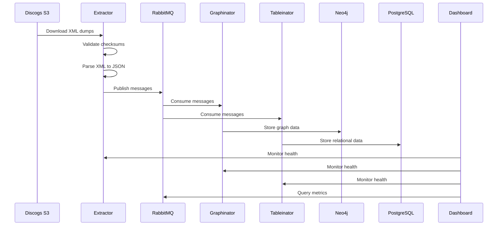

# CLAUDE.md - Development Guide

> 📖 This document provides comprehensive guidance for Claude Code (claude.ai/code) and developers working with the Discogsography codebase.

## 🏗️ Repository Overview

A modern Python 3.13+ microservices system for processing Discogs database exports into queryable storage backends. Built with performance, type safety, and security as core principles.

### 🎯 Architecture Components

| Service | Purpose | Technology Stack |
|---------|---------|------------------|
| **📊 dashboard/** | Real-time monitoring & visualization | FastAPI, WebSocket, HTML/JS |
| **🎵 discovery/** | AI-powered music discovery & analytics | FastAPI, transformers, scikit-learn, plotly |
| **📥 extractor/** | Downloads & parses Discogs XML data | aio-pika, orjson, tqdm |
| **🔗 graphinator/** | Builds Neo4j graph relationships | neo4j-driver, aio-pika |
| **🐘 tableinator/** | Stores data in PostgreSQL | psycopg3, aio-pika |
| **📦 common/** | Shared utilities & configuration | dataclasses, typing |

## 🚀 Development Setup

### Prerequisites

- **Python 3.13+** (managed via uv)
- **Docker & Docker Compose** (for services)
- **100GB+ free disk space** (for Discogs data)
- **8GB+ RAM** (16GB recommended)

### Initial Setup

```bash
# 1. Install uv package manager (10-100x faster than pip)
curl -LsSf https://astral.sh/uv/install.sh | sh

# 2. Clone and enter repository
git clone https://github.com/SimplicityGuy/discogsography.git
cd discogsography

# 3. Install all dependencies with extras
uv sync --all-extras

# 4. Setup pre-commit hooks for code quality
uv run pre-commit install

# 5. Verify installation
uv run task lint  # Should pass all checks
```

### Python Version Management

The Python version (currently 3.13) is centralized and can be managed through:

1. **Environment Variable**: Set `PYTHON_VERSION` in your `.env` file (see `.env.example`)
1. **Update Script**: Run `./scripts/update-python-version.sh 3.14` to update all files
1. **Docker Builds**: Use `--build-arg PYTHON_VERSION=3.14` or set in `.env`
1. **GitHub Actions**: Controlled by `PYTHON_VERSION` env variable in workflow files

The Python version is automatically propagated to:

- All Dockerfiles (via build arguments)
- All pyproject.toml files (requires-python, tool configurations)
- GitHub Actions workflows
- pyrightconfig.json

### 📁 Workspace Structure

This project uses **uv workspaces** for monorepo management:

```
discogsography/
├── pyproject.toml          # Root workspace configuration
├── uv.lock                 # Locked dependencies for reproducibility
│
├── common/                 # Shared utilities (workspace member)
│   ├── __init__.py
│   ├── config.py          # Centralized configuration with validation
│   └── health_server.py   # HTTP health check server
│
├── dashboard/             # Monitoring service (workspace member)
│   ├── pyproject.toml    # Service-specific dependencies
│   ├── dashboard.py      # FastAPI application
│   └── static/           # Frontend assets
│
├── extractor/             # Data ingestion service (workspace member)
│   ├── pyproject.toml    # Service-specific dependencies
│   ├── extractor.py      # Main processing logic
│   └── discogs.py        # S3 download utilities
│
├── graphinator/           # Neo4j service (workspace member)
│   ├── pyproject.toml    # Service-specific dependencies
│   └── graphinator.py    # Graph database logic
│
└── tableinator/           # PostgreSQL service (workspace member)
    ├── pyproject.toml    # Service-specific dependencies
    └── tableinator.py    # Relational database logic
```

**Key Points:**

- Each service has its own `pyproject.toml` for isolated dependencies
- Common code is shared via the `common/` workspace member
- Single `uv.lock` file ensures consistent dependencies across all services
- Use `uv sync --extra <service>` to install service-specific dependencies

## 🛠️ Development Commands

### Task Automation (taskipy)

The project uses **taskipy** for streamlined workflows. All tasks run with `uv run task <task-name>`.

> 📚 See [docs/task-automation.md](docs/task-automation.md) for complete documentation.

#### 🧪 Development Tasks

| Command | Description |
|---------|-------------|
| `uv run task install` | Install all dependencies including dev extras |
| `uv run task lint` | Run all linting tools (ruff + mypy) |
| `uv run task format` | Auto-format code with ruff |
| `uv run task test` | Run tests (excluding E2E) |
| `uv run task test-e2e` | Run Playwright E2E tests |
| `uv run task test-all` | Run all tests including E2E |
| `uv run task test-cov` | Run tests with coverage report |
| `uv run task security` | Run bandit security checks |
| `uv run task pre-commit` | Run all pre-commit hooks |
| `uv run task clean` | Clean Python cache files |
| `uv run task clean-all` | Deep clean (includes .venv) |

#### 🚀 Service Tasks

| Command | Description |
|---------|-------------|
| `uv run task dashboard` | Start monitoring dashboard |
| `uv run task discovery` | Start AI discovery service |
| `uv run task extractor` | Start data extractor service |
| `uv run task graphinator` | Start Neo4j service |
| `uv run task tableinator` | Start PostgreSQL service |

#### 🐋 Docker Tasks

| Command | Description |
|---------|-------------|
| `uv run task up` | Start all services via Docker Compose |
| `uv run task down` | Stop all services |
| `uv run task logs` | Follow logs for all services |
| `uv run task rebuild` | Rebuild and restart services |
| `uv run task build-prod` | Build production images |

#### 📊 Monitoring Tasks

| Command | Description |
|---------|-------------|
| `uv run task monitor` | Real-time queue monitoring |
| `uv run task check-errors` | Analyze logs for errors |
| `uv run task system-monitor` | Comprehensive system dashboard |

### Package Management (uv)

- `uv sync` - Install/update all dependencies from lock file
- `uv add <package>` - Add new dependency
- `uv remove <package>` - Remove dependency
- `uv run <command>` - Run command in virtual environment
- `uv sync --extra extractor` - Install extractor-specific dependencies
- `uv sync --extra graphinator` - Install graphinator-specific dependencies
- `uv sync --extra tableinator` - Install tableinator-specific dependencies
- `uv sync --extra utilities` - Install utilities dependencies (psutil, requests)
- `uv sync --extra dev` - Install development dependencies
- `uv sync --all-extras` - Install all optional dependencies

### 🔍 Code Quality

#### Pre-commit Hooks

The project uses comprehensive pre-commit hooks with all versions frozen to commit SHAs:

```bash
# Run all pre-commit hooks
uv run pre-commit run --all-files

# Update hooks to latest versions
uv run pre-commit autoupdate --freeze
```

**Included Hooks:**

- ✨ **Python**: ruff (linting + formatting), mypy (type checking), bandit (security)
- 🐋 **Docker**: hadolint (Dockerfile linting), docker-compose validation
- 📝 **YAML**: yamllint (YAML validation)
- 🐚 **Shell**: shellcheck (script analysis), shfmt (formatting)
- 🔧 **GitHub**: check-jsonschema, actionlint (workflow validation)

#### Tool Configuration

All tools are configured in `pyproject.toml` for consistency:

| Tool | Configuration | Purpose |
|------|--------------|---------|
| **Ruff** | Comprehensive rules (S, SIM, etc.) | Fast linting & formatting |
| **MyPy** | Strict mode enabled | Static type checking |
| **Black** | Line length 100, Python 3.13 | Code formatting |
| **isort** | Black-compatible profile | Import sorting |
| **Bandit** | Skip B101 (assert warnings) | Security scanning |
| **Coverage** | Track all service modules | Test coverage |
| **Pytest** | Asyncio support, pythonpath | Test framework |

#### Code Standards

- 📏 **Indentation**: 4 spaces (no tabs)
- 📐 **Line Length**: 100 chars (Python), 150 chars (YAML)
- 🐍 **Python Version**: 3.13+ with modern type hints
- 📦 **Imports**: Sorted with isort (black profile)
- 📝 **YAML**: Validated with yamllint
- 🔧 **Workflows**: Validated with actionlint

#### Service-Specific Checks

Run checks for individual services:

```bash
# Type check specific services
cd extractor && uv run mypy .
cd graphinator && uv run mypy .
cd tableinator && uv run mypy .
cd dashboard && uv run mypy .
```

### 🧪 Testing

#### Test Commands

```bash
# Basic testing
uv run pytest                              # Run all tests
uv run pytest --cov                        # With coverage report
uv run pytest tests/test_config.py -v      # Specific test file
uv run pytest -k "test_name" -v            # Tests matching pattern
uv run pytest -m "not e2e"                 # Exclude E2E tests
uv run pytest -xvs                         # Verbose, stop on failure
uv run pytest --tb=short                   # Shorter tracebacks

# E2E testing with Playwright
uv run playwright install chromium         # Install browser
uv run playwright install-deps chromium    # Install dependencies
uv run task test-e2e                      # Run E2E tests

# Service-specific tests
uv run pytest tests/extractor/            # Extractor tests
uv run pytest tests/graphinator/          # Graphinator tests
uv run pytest tests/tableinator/          # Tableinator tests
uv run pytest tests/dashboard/            # Dashboard tests
```

#### Test Structure

```
tests/
├── conftest.py                         # Shared fixtures & configuration
├── test_config.py                      # Configuration tests
├── test_integration.py                 # Integration tests
│
├── extractor/
│   ├── test_discogs.py                # Download functionality tests
│   └── test_extractor.py              # Processing tests
│
├── graphinator/
│   └── test_graphinator.py            # Neo4j service tests
│
├── tableinator/
│   └── test_tableinator.py            # PostgreSQL service tests
│
└── dashboard/
    ├── conftest.py                    # Dashboard-specific fixtures
    ├── test_dashboard_api.py          # API tests (TestClient)
    ├── test_dashboard_api_integration.py  # Integration tests
    └── test_dashboard_ui.py           # E2E tests (Playwright)
```

#### Test Configuration

- **Framework**: pytest with asyncio support
- **Coverage**: Tracks all service modules, excludes test files
- **Fixtures**: Mock fixtures for AMQP, Neo4j, PostgreSQL
- **E2E Tests**: Marked with `@pytest.mark.e2e`, automatic server management
- **Browsers**: Chromium, Firefox, WebKit support
- **Mode**: Headless by default (configurable)

### 🏃 Running Services

#### Using Taskipy (Recommended)

```bash
# Start individual services
uv run task dashboard      # Monitoring dashboard (port 8003)
uv run task discovery      # AI discovery service (port 8005)
uv run task extractor      # Data extractor (periodic checks)
uv run task graphinator    # Neo4j service
uv run task tableinator    # PostgreSQL service

# Start all services with Docker
uv run task up            # Docker Compose up
uv run task logs          # Follow all logs
```

#### Direct Execution

```bash
# Run services directly
uv run python dashboard/dashboard.py
uv run python discovery/discovery.py
uv run python extractor/extractor.py
uv run python graphinator/graphinator.py
uv run python tableinator/tableinator.py
```

#### ⏰ Extractor Periodic Checks

The extractor automatically checks for new Discogs data:

| Setting | Default | Environment Variable |
|---------|---------|---------------------|
| Check interval | 15 days | `PERIODIC_CHECK_DAYS` |
| Behavior | Continuous running | N/A |
| Detection | Checksum comparison | N/A |

```bash
# Custom check interval (daily)
PERIODIC_CHECK_DAYS=1 uv run task extractor

# Custom check interval (weekly)
PERIODIC_CHECK_DAYS=7 uv run task extractor
```

### 🐋 Docker

#### Docker Compose Operations

##### Using Taskipy (Recommended)

```bash
uv run task up          # Start all services
uv run task down        # Stop all services
uv run task logs        # Follow all logs
uv run task rebuild     # Rebuild and restart
uv run task build-prod  # Production build
```

##### Direct Docker Commands

```bash
# Development
docker-compose up -d
docker-compose down
docker-compose logs -f <service>
docker-compose ps
docker-compose restart <service>
docker-compose exec <service> bash

# Production
docker-compose -f docker-compose.yml -f docker-compose.prod.yml up -d
```

#### 🌐 Service URLs

| Service | URL | Credentials |
|---------|-----|-------------|
| 📊 Dashboard | http://localhost:8003 | No auth |
| 🎵 Discovery | http://localhost:8005 | No auth |
| 🐰 RabbitMQ | http://localhost:15672 | discogsography / discogsography |
| 🔗 Neo4j | http://localhost:7474 | neo4j / discogsography |
| 🐘 PostgreSQL | localhost:5433 | discogsography / discogsography |

#### 🏗️ Building Images

##### Individual Service Builds

```bash
# Build specific service (from root directory)
docker build --build-arg PYTHON_VERSION=3.13 -f dashboard/Dockerfile .
docker build --build-arg PYTHON_VERSION=3.13 -f extractor/Dockerfile .
docker build --build-arg PYTHON_VERSION=3.13 -f graphinator/Dockerfile .
docker build --build-arg PYTHON_VERSION=3.13 -f tableinator/Dockerfile .
```

#### 🔒 Docker Security Features

- ✅ **Health checks**: HTTP endpoints for monitoring
- ✅ **Non-root user**: UID/GID 1000 (configurable)
- ✅ **Security options**: `no-new-privileges:true`
- ✅ **Read-only root**: With tmpfs for writable areas
- ✅ **Capability dropping**: `cap_drop: ALL`
- ✅ **Alpine/slim images**: Minimal attack surface

#### 🚀 Build Optimizations

- **Multi-stage builds**: Smaller final images
- **BuildKit caching**: `--mount=type=cache` for dependencies
- **Layer optimization**: Combined RUN commands
- **Version pinning**: Reproducible builds
- **OCI labels**: Standard metadata
- **.dockerignore**: Exclude unnecessary files

> 📚 See [docs/docker-security.md](docs/docker-security.md) and [docs/dockerfile-standards.md](docs/dockerfile-standards.md) for detailed documentation.

## 🐍 Modern Python Features

This project leverages cutting-edge Python 3.13+ features and modern tooling:

### Language Features

- **Python 3.13**: Latest performance improvements and type system enhancements
- **Type Annotations**: Built-in generics (`dict`, `list`, `tuple`) without typing imports
- **Dataclasses**: Configuration with `frozen=True` for immutability
- **Pathlib**: Modern path handling across all services
- **Async/Await**: Comprehensive async patterns with `asyncio.Event()`
- **Structural Pattern Matching**: Used for message routing
- **Context Managers**: Resource management with `async with`

### Modern Dependencies

| Package | Version | Purpose |
|---------|---------|---------|
| **psycopg3** | Latest | PostgreSQL with binary support |
| **neo4j** | 5.15.0+ | Async graph database driver |
| **orjson** | Latest | High-performance JSON parsing |
| **aio-pika** | Latest | Async AMQP operations |
| **FastAPI** | Latest | Modern async web framework |
| **multidict** | Latest | Efficient multi-value mappings |
| **taskipy** | Latest | Python-native task automation |

### Development Tools

- **uv**: 10-100x faster package management with lock files
- **Ruff**: Lightning-fast linting and formatting
- **MyPy**: Strict static type checking
- **Bandit**: Security vulnerability scanning
- **Pre-commit**: Automated quality checks
- **Pytest**: Modern testing with asyncio support

### Best Practices

- **Structured Logging**: JSON logs with emoji prefixes
- **Error Handling**: Retries with exponential backoff
- **Workspace Architecture**: Monorepo with shared dependencies
- **Configuration Management**: Type-safe dataclasses
- **Resource Management**: Proper cleanup and shutdown
- **Security First**: Bandit scanning, secure defaults

## 🏛️ Architecture Details

### 📊 Data Flow Architecture



### 🔑 Key Components

| Component | Purpose | Key Features |
|-----------|---------|--------------|
| `common/config.py` | Configuration management | Type-safe dataclasses, validation |
| `common/health_server.py` | Health monitoring | HTTP endpoints, async server |
| `dashboard/dashboard.py` | Real-time monitoring | FastAPI, WebSocket, metrics |
| `extractor/discogs.py` | S3 downloads | Checksum validation, retry logic |
| `extractor/extractor.py` | XML processing | Streaming parser, deduplication |
| `graphinator/graphinator.py` | Graph storage | Neo4j driver, relationships |
| `tableinator/tableinator.py` | Relational storage | psycopg3, JSONB support |

### ⚙️ Configuration Management

Environment-based configuration with validation:

```python
@dataclass(frozen=True)
class Config:
    # RabbitMQ
    amqp_connection: str

    # Extractor
    discogs_root: Path = Path("/discogs-data")
    periodic_check_days: int = 15

    # Neo4j
    neo4j_address: str
    neo4j_username: str
    neo4j_password: str

    # PostgreSQL
    postgres_address: str
    postgres_username: str
    postgres_password: str
    postgres_database: str
```

### 🛡️ Reliability Features

- **Exception Handling**: Comprehensive error catching with context
- **Message Reliability**: ACK/NACK with dead letter queues
- **Transaction Safety**: Rollback on database errors
- **Graceful Shutdown**: Signal handlers for clean exit
- **Correlation IDs**: Request tracking across services
- **Health Checks**: HTTP endpoints for monitoring

### 🚀 Performance Optimizations

- **Deduplication**: SHA256 hashes prevent reprocessing
- **Streaming Parser**: Memory-efficient XML processing
- **Progress Tracking**: Visual feedback with tqdm
- **JSON Performance**: orjson for 3x faster parsing
- **Connection Pooling**: Reuse database connections
- **Batch Processing**: Efficient bulk operations

## 🔍 Debugging & Monitoring

### 📊 Dashboard Features

Access real-time monitoring at http://localhost:8003:

| Feature | Description |
|---------|-------------|
| **Service Health** | Live status indicators for all microservices |
| **Queue Metrics** | Message rates, depths, consumer counts |
| **Database Stats** | Connection pools, storage usage |
| **Activity Log** | Recent events with timestamps |
| **WebSocket Updates** | Real-time data without refresh |

### 🏥 Health Endpoints

```bash
# Service health checks
curl http://localhost:8000/health  # Extractor
curl http://localhost:8001/health  # Graphinator
curl http://localhost:8002/health  # Tableinator
curl http://localhost:8003/health  # Dashboard
curl http://localhost:8004/health  # Discovery

# Docker health status
docker-compose ps
docker inspect discogsography-extractor | jq '.[0].State.Health'
```

### 📋 Logging System

#### Log Locations

```
/logs/
├── extractor.log     # Extractor service logs
├── graphinator.log   # Neo4j service logs
├── tableinator.log   # PostgreSQL service logs
└── dashboard.log     # Dashboard service logs
```

#### Log Commands

```bash
# Using taskipy
uv run task logs              # All services
uv run task check-errors      # Error analysis

# Using Docker
docker-compose logs -f                    # All services
docker-compose logs -f extractor          # Specific service
docker-compose logs --tail=100 --follow  # Last 100 lines
```

### 🛠️ Debug Utilities

Located in `utilities/` directory:

| Tool | Purpose | Command |
|------|---------|---------|
| `check_errors.py` | Analyze logs for errors | `uv run task check-errors` |
| `check_queues.py` | Queue statistics | `uv run python utilities/check_queues.py` |
| `debug_message.py` | Send test messages | `uv run python utilities/debug_message.py` |
| `monitor_queues.py` | Real-time monitoring | `uv run task monitor` |
| `system_monitor.py` | System dashboard | `uv run task system-monitor` |

### 🔧 Development Tools

- **Pyright**: Language server config in `pyrightconfig.json`
- **Coverage**: `uv run pytest --cov` for reports
- **Type Checking**: `uv run mypy .` for validation
- **Profiling**: Built-in performance metrics

## 🔒 Security Practices

### Bandit Security Analysis

The codebase maintains high security standards with targeted suppressions:

#### Suppression Guidelines

| Suppression | Use Case | Example |
|-------------|----------|---------|
| `# nosec B603 B607` | Trusted Docker commands | `subprocess.run(["docker", "ps"])` |
| `# noqa: S107` | Dev environment defaults | `password="dev-password"` |
| `# nosec B105/B107` | Hardcoded dev passwords | Local development only |
| `# noqa: S310` | Localhost HTTP requests | `http://localhost:8000` |

#### Security Principles

- ✅ **Line-specific suppressions**: Never disable broadly
- ✅ **Justified suppressions**: Each includes reason
- ✅ **Environment override**: Env vars override defaults
- ✅ **No user input in commands**: Prevent injection
- ✅ **Secure defaults**: Production-safe configurations
- ✅ **Container security**: Non-root, read-only filesystem

## 📝 Logging Conventions

### Emoji Pattern

All logger calls follow: `logger.{level}("{emoji} {message}")`

### Emoji Reference

| Emoji | Usage | Example |
|-------|-------|---------|
| 🚀 | Startup | `logger.info("🚀 Starting service...")` |
| ✅ | Success | `logger.info("✅ Operation completed")` |
| ❌ | Error | `logger.error("❌ Connection failed")` |
| ⚠️ | Warning | `logger.warning("⚠️ Retry attempt 2/3")` |
| 🛑 | Shutdown | `logger.info("🛑 Shutting down gracefully")` |
| 📊 | Progress | `logger.info("📊 Processed 1000/5000 records")` |
| 📥 | Download start | `logger.info("📥 Starting download")` |
| ⬇️ | Downloading | `logger.info("⬇️ Downloading file.xml")` |
| 🔄 | Processing | `logger.info("🔄 Processing batch")` |
| ⏳ | Waiting | `logger.info("⏳ Waiting for messages...")` |
| 📋 | Metadata | `logger.info("📋 Loading metadata")` |
| 🔍 | Searching | `logger.info("🔍 Checking for updates")` |
| 📄 | File ops | `logger.info("📄 Created output.json")` |
| 🆕 | New version | `logger.info("🆕 Found newer version")` |
| ⏰ | Periodic | `logger.info("⏰ Running scheduled check")` |
| 🔧 | Setup | `logger.info("🔧 Configuring database")` |
| 🐰 | RabbitMQ | `logger.info("🐰 Connected to RabbitMQ")` |
| 🔗 | Neo4j | `logger.info("🔗 Connected to Neo4j")` |
| 🐘 | PostgreSQL | `logger.info("🐘 Connected to PostgreSQL")` |
| 💾 | Save | `logger.info("💾 Saved 100 records")` |
| 🏥 | Health | `logger.info("🏥 Health server on :8000")` |
| ⏩ | Skip | `logger.info("⏩ Skipped (no changes)")` |

## 🔧 GitHub Actions

### Workflow Overview

| Workflow | Purpose | Triggers | Timeout |
|----------|---------|----------|---------|
| `build.yml` | Main CI/CD pipeline | Push, PR | 15-30 min |
| `docker-validate.yml` | Docker validation | Push, PR | 10 min |
| `playwright-test.yml` | E2E dashboard tests | Dashboard changes | 15 min |
| `test-all.yml` | Comprehensive tests | Push, PR, manual | 15 min |
| `cleanup.yml` | Registry cleanup | Monthly schedule | 10 min |

### 🧪 Test Strategy

#### Test Separation

- **Unit Tests**: Run on every push/PR
- **E2E Tests**: Only when dashboard changes
- **Integration Tests**: Part of unit test suite

#### Conditional Execution

```yaml
# Smart detection of dashboard changes
if: |
  contains(github.event.head_commit.modified, 'dashboard/') ||
  contains(github.event.head_commit.modified, 'tests/dashboard/')
```

#### Playwright Configuration

- **Browsers**: Chromium, Firefox, WebKit
- **Platforms**: Ubuntu (Chrome/Firefox), macOS (Safari)
- **Mobile**: iPhone 15, iPad Pro 11 emulation
- **Features**: Video recording, automatic server management

### 💾 Caching Strategy

| Cache Type | Location | Key Strategy |
|------------|----------|--------------|
| **uv packages** | `~/.cache/uv`, `.venv` | `uv.lock` + `pyproject.toml` |
| **Pre-commit** | `~/.cache/pre-commit` | `.pre-commit-config.yaml` |
| **Pytest** | `.pytest_cache` | Test file hashes |
| **Docker** | Registry + local | Multi-source with rotation |
| **Playwright** | `~/.cache/ms-playwright` | Browser versions |
| **Tools** | `~/.arkade` | Tool versions |

### 🐋 Docker Validation

- **Syntax**: yamllint validation
- **Config**: `docker-compose config` check
- **Security**: hadolint Dockerfile scanning
- **Services**: Dependency validation
- **Build**: Test builds for all services

### 🎯 Optimization Features

- **Parallel Jobs**: Test types run concurrently
- **Smart Caching**: Multi-level cache hierarchy
- **Conditional Steps**: Skip unnecessary work
- **Matrix Builds**: Cross-platform testing
- **Resource Limits**: Prevent runaway jobs

## 📋 Development Guidelines

### Essential Rules

1. **Project Structure**

   - Always run from the project root
   - Common code lives in `common/` directory
   - Each service has its own `pyproject.toml`

1. **Code Quality**

   - Fix all `ruff` and `mypy` errors before completing
   - Run `uv run pre-commit run --all-files` before commits
   - Use `# noqa` and `# nosec` sparingly, always line-specific
   - Sort suppression pragmas alphabetically: `# noqa` before `# nosec`

1. **Dependency Management**

   - Use `uv add` for adding dependencies (not manual edits)
   - Run `uv sync --all-extras` after dependency changes
   - Use `--no-sync` (not `--frozen`) in Docker scripts

1. **Testing**

   - Run tests with `uv run task test`
   - Dashboard E2E tests use `test_server` fixture
   - Multi-browser testing is supported
   - Video recording enabled for debugging

1. **Logging**

   - Format: `logger.{level}("{emoji} {message}")`
   - Exactly one space after emoji
   - All services log to console and `/logs` directory

1. **Docker & GitHub Actions**

   - Sort lists: packages, services, arrays
   - Use `DEBIAN_FRONTEND=noninteractive` for apt-get
   - Define env vars in global `env:` section
   - Sort environment variables alphabetically
   - No resource limits in docker-compose
   - Remove `container_name` when using `deploy.replicas`

1. **Version Control**

   - Use `git mv` for moving files (preserves history)
   - Commit with meaningful messages
   - Use conventional commits when possible

1. **Security**

   - Run `uv run bandit -r . -x "./.venv/*,./tests/*"`
   - Line-specific suppressions only
   - Environment variables override hardcoded defaults

### Best Practices

- Use taskipy commands when available
- Prefer ruff's formatter over black
- PYTHONPATH configured in pyproject.toml
- Comprehensive caching in GitHub workflows
- For non-GitHub/Docker actions, use SHA with version comment

## 🎯 Important Instructions

### Core Principles

- **Do exactly what is asked** - Nothing more, nothing less
- **Minimize file creation** - Edit existing files whenever possible
- **No unsolicited documentation** - Only create docs when explicitly requested
- **Follow existing patterns** - Match the codebase style and conventions
- **Test before completion** - Ensure all changes work correctly

### Remember

This is a production-ready codebase with established patterns. When making changes:

1. Study existing code first
1. Follow established conventions
1. Maintain consistency
1. Preserve functionality
1. Document only when asked

______________________________________________________________________

<div align="center">

**Happy Coding! 🚀**

For questions or issues, refer to the [README.md](README.md) or individual service documentation.

</div>
