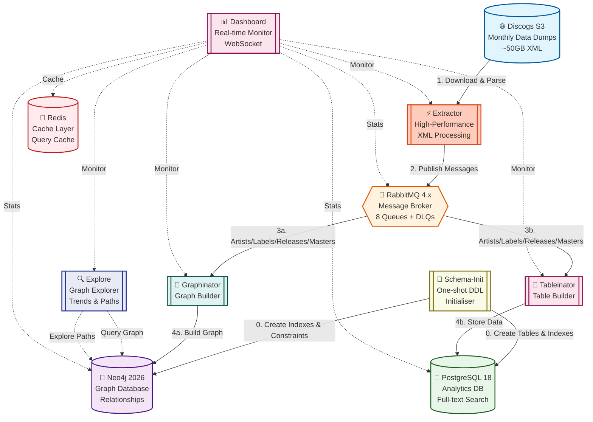

# 🎵 Discogsography

<div align="center">

[](https://github.com/SimplicityGuy/discogsography/actions/workflows/build.yml)
[](https://github.com/SimplicityGuy/discogsography/actions/workflows/code-quality.yml)
[](https://github.com/SimplicityGuy/discogsography/actions/workflows/test.yml)
[](https://github.com/SimplicityGuy/discogsography/actions/workflows/e2e-test.yml)
[](https://codecov.io/gh/SimplicityGuy/discogsography)


[](https://github.com/astral-sh/uv)
[](https://just.systems)
[](https://github.com/astral-sh/ruff)
[](https://doc.rust-lang.org/cargo/)
[](https://github.com/rust-lang/rust-clippy)
[](https://github.com/pre-commit/pre-commit)
[](http://mypy-lang.org/)
[](https://github.com/PyCQA/bandit)
[](https://www.docker.com/)

**A modern Python 3.13+ microservices platform for transforming the complete [Discogs](https://www.discogs.com/) music database into powerful, queryable knowledge graphs and analytics engines.**

[🚀 Quick Start](#-quick-start) | [📖 Documentation](#-documentation) | [🎯 Features](#-key-features) | [💬 Community](#-support--community)

</div>

## 🎯 What is Discogsography?

Discogsography transforms monthly Discogs data dumps (50GB+ compressed XML) into:

- **🔗 Neo4j Graph Database**: Navigate complex music industry relationships
- **🐘 PostgreSQL Database**: High-performance queries and full-text search
- **🤖 AI Discovery Engine**: Intelligent recommendations and analytics
- **📊 Real-time Dashboard**: Monitor system health and processing metrics

Perfect for music researchers, data scientists, developers, and music enthusiasts who want to explore the world's largest music database.

## 🏛️ Architecture Overview

### ⚙️ Core Services

| Service                                                       | Purpose                                | Key Technologies                       |
| ------------------------------------------------------------- | -------------------------------------- | -------------------------------------- |
| **[📊](docs/emoji-guide.md#service-identifiers) Dashboard**   | Real-time system monitoring            | `FastAPI`, WebSocket, reactive UI      |
| **[🔍](docs/emoji-guide.md#service-identifiers) Explore**     | Interactive graph exploration & trends | `FastAPI`, `D3.js`, `Plotly.js`, Neo4j |
| **[⚡](docs/emoji-guide.md#service-identifiers) Extractor**   | High-performance Rust-based extractor  | `tokio`, `quick-xml`, `lapin`          |
| **[🔗](docs/emoji-guide.md#service-identifiers) Graphinator** | Builds Neo4j knowledge graphs          | `neo4j-driver`, graph algorithms       |
| **[🔧](docs/emoji-guide.md#service-identifiers) Schema-Init** | One-shot database schema initialiser   | `neo4j-driver`, `psycopg3`             |
| **[🐘](docs/emoji-guide.md#service-identifiers) Tableinator** | Creates PostgreSQL analytics tables    | `psycopg3`, JSONB, full-text search    |

### 📐 System Architecture



## 🌟 Key Features

- **⚡ High-Speed Processing**: 5,000–10,000 records/second XML parsing with Rust-based extractor
- **🔄 Smart Deduplication**: SHA256 hash-based change detection prevents reprocessing
- **📈 Handles Big Data**: Processes 15M+ releases, 2M+ artists across ~50GB compressed XML
- **🔁 Auto-Recovery**: Automatic retries with exponential backoff and dead letter queues
- **🐋 Container Security**: Non-root users, read-only filesystems, dropped capabilities
- **📝 Type Safety**: Full type hints with strict mypy validation and Bandit security scanning
- **✅ Comprehensive Testing**: Unit, integration, and E2E tests with Playwright
- **🧠 ML-Powered Discovery**: Semantic search, graph algorithms (PageRank, community detection)

## 🚀 Quick Start

```bash
# Clone and start all services
git clone https://github.com/SimplicityGuy/discogsography.git
cd discogsography
docker-compose up -d

# Access the dashboard
open http://localhost:8003
```

| Service           | URL                    | Default Credentials                 |
| ----------------- | ---------------------- | ----------------------------------- |
| 📊 **Dashboard**  | http://localhost:8003  | None                                |
| 🔍 **Explore**    | http://localhost:8006  | None                                |
| 🔗 **Neo4j**      | http://localhost:7474  | `neo4j` / `discogsography`          |
| 🐘 **PostgreSQL** | `localhost:5433`       | `discogsography` / `discogsography` |
| 🐰 **RabbitMQ**   | http://localhost:15672 | `discogsography` / `discogsography` |

See the [Quick Start Guide](docs/quick-start.md) for prerequisites, local development setup, and environment configuration.

## 📖 Documentation

### 🚀 Getting Started

| Document                                                 | Purpose                                                  |
| -------------------------------------------------------- | -------------------------------------------------------- |
| **[Quick Start Guide](docs/quick-start.md)**             | ⚡ Get Discogsography running in minutes                 |
| **[Configuration Guide](docs/configuration.md)**         | ⚙️ Complete environment variable and settings reference  |
| **[Architecture Overview](docs/architecture.md)**        | 🏛️ System architecture, components, data flow, and scale |
| **[CLAUDE.md](CLAUDE.md)**                               | 🤖 Claude Code integration guide & development standards |

### 💡 Usage & Data

| Document                                             | Purpose                                                |
| ---------------------------------------------------- | ------------------------------------------------------ |
| **[Usage Examples](docs/usage-examples.md)**         | 💡 Neo4j Cypher and PostgreSQL query examples          |
| **[Database Schema](docs/database-schema.md)**       | 🗄️ Complete Neo4j graph model and PostgreSQL schema    |
| **[Monitoring Guide](docs/monitoring.md)**           | 📊 Real-time dashboard, metrics, and debug utilities   |

### 👨‍💻 Development

| Document                                                           | Purpose                                              |
| ------------------------------------------------------------------ | ---------------------------------------------------- |
| **[Development Guide](docs/development.md)**                       | 💻 Project structure, tooling, and developer workflow |
| **[Testing Guide](docs/testing-guide.md)**                         | 🧪 Unit, integration, and E2E testing with Playwright |
| **[Logging Guide](docs/logging-guide.md)**                         | 📊 Structured logging standards and emoji conventions |
| **[Contributing Guide](docs/contributing.md)**                     | 🤝 How to contribute: process, standards, and PR flow |
| **[Python Version Management](docs/python-version-management.md)** | 🐍 Managing Python 3.13+ across the project          |

### 🔧 Operations

| Document                                                     | Purpose                                          |
| ------------------------------------------------------------ | ------------------------------------------------ |
| **[Troubleshooting Guide](docs/troubleshooting.md)**         | 🔧 Common issues, solutions, and debugging steps |
| **[Maintenance Guide](docs/maintenance.md)**                 | 🔄 Package upgrades, dependency management       |
| **[Performance Guide](docs/performance-guide.md)**           | ⚡ Database tuning, hardware specs, optimization  |
| **[Performance Benchmarks](docs/performance-benchmarks.md)** | 📈 Processing rates and tuning results           |
| **[Database Resilience](docs/database-resilience.md)**       | 💾 Database connection patterns & error handling |

### 🐋 Infrastructure & CI/CD

| Document                                                 | Purpose                                                |
| -------------------------------------------------------- | ------------------------------------------------------ |
| **[Dockerfile Standards](docs/dockerfile-standards.md)** | 🐋 Best practices for writing Dockerfiles              |
| **[Docker Security](docs/docker-security.md)**           | 🔒 Container hardening & security practices            |
| **[GitHub Actions Guide](docs/github-actions-guide.md)** | 🚀 CI/CD workflows, automation & best practices        |
| **[Task Automation](docs/task-automation.md)**           | ⚙️ Complete `just` and `uv run task` command reference |
| **[Monorepo Guide](docs/monorepo-guide.md)**             | 📦 Managing Python monorepo with shared dependencies   |

### 📋 Reference

| Document                                                                   | Purpose                                                |
| -------------------------------------------------------------------------- | ------------------------------------------------------ |
| **[State Marker System](docs/state-marker-system.md)**                     | 📋 Extraction progress tracking & safe restart system  |
| **[State Marker Periodic Updates](docs/state-marker-periodic-updates.md)** | 💾 Periodic state saves and crash recovery             |
| **[Consumer Cancellation](docs/consumer-cancellation.md)**                 | 🔄 File completion and consumer lifecycle management   |
| **[File Completion Tracking](docs/file-completion-tracking.md)**           | 📊 Intelligent completion tracking and stall detection |
| **[Neo4j Indexing](docs/neo4j-indexing.md)**                               | 🔗 Advanced Neo4j indexing strategies                  |
| **[Platform Targeting](docs/platform-targeting.md)**                       | 🎯 Cross-platform compatibility guidelines             |
| **[Emoji Guide](docs/emoji-guide.md)**                                     | 📋 Standardized emoji usage across the project         |
| **[Recent Improvements](docs/recent-improvements.md)**                     | 🚀 Latest platform enhancements and changelog          |

## 💬 Support & Community

- 🐛 **Bug Reports**: [GitHub Issues](https://github.com/SimplicityGuy/discogsography/issues)
- 💡 **Feature Requests**: [GitHub Discussions](https://github.com/SimplicityGuy/discogsography/discussions)
- 💬 **Questions**: [Discussions Q&A](https://github.com/SimplicityGuy/discogsography/discussions/categories/q-a)
- 📚 **Full Documentation**: [docs/README.md](docs/README.md)

## 📄 License

This project is licensed under the MIT License — see the [LICENSE](LICENSE) file for details.

## 🙏 Acknowledgments

- 🎵 [Discogs](https://www.discogs.com/) for providing the monthly data dumps
- 🚀 [uv](https://github.com/astral-sh/uv) for blazing-fast package management
- 🔥 [Ruff](https://github.com/astral-sh/ruff) for lightning-fast linting
- 🐍 The Python community for excellent libraries and tools

______________________________________________________________________

<div align="center">
Made with ❤️ by the Discogsography community
</div>
