# Discovery Service

🎵 **AI-Powered Music Discovery, Analytics, and Graph Exploration**

The Discovery service provides three powerful features for exploring and understanding the Discogs music database
through intelligent analysis and interactive visualization.

## 🌟 Features

### 🤖 AI-Powered Music Discovery Engine

- **Collaborative Filtering**: Find similar artists through collaboration networks
- **Semantic Search**: Natural language music discovery
- **Graph-based Recommendations**: Use Neo4j graph algorithms for intelligent suggestions
- **Content-based Filtering**: Analyze metadata patterns for personalized recommendations

### 📊 Music Industry Analytics & Insights

- **Genre Trends**: Track musical genre popularity over decades
- **Artist Evolution**: Analyze career trajectories and musical development
- **Label Insights**: Examine record label market share and artist rosters
- **Market Analysis**: Study format adoption (vinyl, CD, digital) and regional patterns

### 🔍 Real-time Music Knowledge Graph Explorer

- **Interactive Visualization**: Explore relationships between artists, releases, and labels
- **Path Finding**: Discover connections between any two entities
- **Neighborhood Exploration**: Visualize local graph neighborhoods
- **Semantic Queries**: Natural language graph exploration

## 🚀 Quick Start

### Using Docker (Recommended)

```bash
# Start all services including discovery
docker-compose up -d

# Access the Discovery UI
open http://localhost:8005
```

### Local Development

```bash
# Install dependencies
uv sync --extra discovery

# Set environment variables
export NEO4J_ADDRESS="bolt://localhost:7687"
export NEO4J_USERNAME="neo4j"
export NEO4J_PASSWORD="password"
export POSTGRES_ADDRESS="localhost:5433"
export POSTGRES_USERNAME="postgres"
export POSTGRES_PASSWORD="password"
export POSTGRES_DATABASE="discogsography"

# Start the discovery service
just discovery

# Or run directly
uv run python discovery/discovery.py
```

## 🌐 Service URLs

| Service          | URL                          | Purpose                          |
| ---------------- | ---------------------------- | -------------------------------- |
| **Discovery UI** | http://localhost:8005        | Main interface with all features |
| **Health Check** | http://localhost:8004/health | Service health status            |
| **API Docs**     | http://localhost:8005/docs   | Interactive API documentation    |

## 🎨 User Interface

The Discovery UI features a modern, responsive design with a hamburger menu providing access to all three main features:

### Navigation Menu

- **🤖 AI Recommendations**: Intelligent music discovery
- **📊 Industry Analytics**: Data visualization and insights
- **🔍 Graph Explorer**: Interactive network visualization
- **📊 Dashboard**: Link to monitoring dashboard

### Responsive Design

- **Desktop**: Full-featured interface with side-by-side layouts
- **Mobile**: Optimized mobile experience with collapsible navigation
- **Dark Theme**: Professional dark theme optimized for extended use

## 🏗️ Service Architecture

### Internal Architecture

```mermaid
graph TB
    subgraph "Discovery Service"
        API[["🌐 FastAPI Server<br/>Port 8005"]]
        HEALTH[["🏥 Health Server<br/>Port 8004"]]

        subgraph "Core Engines"
            REC["🤖 Recommender Engine<br/>Collaborative Filtering<br/>Sentence Transformers"]
            ANA["📊 Analytics Engine<br/>Trend Analysis<br/>Market Intelligence"]
            GEX["🔍 Graph Explorer<br/>Path Finding<br/>Network Analysis"]
        end

        subgraph "Search & ML APIs"
            SEARCH["🔎 Search API<br/>Full-text & Semantic<br/>Faceted Search"]
            ML["🧠 ML API<br/>Collaborative Filter<br/>Content-based"]
            GRAPH_API["📈 Graph Analytics API<br/>Community Detection<br/>PageRank"]
            REALTIME["⚡ Real-time API<br/>WebSocket<br/>Live Updates"]
        end

        subgraph "Cache & Models"
            CACHE["🔴 Redis Cache<br/>Query Results<br/>Embeddings"]
            ONNX["⚡ ONNX Models<br/>Optimized Inference<br/>Sentence Transformers"]
            HF["🤗 HuggingFace Cache<br/>Model Storage<br/>HF_HOME"]
        end
    end

    subgraph "External Services"
        NEO4J[("🔗 Neo4j<br/>Graph Database<br/>Cypher Queries")]
        PG[("🐘 PostgreSQL<br/>Analytics DB<br/>asyncpg driver")]
        REDIS_EXT[("🔴 Redis<br/>External Cache<br/>Shared State")]
    end

    API --> REC
    API --> ANA
    API --> GEX
    API --> SEARCH
    API --> ML
    API --> GRAPH_API
    API --> REALTIME

    REC --> NEO4J
    REC --> ONNX
    REC --> CACHE

    ANA --> PG
    ANA --> NEO4J
    ANA --> CACHE

    GEX --> NEO4J
    GEX --> CACHE

    SEARCH --> PG
    SEARCH --> ONNX
    SEARCH --> CACHE

    ML --> PG
    ML --> ONNX

    GRAPH_API --> NEO4J

    CACHE -.->|Connected| REDIS_EXT
    ONNX -.->|Loads from| HF

    PG -.->|"asyncpg<br/>async driver"| ANA
    PG -.->|"asyncpg<br/>async driver"| SEARCH
    PG -.->|"asyncpg<br/>async driver"| ML

    style API fill:#e3f2fd,stroke:#0d47a1,stroke-width:2px
    style HEALTH fill:#e8f5e9,stroke:#1b5e20,stroke-width:2px
    style REC fill:#fff9c4,stroke:#f57c00,stroke-width:2px
    style ANA fill:#f3e5f5,stroke:#4a148c,stroke-width:2px
    style GEX fill:#e1f5fe,stroke:#01579b,stroke-width:2px
    style CACHE fill:#ffebee,stroke:#b71c1c,stroke-width:2px
    style ONNX fill:#fff3e0,stroke:#e65100,stroke-width:2px
    style HF fill:#fce4ec,stroke:#880e4f,stroke-width:2px
    style NEO4J fill:#f3e5f5,stroke:#4a148c,stroke-width:2px
    style PG fill:#e8f5e9,stroke:#1b5e20,stroke-width:2px
    style REDIS_EXT fill:#ffebee,stroke:#b71c1c,stroke-width:2px
```



### Key Components

- **🌐 FastAPI Server**: Main REST API server with async endpoints
- **🤖 Recommender Engine**: Collaborative filtering using NetworkX and sentence transformers
- **📊 Analytics Engine**: Industry insights with async PostgreSQL queries via asyncpg
- **🔍 Graph Explorer**: Real-time Neo4j graph visualization
- **🔴 Redis Cache**: Query result caching and session management
- **⚡ ONNX Models**: Optimized ML model inference for semantic search
- **🤗 HuggingFace Cache**: Model storage using HF_HOME (replaces deprecated TRANSFORMERS_CACHE)

### Data Flow

1. **User Request** → FastAPI API Server
1. **Query Processing** → Appropriate engine (Recommender/Analytics/Explorer)
1. **Cache Check** → Redis for previously computed results
1. **Database Query** → Neo4j (graph) or PostgreSQL (analytics) via asyncpg
1. **ML Processing** → ONNX models for semantic search and recommendations
1. **Result Caching** → Store in Redis for future requests
1. **Response** → JSON API response to client

## 🔌 API Endpoints

### Recommendations API

```http
POST /api/recommendations
Content-Type: application/json

{
  "recommendation_type": "similar",
  "artist_name": "Miles Davis",
  "genres": ["Jazz"],
  "limit": 10
}
```

### Analytics API

```http
POST /api/analytics
Content-Type: application/json

{
  "analysis_type": "genre_trends",
  "time_range": [1990, 2023],
  "limit": 20
}
```

### Graph Explorer API

```http
POST /api/graph/explore
Content-Type: application/json

{
  "query_type": "expand",
  "node_id": "artist_12345",
  "max_depth": 2,
  "limit": 50
}
```

## 🧠 AI & Machine Learning Features

### Recommendation Engine

- **NetworkX Graph Algorithms**: PageRank, community detection
- **Sentence Transformers**: Semantic similarity using pre-trained models
- **TF-IDF Vectorization**: Content-based filtering
- **Collaborative Networks**: Artist relationship analysis

### Analytics Engine

- **Pandas & NumPy**: Data processing and statistical analysis
- **Plotly**: Interactive visualizations with dark theme
- **Time Series Analysis**: Trend detection and forecasting
- **Market Intelligence**: Industry pattern recognition

### Graph Explorer

- **vis.js Network**: Interactive graph visualization
- **Neo4j Integration**: Real-time graph queries
- **Force-directed Layout**: Automatic node positioning
- **Multi-hop Queries**: Complex relationship discovery

## 🔧 Configuration

### Environment Variables

#### Core Configuration

| Variable    | Description                        | Default | Values                                          |
| ----------- | ---------------------------------- | ------- | ----------------------------------------------- |
| `LOG_LEVEL` | Logging verbosity and detail level | `INFO`  | `DEBUG`, `INFO`, `WARNING`, `ERROR`, `CRITICAL` |

> **📝 Note**: When `LOG_LEVEL=DEBUG`, all Neo4j queries are logged with their parameters for debugging and performance analysis. See [Adding Query Logging](../docs/adding-query-logging.md) for details.

#### Database Configuration

| Variable            | Description          | Default                    |
| ------------------- | -------------------- | -------------------------- |
| `NEO4J_ADDRESS`     | Neo4j connection URL | `bolt://localhost:7687`    |
| `NEO4J_USERNAME`    | Neo4j username       | `neo4j`                    |
| `NEO4J_PASSWORD`    | Neo4j password       | Required                   |
| `POSTGRES_ADDRESS`  | PostgreSQL host:port | `localhost:5433`           |
| `POSTGRES_USERNAME` | PostgreSQL username  | Required                   |
| `POSTGRES_PASSWORD` | PostgreSQL password  | Required                   |
| `POSTGRES_DATABASE` | PostgreSQL database  | `discogsography`           |
| `REDIS_URL`         | Redis connection URL | `redis://localhost:6379/0` |

#### ML & Cache Configuration

| Variable                     | Description                           | Default                         |
| ---------------------------- | ------------------------------------- | ------------------------------- |
| `HF_HOME`                    | Hugging Face models cache directory   | `/models/huggingface`           |
| `SENTENCE_TRANSFORMERS_HOME` | Sentence transformers cache directory | `/models/sentence-transformers` |
| `EMBEDDINGS_CACHE_DIR`       | Embeddings cache directory            | `/tmp/embeddings_cache`         |
| `XDG_CACHE_HOME`             | General cache directory               | `/tmp/.cache`                   |

### ML Model Configuration

```python
# Sentence transformer model for semantic similarity
EMBEDDING_MODEL = "all-MiniLM-L6-v2"

# Graph algorithm parameters
PAGERANK_ALPHA = 0.85
COMMUNITY_RESOLUTION = 1.0

# Recommendation limits
MAX_RECOMMENDATIONS = 50
DEFAULT_SIMILARITY_THRESHOLD = 0.1
```

## 📊 Performance & Scaling

### Processing Rates

- **Recommendations**: ~1000 artists analyzed per second
- **Analytics**: ~5000 records processed per second
- **Graph Queries**: ~100ms average response time

### Memory Usage

- **Base Service**: ~200MB RAM
- **ML Models**: ~500MB additional (sentence transformers)
- **Graph Cache**: ~100MB (configurable)

### Optimization Features

- **Connection Pooling**: Reuse database connections
- **Query Caching**: Cache frequent graph queries
- **Lazy Loading**: Load ML models on first use
- **Batch Processing**: Efficient bulk operations

## 🧪 Development

### Project Structure

```
discovery/
├── discovery.py          # Main FastAPI application
├── recommender.py        # AI recommendation engine
├── analytics.py          # Analytics and insights engine
├── graph_explorer.py     # Graph visualization backend
├── static/
│   ├── index.html       # Main UI
│   ├── css/styles.css   # Responsive styling
│   └── js/
│       ├── app.js       # Core application logic
│       ├── recommendations.js
│       ├── analytics.js
│       └── graph.js
└── Dockerfile           # Container configuration
```

### Testing

```bash
# Run all tests
uv run pytest tests/discovery/

# Run specific test modules
uv run pytest tests/discovery/test_recommender.py
uv run pytest tests/discovery/test_analytics.py
uv run pytest tests/discovery/test_graph_explorer.py

# E2E testing
uv run pytest tests/discovery/test_discovery_ui.py -m e2e
```

### Code Quality

```bash
# Linting and formatting
uv run ruff check discovery/
uv run ruff format discovery/

# Type checking
uv run mypy discovery/

# Security scanning
uv run bandit -r discovery/
```

## 🔒 Security Features

### Container Security

- **Non-root User**: Runs as UID/GID 1000
- **Read-only Filesystem**: Prevents runtime modifications
- **Capability Dropping**: Minimal required capabilities
- **Security Options**: `no-new-privileges:true`

### Application Security

- **Input Validation**: Pydantic models for API validation
- **SQL Injection Prevention**: Parameterized queries
- **XSS Protection**: Input sanitization in frontend
- **CORS Configuration**: Controlled cross-origin access

## 🚨 Troubleshooting

### Common Issues

**Discovery service won't start**

```bash
# Check dependencies
docker-compose logs discovery

# Verify database connections
curl http://localhost:8004/health
```

**ML models failing to load**

```bash
# Check available memory
docker stats discogsography-discovery

# Verify model downloads
docker exec -it discogsography-discovery ls -la /models/

# Check HF_HOME is set correctly
docker exec -it discogsography-discovery env | grep HF_HOME
```

**Missing asyncpg dependency error**

```bash
# If you see "ModuleNotFoundError: No module named 'asyncpg'":
# Rebuild the discovery service to ensure asyncpg is installed
docker-compose build discovery
docker-compose up -d discovery
```

**Cache directory permission errors**

```bash
# If you see filesystem permission errors for cache directories:
# Verify EMBEDDINGS_CACHE_DIR and other cache paths are writable
docker exec -it discogsography-discovery ls -la /tmp/
```

**Graph visualization not loading**

```bash
# Check browser console for errors
# Verify Neo4j connection
curl -u neo4j:discogsography http://localhost:7474/db/data/
```

### Debug Mode

```bash
# Enable debug logging with LOG_LEVEL environment variable
LOG_LEVEL=DEBUG docker-compose up discovery

# Or run directly
PYTHONUNBUFFERED=1 LOG_LEVEL=DEBUG uv run python discovery/discovery.py

# View Neo4j query logs in real-time
docker-compose logs -f discovery | grep "🔍 Executing Neo4j query"
```

**What DEBUG mode shows:**

- 🔍 All Neo4j queries with full Cypher syntax and parameters
- 📊 Detailed operation traces and timing information
- 🧠 ML model loading and inference details
- 🔄 Cache hits/misses and performance metrics
- 📡 WebSocket connection events and data flow
- 🎯 Recommendation algorithm decision points

**Example DEBUG output:**

```json
{
  "event": "🔍 Executing Neo4j query",
  "query": "MATCH (a:Artist) WHERE a.name CONTAINS $search RETURN a LIMIT $limit",
  "params": {"search": "Beatles", "limit": 20}
}
```

## 🤝 Contributing

1. **Feature Development**: Follow existing patterns in recommender/analytics/graph modules
1. **UI Enhancement**: Maintain responsive design and accessibility standards
1. **Testing**: Add comprehensive tests for new features
1. **Documentation**: Update API docs and user guides

## 📄 License

This project is licensed under the MIT License - see the [LICENSE](../LICENSE) file for details.

______________________________________________________________________

<div align="center">

**🎵 Discover the hidden connections in music with AI-powered analysis 🎵**

</div>
