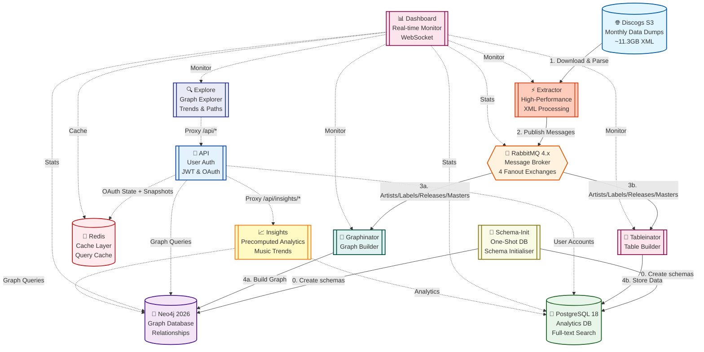
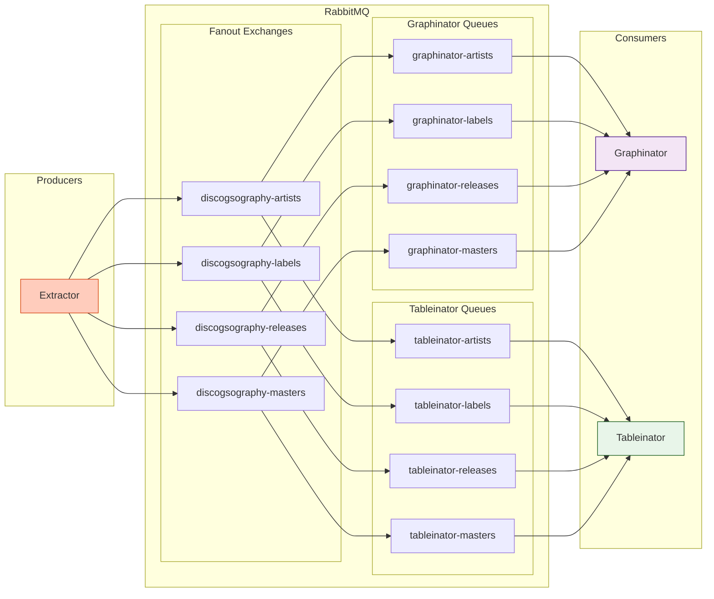

# 🏛️ Architecture Overview

<div align="center">

**Detailed system architecture and component documentation for Discogsography**

[🏠 Back to Main](../README.md) | [📚 Documentation Index](README.md)

</div>

## Overview

Discogsography is built as a microservices platform that processes large-scale music data from Discogs and transforms it into queryable knowledge graphs and relational databases. The architecture emphasizes scalability, reliability, and performance.

## Core Services

### ⚙️ Service Components

| Service                                                  | Purpose                                     | Key Technologies                                             | Port(s)               |
| -------------------------------------------------------- | ------------------------------------------- | ------------------------------------------------------------ | --------------------- |
| **[🔐](emoji-guide.md#service-identifiers) API**         | User auth, graph queries, and sync triggers | `FastAPI`, `psycopg3`, `redis`, Discogs OAuth 1.0            | 8004 (ext), 8005      |
| **[⚡](emoji-guide.md#service-identifiers) Extractor**   | High-performance Rust-based extractor       | `tokio`, `quick-xml`, `lapin`                                | 8000 (health)         |
| **[🔧](emoji-guide.md#service-identifiers) Schema-Init** | One-shot DB schema initializer              | `neo4j-driver`, `psycopg3`                                   | —                     |
| **[🔗](emoji-guide.md#service-identifiers) Graphinator** | Builds Neo4j knowledge graphs               | `neo4j-driver`, graph algorithms                             | 8001 (health)         |
| **[🐘](emoji-guide.md#service-identifiers) Tableinator** | Creates PostgreSQL analytics tables         | `psycopg3`, JSONB, full-text search                          | 8002 (health)         |
| **[🔍](emoji-guide.md#service-identifiers) Explore**     | Static frontend files and health check      | `FastAPI`, `Tailwind CSS`, `Alpine.js`, `D3.js`, `Plotly.js` | 8006, 8007 (internal) |
| **[📊](emoji-guide.md#service-identifiers) Dashboard**   | Real-time system monitoring                 | `FastAPI`, WebSocket, reactive UI                            | 8003 (ext)            |
| **[📈](emoji-guide.md#service-identifiers) Insights**    | Precomputed analytics and music trends      | `FastAPI`, `psycopg3`, `neo4j-driver`                        | 8008 (ext), 8009      |

### Infrastructure Components

| Component                                               | Purpose                               | Port(s)       |
| ------------------------------------------------------- | ------------------------------------- | ------------- |
| **[🐰](emoji-guide.md#service-identifiers) RabbitMQ**   | Message broker and queue management   | 5672, 15672   |
| **[🔗](emoji-guide.md#service-identifiers) Neo4j**      | Graph database for relationships      | 7474, 7687    |
| **[🐘](emoji-guide.md#service-identifiers) PostgreSQL** | Relational database for analytics     | 5433 (mapped) |
| **[🔴](emoji-guide.md#service-identifiers) Redis**      | Cache layer for queries and ML models | 6379          |

## System Architecture Diagram


```mermaid
graph TD
    S3[("🌐 Discogs S3<br/>Monthly Data Dumps<br/>~11.3GB XML")]
    EXT[["⚡ Extractor<br/>High-Performance<br/>XML Processing"]]
    SCHEMA[["🔧 Schema-Init<br/>One-Shot DB<br/>Schema Initialiser"]]
    RMQ{{"🐰 RabbitMQ 4.x<br/>Message Broker<br/>4 Fanout Exchanges"}}
    NEO4J[("🔗 Neo4j 2026<br/>Graph Database<br/>Relationships")]
    PG[("🐘 PostgreSQL 18<br/>Analytics DB<br/>Full-text Search")]
    REDIS[("🔴 Redis<br/>Cache Layer<br/>Query Cache")]
    GRAPH[["🔗 Graphinator<br/>Graph Builder"]]
    TABLE[["🐘 Tableinator<br/>Table Builder"]]
    DASH[["📊 Dashboard<br/>Real-time Monitor<br/>WebSocket"]]
    EXPLORE[["🔍 Explore<br/>Graph Explorer<br/>Trends & Paths"]]
    API[["🔐 API<br/>User Auth<br/>JWT & OAuth"]]
    INSIGHTS[["📈 Insights<br/>Precomputed Analytics<br/>Music Trends"]]

    SCHEMA -->|0. Create schemas| NEO4J
    SCHEMA -->|0. Create schemas| PG
    S3 -->|1. Download & Parse| EXT
    EXT -->|2. Publish Messages| RMQ
    RMQ -->|3a. Artists/Labels/Releases/Masters| GRAPH
    RMQ -->|3b. Artists/Labels/Releases/Masters| TABLE
    GRAPH -->|4a. Build Graph| NEO4J
    TABLE -->|4b. Store Data| PG

    EXPLORE -.->|Proxy /api/*| API

    API -.->|User Accounts| PG
    API -.->|Graph Queries| NEO4J
    API -.->|OAuth State + Snapshots| REDIS

    DASH -.->|Monitor| EXT
    DASH -.->|Monitor| GRAPH
    DASH -.->|Monitor| TABLE
    DASH -.->|Monitor| EXPLORE
    DASH -.->|Cache| REDIS
    DASH -.->|Stats| RMQ
    DASH -.->|Stats| NEO4J
    DASH -.->|Stats| PG

    API -.->|Proxy /api/insights/*| INSIGHTS
    INSIGHTS -.->|Analytics| PG
    INSIGHTS -.->|Graph Queries| NEO4J

    style S3 fill:#e1f5fe,stroke:#01579b,stroke-width:2px
    style EXT fill:#ffccbc,stroke:#d84315,stroke-width:2px
    style SCHEMA fill:#f9fbe7,stroke:#827717,stroke-width:2px
    style RMQ fill:#fff3e0,stroke:#e65100,stroke-width:2px
    style NEO4J fill:#f3e5f5,stroke:#4a148c,stroke-width:2px
    style PG fill:#e8f5e9,stroke:#1b5e20,stroke-width:2px
    style REDIS fill:#ffebee,stroke:#b71c1c,stroke-width:2px
    style DASH fill:#fce4ec,stroke:#880e4f,stroke-width:2px
    style EXPLORE fill:#e8eaf6,stroke:#283593,stroke-width:2px
    style GRAPH fill:#e0f2f1,stroke:#004d40,stroke-width:2px
    style TABLE fill:#fce4ec,stroke:#880e4f,stroke-width:2px
    style API fill:#e3f2fd,stroke:#0d47a1,stroke-width:2px
    style INSIGHTS fill:#fff9c4,stroke:#f57f17,stroke-width:2px
```

## Data Flow

### 1. Data Extraction Phase

**Extractor** (Rust-based):

- Downloads XML dumps from Discogs S3 bucket
- High-performance XML parsing (20,000-400,000+ records/sec)
- SHA256 hash-based deduplication
- Publishes JSON messages to per-data-type RabbitMQ fanout exchanges

### 2. Message Distribution Phase

**RabbitMQ Fanout Exchanges** (one per data type, decoupled from consumers):

- `discogsography-artists`: Artist and band data
- `discogsography-labels`: Record label information
- `discogsography-releases`: Release records
- `discogsography-masters`: Master recording data

Each consumer independently declares and binds its own queues to these exchanges.

**Message Types**:

- `data` — Individual records with SHA256 hash
- `file_complete` — Sent per data type when a file finishes processing
- `extraction_complete` — Sent once to all 4 exchanges after all files finish, carrying `started_at` timestamp and per-type record counts

```json
{
  "type": "data",
  "id": "<record_id>",
  "sha256": "<64-char hex hash>",
  ...entity-specific fields
}
```

See [Database Schema — Extractor Message Format](database-schema.md#extractor-message-format) for detailed examples.

### 3. Data Persistence Phase

**Graphinator** (Neo4j):

- Consumes messages from all 4 queues
- Creates nodes: Artist, Label, Release, Master, Genre, Style
- Builds relationships: BY, ON, MEMBER_OF, DERIVED_FROM, etc.
- On `extraction_complete`: deletes stub nodes (no `sha256` property) created by cross-type MERGE operations

**Tableinator** (PostgreSQL):

- Consumes messages from all 4 queues
- Stores JSONB documents in relational tables; always refreshes `updated_at`, only rewrites data when hash differs
- Creates indexes for fast queries
- On `extraction_complete`: purges stale rows where `updated_at < started_at`

See [Database Schema — Post-Extraction Cleanup](database-schema.md#post-extraction-cleanup) for details.

### 4. Query and Analytics Phase

**API Service** (graph query endpoints):

- Interactive graph exploration (`/api/explore`, `/api/expand`)
- Trend analysis and pattern discovery (`/api/trends`)
- Entity autocomplete and node detail lookup (`/api/autocomplete`, `/api/node/{id}`)
- User collection and wantlist queries (`/api/user/collection`, `/api/user/wantlist`)
- Collection gap analysis (`/api/collection/gaps/label/{id}`, `/api/collection/gaps/artist/{id}`, `/api/collection/gaps/master/{id}`)
- Graph snapshot save/restore (`/api/snapshot`)

**API Service** (new feature endpoints):

- Path finder (`/api/explore/path`)
- Unified full-text search (`/api/search`)
- Label DNA fingerprinting and comparison (`/api/label-dna/*`)
- Taste fingerprint analytics (`/api/user/taste/*`)
- Vinyl Archaeology time-travel filtering (`/api/explore/year-range`, `/api/explore/genre-emergence`, `before_year` parameter on `/api/expand`)
- Collection timeline evolution (`/api/user/collection/timeline`, `/api/user/collection/evolution`)

**Insights Service** (precomputed analytics):

- Scheduled batch analytics against Neo4j and PostgreSQL (configurable interval, default: 24h)
- Top artists by graph centrality (`/api/insights/top-artists`)
- Genre trends by decade (`/api/insights/genre-trends`)
- Label longevity rankings (`/api/insights/label-longevity`)
- Monthly release anniversaries (`/api/insights/this-month`)
- Data completeness scores (`/api/insights/data-completeness`)
- Computation status monitoring (`/api/insights/status`)

**Explore Service** (static frontend):

- Serves the D3.js force-directed graph UI and Plotly.js trends frontend
- All graph query API calls are made from the browser to the **API service** (port 8004)

**Dashboard Service**:

- Real-time WebSocket updates
- System health monitoring
- Queue metrics and processing rates
- Interactive visualizations

## Component Details

### Extractor

**Responsibilities**:

- Download Discogs XML dumps from S3
- Validate checksums and metadata
- Parse XML using high-performance streaming parser
- Deduplicate records using SHA256 hashing
- Publish to RabbitMQ queues

**Key Features**:

- Async Rust with Tokio runtime
- 20,000-400,000+ records/sec processing
- Memory-efficient streaming parser
- Periodic update checks (configurable interval)
- Smart file completion tracking
- Automatic retry with exponential backoff

**Configuration**:

- `DISCOGS_ROOT`: Data storage directory
- `PERIODIC_CHECK_DAYS`: Update check interval
- `AMQP_CONNECTION`: RabbitMQ connection string

See [Extractor README](../extractor/README.md) for details.

### Schema-Init

**Responsibilities**:

- Create all Neo4j constraints and indexes on first run
- Create all PostgreSQL tables and indexes on first run
- Run as a one-shot init container before any other service starts
- All DDL uses `IF NOT EXISTS` — safe to re-run, never drops schema objects

**Key Features**:

- Idempotent: re-running on an already-initialized database is a no-op
- Single source of truth for both Neo4j and PostgreSQL schema definitions
- Schema definitions live in `schema-init/neo4j_schema.py` and `schema-init/postgres_schema.py`
- Parallel initialization: Neo4j and PostgreSQL schema creation run concurrently
- Exits 0 on success, 1 on any failure (so dependent services will not start)

**Configuration**:

- `NEO4J_HOST`, `NEO4J_USERNAME`, `NEO4J_PASSWORD`: Neo4j connection
- `POSTGRES_HOST`, `POSTGRES_USERNAME`, `POSTGRES_PASSWORD`, `POSTGRES_DATABASE`: PostgreSQL connection

### Graphinator

**Responsibilities**:

- Build Neo4j knowledge graph
- Create nodes and relationships
- Maintain graph indexes
- Handle schema evolution

**Key Features**:

- Automatic relationship detection
- Batch transaction processing
- Connection resilience with retry logic
- Smart consumer lifecycle management

**Configuration**:

- `NEO4J_HOST`: Neo4j bolt URL
- `NEO4J_USERNAME`, `NEO4J_PASSWORD`: Auth credentials
- `CONSUMER_CANCEL_DELAY`: Idle timeout before shutdown

See [Graphinator README](../graphinator/README.md) for details.

### Tableinator

**Responsibilities**:

- Store data in PostgreSQL
- Create and maintain indexes
- Handle JSONB documents
- Enable full-text search

**Key Features**:

- JSONB for flexible schema
- GIN indexes for fast queries
- Batch insert optimization
- Connection pool management

**Configuration**:

- `POSTGRES_HOST`: PostgreSQL host:port
- `POSTGRES_USERNAME`, `POSTGRES_PASSWORD`: Auth credentials
- `POSTGRES_DATABASE`: Database name

See [Tableinator README](../tableinator/README.md) for details.

### Explore Service

**Responsibilities**:

- Serve the interactive graph exploration frontend (Tailwind CSS, Alpine.js, D3.js, Plotly.js)
- Provide a health check endpoint
- All graph query API endpoints are routed through the **API service**

**Key Features**:

- FastAPI static file serving (HTML, JS, CSS)
- Tailwind CSS dark theme with Alpine.js reactive UI
- D3.js force-directed graph and Plotly.js trends visualizations
- Internal-only (not externally exposed in Docker Compose)

**Configuration**:

- `API_BASE_URL`: URL of the API service to proxy graph query requests (default: `http://api:8004`)
- `CORS_ORIGINS`: Optional comma-separated list of allowed CORS origins

See [Explore README](../explore/README.md) for details.

### Dashboard

**Responsibilities**:

- Real-time system monitoring
- WebSocket-based live updates
- Service health checks
- Queue metrics visualization

**Key Features**:

- FastAPI backend
- WebSocket for real-time data
- Responsive HTML/CSS/JS frontend
- Activity log and event tracking

**Configuration**:

- Service health endpoint URLs
- Database connection strings
- RabbitMQ management API access

See [Dashboard README](../dashboard/README.md) for details.

### Insights

**Responsibilities**:

- Run scheduled batch analytics against Neo4j and PostgreSQL
- Compute artist centrality, genre trends, label longevity, anniversaries, and data completeness
- Store precomputed results in PostgreSQL `insights.*` tables
- Serve analytics via read-only HTTP endpoints

**Key Features**:

- FastAPI backend with async PostgreSQL and Neo4j drivers
- Configurable scheduler interval (default: 24 hours)
- 5 computation types running sequentially
- Redis caching with cache-aside pattern (TTL matches schedule interval, invalidated after computation)
- Separate health server on port 8009
- Results proxied through the API service at `/api/insights/*`

**Configuration**:

- `NEO4J_HOST`, `NEO4J_USERNAME`, `NEO4J_PASSWORD`: Neo4j connection
- `POSTGRES_HOST`, `POSTGRES_USERNAME`, `POSTGRES_PASSWORD`, `POSTGRES_DATABASE`: PostgreSQL connection
- `INSIGHTS_SCHEDULE_HOURS`: Computation interval in hours (default: 24)
- `REDIS_HOST`: Redis hostname for result caching
- `INSIGHTS_MILESTONE_YEARS`: Configurable anniversary years to highlight

See [Insights README](../insights/README.md) for details.

### API

**Responsibilities**:

- User registration and authentication (`/api/auth/*`)
- JWT token generation and validation (HS256)
- Discogs OAuth 1.0a OOB flow management (`/api/oauth/*`)
- Discogs OAuth token storage and retrieval
- Graph query endpoints (`/api/autocomplete`, `/api/explore`, `/api/expand`, `/api/node/{id}`, `/api/trends`)
- User collection and wantlist queries (`/api/user/collection`, `/api/user/wantlist`, `/api/user/recommendations`, `/api/user/collection/stats`, `/api/user/status`)
- Collection gap analysis (`/api/collection/gaps/{type}/{id}`, `/api/collection/formats`)
- Collection and wantlist sync (`/api/sync`, `/api/sync/status`)
- Graph snapshot save/restore (`/api/snapshot`, `/api/snapshot/{token}`)
- Reads Discogs app credentials from `app_config` table (set via `discogs-setup` CLI)

**Key Features**:

- FastAPI backend with async PostgreSQL
- PBKDF2-SHA256 password hashing (100,000 iterations)
- Stateless JWT authentication using shared `JWT_SECRET_KEY`
- Redis-backed OAuth state storage with TTL
- Token-protected endpoints for all user operations

**Configuration**:

- `JWT_SECRET_KEY`: Shared secret for HS256 token signing
- `POSTGRES_HOST`, `POSTGRES_USERNAME`, `POSTGRES_PASSWORD`: PostgreSQL connection
- `REDIS_HOST`: Redis connection for OAuth state
- `DISCOGS_USER_AGENT`: User-Agent header for Discogs API calls

See [API README](../api/README.md) for details.

## Message Queue Architecture

### Queue Structure


```mermaid
graph LR
    subgraph Producers
        EXT[Extractor]
    end

    subgraph RabbitMQ
        subgraph Fanout Exchanges
            AX[discogsography-artists]
            LX[discogsography-labels]
            RX[discogsography-releases]
            MX[discogsography-masters]
        end

        subgraph Graphinator Queues
            GAQ[graphinator-artists]
            GLQ[graphinator-labels]
            GRQ[graphinator-releases]
            GMQ[graphinator-masters]
        end

        subgraph Tableinator Queues
            TAQ[tableinator-artists]
            TLQ[tableinator-labels]
            TRQ[tableinator-releases]
            TMQ[tableinator-masters]
        end
    end

    subgraph Consumers
        GRAPH[Graphinator]
        TABLE[Tableinator]
    end

    EXT --> AX
    EXT --> LX
    EXT --> RX
    EXT --> MX

    AX --> GAQ
    AX --> TAQ
    LX --> GLQ
    LX --> TLQ
    RX --> GRQ
    RX --> TRQ
    MX --> GMQ
    MX --> TMQ

    GAQ --> GRAPH
    GLQ --> GRAPH
    GRQ --> GRAPH
    GMQ --> GRAPH

    TAQ --> TABLE
    TLQ --> TABLE
    TRQ --> TABLE
    TMQ --> TABLE

    style EXT fill:#ffccbc,stroke:#d84315
    style GRAPH fill:#f3e5f5,stroke:#4a148c
    style TABLE fill:#e8f5e9,stroke:#1b5e20
```

### Queue Properties

- **Durability**: All queues are durable (survive broker restart)
- **Persistence**: Messages persisted to disk
- **Prefetch**: Configurable per consumer (default: 100)
- **Dead Letter**: Failed messages routed to DLX
- **TTL**: No message expiration (process all data)

### Consumer Lifecycle

1. **Active Processing**: Consuming and processing messages
1. **Idle Detection**: All queues empty, no messages for 5 minutes
1. **Connection Cleanup**: Close RabbitMQ connections
1. **Periodic Checking**: Check queues every hour for new messages
1. **Auto-Reconnection**: Restart consumers when new data arrives

See [Consumer Cancellation](consumer-cancellation.md) for details.

## Database Architecture

### Neo4j Graph Database

**Purpose**: Store and query complex music relationships

**Node Types**:

- Artist (musicians, bands, producers)
- Label (record labels, imprints)
- Master (master recordings)
- Release (physical/digital releases)
- Genre (musical genres)
- Style (sub-genres, styles)
- User (authenticated Discogs users)

**Relationship Types**:

- BY (release → artist)
- ON (release → label)
- DERIVED_FROM (release → master)
- IS (release → genre/style)
- MEMBER_OF (artist → band)
- ALIAS_OF (artist alias → primary artist)
- SUBLABEL_OF (label → parent label)
- PART_OF (style → genre)
- COLLECTED (user → release)
- WANTS (user → release)

See [Database Schema](database-schema.md) for details.

### PostgreSQL Database

**Purpose**: Fast structured queries and analytics

**Tables**:

- `artists`: Artist data in JSONB format
- `labels`: Label data in JSONB format
- `masters`: Master recording data
- `releases`: Release data with full-text indexes
- `insights.artist_centrality`: Top artists by graph centrality
- `insights.genre_trends`: Genre release counts by decade
- `insights.label_longevity`: Labels ranked by years active
- `insights.monthly_anniversaries`: Notable release anniversaries
- `insights.data_completeness`: Data quality metrics per entity type
- `insights.computation_log`: Audit log of computation runs

**Indexes**:

- B-tree indexes on common query fields
- GIN indexes on JSONB columns
- Full-text search indexes

See [Database Schema](database-schema.md) for details.

### Redis Cache

**Purpose**: Cache query results and OAuth state

**Cache Types**:

- OAuth state tokens (API — short TTL, used during Discogs OAuth flow)
- Graph snapshots (API — native Redis TTL, default 28 days, survives service restarts)
- JWT revocation blacklist (API — JTI claims with TTL matching token expiry)
- Insights computation results (Insights — TTL matches schedule interval, invalidated after each run)
- Query result caching (Dashboard)
- Dashboard metrics

**Configuration**:

- Default TTL: 1 hour
- Max memory: Configurable
- Eviction policy: LRU

## Security Architecture

### Container Security

- Non-root users (UID 1000)
- Read-only root filesystems
- Dropped capabilities
- No new privileges flag
- Resource limits (CPU, memory)

See [Docker Security](docker-security.md) for details.

### Network Security

- No external ports exposed (except dashboards)
- Internal Docker network for services
- Encrypted connections to databases
- Secrets via environment variables

### Code Security

- Bandit security scanning
- Dependency vulnerability checks
- Type safety with mypy
- Input validation at boundaries

## Monitoring and Observability

### Health Checks

All services expose HTTP health endpoints:

```bash
# Externally accessible (Docker Compose)
curl http://localhost:8003/health  # Dashboard
curl http://localhost:8005/health  # API health check port

# Internal only (available from within Docker network, or local dev)
curl http://localhost:8000/health  # Extractor
curl http://localhost:8001/health  # Graphinator
curl http://localhost:8002/health  # Tableinator
curl http://localhost:8007/health  # Explore
curl http://localhost:8009/health  # Insights
```

### Logging

- Structured logging with emojis
- Log levels: DEBUG, INFO, WARNING, ERROR, CRITICAL
- Service-specific log files
- Centralized log aggregation ready

See [Logging Guide](logging-guide.md) for details.

### Metrics

- Processing rates (records/second)
- Queue depths and consumer counts
- Database connection pool stats
- Memory and CPU usage
- Error rates and retry counts

See [Monitoring](monitoring.md) for details.

## 💿 Dataset Scale

<div align="center">

|                   Data Type                    | Record Count | XML Size | Initial Load | Update Run |
| :--------------------------------------------: | :----------: | :------: | :----------: | :--------: |
| [📀](emoji-guide.md#music-domain) **Releases** | ~19 million  |  ~11GB   |  ~40 hours   | ~26 hours  |
| [🎤](emoji-guide.md#music-domain) **Artists**  | ~10 million  |  ~461MB  |  ~21 hours   | ~14 hours  |
| [🎵](emoji-guide.md#music-domain) **Masters**  | ~2.5 million |  ~575MB  |  ~4.5 hours  |  ~4 hours  |
|                 🏢 **Labels**                  | ~2.3 million |  ~84MB   |   ~4 hours   |  ~3 hours  |

**📊 Total: ~34 million records • ~11.3GB compressed • ~76GB on disk (28GB Neo4j + 48GB PostgreSQL)**

**⏱️ Initial load: ~2 days (parallel, limited by releases) • Update run: ~26 hours (~5x faster)**

</div>

### 🔗 Neo4j Graph Scale

<div align="center">

**Nodes: ~33.8 million**

| Node Label  |    Count     |
| :---------: | :----------: |
| **Release** | ~19 million  |
| **Artist**  | ~10 million  |
| **Master**  | ~2.5 million |
|  **Label**  | ~2.4 million |
|  **Style**  |     757      |
|  **Genre**  |      16      |

**Relationships: ~134.3 million**

| Relationship Type |     Count     | Description                        |
| :---------------: | :-----------: | :--------------------------------- |
|      **IS**       | ~61.2 million | Release/Master → Style/Genre       |
|      **BY**       |  ~26 million  | Release/Master → Artist            |
|      **ON**       | ~20.6 million | Release → Label                    |
| **DERIVED_FROM**  |  ~19 million  | Release → Master                   |
|   **ALIAS_OF**    | ~4.9 million  | Artist → Artist (aliases)          |
|   **MEMBER_OF**   | ~2.3 million  | Artist → Artist (group membership) |
|  **SUBLABEL_OF**  |     ~278K     | Label → Label (parent/child)       |
|    **PART_OF**    |     ~10K      | Series relationships               |

</div>

## Scalability Considerations

### Horizontal Scaling

**Stateless Services** (can scale horizontally):

- API (load balanced — JWT validation is stateless)
- Extractor (one instance per data type)
- Graphinator (multiple consumers per queue)
- Tableinator (multiple consumers per queue)
- Explore (load balanced)
- Dashboard (load balanced)
- Insights (load balanced)

**Stateful Services** (scale vertically):

- Neo4j (clustering available in enterprise)
- PostgreSQL (replication supported)
- RabbitMQ (clustering supported)
- Redis (clustering supported)

### Performance Tuning

- Batch size optimization
- Prefetch count tuning
- Connection pool sizing
- Index optimization
- Query caching strategies

See [Performance Guide](performance-guide.md) for details.

## Deployment Options

### Docker Compose (Development)

```bash
docker-compose up -d
```

**Pros**:

- Easy setup
- All services on one machine
- Good for development and testing

**Cons**:

- Limited scalability
- Single point of failure

### Kubernetes (Production)

**Recommended for**:

- Production deployments
- High availability requirements
- Auto-scaling needs
- Multi-node clusters

**Components**:

- Deployments for stateless services
- StatefulSets for databases
- Services for load balancing
- ConfigMaps and Secrets
- Persistent volumes

## Related Documentation

- [Quick Start Guide](quick-start.md) - Get started quickly
- [Configuration Guide](configuration.md) - Environment variables and settings
- [Database Schema](database-schema.md) - Detailed schema documentation
- [Performance Guide](performance-guide.md) - Optimization strategies
- [Monitoring Guide](monitoring.md) - Observability and debugging

______________________________________________________________________

**Last Updated**: 2026-03-15
