# 🏛️ Architecture Overview

<div align="center">

**Detailed system architecture and component documentation for Discogsography**

[🏠 Back to Main](../README.md) | [📚 Documentation Index](README.md)

</div>

## Overview

Discogsography is built as a microservices platform that processes large-scale music data from Discogs and transforms it into queryable knowledge graphs and relational databases. The architecture emphasizes scalability, reliability, and performance.

## Core Services

### ⚙️ Service Components

| Service                                                       | Purpose                                          | Key Technologies                              | Port(s)       |
| ------------------------------------------------------------- | ------------------------------------------------ | --------------------------------------------- | ------------- |
| **[📥](emoji-guide.md#service-identifiers) Python Extractor** | Downloads & processes Discogs XML dumps (Python) | `asyncio`, `orjson`, `aio-pika`               | 8000 (health) |
| **[⚡](emoji-guide.md#service-identifiers) Rust Extractor**   | High-performance Rust-based extractor            | `tokio`, `quick-xml`, `lapin`                 | 8000 (health) |
| **[🔗](emoji-guide.md#service-identifiers) Graphinator**      | Builds Neo4j knowledge graphs                    | `neo4j-driver`, graph algorithms              | 8001 (health) |
| **[🐘](emoji-guide.md#service-identifiers) Tableinator**      | Creates PostgreSQL analytics tables              | `psycopg3`, JSONB, full-text search           | 8002 (health) |
| **[🎵](emoji-guide.md#service-identifiers) Discovery**        | AI-powered music intelligence                    | `sentence-transformers`, `plotly`, `networkx` | 8005, 8004    |
| **[📊](emoji-guide.md#service-identifiers) Dashboard**        | Real-time system monitoring                      | `FastAPI`, WebSocket, reactive UI             | 8003          |

### Infrastructure Components

| Component                                               | Purpose                               | Port(s)       |
| ------------------------------------------------------- | ------------------------------------- | ------------- |
| **[🐰](emoji-guide.md#service-identifiers) RabbitMQ**   | Message broker and queue management   | 5672, 15672   |
| **[🔗](emoji-guide.md#service-identifiers) Neo4j**      | Graph database for relationships      | 7474, 7687    |
| **[🐘](emoji-guide.md#service-identifiers) PostgreSQL** | Relational database for analytics     | 5433 (mapped) |
| **[🔴](emoji-guide.md#service-identifiers) Redis**      | Cache layer for queries and ML models | 6379          |

## System Architecture Diagram

```mermaid
graph TD
    S3[("🌐 Discogs S3<br/>Monthly Data Dumps<br/>~50GB XML")]
    PYEXT[["📥 Python Extractor<br/>XML → JSON<br/>Deduplication"]]
    RSEXT[["⚡ Rust Extractor<br/>High-Performance<br/>XML Processing"]]
    RMQ{{"🐰 RabbitMQ<br/>Message Broker<br/>4 Queues"}}
    NEO4J[("🔗 Neo4j<br/>Graph Database<br/>Relationships")]
    PG[("🐘 PostgreSQL<br/>Analytics DB<br/>Full-text Search")]
    REDIS[("🔴 Redis<br/>Cache Layer<br/>Query & ML Cache")]
    GRAPH[["🔗 Graphinator<br/>Graph Builder"]]
    TABLE[["🐘 Tableinator<br/>Table Builder"]]
    DASH[["📊 Dashboard<br/>Real-time Monitor<br/>WebSocket"]]
    DISCO[["🎵 Discovery<br/>AI Engine<br/>ML Models"]]

    S3 -->|1a. Download & Parse| PYEXT
    S3 -->|1b. Download & Parse| RSEXT
    PYEXT -->|2. Publish Messages| RMQ
    RSEXT -->|2. Publish Messages| RMQ
    RMQ -->|3a. Artists/Labels/Releases/Masters| GRAPH
    RMQ -->|3b. Artists/Labels/Releases/Masters| TABLE
    GRAPH -->|4a. Build Graph| NEO4J
    TABLE -->|4b. Store Data| PG

    DISCO -.->|Query| NEO4J
    DISCO -.->|Query via asyncpg| PG
    DISCO -.->|Cache| REDIS
    DISCO -.->|Analyze| DISCO

    DASH -.->|Monitor| PYEXT
    DASH -.->|Monitor| RSEXT
    DASH -.->|Monitor| GRAPH
    DASH -.->|Monitor| TABLE
    DASH -.->|Monitor| DISCO
    DASH -.->|Cache| REDIS
    DASH -.->|Stats| RMQ
    DASH -.->|Stats| NEO4J
    DASH -.->|Stats| PG

    style S3 fill:#e1f5fe,stroke:#01579b,stroke-width:2px
    style PYEXT fill:#fff9c4,stroke:#f57c00,stroke-width:2px
    style RSEXT fill:#ffccbc,stroke:#d84315,stroke-width:2px
    style RMQ fill:#fff3e0,stroke:#e65100,stroke-width:2px
    style NEO4J fill:#f3e5f5,stroke:#4a148c,stroke-width:2px
    style PG fill:#e8f5e9,stroke:#1b5e20,stroke-width:2px
    style REDIS fill:#ffebee,stroke:#b71c1c,stroke-width:2px
    style DASH fill:#fce4ec,stroke:#880e4f,stroke-width:2px
    style DISCO fill:#e3f2fd,stroke:#0d47a1,stroke-width:2px
```



## Data Flow

### 1. Data Extraction Phase

**Python Extractor** (Default):

- Downloads XML dumps from Discogs S3 bucket
- Parses XML using streaming parser (5,000-10,000 records/sec)
- SHA256 hash-based deduplication
- Publishes JSON messages to RabbitMQ queues

**Rust Extractor** (High-Performance Option):

- High-performance alternative to Python Extractor
- Processes 20,000-400,000+ records/sec
- Same deduplication and messaging logic
- Switch using `./scripts/switch-extractor.sh rust`

### 2. Message Distribution Phase

**RabbitMQ Queues**:

- `artists_queue`: Artist and band data
- `labels_queue`: Record label information
- `releases_queue`: Release records
- `masters_queue`: Master recording data

**Message Format**:

```json
{
  "type": "artist|label|release|master",
  "data": {...},
  "hash": "sha256_hash"
}
```

### 3. Data Persistence Phase

**Graphinator** (Neo4j):

- Consumes messages from all 4 queues
- Creates nodes: Artist, Label, Release, Master, Genre, Style
- Builds relationships: BY, ON, MEMBER_OF, DERIVED_FROM, etc.
- Batch processing: 1,000-2,000 records/sec

**Tableinator** (PostgreSQL):

- Consumes messages from all 4 queues
- Stores JSONB documents in relational tables
- Creates indexes for fast queries
- Batch processing: 3,000-5,000 records/sec

### 4. Query and Analytics Phase

**Discovery Service**:

- AI-powered music recommendations
- Semantic search using sentence transformers
- Graph algorithms: PageRank, community detection
- Results cached in Redis for performance

**Dashboard Service**:

- Real-time WebSocket updates
- System health monitoring
- Queue metrics and processing rates
- Interactive visualizations

## Component Details

### Python Extractor

**Responsibilities**:

- Download Discogs XML dumps from S3
- Validate checksums and metadata
- Parse XML using streaming parser
- Deduplicate records using SHA256 hashing
- Publish to RabbitMQ queues

**Key Features**:

- Async I/O for optimal performance
- Periodic update checks (configurable interval)
- Smart file completion tracking
- Automatic retry with exponential backoff

**Configuration**:

- `DISCOGS_ROOT`: Data storage directory
- `PERIODIC_CHECK_DAYS`: Update check interval
- `AMQP_CONNECTION`: RabbitMQ connection string

See [Extractor README](../extractor/pyextractor/README.md) for details.

### Rust Extractor

**Responsibilities**:

- High-performance alternative to Python Extractor
- Same functionality with dramatically improved throughput
- Optimized for large-scale data processing

**Key Features**:

- Async Rust with Tokio runtime
- 20,000-400,000+ records/sec processing
- Memory-efficient streaming parser
- Compatible with existing infrastructure

**Switching Extractors**:

```bash
# Switch to Rust Extractor
./scripts/switch-extractor.sh rust

# Switch back to Python Extractor
./scripts/switch-extractor.sh python
```

See [Rust Extractor README](../extractor/rustextractor/README.md) for details.

### Graphinator

**Responsibilities**:

- Build Neo4j knowledge graph
- Create nodes and relationships
- Maintain graph indexes
- Handle schema evolution

**Key Features**:

- Automatic relationship detection
- Batch transaction processing
- Connection resilience with retry logic
- Smart consumer lifecycle management

**Configuration**:

- `NEO4J_ADDRESS`: Neo4j bolt URL
- `NEO4J_USERNAME`, `NEO4J_PASSWORD`: Auth credentials
- `CONSUMER_CANCEL_DELAY`: Idle timeout before shutdown

See [Graphinator README](../graphinator/README.md) for details.

### Tableinator

**Responsibilities**:

- Store data in PostgreSQL
- Create and maintain indexes
- Handle JSONB documents
- Enable full-text search

**Key Features**:

- JSONB for flexible schema
- GIN indexes for fast queries
- Batch insert optimization
- Connection pool management

**Configuration**:

- `POSTGRES_ADDRESS`: PostgreSQL host:port
- `POSTGRES_USERNAME`, `POSTGRES_PASSWORD`: Auth credentials
- `POSTGRES_DATABASE`: Database name

See [Tableinator README](../tableinator/README.md) for details.

### Discovery Service

**Responsibilities**:

- AI-powered music discovery and recommendations
- Semantic search using ML models
- Graph analysis and visualization
- Industry analytics and insights

**Key Features**:

- Sentence transformers for embeddings
- Redis caching for query performance
- Interactive Plotly visualizations
- Network graph rendering with vis.js

**Configuration**:

- `REDIS_URL`: Redis cache connection
- `HF_HOME`: Hugging Face model cache
- `SENTENCE_TRANSFORMERS_HOME`: Transformer cache
- Database connection settings

See [Discovery README](../discovery/README.md) for details.

### Dashboard

**Responsibilities**:

- Real-time system monitoring
- WebSocket-based live updates
- Service health checks
- Queue metrics visualization

**Key Features**:

- FastAPI backend
- WebSocket for real-time data
- Responsive HTML/CSS/JS frontend
- Activity log and event tracking

**Configuration**:

- Service health endpoint URLs
- Database connection strings
- RabbitMQ management API access

See [Dashboard README](../dashboard/README.md) for details.

## Message Queue Architecture

### Queue Structure


### Queue Properties

- **Durability**: All queues are durable (survive broker restart)
- **Persistence**: Messages persisted to disk
- **Prefetch**: Configurable per consumer (default: 100)
- **Dead Letter**: Failed messages routed to DLX
- **TTL**: No message expiration (process all data)

### Consumer Lifecycle

1. **Active Processing**: Consuming and processing messages
1. **Idle Detection**: All queues empty, no messages for 5 minutes
1. **Connection Cleanup**: Close RabbitMQ connections
1. **Periodic Checking**: Check queues every hour for new messages
1. **Auto-Reconnection**: Restart consumers when new data arrives

See [Consumer Cancellation](consumer-cancellation.md) for details.

## Database Architecture

### Neo4j Graph Database

**Purpose**: Store and query complex music relationships

**Node Types**:

- Artist (musicians, bands, producers)
- Label (record labels, imprints)
- Master (master recordings)
- Release (physical/digital releases)
- Genre (musical genres)
- Style (sub-genres, styles)

**Relationship Types**:

- BY (release → artist)
- ON (release → label)
- MEMBER_OF (artist → band)
- DERIVED_FROM (release → master)
- SUBLABEL_OF (label → parent label)
- IS (release → genre/style)

See [Database Schema](database-schema.md) for details.

### PostgreSQL Database

**Purpose**: Fast structured queries and analytics

**Tables**:

- `artists`: Artist data in JSONB format
- `labels`: Label data in JSONB format
- `masters`: Master recording data
- `releases`: Release data with full-text indexes

**Indexes**:

- B-tree indexes on common query fields
- GIN indexes on JSONB columns
- Full-text search indexes

See [Database Schema](database-schema.md) for details.

### Redis Cache

**Purpose**: Cache query results and ML model outputs

**Cache Types**:

- Query result caching
- Embedding vectors
- Graph algorithm results
- Dashboard metrics

**Configuration**:

- Default TTL: 1 hour
- Max memory: Configurable
- Eviction policy: LRU

## Security Architecture

### Container Security

- Non-root users (UID 1000)
- Read-only root filesystems
- Dropped capabilities
- No new privileges flag
- Resource limits (CPU, memory)

See [Docker Security](docker-security.md) for details.

### Network Security

- No external ports exposed (except dashboards)
- Internal Docker network for services
- Encrypted connections to databases
- Secrets via environment variables

### Code Security

- Bandit security scanning
- Dependency vulnerability checks
- Type safety with mypy
- Input validation at boundaries

## Monitoring and Observability

### Health Checks

All services expose HTTP health endpoints:

```bash
curl http://localhost:8000/health  # Extractor (Python or Rust)
curl http://localhost:8001/health  # Graphinator
curl http://localhost:8002/health  # Tableinator
curl http://localhost:8003/health  # Dashboard
curl http://localhost:8004/health  # Discovery
```

### Logging

- Structured logging with emojis
- Log levels: DEBUG, INFO, WARNING, ERROR, CRITICAL
- Service-specific log files
- Centralized log aggregation ready

See [Logging Guide](logging-guide.md) for details.

### Metrics

- Processing rates (records/second)
- Queue depths and consumer counts
- Database connection pool stats
- Memory and CPU usage
- Error rates and retry counts

See [Monitoring](monitoring.md) for details.

## Scalability Considerations

### Horizontal Scaling

**Stateless Services** (can scale horizontally):

- Python Extractor (one instance per data type)
- Rust Extractor (one instance per data type)
- Graphinator (multiple consumers per queue)
- Tableinator (multiple consumers per queue)
- Discovery (load balanced)
- Dashboard (load balanced)

**Stateful Services** (scale vertically):

- Neo4j (clustering available in enterprise)
- PostgreSQL (replication supported)
- RabbitMQ (clustering supported)
- Redis (clustering supported)

### Performance Tuning

- Batch size optimization
- Prefetch count tuning
- Connection pool sizing
- Index optimization
- Query caching strategies

See [Performance Guide](performance-guide.md) for details.

## Deployment Options

### Docker Compose (Development)

```bash
docker-compose up -d
```

**Pros**:

- Easy setup
- All services on one machine
- Good for development and testing

**Cons**:

- Limited scalability
- Single point of failure

### Kubernetes (Production)

**Recommended for**:

- Production deployments
- High availability requirements
- Auto-scaling needs
- Multi-node clusters

**Components**:

- Deployments for stateless services
- StatefulSets for databases
- Services for load balancing
- ConfigMaps and Secrets
- Persistent volumes

## Related Documentation

- [Quick Start Guide](quick-start.md) - Get started quickly
- [Configuration Guide](configuration.md) - Environment variables and settings
- [Database Schema](database-schema.md) - Detailed schema documentation
- [Performance Guide](performance-guide.md) - Optimization strategies
- [Monitoring Guide](monitoring.md) - Observability and debugging

______________________________________________________________________

**Last Updated**: 2025-01-15
