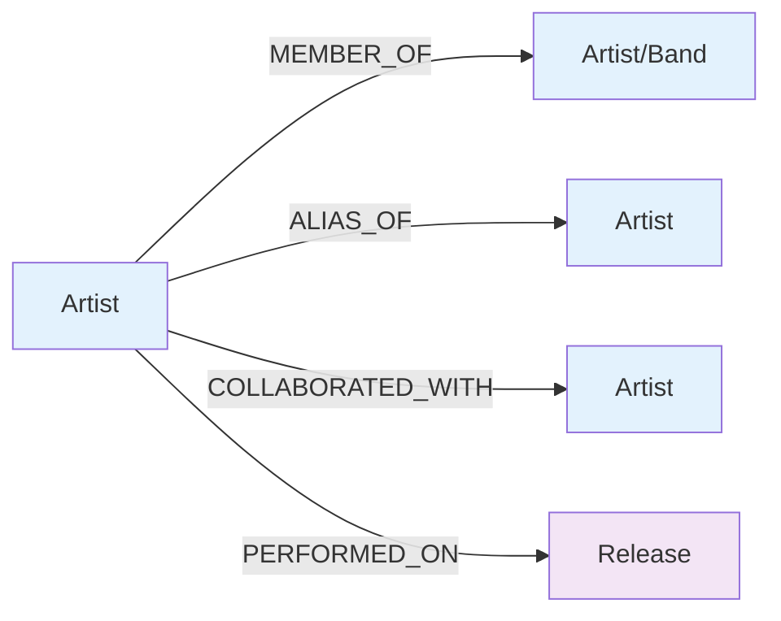
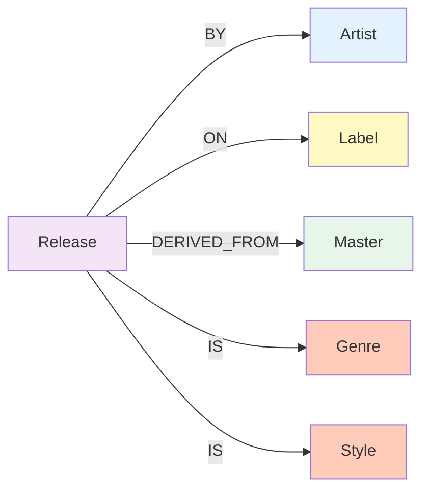
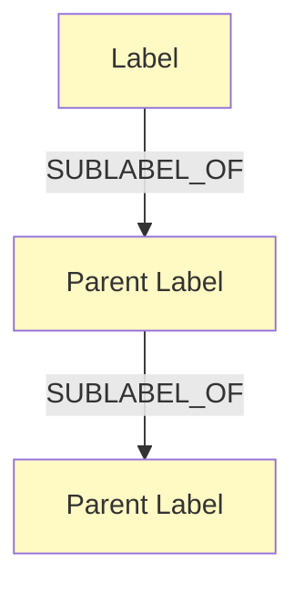
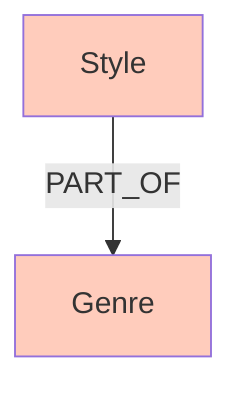
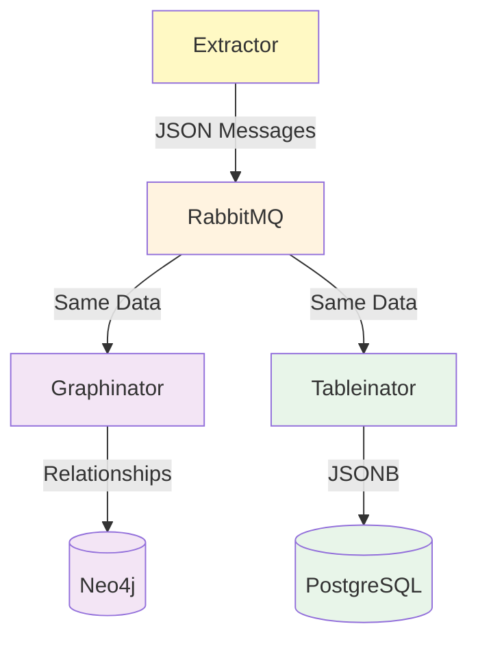

# 🗄️ Database Schema

<div align="center">

**Complete database schema documentation for Neo4j and PostgreSQL**

[🏠 Back to Main](../README.md) | [📚 Documentation Index](README.md) | [🏛️ Architecture](architecture.md)

</div>

## Overview

Discogsography uses two complementary database systems:
- **Neo4j**: Graph database for complex relationship queries
- **PostgreSQL**: Relational database for fast analytics and full-text search

## 🔗 Neo4j Graph Database

### Purpose

Neo4j stores music industry relationships as a graph, making it ideal for:
- Navigation of complex music relationships
- Discovery of connections between artists
- Analysis of label ecosystems
- Genre and style relationships
- Collaboration networks

### Node Types

#### Artist Node

Represents musicians, bands, producers, and other music industry individuals.

```cypher
(:Artist {
  id: String,              # Discogs artist ID
  name: String,            # Artist name
  real_name: String?,      # Real name (if different)
  profile: String?,        # Biography/description
  data_quality: String?,   # Data quality indicator
  namevariations: [String]?, # Alternative names
  urls: [String]?,         # Associated URLs
  members: [String]?,      # Band members (if group)
  groups: [String]?        # Groups this artist belongs to
})
```

**Indexes**:
```cypher
CREATE INDEX artist_id IF NOT EXISTS FOR (a:Artist) ON (a.id);
CREATE INDEX artist_name IF NOT EXISTS FOR (a:Artist) ON (a.name);
```

#### Label Node

Represents record labels and their imprints.

```cypher
(:Label {
  id: String,              # Discogs label ID
  name: String,            # Label name
  profile: String?,        # Label description
  contact_info: String?,   # Contact information
  parent_label: String?,   # Parent label (if sublabel)
  sublabels: [String]?,    # Sublabels
  urls: [String]?          # Associated URLs
})
```

**Indexes**:
```cypher
CREATE INDEX label_id IF NOT EXISTS FOR (l:Label) ON (l.id);
CREATE INDEX label_name IF NOT EXISTS FOR (l:Label) ON (l.name);
```

#### Master Node

Represents master recordings (the original recordings from which releases are derived).

```cypher
(:Master {
  id: String,              # Discogs master ID
  title: String,           # Recording title
  year: Integer?,          # Release year
  main_release: String?,   # Main release ID
  data_quality: String?,   # Data quality indicator
  genres: [String]?,       # Musical genres
  styles: [String]?,       # Musical styles
  artists: [String]?       # Primary artists
})
```

**Indexes**:
```cypher
CREATE INDEX master_id IF NOT EXISTS FOR (m:Master) ON (m.id);
CREATE INDEX master_title IF NOT EXISTS FOR (m:Master) ON (m.title);
CREATE INDEX master_year IF NOT EXISTS FOR (m:Master) ON (m.year);
```

#### Release Node

Represents physical or digital releases (albums, singles, etc.).

```cypher
(:Release {
  id: String,              # Discogs release ID
  title: String,           # Release title
  year: Integer?,          # Release year
  country: String?,        # Country of release
  format: [String]?,       # Format (CD, Vinyl, etc.)
  master_id: String?,      # Associated master ID
  data_quality: String?,   # Data quality indicator
  genres: [String]?,       # Musical genres
  styles: [String]?,       # Musical styles
  artists: [String]?,      # Primary artists
  labels: [String]?,       # Release labels
  tracklist: [Object]?     # Track information
})
```

**Indexes**:
```cypher
CREATE INDEX release_id IF NOT EXISTS FOR (r:Release) ON (r.id);
CREATE INDEX release_title IF NOT EXISTS FOR (r:Release) ON (r.title);
CREATE INDEX release_year IF NOT EXISTS FOR (r:Release) ON (r.year);
CREATE INDEX release_country IF NOT EXISTS FOR (r:Release) ON (r.country);
```

#### Genre Node

Represents musical genres.

```cypher
(:Genre {
  name: String             # Genre name (e.g., "Rock", "Electronic")
})
```

**Indexes**:
```cypher
CREATE INDEX genre_name IF NOT EXISTS FOR (g:Genre) ON (g.name);
```

#### Style Node

Represents musical styles (sub-genres).

```cypher
(:Style {
  name: String             # Style name (e.g., "Progressive Rock", "Techno")
})
```

**Indexes**:
```cypher
CREATE INDEX style_name IF NOT EXISTS FOR (s:Style) ON (s.name);
```

### Relationships

#### Artist Relationships



**MEMBER_OF**:
```cypher
(artist:Artist)-[:MEMBER_OF]->(band:Artist)
```
- Direction: Individual → Band
- Properties: None
- Example: (John Lennon)-[:MEMBER_OF]->(The Beatles)

**ALIAS_OF**:
```cypher
(alias:Artist)-[:ALIAS_OF]->(primary:Artist)
```
- Direction: Alias → Primary
- Properties: None
- Example: (The Artist Formerly Known as Prince)-[:ALIAS_OF]->(Prince)

**COLLABORATED_WITH**:
```cypher
(artist1:Artist)-[:COLLABORATED_WITH]-(artist2:Artist)
```
- Direction: Bidirectional
- Properties: None
- Example: (David Bowie)-[:COLLABORATED_WITH]-(Queen)

**PERFORMED_ON**:
```cypher
(artist:Artist)-[:PERFORMED_ON {role: String}]->(release:Release)
```
- Direction: Artist → Release
- Properties: `role` (e.g., "Vocals", "Guitar")
- Example: (Miles Davis)-[:PERFORMED_ON {role: "Trumpet"}]->(Kind of Blue)

#### Release Relationships



**BY**:
```cypher
(release:Release)-[:BY]->(artist:Artist)
```
- Direction: Release → Artist
- Properties: None
- Example: (Dark Side of the Moon)-[:BY]->(Pink Floyd)

**ON**:
```cypher
(release:Release)-[:ON]->(label:Label)
```
- Direction: Release → Label
- Properties: `catalog_number: String?`
- Example: (Dark Side of the Moon)-[:ON {catalog_number: "SHVL 804"}]->(Harvest Records)

**DERIVED_FROM**:
```cypher
(release:Release)-[:DERIVED_FROM]->(master:Master)
```
- Direction: Release → Master
- Properties: None
- Example: (Dark Side of the Moon [UK pressing])-[:DERIVED_FROM]->(Dark Side of the Moon [master])

**IS** (Genre):
```cypher
(release:Release)-[:IS]->(genre:Genre)
```
- Direction: Release → Genre
- Properties: None
- Example: (Dark Side of the Moon)-[:IS]->(Progressive Rock)

**IS** (Style):
```cypher
(release:Release)-[:IS]->(style:Style)
```
- Direction: Release → Style
- Properties: None
- Example: (Dark Side of the Moon)-[:IS]->(Psychedelic Rock)

#### Label Relationships



**SUBLABEL_OF**:
```cypher
(sublabel:Label)-[:SUBLABEL_OF]->(parent:Label)
```
- Direction: Sublabel → Parent
- Properties: None
- Example: (Harvest Records)-[:SUBLABEL_OF]->(EMI)

#### Genre/Style Relationships



**PART_OF**:
```cypher
(style:Style)-[:PART_OF]->(genre:Genre)
```
- Direction: Style → Genre
- Properties: None
- Example: (Progressive Rock)-[:PART_OF]->(Rock)

### Common Queries

#### Find all releases by an artist

```cypher
MATCH (a:Artist {name: "Pink Floyd"})-[:BY]-(r:Release)
RETURN r.title, r.year
ORDER BY r.year;
```

#### Discover band members

```cypher
MATCH (member:Artist)-[:MEMBER_OF]->(band:Artist {name: "The Beatles"})
RETURN member.name, member.real_name;
```

#### Explore label catalog

```cypher
MATCH (r:Release)-[:ON]->(l:Label {name: "Blue Note"})
WHERE r.year >= 1950 AND r.year <= 1970
RETURN r.title, r.artist, r.year
ORDER BY r.year;
```

#### Find artist collaborations

```cypher
MATCH (a1:Artist {name: "Miles Davis"})-[:COLLABORATED_WITH]-(a2:Artist)
RETURN DISTINCT a2.name
ORDER BY a2.name;
```

#### Analyze genre connections

```cypher
MATCH (r:Release)-[:IS]->(g:Genre)
WITH g.name as genre, count(r) as release_count
RETURN genre, release_count
ORDER BY release_count DESC
LIMIT 20;
```

## 🐘 PostgreSQL Database

### Purpose

PostgreSQL stores denormalized data for:
- Fast structured queries
- Full-text search
- Analytics and reporting
- JSONB-based flexible schema

### Table Schema

All tables follow the same basic structure with JSONB columns for flexibility.

#### Artists Table

```sql
CREATE TABLE artists (
    data_id VARCHAR PRIMARY KEY,              -- Discogs artist ID
    hash VARCHAR NOT NULL UNIQUE,             -- SHA256 hash for deduplication
    data JSONB NOT NULL                       -- Complete artist data
);

-- Indexes for performance
CREATE INDEX idx_artists_name ON artists ((data->>'name'));
CREATE INDEX idx_artists_gin ON artists USING GIN (data);
CREATE INDEX idx_artists_real_name ON artists ((data->>'real_name'));
```

**Data Structure**:
```json
{
  "id": "123",
  "name": "Pink Floyd",
  "real_name": null,
  "profile": "British progressive rock band...",
  "data_quality": "Correct",
  "namevariations": ["The Pink Floyd", "Pink Floyd Sound"],
  "urls": ["https://www.pinkfloyd.com"],
  "members": ["Roger Waters", "David Gilmour", ...],
  "images": [...]
}
```

#### Labels Table

```sql
CREATE TABLE labels (
    data_id VARCHAR PRIMARY KEY,
    hash VARCHAR NOT NULL UNIQUE,
    data JSONB NOT NULL
);

CREATE INDEX idx_labels_name ON labels ((data->>'name'));
CREATE INDEX idx_labels_gin ON labels USING GIN (data);
CREATE INDEX idx_labels_parent ON labels ((data->>'parent_label'));
```

**Data Structure**:
```json
{
  "id": "456",
  "name": "Blue Note",
  "profile": "American jazz record label...",
  "contact_info": "...",
  "parent_label": "EMI",
  "sublabels": ["Blue Note Japan"],
  "urls": ["https://www.bluenote.com"]
}
```

#### Masters Table

```sql
CREATE TABLE masters (
    data_id VARCHAR PRIMARY KEY,
    hash VARCHAR NOT NULL UNIQUE,
    data JSONB NOT NULL
);

CREATE INDEX idx_masters_title ON masters ((data->>'title'));
CREATE INDEX idx_masters_year ON masters ((data->>'year'));
CREATE INDEX idx_masters_gin ON masters USING GIN (data);
CREATE INDEX idx_masters_genres ON masters USING GIN ((data->'genres'));
```

**Data Structure**:
```json
{
  "id": "789",
  "title": "Kind of Blue",
  "year": 1959,
  "main_release": "789-1",
  "data_quality": "Correct",
  "genres": ["Jazz"],
  "styles": ["Modal", "Cool Jazz"],
  "artists": [{"id": "111", "name": "Miles Davis"}]
}
```

#### Releases Table

```sql
CREATE TABLE releases (
    data_id VARCHAR PRIMARY KEY,
    hash VARCHAR NOT NULL UNIQUE,
    data JSONB NOT NULL
);

-- Performance indexes
CREATE INDEX idx_releases_title ON releases ((data->>'title'));
CREATE INDEX idx_releases_artist ON releases ((data->>'artist'));
CREATE INDEX idx_releases_year ON releases ((data->>'year'));
CREATE INDEX idx_releases_country ON releases ((data->>'country'));
CREATE INDEX idx_releases_gin ON releases USING GIN (data);
CREATE INDEX idx_releases_genres ON releases USING GIN ((data->'genres'));
CREATE INDEX idx_releases_labels ON releases USING GIN ((data->'labels'));

-- Full-text search index
CREATE INDEX idx_releases_title_fts ON releases
  USING GIN (to_tsvector('english', data->>'title'));
```

**Data Structure**:
```json
{
  "id": "1000",
  "title": "Kind of Blue",
  "year": 1959,
  "country": "US",
  "format": ["Vinyl", "LP", "Album"],
  "master_id": "789",
  "data_quality": "Correct",
  "genres": ["Jazz"],
  "styles": ["Modal", "Cool Jazz"],
  "artists": [{"id": "111", "name": "Miles Davis"}],
  "labels": [{"id": "456", "name": "Columbia", "catno": "CL 1355"}],
  "tracklist": [
    {"position": "A1", "title": "So What", "duration": "9:22"},
    ...
  ]
}
```

### Common Queries

#### Full-text search releases

```sql
SELECT
    data->>'title' as title,
    data->>'artist' as artist,
    data->>'year' as year
FROM releases
WHERE data->>'title' ILIKE '%dark side%'
ORDER BY (data->>'year')::int DESC
LIMIT 10;
```

#### Artist discography

```sql
SELECT
    data->>'title' as title,
    data->>'year' as year,
    data->'genres' as genres
FROM releases
WHERE data->>'artist' = 'Miles Davis'
AND (data->>'year')::int BETWEEN 1950 AND 1960
ORDER BY (data->>'year')::int;
```

#### Genre statistics

```sql
SELECT
    genre,
    COUNT(*) as release_count,
    MIN((data->>'year')::int) as first_release,
    MAX((data->>'year')::int) as last_release
FROM releases,
     jsonb_array_elements_text(data->'genres') as genre
GROUP BY genre
ORDER BY release_count DESC
LIMIT 20;
```

#### Search by label

```sql
SELECT
    data->>'title' as title,
    data->>'year' as year
FROM releases
WHERE data @> '{"labels": [{"name": "Blue Note"}]}'
ORDER BY (data->>'year')::int;
```

#### Complex JSONB query

```sql
SELECT
    data->>'title' as title,
    data->>'year' as year,
    label->>'name' as label,
    label->>'catno' as catalog_number
FROM releases,
     jsonb_array_elements(data->'labels') as label
WHERE (data->>'year')::int = 1959
AND label->>'name' = 'Columbia';
```

## 🔄 Data Synchronization

Both databases receive the same source data but store it differently:



### Consistency Guarantees

- **Hash-based deduplication**: Prevents duplicate records
- **Idempotent operations**: Re-processing same data is safe
- **Eventual consistency**: Both databases will converge to same state
- **No distributed transactions**: Services operate independently

### Data Flow

1. Extractor parses XML and computes SHA256 hash
2. Message published to RabbitMQ with data + hash
3. Graphinator checks hash in Neo4j, skips if exists
4. Tableinator checks hash in PostgreSQL, skips if exists
5. New/changed records inserted/updated in both databases

## 📊 Performance Considerations

### Neo4j Optimization

**Index Strategy**:
- Create indexes on frequently queried properties
- Use composite indexes for complex queries
- Monitor query performance with `PROFILE` command

**Query Optimization**:
- Use `LIMIT` to restrict result size
- Avoid Cartesian products
- Use parameters for repeated queries
- Consider query caching

**Batch Operations**:
- Use `UNWIND` for batch inserts
- Transaction size: 1000-5000 operations
- Periodic `COMMIT` for long-running operations

### PostgreSQL Optimization

**Index Strategy**:
- B-tree indexes for equality/range queries
- GIN indexes for JSONB and full-text search
- Analyze query plans with `EXPLAIN ANALYZE`

**Query Optimization**:
- Use `->` for key access, `->>` for text values
- Cast types explicitly: `(data->>'year')::int`
- Utilize GIN indexes for `@>` containment queries
- Consider materialized views for complex analytics

**Vacuum and Analyze**:
```sql
-- Regular maintenance
VACUUM ANALYZE artists;
VACUUM ANALYZE labels;
VACUUM ANALYZE masters;
VACUUM ANALYZE releases;
```

## 🔧 Database Maintenance

### Neo4j Maintenance

```cypher
-- Check database stats
CALL dbms.queryJmx('org.neo4j:*') YIELD name, attributes;

-- List all indexes
SHOW INDEXES;

-- List all constraints
SHOW CONSTRAINTS;

-- Rebuild indexes (if needed)
DROP INDEX index_name IF EXISTS;
CREATE INDEX index_name FOR (n:NodeType) ON (n.property);
```

### PostgreSQL Maintenance

```sql
-- Database statistics
SELECT schemaname, tablename, n_live_tup, n_dead_tup
FROM pg_stat_user_tables
ORDER BY n_live_tup DESC;

-- Index usage
SELECT schemaname, tablename, indexname, idx_scan, idx_tup_read, idx_tup_fetch
FROM pg_stat_user_indexes
ORDER BY idx_scan DESC;

-- Table sizes
SELECT
    schemaname,
    tablename,
    pg_size_pretty(pg_total_relation_size(schemaname||'.'||tablename)) AS size
FROM pg_tables
WHERE schemaname = 'public'
ORDER BY pg_total_relation_size(schemaname||'.'||tablename) DESC;
```

## Related Documentation

- [Architecture Overview](architecture.md) - System architecture and data flow
- [Usage Examples](usage-examples.md) - More query examples
- [Performance Guide](performance-guide.md) - Database tuning
- [Neo4j Indexing](neo4j-indexing.md) - Advanced indexing strategies

---

**Last Updated**: 2025-01-15
