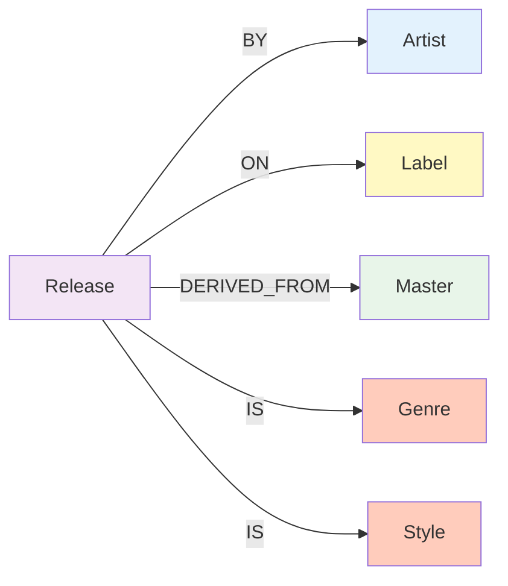
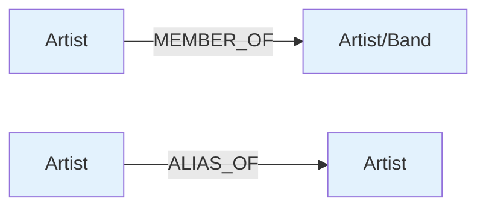
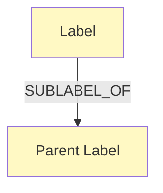
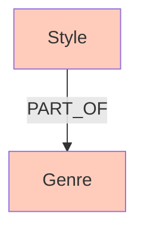
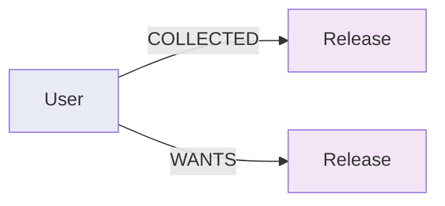
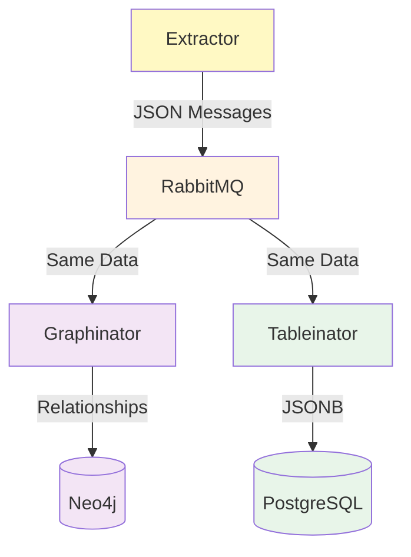

# Database Schema

<div align="center">

**Complete database schema documentation for Neo4j and PostgreSQL**

[Back to Main](../README.md) | [Documentation Index](README.md) | [Architecture](architecture.md)

</div>

## Overview

Discogsography uses two complementary database systems:

- **Neo4j**: Graph database for complex relationship queries
- **PostgreSQL**: Relational database for fast analytics and full-text search

### Schema Ownership

All schema definitions are owned exclusively by the **`schema-init`** service, which runs as a one-shot init container before any other service starts:

- **`schema-init/neo4j_schema.py`**: All Neo4j constraints and indexes
- **`schema-init/postgres_schema.py`**: All PostgreSQL tables and indexes

All DDL statements use `IF NOT EXISTS` -- the schema is never dropped and is safe to re-run on every startup. Graphinator and Tableinator only write data; they rely on schema-init to have prepared the database beforehand.

## Neo4j Graph Database

### Purpose

Neo4j stores music industry relationships as a graph, making it ideal for:

- Navigation of complex music relationships
- Discovery of connections between artists
- Analysis of label ecosystems
- Genre and style relationships
- User collection analysis and gap detection

### Data Pipeline

Raw XML data from the Discogs dump is parsed by the **extractor** into JSON messages and published to RabbitMQ. Each message includes a `type` field (`"data"` or `"file_complete"`), an `id`, and a `sha256` hash. Before writing to Neo4j, the **graphinator** normalizes each message using `normalize_record()`, which flattens nested XML-dict structures, extracts IDs, and parses year values. See [Extractor Message Format](#extractor-message-format) for the raw data structure.

### Node Types

The graphinator stores only the properties needed for graph traversal and querying. Detailed record data is stored in PostgreSQL. The following sections document the **actual properties written to Neo4j** by the graphinator.

#### Artist Node

Represents musicians, bands, producers, and other music industry individuals.

```cypher
(:Artist {
  id: String,              -- Discogs artist ID
  name: String,            -- Artist name
  resource_url: String,    -- Discogs API resource URL
  releases_url: String,    -- Discogs API releases URL
  sha256: String           -- Content hash for change detection
})
```

**Constraints & Indexes**:

```cypher
CREATE CONSTRAINT artist_id IF NOT EXISTS FOR (a:Artist) REQUIRE a.id IS UNIQUE;
CREATE INDEX artist_sha256 IF NOT EXISTS FOR (a:Artist) ON (a.sha256);
CREATE INDEX artist_name IF NOT EXISTS FOR (a:Artist) ON (a.name);
CREATE FULLTEXT INDEX artist_name_fulltext IF NOT EXISTS FOR (n:Artist) ON EACH [n.name];
```

#### Label Node

Represents record labels and their imprints.

```cypher
(:Label {
  id: String,              -- Discogs label ID
  name: String,            -- Label name
  sha256: String           -- Content hash for change detection
})
```

**Constraints & Indexes**:

```cypher
CREATE CONSTRAINT label_id IF NOT EXISTS FOR (l:Label) REQUIRE l.id IS UNIQUE;
CREATE INDEX label_sha256 IF NOT EXISTS FOR (l:Label) ON (l.sha256);
CREATE INDEX label_name IF NOT EXISTS FOR (l:Label) ON (l.name);
CREATE FULLTEXT INDEX label_name_fulltext IF NOT EXISTS FOR (n:Label) ON EACH [n.name];
```

#### Master Node

Represents master recordings (the original recordings from which releases are derived).

```cypher
(:Master {
  id: String,              -- Discogs master ID
  title: String,           -- Recording title
  year: Integer?,          -- Release year (parsed to integer, null if absent/invalid)
  sha256: String           -- Content hash for change detection
})
```

**Constraints & Indexes**:

```cypher
CREATE CONSTRAINT master_id IF NOT EXISTS FOR (m:Master) REQUIRE m.id IS UNIQUE;
CREATE INDEX master_sha256 IF NOT EXISTS FOR (m:Master) ON (m.sha256);
```

#### Release Node

Represents physical or digital releases (albums, singles, etc.).

```cypher
(:Release {
  id: String,              -- Discogs release ID
  title: String,           -- Release title
  year: Integer?,          -- Release year (parsed from 'released' date field, null if absent)
  formats: [String]?,      -- Deduplicated format names (e.g., ["Vinyl", "LP", "Album"])
  sha256: String           -- Content hash for change detection
})
```

**Constraints & Indexes**:

```cypher
CREATE CONSTRAINT release_id IF NOT EXISTS FOR (r:Release) REQUIRE r.id IS UNIQUE;
CREATE INDEX release_sha256 IF NOT EXISTS FOR (r:Release) ON (r.sha256);
CREATE INDEX release_year_index IF NOT EXISTS FOR (r:Release) ON (r.year);
CREATE FULLTEXT INDEX release_title_fulltext IF NOT EXISTS FOR (n:Release) ON EACH [n.title];
```

#### Genre Node

Represents musical genres.

```cypher
(:Genre {
  name: String             -- Genre name (e.g., "Rock", "Electronic")
})
```

**Constraints & Indexes**:

```cypher
CREATE CONSTRAINT genre_name IF NOT EXISTS FOR (g:Genre) REQUIRE g.name IS UNIQUE;
CREATE FULLTEXT INDEX genre_name_fulltext IF NOT EXISTS FOR (n:Genre) ON EACH [n.name];
```

#### Style Node

Represents musical styles (sub-genres).

```cypher
(:Style {
  name: String             -- Style name (e.g., "Progressive Rock", "Techno")
})
```

**Constraints & Indexes**:

```cypher
CREATE CONSTRAINT style_name IF NOT EXISTS FOR (s:Style) REQUIRE s.name IS UNIQUE;
CREATE FULLTEXT INDEX style_name_fulltext IF NOT EXISTS FOR (n:Style) ON EACH [n.name];
```

#### User Node

Represents an authenticated Discogs user. Created by the collection sync process.

```cypher
(:User {
  id: String               -- Discogs username
})
```

**Constraints**:

```cypher
CREATE CONSTRAINT user_id IF NOT EXISTS FOR (u:User) REQUIRE u.id IS UNIQUE;
```

### Relationships

#### Release Relationships


```mermaid
graph LR
    R[Release] -->|BY| A[Artist]
    R -->|ON| L[Label]
    R -->|DERIVED_FROM| M[Master]
    R -->|IS| G[Genre]
    R -->|IS| S[Style]

    style R fill:#f3e5f5
    style A fill:#e3f2fd
    style L fill:#fff9c4
    style M fill:#e8f5e9
    style G fill:#ffccbc
    style S fill:#ffccbc
```

**BY**:

```cypher
(release:Release)-[:BY]->(artist:Artist)
```

- Direction: Release -> Artist
- Properties: None
- Example: (Dark Side of the Moon)-[:BY]->(Pink Floyd)

**ON**:

```cypher
(release:Release)-[:ON]->(label:Label)
```

- Direction: Release -> Label
- Properties: None
- Example: (Dark Side of the Moon)-[:ON]->(Harvest Records)

**DERIVED_FROM**:

```cypher
(release:Release)-[:DERIVED_FROM]->(master:Master)
```

- Direction: Release -> Master
- Properties: None
- Example: (Dark Side of the Moon [UK pressing])-[:DERIVED_FROM]->(Dark Side of the Moon [master])

**IS** (Genre):

```cypher
(release:Release)-[:IS]->(genre:Genre)
```

- Direction: Release -> Genre
- Properties: None
- Example: (Dark Side of the Moon)-[:IS]->(Rock)

**IS** (Style):

```cypher
(release:Release)-[:IS]->(style:Style)
```

- Direction: Release -> Style
- Properties: None
- Example: (Dark Side of the Moon)-[:IS]->(Psychedelic Rock)

#### Artist Relationships


```mermaid
graph LR
    A1[Artist] -->|MEMBER_OF| A2[Artist/Band]
    A3[Artist] -->|ALIAS_OF| A4[Artist]

    style A1 fill:#e3f2fd
    style A2 fill:#e3f2fd
    style A3 fill:#e3f2fd
    style A4 fill:#e3f2fd
```

**MEMBER_OF**:

```cypher
(artist:Artist)-[:MEMBER_OF]->(band:Artist)
```

- Direction: Individual -> Band
- Properties: None
- Example: (John Lennon)-[:MEMBER_OF]->(The Beatles)

**ALIAS_OF**:

```cypher
(alias:Artist)-[:ALIAS_OF]->(primary:Artist)
```

- Direction: Alias -> Primary
- Properties: None
- Example: (The Artist Formerly Known as Prince)-[:ALIAS_OF]->(Prince)

#### Label Relationships


```mermaid
graph TD
    L1[Label] -->|SUBLABEL_OF| L2[Parent Label]

    style L1 fill:#fff9c4
    style L2 fill:#fff9c4
```

**SUBLABEL_OF**:

```cypher
(sublabel:Label)-[:SUBLABEL_OF]->(parent:Label)
```

- Direction: Sublabel -> Parent
- Properties: None
- Example: (Harvest Records)-[:SUBLABEL_OF]->(EMI)

#### Genre/Style Relationships


```mermaid
graph TD
    S[Style] -->|PART_OF| G[Genre]

    style S fill:#ffccbc
    style G fill:#ffccbc
```

**PART_OF**:

```cypher
(style:Style)-[:PART_OF]->(genre:Genre)
```

- Direction: Style -> Genre
- Properties: None
- Example: (Progressive Rock)-[:PART_OF]->(Rock)

#### User Relationships


```mermaid
graph LR
    U[User] -->|COLLECTED| R1[Release]
    U -->|WANTS| R2[Release]

    style U fill:#e8eaf6
    style R1 fill:#f3e5f5
    style R2 fill:#f3e5f5
```

**COLLECTED**:

```cypher
(user:User)-[:COLLECTED {rating, folder_id, date_added, synced_at}]->(release:Release)
```

- Direction: User -> Release
- Properties: `rating` (Integer?), `folder_id` (String?), `date_added` (String?), `synced_at` (String)
- Created by the collection sync process

**WANTS**:

```cypher
(user:User)-[:WANTS {rating, date_added, synced_at}]->(release:Release)
```

- Direction: User -> Release
- Properties: `rating` (Integer?), `date_added` (String?), `synced_at` (String)
- Created by the wantlist sync process

### Complete Relationship Summary

| Relationship | From | To | Properties |
|---|---|---|---|
| BY | Release | Artist | None |
| ON | Release | Label | None |
| DERIVED_FROM | Release | Master | None |
| IS | Release | Genre | None |
| IS | Release | Style | None |
| MEMBER_OF | Artist | Artist (band) | None |
| ALIAS_OF | Artist | Artist (primary) | None |
| SUBLABEL_OF | Label | Label (parent) | None |
| PART_OF | Style | Genre | None |
| COLLECTED | User | Release | rating, folder_id, date_added, synced_at |
| WANTS | User | Release | rating, date_added, synced_at |

### Common Queries

#### Find all releases by an artist

```cypher
MATCH (r:Release)-[:BY]->(a:Artist {name: "Pink Floyd"})
RETURN r.title, r.year
ORDER BY r.year;
```

#### Discover band members

```cypher
MATCH (member:Artist)-[:MEMBER_OF]->(band:Artist {name: "The Beatles"})
RETURN member.name;
```

#### Explore label catalog

```cypher
MATCH (r:Release)-[:ON]->(l:Label {name: "Blue Note"})
WHERE r.year >= 1950 AND r.year <= 1970
RETURN r.title, r.year
ORDER BY r.year;
```

#### Release timeline by genre

```cypher
MATCH (r:Release)-[:IS]->(g:Genre {name: "Jazz"})
WHERE r.year > 0
WITH r.year AS year, count(DISTINCT r) AS count
RETURN year, count
ORDER BY year;
```

#### Analyze genre connections

```cypher
MATCH (r:Release)-[:IS]->(g:Genre)
WITH g.name as genre, count(r) as release_count
RETURN genre, release_count
ORDER BY release_count DESC
LIMIT 20;
```

#### Gap analysis (find missing releases on a label)

```cypher
MATCH (u:User {id: $user_id})
MATCH (l:Label {id: $label_id})<-[:ON]-(r:Release)
WHERE NOT (u)-[:COLLECTED]->(r)
OPTIONAL MATCH (r)-[:BY]->(a:Artist)
OPTIONAL MATCH (r)-[:IS]->(g:Genre)
RETURN r.id, r.title, r.year, r.formats,
       collect(DISTINCT a.name)[0] AS artist,
       collect(DISTINCT g.name) AS genres
ORDER BY r.year DESC;
```

## Extractor Message Format

The Rust extractor parses Discogs XML dumps and publishes JSON messages to RabbitMQ. Each entity type has its own queue. Messages use xmltodict conventions: XML attributes are prefixed with `@`, text content with attributes uses `#text`, and single vs multiple child elements may be an object vs array.

### Message Envelope

Every message includes:

```json
{
  "type": "data",
  "id": "<record_id>",
  "sha256": "<64-char hex hash of record content>",
  ...entity-specific fields
}
```

File completion markers:

```json
{
  "type": "file_complete",
  "data_type": "artists|labels|masters|releases",
  "file": "discogs_20260301_artists.xml.gz",
  "total_processed": 523847,
  "timestamp": "2026-03-05T12:45:23.456Z"
}
```

### Raw Artist Message

Source XML:

```xml
<artist id="1">
  <id>1</id>
  <name>The Beatles</name>
  <members>
    <name id="10">John Lennon</name>
    <name id="20">Paul McCartney</name>
  </members>
  <aliases>
    <name id="100">Beatles, The</name>
  </aliases>
  <groups>
    <name id="200">Plastic Ono Band</name>
  </groups>
</artist>
```

Raw JSON message:

```json
{
  "type": "data",
  "id": "1",
  "sha256": "abc123...",
  "name": "The Beatles",
  "members": {
    "name": [
      { "@id": "10", "#text": "John Lennon" },
      { "@id": "20", "#text": "Paul McCartney" }
    ]
  },
  "aliases": {
    "name": { "@id": "100", "#text": "Beatles, The" }
  },
  "groups": {
    "name": { "@id": "200", "#text": "Plastic Ono Band" }
  }
}
```

After `normalize_record("artists", ...)`:

```json
{
  "id": "1",
  "name": "The Beatles",
  "sha256": "abc123...",
  "members": [
    { "id": "10", "name": "John Lennon" },
    { "id": "20", "name": "Paul McCartney" }
  ],
  "aliases": [{ "id": "100", "name": "Beatles, The" }],
  "groups": [{ "id": "200", "name": "Plastic Ono Band" }]
}
```

### Raw Label Message

Source XML:

```xml
<label>
  <id>1</id>
  <name>EMI</name>
  <parentLabel id="500">EMI Group</parentLabel>
  <sublabels>
    <label id="10">Parlophone</label>
    <label id="20">Columbia</label>
  </sublabels>
</label>
```

Raw JSON message:

```json
{
  "type": "data",
  "id": "1",
  "sha256": "def456...",
  "name": "EMI",
  "parentLabel": { "@id": "500", "#text": "EMI Group" },
  "sublabels": {
    "label": [
      { "@id": "10", "#text": "Parlophone" },
      { "@id": "20", "#text": "Columbia" }
    ]
  }
}
```

After `normalize_record("labels", ...)`:

```json
{
  "id": "1",
  "name": "EMI",
  "sha256": "def456...",
  "parentLabel": { "id": "500", "name": "EMI Group" },
  "sublabels": [
    { "id": "10", "name": "Parlophone" },
    { "id": "20", "name": "Columbia" }
  ]
}
```

### Raw Master Message

Source XML:

```xml
<master id="1000">
  <title>Abbey Road</title>
  <year>1969</year>
  <artists>
    <artist>
      <id>456</id>
      <name>The Beatles</name>
    </artist>
  </artists>
  <genres>
    <genre>Rock</genre>
    <genre>Pop</genre>
  </genres>
  <styles>
    <style>Pop Rock</style>
  </styles>
</master>
```

Raw JSON message:

```json
{
  "type": "data",
  "id": "1000",
  "sha256": "ghi789...",
  "title": "Abbey Road",
  "year": "1969",
  "artists": {
    "artist": { "id": "456", "name": "The Beatles" }
  },
  "genres": { "genre": ["Rock", "Pop"] },
  "styles": { "style": "Pop Rock" }
}
```

After `normalize_record("masters", ...)`:

```json
{
  "id": "1000",
  "title": "Abbey Road",
  "year": 1969,
  "sha256": "ghi789...",
  "artists": [{ "id": "456", "name": "The Beatles" }],
  "genres": ["Rock", "Pop"],
  "styles": ["Pop Rock"]
}
```

Note: `year` is parsed from the string `"1969"` to the integer `1969` by `_parse_year_int()`.

### Raw Release Message

Source XML:

```xml
<release id="123">
  <title>Abbey Road</title>
  <released>1969-09-26</released>
  <artists>
    <artist>
      <id>456</id>
      <name>The Beatles</name>
    </artist>
  </artists>
  <labels>
    <label id="100" name="Apple Records" catno="PCS 7088"/>
  </labels>
  <formats>
    <format name="Vinyl" qty="1">
      <descriptions><description>LP</description></descriptions>
    </format>
  </formats>
  <genres>
    <genre>Rock</genre>
  </genres>
  <styles>
    <style>Pop Rock</style>
  </styles>
  <master_id is_main_release="true">1000</master_id>
  <country>UK</country>
</release>
```

Raw JSON message:

```json
{
  "type": "data",
  "id": "123",
  "sha256": "jkl012...",
  "title": "Abbey Road",
  "released": "1969-09-26",
  "artists": {
    "artist": { "id": "456", "name": "The Beatles" }
  },
  "labels": {
    "label": { "@id": "100", "@name": "Apple Records", "@catno": "PCS 7088" }
  },
  "formats": {
    "format": {
      "@name": "Vinyl",
      "@qty": "1",
      "descriptions": { "description": "LP" }
    }
  },
  "genres": { "genre": "Rock" },
  "styles": { "style": "Pop Rock" },
  "master_id": { "#text": "1000", "@is_main_release": "true" },
  "country": "UK"
}
```

After `normalize_record("releases", ...)`:

```json
{
  "id": "123",
  "title": "Abbey Road",
  "year": 1969,
  "sha256": "jkl012...",
  "artists": [{ "id": "456", "name": "The Beatles" }],
  "labels": [{ "id": "100", "name": "Apple Records", "catno": "PCS 7088" }],
  "master_id": "1000",
  "genres": ["Rock"],
  "styles": ["Pop Rock"],
  "released": "1969-09-26",
  "country": "UK",
  "formats": { "format": { "@name": "Vinyl", "@qty": "1", "descriptions": { "description": "LP" } } }
}
```

Notes:
- `year` is parsed from the `released` date field (`"1969-09-26"` -> `1969`) by `_parse_year_int()`.
- `master_id` is extracted from the `#text` field of the dict.
- `formats` raw data is preserved; the graphinator separately calls `extract_format_names()` to produce `["Vinyl"]` for storage on the Release node.

### XML-to-JSON Conventions

| XML Pattern | JSON Result |
|---|---|
| `<name>Text</name>` | `"name": "Text"` |
| `<el id="1">Text</el>` | `"el": {"@id": "1", "#text": "Text"}` |
| `<el id="1"/>` | `"el": {"@id": "1"}` |
| Multiple `<el>` children | `"el": [...]` (array) |
| Single `<el>` child | `"el": {...}` (object, not array) |

This single-vs-array ambiguity is why `normalize_record()` exists: it normalizes all list-like fields to consistent arrays.

## PostgreSQL Database

### Purpose

PostgreSQL stores denormalized data for:

- Fast structured queries
- Full-text search
- Analytics and reporting
- JSONB-based flexible schema

### Table Schema

All entity tables follow the same basic structure with JSONB columns for flexibility.

#### Entity Tables (artists, labels, masters, releases)

```sql
CREATE TABLE IF NOT EXISTS <entity_type> (
    data_id VARCHAR PRIMARY KEY,     -- Discogs entity ID
    hash VARCHAR NOT NULL,            -- SHA256 hash for change detection
    data JSONB NOT NULL              -- Complete normalized record data
);

CREATE INDEX IF NOT EXISTS idx_<entity>_hash ON <entity> (hash);
```

The `data` column stores the **full normalized record** from `normalize_record()`, not just the properties written to Neo4j. This means PostgreSQL has access to all fields (profile, tracklist, notes, etc.) while Neo4j only stores the subset needed for graph traversal.

#### Entity-Specific Indexes

```sql
-- Artists
CREATE INDEX IF NOT EXISTS idx_artists_name ON artists ((data->>'name'));

-- Labels
CREATE INDEX IF NOT EXISTS idx_labels_name ON labels ((data->>'name'));

-- Masters
CREATE INDEX IF NOT EXISTS idx_masters_title ON masters ((data->>'title'));
CREATE INDEX IF NOT EXISTS idx_masters_year ON masters ((data->>'year'));

-- Releases
CREATE INDEX IF NOT EXISTS idx_releases_title ON releases ((data->>'title'));
CREATE INDEX IF NOT EXISTS idx_releases_year ON releases ((data->>'year'));
CREATE INDEX IF NOT EXISTS idx_releases_country ON releases ((data->>'country'));
CREATE INDEX IF NOT EXISTS idx_releases_genres ON releases USING GIN ((data->'genres'));
CREATE INDEX IF NOT EXISTS idx_releases_labels ON releases USING GIN ((data->'labels'));
```

#### User Tables

```sql
CREATE TABLE IF NOT EXISTS users (
    id              UUID PRIMARY KEY DEFAULT gen_random_uuid(),
    email           VARCHAR(255) UNIQUE NOT NULL,
    hashed_password VARCHAR(255) NOT NULL,
    is_active       BOOLEAN NOT NULL DEFAULT TRUE,
    created_at      TIMESTAMP WITH TIME ZONE NOT NULL DEFAULT NOW(),
    updated_at      TIMESTAMP WITH TIME ZONE NOT NULL DEFAULT NOW()
);

CREATE TABLE IF NOT EXISTS oauth_tokens (
    id                UUID PRIMARY KEY DEFAULT gen_random_uuid(),
    user_id           UUID NOT NULL REFERENCES users(id) ON DELETE CASCADE,
    provider          VARCHAR(50) NOT NULL,
    access_token      TEXT NOT NULL,
    access_secret     TEXT NOT NULL,
    provider_username VARCHAR(255),
    provider_user_id  VARCHAR(255),
    created_at        TIMESTAMP WITH TIME ZONE NOT NULL DEFAULT NOW(),
    updated_at        TIMESTAMP WITH TIME ZONE NOT NULL DEFAULT NOW(),
    UNIQUE(user_id, provider)
);

CREATE TABLE IF NOT EXISTS app_config (
    key        VARCHAR(255) PRIMARY KEY,
    value      TEXT NOT NULL,
    updated_at TIMESTAMP WITH TIME ZONE NOT NULL DEFAULT NOW()
);

CREATE TABLE IF NOT EXISTS user_collections (
    id           UUID PRIMARY KEY DEFAULT gen_random_uuid(),
    user_id      UUID NOT NULL REFERENCES users(id) ON DELETE CASCADE,
    release_id   BIGINT NOT NULL,
    instance_id  BIGINT,
    folder_id    INTEGER,
    title        VARCHAR(500),
    artist       VARCHAR(500),
    year         INTEGER,
    formats      JSONB,
    label        VARCHAR(255),
    condition    VARCHAR(100),
    rating       SMALLINT,
    notes        TEXT,
    date_added   TIMESTAMP WITH TIME ZONE,
    metadata     JSONB,
    created_at   TIMESTAMP WITH TIME ZONE NOT NULL DEFAULT NOW(),
    updated_at   TIMESTAMP WITH TIME ZONE NOT NULL DEFAULT NOW(),
    UNIQUE(user_id, release_id, instance_id)
);

CREATE INDEX IF NOT EXISTS idx_user_collections_user_id ON user_collections (user_id);
CREATE INDEX IF NOT EXISTS idx_user_collections_release_id ON user_collections (release_id);

CREATE TABLE IF NOT EXISTS user_wantlists (
    id         UUID PRIMARY KEY DEFAULT gen_random_uuid(),
    user_id    UUID NOT NULL REFERENCES users(id) ON DELETE CASCADE,
    release_id BIGINT NOT NULL,
    title      VARCHAR(500),
    artist     VARCHAR(500),
    year       INTEGER,
    format     VARCHAR(255),
    rating     SMALLINT,
    notes      TEXT,
    date_added TIMESTAMP WITH TIME ZONE,
    metadata   JSONB,
    created_at TIMESTAMP WITH TIME ZONE NOT NULL DEFAULT NOW(),
    updated_at TIMESTAMP WITH TIME ZONE NOT NULL DEFAULT NOW(),
    UNIQUE(user_id, release_id)
);

CREATE INDEX IF NOT EXISTS idx_user_wantlists_user_id ON user_wantlists (user_id);
CREATE INDEX IF NOT EXISTS idx_user_wantlists_release_id ON user_wantlists (release_id);

CREATE TABLE IF NOT EXISTS sync_history (
    id            UUID PRIMARY KEY DEFAULT gen_random_uuid(),
    user_id       UUID NOT NULL REFERENCES users(id) ON DELETE CASCADE,
    sync_type     VARCHAR(50) NOT NULL,
    status        VARCHAR(50) NOT NULL DEFAULT 'pending',
    items_synced  INTEGER,
    pages_fetched INTEGER,
    error_message TEXT,
    started_at    TIMESTAMP WITH TIME ZONE NOT NULL DEFAULT NOW(),
    completed_at  TIMESTAMP WITH TIME ZONE
);

CREATE INDEX IF NOT EXISTS idx_sync_history_user_started ON sync_history (user_id, started_at DESC);
CREATE INDEX IF NOT EXISTS idx_sync_history_running ON sync_history (user_id) WHERE status = 'running';
```

### Common Queries

#### Full-text search releases

```sql
SELECT
    data->>'title' as title,
    data->>'year' as year
FROM releases
WHERE data->>'title' ILIKE '%dark side%'
ORDER BY (data->>'year')::int DESC
LIMIT 10;
```

#### Artist discography

```sql
SELECT
    data->>'title' as title,
    data->>'year' as year,
    data->'genres' as genres
FROM releases, jsonb_array_elements(data->'artists') as artist
WHERE artist->>'name' = 'Miles Davis'
ORDER BY (data->>'year')::int;
```

#### Genre statistics

```sql
SELECT
    genre,
    COUNT(*) as release_count,
    MIN((data->>'year')::int) as first_release,
    MAX((data->>'year')::int) as last_release
FROM releases,
     jsonb_array_elements_text(data->'genres') as genre
GROUP BY genre
ORDER BY release_count DESC
LIMIT 20;
```

## Data Synchronization

Both databases receive the same source data but store it differently:


```mermaid
graph TD
    EXT[Extractor] -->|JSON Messages| RMQ[RabbitMQ]
    RMQ -->|Same Data| GRAPH[Graphinator]
    RMQ -->|Same Data| TABLE[Tableinator]
    GRAPH -->|Relationships| NEO4J[(Neo4j)]
    TABLE -->|JSONB| PG[(PostgreSQL)]

    style EXT fill:#fff9c4
    style RMQ fill:#fff3e0
    style GRAPH fill:#f3e5f5
    style TABLE fill:#e8f5e9
    style NEO4J fill:#f3e5f5
    style PG fill:#e8f5e9
```

### Processing Pipeline

Both graphinator and tableinator follow the same normalization pipeline:

1. Raw JSON message received from RabbitMQ
2. `normalize_record(data_type, data)` called to flatten XML-dict structures
3. Hash-based deduplication check (skip if unchanged)
4. Write to database (Neo4j nodes/relationships or PostgreSQL JSONB)
5. Acknowledge message

Both batch and single-message processing paths call `normalize_record()` at the same point, ensuring identical data reaches the database regardless of processing mode.

### Consistency Guarantees

- **Hash-based deduplication**: Prevents duplicate records
- **Idempotent operations**: Re-processing same data is safe
- **Eventual consistency**: Both databases will converge to same state
- **No distributed transactions**: Services operate independently
- **Identical normalization**: Both paths use `normalize_record()` before writing

### Data Flow

1. **Schema-Init** creates all constraints, indexes, and tables in Neo4j and PostgreSQL (before any other service starts)
1. Extractor parses XML and computes SHA256 hash
1. Message published to RabbitMQ with data + hash
1. Graphinator normalizes and writes nodes and relationships to Neo4j
1. Tableinator normalizes and writes JSONB records to PostgreSQL
1. New/changed records inserted/updated in both databases

## Performance Considerations

### Neo4j Optimization

**Index Strategy**:

- Uniqueness constraints on all node ID properties
- SHA256 indexes for fast deduplication lookups
- Name/title indexes for query performance
- Full-text indexes for autocomplete search
- Year index on Release for timeline queries

**Query Optimization**:

- Use `LIMIT` to restrict result size
- Avoid Cartesian products
- Use parameters for repeated queries
- Year stored as integer to avoid runtime `toInteger()` coercion

**Batch Operations**:

- Use `UNWIND` for batch inserts
- Transaction size: 100 records per batch (configurable)
- Periodic flush for low-traffic periods

### PostgreSQL Optimization

**Index Strategy**:

- B-tree indexes for equality/range queries on extracted JSONB fields
- GIN indexes for JSONB containment queries (genres, labels)

**Query Optimization**:

- Use `->` for key access, `->>` for text values
- Cast types explicitly: `(data->>'year')::int`
- Utilize GIN indexes for `@>` containment queries

**Vacuum and Analyze**:

```sql
VACUUM ANALYZE artists;
VACUUM ANALYZE labels;
VACUUM ANALYZE masters;
VACUUM ANALYZE releases;
```

## Database Maintenance

### Neo4j Maintenance

```cypher
-- List all indexes
SHOW INDEXES;

-- List all constraints
SHOW CONSTRAINTS;
```

### PostgreSQL Maintenance

```sql
-- Database statistics
SELECT schemaname, tablename, n_live_tup, n_dead_tup
FROM pg_stat_user_tables
ORDER BY n_live_tup DESC;

-- Table sizes
SELECT
    schemaname,
    tablename,
    pg_size_pretty(pg_total_relation_size(schemaname||'.'||tablename)) AS size
FROM pg_tables
WHERE schemaname = 'public'
ORDER BY pg_total_relation_size(schemaname||'.'||tablename) DESC;
```

## Related Documentation

- [Architecture Overview](architecture.md) - System architecture and data flow
- [Neo4j Indexing](neo4j-indexing.md) - Advanced indexing strategies
- [State Marker System](state-marker-system.md) - Extractor progress tracking

---

**Last Updated**: 2026-03-05
