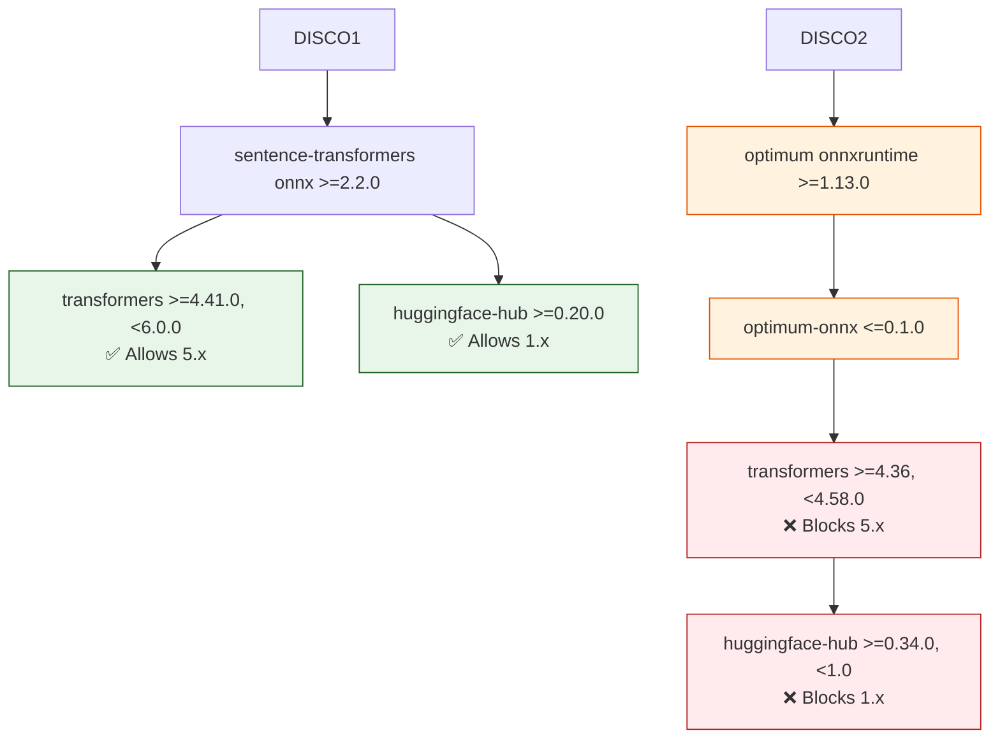

# Dependency Upgrade Summary - February 2026

## Executive Summary

Successfully upgraded all dependencies to their latest compatible versions. The update script now properly supports both minor and major version upgrades.

## Changes Made

### 1. Update Script Improvements (`scripts/update-project.sh`)

**Python Dependencies:**
- Clarified that `uv lock --upgrade` respects version constraints in `pyproject.toml`
- Added documentation that `>=` constraints allow major upgrades
- Both `--major` and default mode use `--upgrade` (behavior controlled by pyproject.toml constraints)

**Rust Dependencies:**
- Added `--breaking` flag support for major version upgrades
- When `--major` flag is used: `cargo upgrade --breaking`
- Without flag: `cargo upgrade` (respects semver, no breaking changes)
- Applied to both main installation and fallback installation paths

### 2. Dependency Upgrades

#### Python Packages (3 packages upgraded)
- **filelock**: 3.21.2 → 3.24.0 (minor upgrade)
- **platformdirs**: 4.7.1 → 4.9.1 (minor upgrade)
- **pyee**: 13.0.0 → 13.0.1 (patch upgrade)

#### Rust Crates (1 crate upgraded)
- **bitflags**: 2.10.0 → 2.11.0 (minor upgrade)

#### Pre-commit Hooks
- Updated all hooks to latest versions (via `pre-commit autoupdate --freeze`)

### 3. Testing Results

✅ **All tests passed successfully:**
- Python tests: 1,673 passed, 28 warnings
- Rust library tests: 130 passed
- Rust binary tests: 129 passed
- Rust integration tests: 100 passed
- Total execution time: ~5 minutes

## Blocked Upgrades

### HuggingFace Ecosystem

Two packages have major version upgrades available but **cannot be upgraded** due to dependency constraints:

#### transformers: 4.57.6 → 5.1.0 (BLOCKED)
- **Constraint**: `optimum[onnxruntime]` requires `transformers<4.58.0`
- **Dependency chain**:
  - `optimum[onnxruntime]>=1.13.0` → `optimum-onnx[onnxruntime]`
  - `optimum-onnx<=0.1.0` → `transformers>=4.36,<4.58.0`
  - Even `optimum[onnxruntime]==2.1.0` still constrains to `transformers<4.58.0`

#### huggingface-hub: 0.36.2 → 1.4.1 (BLOCKED)
- **Constraint**: `transformers==4.57.6` requires `huggingface-hub<1.0,>=0.34.0`
- Upgrading transformers to 5.x would require `huggingface-hub>=1.0`
- But transformers 5.x is blocked by optimum (see above)

### Resolution Path

To upgrade these packages, we need:
1. **Wait for optimum to support transformers 5.x** - Track https://github.com/huggingface/optimum
2. **Monitor optimum releases** - Once optimum supports transformers >=5.0, run upgrade script again
3. **Alternative**: Remove `optimum[onnxruntime]` dependency if ONNX optimization is not critical

## Validation

### Pre-Upgrade State
```bash
Package         Version Latest Type
--------------- ------- ------ -----
huggingface-hub 0.36.2  1.4.1  wheel  (blocked)
transformers    4.57.6  5.1.0  wheel  (blocked)
```

### Post-Upgrade State
```bash
# All upgradeable packages upgraded
# Remaining outdated packages are blocked by constraints
```

### Files Modified
```
.pre-commit-config.yaml            (pre-commit hooks updated)
extractor/extractor/Cargo.lock  (Rust dependencies updated)
scripts/update-project.sh          (script improvements)
uv.lock                            (Python dependencies updated)
```

## Breaking Changes

### None Detected

All upgrades were minor/patch versions with no breaking changes:
- Python packages: All backward compatible
- Rust crates: Semver-compliant minor upgrade
- Pre-commit hooks: Auto-updated with compatibility preserved

## Recommendations

### Immediate Actions
1. ✅ Review and commit the changes
2. ✅ Run smoke tests in development environment
3. ✅ Verify CI/CD pipeline passes

### Future Monitoring
1. **Watch optimum repository** for transformers 5.x support
2. **Run update script monthly** to catch minor/patch updates
3. **Use `--major` flag** when breaking changes are acceptable (e.g., major releases)

### Update Script Usage

```bash
# Minor and patch upgrades (default)
./scripts/update-project.sh

# Include major version upgrades (for both Python and Rust)
./scripts/update-project.sh --major

# Dry run to see what would be updated
./scripts/update-project.sh --dry-run --major

# Skip tests (faster, but not recommended)
./scripts/update-project.sh --skip-tests
```

## Technical Notes

### Why the Constraint?

The `optimum[onnxruntime]` package is used for ONNX optimization of HuggingFace models. It depends on `optimum-onnx` which has not been updated to support transformers 5.x yet. This is a common pattern in the ML ecosystem where:

1. Core library releases new major version (transformers 5.x)
2. Optimization/acceleration libraries lag behind (optimum-onnx)
3. Applications must wait for ecosystem to catch up

### Constraint Visualization



### Update Strategy

The project uses **conservative version constraints** (`>=x.y.z`) which:
- ✅ Allow automatic minor and patch upgrades
- ✅ Prevent unexpected breaking changes
- ✅ Enable security patches without manual intervention
- ⚠️ May prevent major version upgrades when ecosystem constraints conflict

This is the **recommended approach** for production systems prioritizing stability.

## Conclusion

The dependency upgrade was **successful** with all compatible versions updated. The update script now properly supports major version upgrades for Rust crates when needed. The HuggingFace ecosystem packages will be upgraded automatically once the `optimum` library adds support for transformers 5.x.

**No action required** - the current versions are the latest compatible versions given project constraints.
