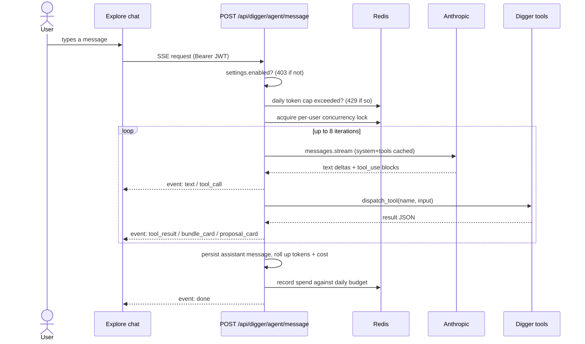

# Digger LLM Agent

The Digger agent lets a user chat with their record-hunting assistant — interactively
in Explore or through an external MCP client — to get bundle recommendations,
what-if scenarios, and agent-proposed wantlist tier changes. It is built on the
official `anthropic` Python SDK and lives in `api/digger_agent/`.

## Overview

A single endpoint, `POST /api/digger/agent/message`, orchestrates one tool-using
agent turn and streams typed Server-Sent Events. Tools delegate to the M2
deterministic services (optimizer, reports, opportunistic refresh) — the model
decides _which_ tools to call and _how_ to summarize, but never invents numbers.

## Endpoints

| Method & path | Purpose |
| --- | --- |
| `POST /api/digger/agent/message` | Stream one agent turn (SSE). 403 if digger disabled, 429 if the daily interactive token cap is exhausted. |
| `GET /api/digger/agent/sessions` | List the caller's recent sessions (most recently active first). |
| `GET /api/digger/proposals` | The caller's pending, unexpired tier-change proposals. |
| `POST /api/digger/proposals/{id}/approve` | Apply a proposal's tier changes (one transaction); returns the count applied. |
| `POST /api/digger/proposals/{id}/reject` | Mark a pending proposal rejected. |

### SSE event types

`text` · `tool_call` · `tool_result` · `bundle_card` · `proposal_card` · `done` · `error`

## Tool surface

Nine tools (see `api/digger_agent/tools/schemas.py`):

- **read** — `get_wantlist`, `get_user_settings`, `get_listings_for_release`, `summarize_marketplace_coverage`
- **compute** — `compute_bundles`, `explain_bundle`
- **write** — `save_report`, `propose_tier_changes` (records a _pending_ proposal the user approves in the UI)
- **side-effect** — `request_opportunistic_refresh` (nudges the worker to re-scrape stale releases)

`compute_bundles` never takes a `user_id` — it comes from the JWT via `ToolContext`.
`explain_bundle` and `save_report` reuse `ctx.last_optimizer_output`; if it is missing
they return an explicit error string the model can self-correct from.

## Guardrails

- **Daily token cap** per user and kind (interactive / scheduled), counted in Redis and keyed by the UTC date.
- **One active stream per user** — a Redis `SET NX` lock; a concurrent turn yields an `error` event.
- **Max 8 tool iterations** per turn.
- **User-message length** capped at 4000 characters.
- All tool inputs are validated against their JSON schemas before dispatch.

## Models

- Interactive default: **Sonnet 4.6** (`claude-sonnet-4-6`).
- Scheduled default: **Haiku 4.5** (`claude-haiku-4-5`).
- Opus available as `claude-opus-4-7`.
- User-overridable per call via `model_override` ∈ `{haiku, sonnet, opus}`; the
  per-user default is `user_digger_settings.preferred_model`.

Model IDs carry **no date suffix** (`_MODEL_IDS` in `api/digger_agent/runtime.py`).

## Prompt caching

The system prompt + tool definitions are sent with a single `cache_control:
ephemeral` breakpoint, caching the stable tools→system prefix across turns.
Verify with `usage.cache_read_input_tokens` on multi-turn sessions.

## Cost tracking

`digger.agent_sessions.total_cost_usd` is incremented per turn from token usage
using the per-million-token rates in `_COST_PER_M` (`api/routers/digger_agent.py`).
This figure is for display only — it does not gate requests (the token cap does).

## MCP exposure

`mcp-server/mcp_server/digger_tools.py` exposes four tools so an external Claude
client can drive the same engine over HTTP:

- `digger_get_wantlist_status`, `digger_run_recommendation`,
  `digger_explain_bundle`, `digger_simulate_what_if`

Unlike the public knowledge-graph tools, these require a **per-user JWT**: set
`MCP_API_TOKEN` in the MCP server's environment. Without it the tools return a
clear error rather than a 401. `digger_run_recommendation` / `digger_simulate_what_if`
consume the `/api/digger/recommend` SSE stream and return its final `result`
(the optimizer output) as JSON.

## Configuration

- `ANTHROPIC_API_KEY` (API service) — enables `/api/digger/agent/*`. Supports the
  `_FILE` secret variant in production.
- `MCP_API_TOKEN` (MCP server) — the per-user JWT the Digger MCP tools authenticate with.

See [configuration.md](configuration.md) for the full environment reference.
