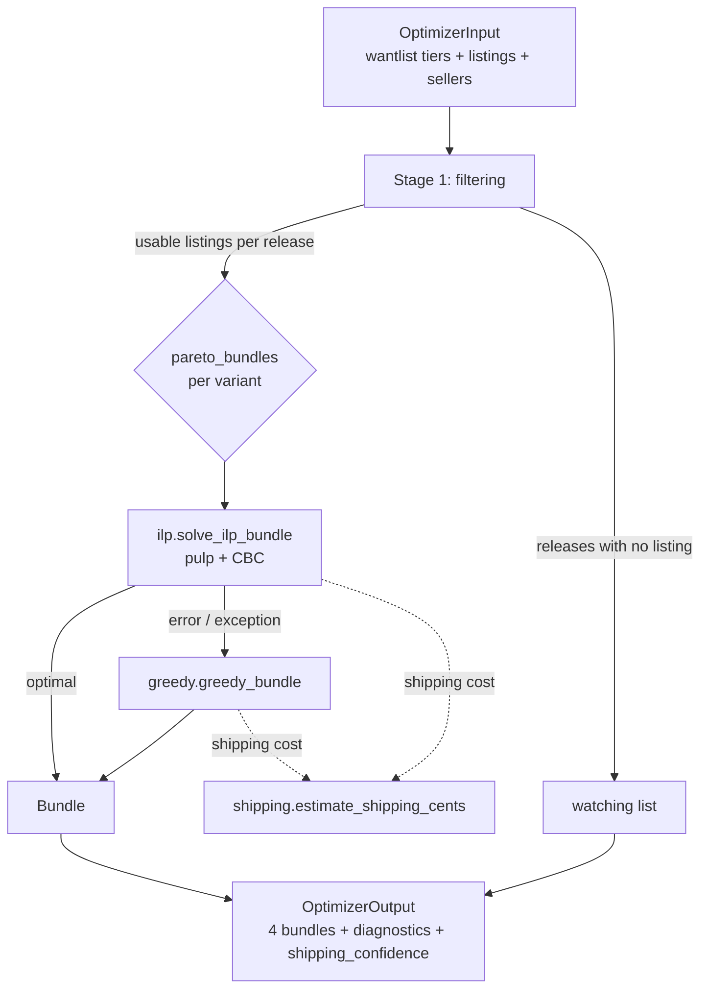

# Digger Optimizer

The Digger optimizer turns a user's wantlist (with per-release tier, condition, and
price preferences) plus the scraped marketplace state into **3–4 named, Pareto-optimal
seller bundles** with shipping-aware total costs:

| Bundle | Optimizes for |
| ------ | ------------- |
| **Cheapest** | Lowest grand total (items + shipping) |
| **Most Coverage** | Most wantlist items satisfied |
| **Best Quality** | Higher media/sleeve conditions |
| **Fewest Sellers** | Fewest separate orders (less shipping, less hassle) |

It lives in `common/digger_optimizer/` as a **pure-function library** — no I/O, no
database, no network. Every input is passed in as a Pydantic model and the result is a
Pydantic model. This lets the same code run in two places:

- **`api/`** — the interactive `POST /api/digger/recommend` endpoint (real-time, SSE).
- **`digger/`** — the scheduled report worker (`digger/scheduler/runner.py`).

## Public API

```python
from common.digger_optimizer import pareto_bundles, OptimizerInput, OptimizerOutput

out: OptimizerOutput = pareto_bundles(inp)  # inp: OptimizerInput
for bundle in out.bundles:
    print(bundle.name, bundle.grand_total_cents, bundle.coverage)
print("watching (no qualifying listings):", out.watching)
```

`pareto_bundles(inp, *, ilp_timeout_seconds=5)` is the only entry point. It returns an
`OptimizerOutput` with the bundles, a `watching` list (must-have releases that currently
have no qualifying listing), per-variant `diagnostics`, and an overall
`shipping_confidence` flag.

## Modules

| Module | Responsibility |
| ------ | -------------- |
| `models.py` | Pydantic input/output types + the `CONDITION_RANK` table |
| `filtering.py` | Stage 1 — drop listings below the condition floor / over max price / wrong currency |
| `shipping.py` | Per-seller shipping estimation (scraped policy, else region matrix) |
| `greedy.py` | Greedy reference solver — ILP fallback and warm-start hint |
| `ilp.py` | `pulp` + CBC integer program (the optimal solver) |
| `pareto.py` | Coordinator — runs the four variants, assembles diagnostics |

## Pipeline



### Stage 1 — Filtering (`filtering.py`)

For each release the user wants, keep only listings that:

1. match the user's currency (cross-currency conversion is **out of scope** — mismatches
   are counted in diagnostics and skipped),
2. meet the per-tier **media** condition floor (`CONDITION_RANK[listing] >= CONDITION_RANK[floor]`),
3. meet the per-tier **sleeve** condition floor,
4. fall at or under the per-release `max_price_cents` cap (when set).

A **must-have** release with zero qualifying listings goes onto the `watching` list rather
than making the whole problem infeasible.

### Shipping (`shipping.py`)

Per-seller shipping is computed two ways, in priority order:

1. **Scraped policy** — if the seller's `shipping_policy` covers the buyer's region (or a
   `default`), cost is `first_cents + additional_cents * (count - 1)`.
2. **Region matrix fallback** — a static 7×7 origin→destination matrix
   (`REGION_MATRIX_CENTS`, USD-centric) with a diminishing-returns multiplier
   `1.0 + 0.2 * (count - 1)` for consolidated multi-item orders.

`shipping_confidence_score()` reports **`high`** when ≥80% of candidate sellers have a
usable scraped policy for the buyer's region, otherwise **`low`** — surfaced to the user so
they know whether totals are precise or estimated.

### ILP solver (`ilp.py`)

The optimal solver is an integer program built with [`pulp`](https://github.com/coin-or/pulp)
(which ships the CBC binary):

- **Variables:** `x[listing] ∈ {0,1}` (include listing), `y[seller] ∈ {0,1}` (order from
  seller), `z[seller, k] ∈ {0,1}` (seller has exactly `k` items — linearizes the per-seller
  shipping step function in item count).
- **Constraints:** each must-have covered exactly once (if any listing qualifies); each
  nice/eventually at most once; `x[listing] ≤ y[seller]`; the `z` gating that ties item
  count to shipping tier; excluded sellers forced off; optional budget cap.
- **Objective:** minimize item cost + shipping, with per-variant adjustments (seller
  penalty for *Fewest Sellers*, a quality bonus for *Best Quality*, and nice/eventually
  coverage credits).

The solver runs with a per-variant timeout (default **5 s**, `randomSeed 42` for
determinism). On infeasibility it returns an empty bundle; on an exception the coordinator
falls back to greedy.

### Greedy fallback (`greedy.py`)

The greedy solver is a ratio-based heuristic (best value-per-marginal-cost, accounting for
marginal shipping and a seller-consolidation bonus). It is used as the fallback when the
ILP raises, and as a reference implementation for the property tests. It is bounded and
fast — typically within 5–15% of the ILP optimum.

### Bundle variants (`pareto.py` + `greedy._WEIGHTS`)

The four variants are the same model solved with different objective weights (cents):

| Variant | Nice credit | Eventually credit | Quality bonus / rank step | Extra-seller penalty |
| ------- | ----------- | ----------------- | ------------------------- | -------------------- |
| `cheapest` | $5 | $1 | — | — |
| `most_coverage` | $25 | $10 | — | — |
| `best_quality` | $5 | $1 | $3 | — |
| `fewest_sellers` | $5 | $1 | — | $20 |

The coordinator records, per variant, which solver actually produced the bundle
(`ilp` or `greedy`) and its wall-clock solve time in `diagnostics`.

## Interactive flow — `POST /api/digger/recommend` (SSE)

The interactive endpoint streams progress while it opportunistically refreshes stale
listings, then streams the optimizer result. Events are Server-Sent Events
(`sse-starlette`): `refresh_started`, `refresh_progress` (repeated), `result`, `done`, and
`error`.

```mermaid
sequenceDiagram
    participant UI as Explore (Reports UI)
    participant API as API /api/digger/recommend
    participant PG as PostgreSQL (digger.*)
    participant R as Redis pub/sub
    participant W as Digger worker
    participant OPT as common.digger_optimizer

    UI->>API: POST /recommend {deadline_seconds, budget_cap, excluded_sellers}
    API->>PG: identify stale releases (per-tier half-life)
    API-->>UI: event: refresh_started {stale_count}
    API->>PG: bump scrape priority for stale releases
    API->>R: subscribe digger:refresh:{user_id}
    W->>PG: scrape + persist listings
    W->>R: publish progress per release
    R-->>API: progress message
    API-->>UI: event: refresh_progress {release_id, status, remaining}
    Note over API: until all stale done OR deadline reached
    API->>PG: build OptimizerInput from wantlist + listings + sellers
    API->>OPT: pareto_bundles(inp)
    OPT-->>API: OptimizerOutput
    API-->>UI: event: result {bundles, watching, diagnostics}
    API-->>UI: event: done
```

Staleness uses a per-tier half-life — **must** 3.5 days, **nice** 7 days, **eventually**
14 days. `deadline_seconds` caps how long the refresh wait can run before the optimizer is
invoked with whatever has arrived; fresh wantlists skip the refresh wait entirely.

## Scheduled flow — `digger/scheduler/runner.py`

The Digger worker runs a scheduler loop that generates reports on each user's configured
cadence (`weekly` / `biweekly` / `monthly`). The loop **only starts when
`DIGGER_API_SERVICE_TOKEN` is set**, polling every `DIGGER_SCHEDULER_POLL_SECONDS`
(default 300). The worker reads its own tables directly but fetches wantlist priorities
over HTTP from the API's internal endpoints — it never imports from `api/`.

```mermaid
sequenceDiagram
    participant S as Scheduler loop (digger)
    participant API as API /api/internal/digger/*
    participant PG as PostgreSQL (digger.*)
    participant OPT as common.digger_optimizer

    loop every DIGGER_SCHEDULER_POLL_SECONDS
        S->>API: GET users-due-for-report (X-Service-Token)
        API-->>S: [{user_id, cadence, country, currency}]
        loop per due user
            S->>API: GET wantlist-snapshot/{user_id} (X-Service-Token)
            API-->>S: {must, nice, eventually}
            S->>PG: read active listings + sellers + last report
            S->>OPT: pareto_bundles(inp)
            OPT-->>S: OptimizerOutput
            S->>PG: INSERT digger.reports + advance next_scheduled_run_at (one tx)
        end
    end
```

### Change detection

Each scheduled run is classified relative to the user's most recent report:

- **`first_run`** — no prior report exists.
- **`significant`** — the symmetric difference of chosen `listing_id`s between the new run
  and the prior report is **≥ 3** (`_SIGNIFICANT_CHANGE_THRESHOLD`, inclusive boundary).
- **`none`** — fewer than 3 listings changed.

The flag drives the Reports inbox so users can skip "nothing changed" reports. An empty
wantlist advances the schedule without writing a report.

## Performance

- Roughly **~1000 listings × 200 sellers → < 2 s per variant** on a modern CPU.
- **5 s** per-variant ILP timeout; ~20 s worst case across all four variants.
- Greedy fallback is bounded and usually within **5–15%** of the ILP optimum.

Perf coverage for the API surface lives in `tests/perftest/` (`digger_recommend`,
`digger_reports_*`). Optimizer correctness is covered by unit + `hypothesis` property
tests in `tests/common/test_digger_optimizer_*`.

## Related

- [Architecture](architecture.md) — where Digger and the optimizer sit in the platform.
- [Digger Scraping Policy](digger-scraping-policy.md) — how listings/sellers are sourced.
- [Configuration](configuration.md) — `DIGGER_API_SERVICE_TOKEN`, `API_BASE_URL`,
  `DIGGER_SCHEDULER_POLL_SECONDS`, and the other Digger worker variables.
