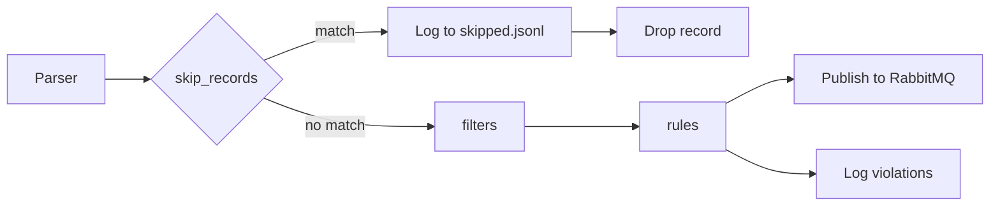

# Extraction Rules Guide

The extraction rules engine validates, filters, and skips records during Discogs XML and MusicBrainz JSONL extraction. Rules are configured in a YAML file and applied inside the `message_validator` pipeline stage — after parsing, before publishing to RabbitMQ.

Rules are **observation and transform** — they can flag violations, strip bad data, nullify sentinel values, and skip junk records. All operations happen at the extraction boundary, so downstream consumers receive clean data.

## Configuration

Specify the rules file via CLI argument or environment variable:

```bash
# CLI argument
extractor --source discogs --data-quality-rules /path/to/extraction-rules.yaml

# Environment variable
DATA_QUALITY_RULES=/path/to/extraction-rules.yaml
```

The default rules file is `extractor/extraction-rules.yaml`.

## YAML Structure

The configuration has three optional top-level sections:

```yaml
skip_records:   # Skip entire records matching conditions
  ...
filters:        # Transform field values before validation
  ...
rules:          # Flag violations (observation-only)
  ...
```

All three sections are optional. Existing configs with only `rules:` continue to work unchanged.

## Pipeline Flow



1. **Skip check** — if any `skip_records` condition matches, the record is logged to `skipped.jsonl` and dropped (not validated, not published)
2. **Filters** — matching values are removed or nullified in-place
3. **Rules** — violations are logged but the record is always forwarded

## Skip Records

Skip entire records that match a condition. Useful for known junk entries that should not be published to consumers.

### `contains` — case-insensitive substring match

```yaml
skip_records:
  artists:
    - field: profile
      contains: "DO NOT USE"
      reason: "Upstream junk entry marked DO NOT USE"
  labels:
    - field: profile
      contains: "DO NOT USE"
      reason: "Upstream junk entry marked DO NOT USE"
```

- **field**: dot-separated path to the field (e.g., `profile`, `name`)
- **contains**: substring to match (case-insensitive)
- **reason**: human-readable reason logged in `skipped.jsonl` and the quality report

Multiple conditions per entity type are supported. A record is skipped if **any** condition matches (short-circuits on first match).

### Output

Skipped records are written to `{discogs_root}/flagged/{version}/{entity_type}/skipped.jsonl`:

```json
{"record_id":"66827","reason":"Upstream junk entry marked DO NOT USE","field":"profile","field_value":"[b]DO NOT USE.[/b]","timestamp":"2026-04-03T22:07:13Z"}
```

Raw XML and parsed JSON files are also captured for inspection.

## Filters

Transform field values before validation and publishing. Two filter types are available.

### `remove_matching` — strip array elements by regex

Removes elements from an array field that match a regular expression.

```yaml
filters:
  releases:
    - field: genres.genre
      remove_matching: "^\\d+$"
      reason: "Strip legacy numeric genre IDs from upstream data"
```

- **field**: dot-separated path to the array (e.g., `genres.genre`)
- **remove_matching**: regex pattern — matching string elements are removed
- **reason**: logged at info level when values are removed

Example: `["1", "1", "Electronic"]` becomes `["Electronic"]`.

### `nullify_when` — set scalar fields to null by range

Sets a scalar field to JSON `null` when its numeric value falls outside a range. Useful for sentinel values and implausible data.

```yaml
filters:
  masters:
    - field: year
      nullify_when:
        type: range
        below: 1860
      reason: "Treat sentinel and implausible years as unknown"
  releases:
    - field: year
      nullify_when:
        type: range
        below: 1860
      reason: "Treat sentinel and implausible years as unknown"
```

- **field**: top-level field name (e.g., `year`)
- **nullify_when.type**: condition type (currently only `range` is supported)
- **nullify_when.below**: nullify if value is strictly less than this threshold
- **nullify_when.above**: nullify if value is strictly greater than this threshold
- **reason**: logged at info level when a value is nullified

At least one of `below` or `above` must be specified. Both can be used together:

```yaml
- field: year
  nullify_when:
    type: range
    below: 1860
    above: 2027
  reason: "Nullify years outside plausible range"
```

**Behavior details:**
- Non-numeric string values (e.g., `"unknown"`) are left unchanged
- Fields already set to `null` are skipped (no action logged)
- Missing fields are not created
- The threshold is exclusive: `below: 1860` nullifies 1859 but not 1860

**Year sentinel example:** Discogs uses `<year>0</year>` as a sentinel for "year unknown." With `below: 1860`, year=0 is nullified along with implausible years like 197 and 338 — all in one rule.

## Rules (Validation)

Rules flag violations but never block extraction — all records are published regardless of violations. Five condition types are available.

### `range` — numeric range check

```yaml
rules:
  releases:
    - name: year-out-of-range
      description: "Release year is before 1860 or after current year + 1"
      field: year
      condition:
        type: range
        min: 1860
        max: 2027
      severity: warning
```

Parses the field value as a number. Flags if `value < min` or `value > max`. Non-numeric values are silently skipped (no violation).

### `required` — field must exist and be non-empty

```yaml
- name: missing-title
  field: title
  condition:
    type: required
  severity: error
```

Flags if the field is missing, null, or an empty string.

### `regex` — pattern match

```yaml
- name: genre-is-numeric
  field: genres.genre
  condition:
    type: regex
    pattern: "^\\d+$"
  severity: error
```

Flags if the field value matches the regex. The pattern is pre-compiled at startup.

### `enum` — allowed value list

```yaml
- name: genre-not-recognized
  field: genres.genre
  condition:
    type: enum
    values:
      - Blues
      - Classical
      - Electronic
      - Jazz
      - Rock
      # ... full list
  severity: warning
```

Flags if the field value is **not** in the allowed set. The value list is compiled to a HashSet for O(1) lookups.

### `length` — string length check

```yaml
- name: name-too-long
  field: name
  condition:
    type: length
    max: 1000
  severity: warning
```

Counts Unicode characters. Flags if length is below `min` or above `max`.

### Severity Levels

| Level | Meaning | File capture |
|-------|---------|-------------|
| `error` | Data quality defect | XML + JSON captured |
| `warning` | Potential issue | XML + JSON captured |
| `info` | Informational | No file capture |

### Dot Notation for Nested Fields

Fields use dot notation to navigate nested JSON structures:

- `title` — top-level field
- `genres.genre` — nested: `{"genres": {"genre": ["Rock", "Pop"]}}`
- `artists.name` — array expansion: `{"artists": [{"name": "A"}, {"name": "B"}]}` evaluates both names

When a segment resolves to an array, each element is evaluated independently.

## Quality Report

After extraction completes, a summary report is written to `{discogs_root}/flagged/{version}/report.txt`:

```
Data Quality Report for discogs_20260401:
  Skipped records:
    artists: 1 (Upstream junk entry marked DO NOT USE: 66827)
    labels: 1 (Upstream junk entry marked DO NOT USE: 212)
  releases: 0 errors, 0 warnings (of 19035253 records)
  artists: 0 errors, 0 warnings (of 9568851 records)
  labels: 0 errors, 0 warnings (of 2100812 records)
  masters: 0 errors, 0 warnings (of 2541388 records)
```

## Flagged Records Directory

```
{discogs_root}/flagged/{version}/
  releases/
    12345.xml           # Raw XML fragment
    12345.json          # Parsed JSON
    violations.jsonl    # All violations for releases
    skipped.jsonl       # All skipped releases
  artists/
    violations.jsonl
    skipped.jsonl
  labels/
    violations.jsonl
    skipped.jsonl
  masters/
    violations.jsonl
    skipped.jsonl
  report.txt            # Summary report
```

Each violation record in `violations.jsonl`:

```json
{
  "record_id": "12345",
  "rule": "genre-is-numeric",
  "severity": "error",
  "field": "genres.genre",
  "field_value": "1",
  "xml_file": "12345.xml",
  "json_file": "12345.json",
  "timestamp": "2026-04-03T22:07:13Z"
}
```

## Admin Panel

The extraction analysis section of the admin panel (Dashboard > Extraction Analysis) displays:

- **Skipped records** — card per entity type with count and reason, expandable to individual record IDs
- **Violations** — grouped by entity type and rule, with drill-down to individual records
- **Version comparison** — delta table showing changes between extraction versions, including skipped records

## Default Rules Reference

See [`extractor/extraction-rules.yaml`](../extractor/extraction-rules.yaml) for the full default configuration.
