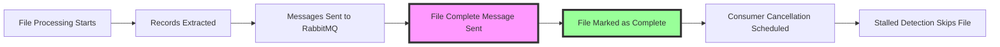

# File Completion Tracking

<div align="center">

**Intelligent file completion tracking and stalled detection management**

Last Updated: January 2025

[🏠 Back to Docs](README.md) | [🔄 Consumer Cancellation](consumer-cancellation.md)

</div>

## Overview

The file completion tracking system ensures accurate monitoring of file processing status across the Discogsography platform. It prevents false warnings about stalled extractors and coordinates with the consumer cancellation feature for optimal resource management.

## How It Works

### 1. File Processing Lifecycle



### 2. Completion Tracking

When a file finishes processing:

1. **Python/Rust Extractor** sends a `file_complete` message with:

   - `type`: "file_complete"
   - `data_type`: The type of data (artists, labels, masters, releases)
   - `timestamp`: Completion time
   - `total_processed`: Number of records processed
   - `file`: Original filename

1. **Python/Rust Extractor** adds the data type to `completed_files` set

1. **Consumers** (graphinator/tableinator) receive the message and:

   - Mark the file as complete (🎉 in logs)
   - Schedule consumer cancellation after grace period

### 3. Stalled Detection

The extractors' progress monitoring:

- Checks for files with no activity for >2 minutes
- **Excludes** files in the `completed_files` set
- Only reports actual stalls, not completed files

## Implementation Details

### Python/Rust Extractor Changes

```python
# Global tracking variables
completed_files = set()  # Track which files have been completed

# When sending file completion message
completed_files.add(self.data_type)

# During stalled detection
for data_type, last_time in last_extraction_time.items():
    # Skip if this file type has been completed
    if data_type in completed_files:
        continue
    # ... stalled detection logic
```

### Progress Reporting

Enhanced progress reports show:

```
📊 Extraction Progress: 50000 total records extracted
(Artists: 20000, Labels: 15000, Masters: 10000, Releases: 5000)
✅ Completed file types: ['artists', 'labels']
✅ Active extractors: ['masters', 'releases']
```

## Benefits

1. **Accurate Monitoring**: No false warnings about completed files
1. **Clear Status**: Easy to see which files are done vs. active
1. **Resource Optimization**: Works with consumer cancellation for cleanup
1. **Better Debugging**: Clear indication of actual vs. false stalls

## Configuration

No additional configuration needed - the feature works automatically with existing settings.

### Related Environment Variables

- `CONSUMER_CANCEL_DELAY`: Grace period before canceling consumers (default: 300s)
- `FORCE_REPROCESS`: Set to "true" to reprocess all files

## Monitoring

### Log Messages to Watch

**Python/Rust Extractor**:

- `✅ Sent file completion message for {type}` - File marked complete
- `✅ Completed file types: [...]` - Shows all completed files
- `⚠️ Stalled extractors detected: [...]` - Only shows actual stalls

**Consumers**:

- `🎉 File processing complete for {type}!` - Completion received
- `🔌 Canceling consumer for {type}` - Cancellation scheduled

## Troubleshooting

### Issue: Still seeing stalled warnings for completed files

**Cause**: Service was restarted and lost completion state

**Solution**: The `completed_files` set is reset on restart. This is expected behavior - the warnings will stop once files complete in the new session.

### Issue: Consumer not being canceled after completion

**Check**:

1. Verify `CONSUMER_CANCEL_DELAY` is not 0
1. Check logs for cancellation messages
1. Ensure RabbitMQ connection is stable

## Testing

Test the feature:

```bash
# Start services
docker-compose up -d

# Watch logs for completion tracking
docker-compose logs -f extractor-python | grep -E "(Completed file types|Stalled extractors)"  # For Python
docker-compose logs -f extractor-rust | grep -E "(Completed file types|Stalled extractors)"    # For Rust

# Force a quick test with small files
# Files will complete quickly and should not show as stalled
```

## Technical Architecture

### State Management

- `extraction_progress`: Tracks record counts per type
- `last_extraction_time`: Tracks last activity time per type
- `completed_files`: Set of completed data types
- State is reset when processing new files

### Integration Points

1. **Python/Rust Extractor → RabbitMQ**: Sends completion message
1. **Python/Rust Extractor Internal**: Updates completion tracking
1. **Consumers → RabbitMQ**: Cancel queue consumers
1. **Progress Reporter**: Excludes completed files

## Future Enhancements

- [ ] Persist completion state across restarts
- [ ] Add completion timestamps to progress reports
- [ ] Create completion metrics for monitoring
- [ ] Add file-level (not just type-level) tracking
