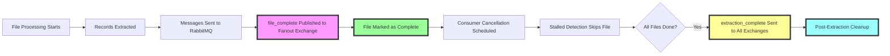

# File Completion Tracking

<div align="center">

**Intelligent file completion tracking and stalled detection management**

Last Updated: March 2026

[🏠 Back to Docs](README.md) | [🔄 Consumer Cancellation](consumer-cancellation.md)

</div>

## Overview

The file completion tracking system ensures accurate monitoring of file processing status across the Discogsography
platform. It prevents false warnings about stalled extractors and coordinates with the consumer cancellation feature for
optimal resource management.

## How It Works

### 1. File Processing Lifecycle


```mermaid
graph LR
    A[File Processing Starts] --> B[Records Extracted]
    B --> C[Messages Sent to RabbitMQ]
    C --> D[file_complete Published to Fanout Exchange]
    D --> E[File Marked as Complete]
    E --> F[Consumer Cancellation Scheduled]
    F --> G[Stalled Detection Skips File]
    G --> H{All Files Done?}
    H -->|Yes| I[extraction_complete Sent to All Exchanges]
    I --> J[Post-Extraction Cleanup]

    style D fill:#f9f,stroke:#333,stroke-width:4px
    style E fill:#9f9,stroke:#333,stroke-width:4px
    style I fill:#ff9,stroke:#333,stroke-width:4px
    style J fill:#9ff,stroke:#333,stroke-width:4px
```

### 2. Completion Tracking

When a file finishes processing:

1. **Extractor** sends a `file_complete` message with:

   - `type`: "file_complete"
   - `data_type`: The type of data (artists, labels, masters, releases)
   - `timestamp`: Completion time
   - `total_processed`: Number of records processed
   - `file`: Original filename

1. **Extractor** adds the data type to `completed_files` set

1. **Consumers** (graphinator/tableinator) receive the message and:

   - Mark the file as complete (🎉 in logs)
   - Schedule consumer cancellation after grace period

### 2a. Extraction Completion

After **all** files finish processing, the extractor sends an `extraction_complete` message to all 4 fanout exchanges:

1. **Extractor** builds an `extraction_complete` message with:

   - `type`: "extraction_complete"
   - `version`: The Discogs data version (e.g., "20260301")
   - `timestamp`: Completion time
   - `started_at`: When the extraction began (used for stale row detection)
   - `record_counts`: Per-type record counts

1. **Consumers** receive the message on each queue and perform post-extraction cleanup:

   - **Graphinator**: Flushes remaining batches, then deletes stub nodes without a `sha256` property (skeleton nodes created by cross-type MERGE operations)
   - **Tableinator**: Flushes remaining batches, then purges rows where `updated_at < started_at` (stale rows from prior extractions)

This ensures database counts match the extractor's record counts after each run.

### 3. Stalled Detection

The extractors' progress monitoring:

- Checks for files with no activity for >2 minutes
- **Excludes** files in the `completed_files` set
- Only reports actual stalls, not completed files

## Implementation Details

### Extractor Changes

The Rust extractor tracks completed files to prevent false stall warnings:

- Maintains a `completed_files` set
- Marks each data type as complete after sending the file completion message
- Excludes completed file types from stalled detection logic

### Progress Reporting

Enhanced progress reports show:

```
📊 Extraction Progress: 50000 total records extracted
(Artists: 20000, Labels: 15000, Masters: 10000, Releases: 5000)
✅ Completed file types: ['artists', 'labels']
✅ Active extractors: ['masters', 'releases']
```

## Benefits

1. **Accurate Monitoring**: No false warnings about completed files
1. **Clear Status**: Easy to see which files are done vs. active
1. **Resource Optimization**: Works with consumer cancellation for cleanup
1. **Better Debugging**: Clear indication of actual vs. false stalls

## Configuration

No additional configuration needed - the feature works automatically with existing settings.

### Related Environment Variables

- `CONSUMER_CANCEL_DELAY`: Grace period before canceling consumers (default: 300s)
- `FORCE_REPROCESS`: Set to "true" to reprocess all files

## Monitoring

### Log Messages to Watch

**Extractor**:

- `✅ Sent file completion message for {type}` - File marked complete
- `✅ Completed file types: [...]` - Shows all completed files
- `⚠️ Stalled extractors detected: [...]` - Only shows actual stalls

**Consumers**:

- `🎉 File processing complete for {type}!` - File completion received
- `🔌 Canceling consumer for {type}` - Cancellation scheduled
- `🏁 Received extraction_complete signal` - Extraction complete received
- `🧹 Cleaned up N stub {Label} nodes` - Graphinator stub node cleanup
- `🧹 Purged N stale {type} rows` - Tableinator stale row purge

## Troubleshooting

### Issue: Still seeing stalled warnings for completed files

**Cause**: Service was restarted and lost completion state

**Solution**: The `completed_files` set is reset on restart. This is expected behavior - the warnings will stop once
files complete in the new session.

### Issue: Consumer not being canceled after completion

**Check**:

1. Verify `CONSUMER_CANCEL_DELAY` is not 0
1. Check logs for cancellation messages
1. Ensure RabbitMQ connection is stable

## Testing

Test the feature:

```bash
# Start services
docker-compose up -d

# Watch logs for completion tracking
docker-compose logs -f extractor | grep -E "(Completed file types|Stalled extractors)"

# Force a quick test with small files
# Files will complete quickly and should not show as stalled
```

## Technical Architecture

### State Management

- `extraction_progress`: Tracks record counts per type
- `last_extraction_time`: Tracks last activity time per type
- `completed_files`: Set of completed data types
- State is reset when processing new files

### Integration Points

1. **Extractor → RabbitMQ**: Sends `file_complete` per data type
1. **Extractor → RabbitMQ**: Sends `extraction_complete` to all exchanges after all files finish
1. **Extractor Internal**: Updates completion tracking
1. **Consumers → RabbitMQ**: Cancel queue consumers
1. **Consumers → Database**: Post-extraction cleanup (stub nodes / stale rows)
1. **Progress Reporter**: Excludes completed files

## Future Enhancements

- [ ] Persist completion state across restarts
- [ ] Add completion timestamps to progress reports
- [ ] Create completion metrics for monitoring
- [ ] Add file-level (not just type-level) tracking
