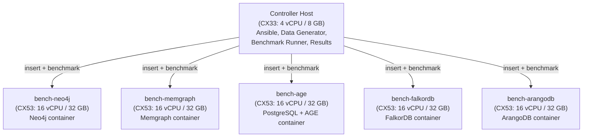

# Cloud Benchmark Deployment Plan

## Overview

Deploy dedicated Hetzner Cloud hosts to benchmark Neo4j, Memgraph, Apache AGE, FalkorDB, and ArangoDB under identical conditions. A controller host generates synthetic graph data representative of the real Discogs dataset (~34M nodes, ~135M relationships) and inserts it directly into each database via GraphBackend drivers. No extractor, RabbitMQ, or graphinator changes are needed.

## Architecture

The deployment uses one controller host and five database hosts. No extractor or RabbitMQ host is needed — the controller generates synthetic data and inserts it directly using each database's native driver.

The controller host:

1. Provisions and configures all database hosts via Ansible
2. Generates synthetic graph data matching the Discogs schema (artists, labels, masters, releases, and their relationships)
3. Inserts data directly into each database using GraphBackend drivers (neo4j driver, psycopg for AGE, falkordb client, python-arango, etc.)
4. Runs the benchmark query suite against each database
5. Collects and aggregates results



Each database host runs only its database container and a schema-init container. No graphinator is deployed — the controller handles all data insertion directly.

### Benchmark Execution Flow

The automation handles benchmarks in sequence to isolate results:

1. **Provision** — Create all 6 Hetzner hosts, configure networking and firewall
2. **Setup** — Install Docker, deploy database containers, run schema-init on each host
3. **Small benchmark** — Generate `small` synthetic data (~135k nodes, ~540k relationships), insert into each database sequentially, run query benchmarks against each
4. **Large benchmark** — Wipe databases, generate `large` synthetic data (~1.35M nodes, ~5.4M relationships), insert into each database sequentially, run query benchmarks against each
5. **Collect** — Gather all results to the controller host
6. **Partial teardown** — Destroy the 5 database hosts, keep the controller host running so benchmark data can be downloaded

## Hetzner Cloud

### Why Hetzner

Hetzner offers the best price/performance ratio by a significant margin among cloud providers. European data centers (Nuremberg, Falkenstein, Helsinki) plus US East (Ashburn) and US West are available.

### Instance Sizing

- **Controller host (CX33):** 4 vCPU / 8 GB RAM / 80 GB SSD — sufficient for data generation, Ansible orchestration, and running the benchmark harness remotely
- **Database hosts (CX53):** 16 vCPU / 32 GB RAM / 320 GB SSD — accommodates in-memory databases (Memgraph, FalkorDB) for the `large` synthetic dataset (~1.35M nodes, ~5.4M relationships)

### Pricing

| Role | Instance | vCPU | RAM | Disk | Per Host/hr | Per Host/mo |
|------|----------|------|-----|------|-------------|-------------|
| Controller | **CX33** | 4 | 8 GB | 80 GB | €0.0088 | €5.49 |
| Database | **CX53** | 16 | 32 GB | 320 GB | €0.0280 | €17.49 |

### Cost Estimates

| Scenario | Duration | Controller (1x CX33) | DB Hosts (5x CX53) | Total |
|----------|----------|---------------------|---------------------|-------|
| Quick run (~8 hours) | 8 hr | €0.07 | €1.12 | **€1.19** |
| Full run (~24 hours) | 24 hr | €0.21 | €3.36 | **€3.57** |
| Extended (~48 hours) | 48 hr | €0.42 | €6.72 | **€7.14** |

> **Note:** After benchmarks complete, the automation tears down the 5 database hosts and keeps only the controller running for result download. The controller at €0.0088/hr costs under €0.01/hr while you review and download data.

### Additional Costs

| Item | Cost | Notes |
|------|------|-------|
| Hetzner network | Free | 20TB included per server |
| DNS/floating IPs | Not needed | Use IP addresses directly |

### Billing Alert

Set a spending alert in Hetzner Console to receive an email if costs exceed $75. This provides time to decide whether to continue or tear down early.

1. Log in to [console.hetzner.cloud](https://console.hetzner.cloud)
2. Go to **Account > Billing**
3. Click on the cost values for the benchmark project
4. Set the alert threshold to **$75**

Hetzner will send an email notification when spending approaches or exceeds this limit. This is a notification only — it does not automatically stop servers. Traffic usage alerts are also sent automatically at 75% and 100% of included free traffic.

## Metrics Collection

### What to Measure During Data Insertion

| Metric | Collection Method | Frequency |
|--------|-------------------|-----------|
| Total insertion wall-clock time | Timestamp at start/end | Once |
| Per-entity-type insertion time | Benchmark harness logs | Per type |
| Insertion throughput (records/sec) | Benchmark harness logs | Per batch |
| CPU usage (%) | `node_exporter` or `vmstat` | Every 5s |
| Memory usage (RSS, cache) | `node_exporter` or `/proc/meminfo` | Every 5s |
| Disk usage (bytes) | `df` + database-specific query | Every 30s |
| Disk I/O (read/write MB/s) | `iostat` or `node_exporter` | Every 5s |
| Network I/O (MB/s) | `node_exporter` | Every 5s |

### What to Measure Post-Insertion (Query Benchmarks)

Run every query type used in the explore frontend against each database:

| Benchmark | Queries | Iterations | What It Tests |
|-----------|---------|------------|---------------|
| Autocomplete | 4 fulltext search queries (artist, label, genre, style) | 500 each | Search latency |
| Explore center-node | 4 queries (artist, genre, label, style) | 200 each | Aggregation + COUNT |
| Expand (shallow) | 12 queries (all entity+category combos) | 200 each | 1-hop traversal + pagination |
| Expand count | 12 count queries | 200 each | Traversal + aggregation |
| Node detail | 5 queries (artist, release, label, genre, style) | 200 each | Multi-hop + collect |
| Trends | 4 queries (by entity type) | 200 each | Year grouping + aggregation |
| User collection | 3 queries (collection, wantlist, stats) | 200 each | User-scoped traversal |
| Gap analysis | 3 queries (label gaps, artist gaps, master gaps) | 100 each | Exclusion pattern traversal |
| Recommendations | 1 query | 100 | Multi-hop + scoring |
| Point read | `MATCH (a:Artist {id: $id})` | 1000 | Index lookup baseline |
| Concurrent mixed | 4 readers + 1 writer | 60 seconds | Contention under load |

### Metrics Output Format

Each benchmark run produces a JSON file:

```json
{
  "backend": "neo4j",
  "host": "bench-neo4j.example.com",
  "instance_type": "hetzner-cx53",
  "dataset": "synthetic-1M",
  "insertion_metrics": {
    "total_duration_sec": 120,
    "artists": {"count": 300000, "duration_sec": 15, "records_per_sec": 20000},
    "labels": {"count": 100000, "duration_sec": 8, "records_per_sec": 12500},
    "masters": {"count": 200000, "duration_sec": 18, "records_per_sec": 11111},
    "releases": {"count": 400000, "duration_sec": 79, "records_per_sec": 5063}
  },
  "system_metrics": {
    "peak_memory_mb": 12400,
    "peak_cpu_percent": 85,
    "disk_usage_mb": 8500,
    "avg_disk_io_mb_sec": 45
  },
  "benchmarks": {
    "autocomplete_artist": {"p50_ms": 2.1, "p95_ms": 5.3, "p99_ms": 12.1},
    "explore_center_artist": {"p50_ms": 8.4, "p95_ms": 22.1, "p99_ms": 45.0},
    "expand_releases_by_artist": {"p50_ms": 3.2, "p95_ms": 8.1, "p99_ms": 15.3}
  }
}
```

## Automated Deployment with Ansible

Ansible is the right tool here — agentless (SSH-only), simple YAML playbooks, and good Hetzner module support for provisioning.

### Directory Structure

```
infra/
  ansible.cfg
  inventory/
    hosts.yml                    -- generated by provisioning playbook
  playbooks/
    provision.yml                -- create Hetzner Cloud instances
    setup-common.yml             -- common setup (Docker, monitoring, firewall)
    setup-neo4j.yml              -- Neo4j database host
    setup-memgraph.yml           -- Memgraph database host
    setup-age.yml                -- PostgreSQL+AGE database host
    setup-falkordb.yml           -- FalkorDB database host
    setup-arangodb.yml           -- ArangoDB database host
    run-benchmarks.yml           -- generate synthetic data, insert, and run benchmarks
    collect-results.yml          -- gather results to local machine
    teardown.yml                 -- destroy all instances
  roles/
    common/                      -- Docker, monitoring agent, firewall
    neo4j/                       -- Neo4j container + schema init
    memgraph/                    -- Memgraph container + schema init
    age/                         -- PostgreSQL+AGE container + schema init
    falkordb/                    -- FalkorDB container + schema init
    arangodb/                    -- ArangoDB container + schema init
    benchmark/                   -- benchmark harness + data generator
  templates/
    docker-compose.neo4j.yml.j2
    docker-compose.memgraph.yml.j2
    docker-compose.age.yml.j2
    docker-compose.falkordb.yml.j2
    docker-compose.arangodb.yml.j2
    metrics-collector.sh.j2      -- system metrics collection script
  scripts/
    run-all.sh                   -- end-to-end: provision -> deploy -> benchmark -> collect -> teardown
```

### Provisioning Playbook

```yaml
# infra/playbooks/provision.yml
---
- name: Provision benchmark hosts on Hetzner Cloud
  hosts: localhost
  connection: local
  vars_files:
    - ../vault.yml
  vars:
    hcloud_token: "{{ hcloud_token }}"
    controller_type: cx33      # 4 vCPU / 8GB — controller host
    db_type: cx53              # 16 vCPU / 32GB — database hosts
    image: ubuntu-24.04
    location: nbg1             # Nuremberg (cheapest). Alternatives: fsn1, hel1, ash
    ssh_key_name: benchmark-key
    servers:
      - { name: bench-controller, role: controller }
      - { name: bench-neo4j, role: neo4j }
      - { name: bench-memgraph, role: memgraph }
      - { name: bench-age, role: age }
      - { name: bench-falkordb, role: falkordb }
      - { name: bench-arangodb, role: arangodb }

  tasks:
    - name: Upload SSH key to Hetzner
      hetzner.hcloud.ssh_key:
        api_token: "{{ hcloud_token }}"
        name: "{{ ssh_key_name }}"
        public_key: "{{ lookup('file', '~/.ssh/benchmark-key.pub') }}"
        state: present

    - name: Create private network for inter-host communication
      hetzner.hcloud.network:
        api_token: "{{ hcloud_token }}"
        name: bench-network
        ip_range: 10.0.0.0/16
        state: present
      register: network

    - name: Create subnet
      hetzner.hcloud.subnetwork:
        api_token: "{{ hcloud_token }}"
        network: bench-network
        ip_range: 10.0.1.0/24
        type: cloud
        network_zone: eu-central
        state: present

    - name: Create firewall
      hetzner.hcloud.firewall:
        api_token: "{{ hcloud_token }}"
        name: bench-firewall
        rules:
          - description: SSH
            direction: in
            protocol: tcp
            port: "22"
            source_ips: ["0.0.0.0/0", "::/0"]
          - description: Database ports (private network only)
            direction: in
            protocol: tcp
            port: "5432-8529"
            source_ips: ["10.0.0.0/16"]
        state: present

    - name: Create servers
      hetzner.hcloud.server:
        api_token: "{{ hcloud_token }}"
        name: "{{ item.name }}"
        server_type: "{{ controller_type if item.role == 'controller' else db_type }}"
        image: "{{ image }}"
        location: "{{ location }}"
        ssh_keys: ["{{ ssh_key_name }}"]
        firewalls: [bench-firewall]
        state: present
      loop: "{{ servers }}"
      register: created_servers

    - name: Attach servers to private network
      hetzner.hcloud.server_network:
        api_token: "{{ hcloud_token }}"
        server: "{{ item.name }}"
        network: bench-network
        state: present
      loop: "{{ servers }}"

    - name: Wait for SSH to become available
      wait_for:
        host: "{{ item.hcloud_server.ipv4_address }}"
        port: 22
        delay: 10
        timeout: 120
      loop: "{{ created_servers.results }}"

    - name: Generate Ansible inventory
      copy:
        content: |
          ---
          all:
            vars:
              ansible_user: root
              ansible_ssh_private_key_file: ~/.ssh/benchmark-key
              ansible_python_interpreter: /usr/bin/python3
            children:
              controller:
                hosts:
                  bench-controller:
                    ansible_host: "{{ created_servers.results[0].hcloud_server.ipv4_address }}"
              databases:
                hosts:
                  
                  {{ server.hcloud_server.name }}:
                    ansible_host: "{{ server.hcloud_server.ipv4_address }}"
                    db_role: "{{ servers[loop.index].role }}"
                  
        dest: ../inventory/hosts.yml

    - name: Display server IPs
      debug:
        msg: "{{ item.hcloud_server.name }}: {{ item.hcloud_server.ipv4_address }}"
      loop: "{{ created_servers.results }}"
```

### Common Setup Role

```yaml
# infra/roles/common/tasks/main.yml
---
- name: Update packages
  apt:
    update_cache: yes
    upgrade: dist

- name: Install Docker
  include_role:
    name: geerlingguy.docker

- name: Install monitoring tools
  apt:
    name: [sysstat, iotop, htop, jq, curl]
    state: present

- name: Deploy metrics collector script
  template:
    src: metrics-collector.sh.j2
    dest: /opt/benchmark/metrics-collector.sh
    mode: '0755'

- name: Configure firewall
  ufw:
    rule: allow
    port: "{{ item }}"
    proto: tcp
  loop:
    - '22'     # SSH
    - '7687'   # Bolt (Neo4j, Memgraph)
    - '5432'   # PostgreSQL (AGE)
    - '6379'   # Redis (FalkorDB)
    - '8529'   # ArangoDB HTTP
```

### Database Host Playbook (Example: Neo4j)

```yaml
# infra/playbooks/setup-neo4j.yml
---
- name: Setup Neo4j benchmark host
  hosts: bench-neo4j
  become: yes
  roles:
    - common

  tasks:
    - name: Deploy docker-compose
      template:
        src: ../templates/docker-compose.neo4j.yml.j2
        dest: /opt/benchmark/docker-compose.yml

    - name: Start services
      community.docker.docker_compose_v2:
        project_src: /opt/benchmark
        state: present

    - name: Run schema init
      community.docker.docker_container_exec:
        container: schema-init
        command: python neo4j_schema.py

    - name: Start metrics collection
      command: >
        nohup /opt/benchmark/metrics-collector.sh
        --output /opt/benchmark/results/system-metrics.jsonl
        --interval 5 &
```

### Benchmark Playbook

```yaml
# infra/playbooks/run-benchmarks.yml
---
- name: Run synthetic data generation, insertion, and benchmarks
  hosts: bench-controller
  vars:
    databases:
      - { name: neo4j, host: "{{ hostvars['bench-neo4j'].ansible_host }}", port: 7687, protocol: bolt }
      - { name: memgraph, host: "{{ hostvars['bench-memgraph'].ansible_host }}", port: 7687, protocol: bolt }
      - { name: age, host: "{{ hostvars['bench-age'].ansible_host }}", port: 5432, protocol: postgresql }
      - { name: falkordb, host: "{{ hostvars['bench-falkordb'].ansible_host }}", port: 6379, protocol: redis }
      - { name: arangodb, host: "{{ hostvars['bench-arangodb'].ansible_host }}", port: 8529, protocol: http }

  tasks:
    - name: Generate synthetic data
      command: >
        uv run python -m benchmarks.datagen
        --artists 300000
        --labels 100000
        --masters 200000
        --releases 400000
        --output /opt/benchmark/synthetic-data/

    - name: Insert synthetic data into each database
      command: >
        uv run python -m benchmarks.insert
        --backend {{ item.name }}
        --host {{ item.host }}:{{ item.port }}
        --data-dir /opt/benchmark/synthetic-data/
        --output /opt/benchmark/results/{{ item.name }}_insertion.json
      loop: "{{ databases }}"
      loop_control:
        pause: 10

    - name: Run benchmark suite for each database
      command: >
        uv run python -m benchmarks.runner
        --backend {{ item.name }}
        --host {{ item.host }}:{{ item.port }}
        --output /opt/benchmark/results/{{ item.name }}_benchmark.json
        --iterations 200
        --warmup 10
      loop: "{{ databases }}"
      loop_control:
        pause: 30  # 30s pause between databases

    - name: Generate comparison report
      command: >
        uv run python -m benchmarks.compare
        /opt/benchmark/results/*_benchmark.json
        --output /opt/benchmark/results/comparison.md

    - name: Fetch all results
      fetch:
        src: /opt/benchmark/results/
        dest: ./results/
        flat: no
```

### Teardown Playbook

```yaml
# infra/playbooks/teardown.yml
---
- name: Destroy all benchmark infrastructure
  hosts: localhost
  connection: local
  vars_files:
    - ../vault.yml
  vars:
    hcloud_token: "{{ hcloud_token }}"
    servers:
      - bench-controller
      - bench-neo4j
      - bench-memgraph
      - bench-age
      - bench-falkordb
      - bench-arangodb

  tasks:
    - name: Destroy servers
      hetzner.hcloud.server:
        api_token: "{{ hcloud_token }}"
        name: "{{ item }}"
        state: absent
      loop: "{{ servers }}"

    - name: Remove firewall
      hetzner.hcloud.firewall:
        api_token: "{{ hcloud_token }}"
        name: bench-firewall
        state: absent

    - name: Remove network
      hetzner.hcloud.network:
        api_token: "{{ hcloud_token }}"
        name: bench-network
        state: absent

    - name: Remove SSH key
      hetzner.hcloud.ssh_key:
        api_token: "{{ hcloud_token }}"
        name: benchmark-key
        state: absent
```

### End-to-End Script

```bash
#!/usr/bin/env bash
# infra/scripts/run-all.sh
set -euo pipefail

echo "=== Provisioning Hetzner Cloud infrastructure ==="
ansible-playbook playbooks/provision.yml --ask-vault-pass

echo "=== Setting up all hosts ==="
ansible-playbook playbooks/setup-common.yml
ansible-playbook playbooks/setup-neo4j.yml
ansible-playbook playbooks/setup-memgraph.yml
ansible-playbook playbooks/setup-age.yml
ansible-playbook playbooks/setup-falkordb.yml
ansible-playbook playbooks/setup-arangodb.yml

echo "=== Running synthetic data insertion + benchmarks ==="
ansible-playbook playbooks/run-benchmarks.yml

echo "=== Collecting results ==="
ansible-playbook playbooks/collect-results.yml

echo "=== Results saved to ./results/ ==="
echo "=== Review results before tearing down ==="
read -p "Tear down infrastructure? [y/N] " confirm
if [[ "$confirm" == "y" ]]; then
    ansible-playbook playbooks/teardown.yml --ask-vault-pass
fi
```

## Docker Compose Templates

Each database host runs a Docker Compose stack with the database and schema-init containers only. No graphinator is deployed — data insertion is handled by the controller host.

### Neo4j Host Template

```yaml
# infra/templates/docker-compose.neo4j.yml.j2
---
services:
  neo4j:
    image: neo4j:2026-community
    container_name: neo4j
    hostname: neo4j
    environment:
      NEO4J_AUTH: neo4j/discogsography
      NEO4J_PLUGINS: '["apoc"]'
      NEO4J_server_memory_heap_initial__size: 2G
      NEO4J_server_memory_heap_max__size: 2G
      NEO4J_server_memory_pagecache_size: 1G
    ports:
      - "7687:7687"
      - "7474:7474"
    volumes:
      - neo4j_data:/data
    healthcheck:
      test: ["CMD", "neo4j", "status"]
      interval: 15s
      timeout: 10s
      retries: 5
      start_period: 60s
    restart: unless-stopped

  schema-init:
    image: discogsography/schema-init:latest
    container_name: schema-init
    environment:
      GRAPH_BACKEND: neo4j
      NEO4J_HOST: neo4j
      NEO4J_PASSWORD: discogsography
      NEO4J_USERNAME: neo4j
    depends_on:
      neo4j:
        condition: service_healthy

volumes:
  neo4j_data:
```

### Memgraph Host Template

```yaml
# infra/templates/docker-compose.memgraph.yml.j2
---
services:
  memgraph:
    image: memgraph/memgraph:latest
    container_name: memgraph
    hostname: memgraph
    command: ["--bolt-server-name-for-init=Neo4j/5.2.0"]
    ports:
      - "7687:7687"
    volumes:
      - memgraph_data:/var/lib/memgraph
    healthcheck:
      test: ["CMD-SHELL", "echo 'RETURN 1;' | mgconsole || exit 1"]
      interval: 15s
      timeout: 10s
      retries: 5
      start_period: 30s
    restart: unless-stopped

  schema-init:
    image: discogsography/schema-init:latest
    container_name: schema-init
    environment:
      GRAPH_BACKEND: memgraph
      NEO4J_HOST: memgraph
      NEO4J_PASSWORD: ""
      NEO4J_USERNAME: ""
    depends_on:
      memgraph:
        condition: service_healthy

volumes:
  memgraph_data:
```

### Apache AGE Host Template

```yaml
# infra/templates/docker-compose.age.yml.j2
---
services:
  postgres-age:
    build:
      context: .
      dockerfile: Dockerfile.postgres-age
    container_name: postgres-age
    hostname: postgres-age
    environment:
      POSTGRES_DB: discogsography
      POSTGRES_USER: discogsography
      POSTGRES_PASSWORD: discogsography
    ports:
      - "5432:5432"
    volumes:
      - age_data:/var/lib/postgresql/data
    healthcheck:
      test: ["CMD-SHELL", "pg_isready -U discogsography"]
      interval: 15s
      timeout: 10s
      retries: 5
      start_period: 30s
    restart: unless-stopped

  schema-init:
    image: discogsography/schema-init:latest
    container_name: schema-init
    environment:
      GRAPH_BACKEND: age
      POSTGRES_HOST: postgres-age
      POSTGRES_DB: discogsography
      POSTGRES_USER: discogsography
      POSTGRES_PASSWORD: discogsography
    depends_on:
      postgres-age:
        condition: service_healthy

volumes:
  age_data:
```

### FalkorDB Host Template

```yaml
# infra/templates/docker-compose.falkordb.yml.j2
---
services:
  falkordb:
    image: falkordb/falkordb:latest
    container_name: falkordb
    hostname: falkordb
    command: >
      --loadmodule /usr/lib/redis/modules/falkordb.so
      --save 60 1
      --appendonly yes
    ports:
      - "6379:6379"
    volumes:
      - falkordb_data:/data
    healthcheck:
      test: ["CMD", "redis-cli", "ping"]
      interval: 10s
      timeout: 5s
      retries: 5
    restart: unless-stopped

  schema-init:
    image: discogsography/schema-init:latest
    container_name: schema-init
    environment:
      GRAPH_BACKEND: falkordb
      FALKORDB_HOST: falkordb
      FALKORDB_PORT: "6379"
    depends_on:
      falkordb:
        condition: service_healthy

volumes:
  falkordb_data:
```

### ArangoDB Host Template

```yaml
# infra/templates/docker-compose.arangodb.yml.j2
---
services:
  arangodb:
    image: arangodb/arangodb:latest
    container_name: arangodb
    hostname: arangodb
    environment:
      ARANGO_ROOT_PASSWORD: discogsography
    ports:
      - "8529:8529"
    volumes:
      - arangodb_data:/var/lib/arangodb3
    healthcheck:
      test: ["CMD", "curl", "-f", "http://localhost:8529/_api/version"]
      interval: 10s
      timeout: 5s
      retries: 5
    restart: unless-stopped

  schema-init:
    image: discogsography/schema-init:latest
    container_name: schema-init
    environment:
      GRAPH_BACKEND: arangodb
      ARANGODB_HOST: arangodb
      ARANGODB_PORT: "8529"
      ARANGODB_PASSWORD: discogsography
    depends_on:
      arangodb:
        condition: service_healthy

volumes:
  arangodb_data:
```

## System Metrics Collector

A lightweight script that runs on each database host, collecting system metrics to a JSONL file:

```bash
#!/usr/bin/env bash
# infra/templates/metrics-collector.sh.j2
OUTPUT="${1:---output /opt/benchmark/results/system-metrics.jsonl}"
INTERVAL="${2:-5}"

while true; do
    TIMESTAMP=$(date -u +%Y-%m-%dT%H:%M:%SZ)
    CPU=$(grep 'cpu ' /proc/stat | awk '{u=$2+$4; t=$2+$4+$5; printf "%.1f", u/t*100}')
    MEM_TOTAL=$(awk '/MemTotal/ {print $2}' /proc/meminfo)
    MEM_AVAIL=$(awk '/MemAvailable/ {print $2}' /proc/meminfo)
    MEM_USED=$((MEM_TOTAL - MEM_AVAIL))
    DISK=$(df /opt/benchmark --output=used -B1 | tail -1 | tr -d ' ')
    IO_READ=$(cat /proc/diskstats | awk '{r+=$6} END {print r}')
    IO_WRITE=$(cat /proc/diskstats | awk '{w+=$10} END {print w}')

    echo "{\"ts\":\"$TIMESTAMP\",\"cpu\":$CPU,\"mem_used_kb\":$MEM_USED,\"mem_total_kb\":$MEM_TOTAL,\"disk_bytes\":$DISK,\"io_read_sectors\":$IO_READ,\"io_write_sectors\":$IO_WRITE}" >> "$OUTPUT"

    sleep "$INTERVAL"
done
```

## Prerequisites and Provisioning Guide

### Local Machine Setup

```bash
# Install Ansible and Hetzner Cloud collection
uv tool install ansible-core
ansible-galaxy collection install hetzner.hcloud community.docker community.general
pip install hcloud  # Hetzner API client

# Generate a dedicated SSH key for benchmarking
ssh-keygen -t ed25519 -f ~/.ssh/benchmark-key -N "" -C "discogsography-benchmark"
```

### Hetzner Cloud Account Setup

1. Create account at [console.hetzner.cloud](https://console.hetzner.cloud)
2. Create a project (e.g., "discogsography-benchmark")
3. Go to **Security > API Tokens > Generate API Token**
4. Select **Read & Write** permissions
5. Copy the token (shown only once)

```bash
export HCLOUD_TOKEN="hetzner-api-token-here"
```

### Store API Keys Securely

Create an Ansible vault file to avoid exporting tokens in your shell:

```bash
# Create encrypted vault for API credentials
ansible-vault create infra/vault.yml
```

Contents of `vault.yml`:

```yaml
hcloud_token: "your-hetzner-token"
```

Reference in playbooks:

```yaml
vars_files:
  - ../vault.yml
```

Run playbooks with vault:

```bash
ansible-playbook playbooks/provision.yml --ask-vault-pass
# Or store the vault password in a file:
echo "your-vault-password" > infra/.vault-pass
chmod 600 infra/.vault-pass
ansible-playbook playbooks/provision.yml --vault-password-file=infra/.vault-pass
```

Add to `.gitignore`:

```
infra/.vault-pass
infra/vault.yml
```

### Quick Reference: Provisioning Commands

```bash
export HCLOUD_TOKEN="your-token"  # or use vault

# Provision
ansible-playbook infra/playbooks/provision.yml --ask-vault-pass

# Teardown
ansible-playbook infra/playbooks/teardown.yml --ask-vault-pass

# End-to-end
./infra/scripts/run-all.sh
```

## Work Items

- [ ] Create `infra/` directory structure with Ansible playbooks and roles
- [ ] Implement graph backend abstraction layer (see [shared-pre-work.md](shared-pre-work.md))
- [ ] Implement each backend driver: neo4j, memgraph, age, falkordb, arangodb
- [ ] Create synthetic data generator matching Discogs schema
- [ ] Create direct-insertion benchmark module using GraphBackend drivers
- [ ] Create Docker Compose templates for each database host (database + schema-init only)
- [ ] Create system metrics collector script
- [ ] Create benchmark harness (see [shared-pre-work.md](shared-pre-work.md))
- [ ] Write provisioning playbook (Hetzner)
- [ ] Write setup playbooks for each database host role
- [ ] Write benchmark orchestration playbook
- [ ] Write results collection playbook
- [ ] Write teardown playbook
- [ ] Create `run-all.sh` end-to-end script
- [ ] Create Hetzner account and generate API token
- [ ] Test with 2 hosts first (controller + neo4j) before scaling to all 6
- [ ] Run initial benchmark with synthetic dataset to validate the pipeline
- [ ] Set $75 billing alert in Hetzner Console
- [ ] Run `benchmarks/calibrate.py` on each CX53 host and save as `benchmarks/results/hetzner_cx53_calibration.json`

## Scaling Results to Other Hardware

After benchmarks complete, anyone can estimate how the results translate to their own hardware without re-running the full suite. See [shared-pre-work.md, Section 3](shared-pre-work.md#3-scaling-results-to-your-environment) for the full methodology.

Quick start:

```bash
# Run calibration on your machine (~30 seconds)
uv run python -m benchmarks.calibrate --output my-calibration.json

# Scale any benchmark result file to your hardware
uv run python -m benchmarks.scale_results \
  --baseline benchmarks/results/hetzner_cx53_calibration.json \
  --local my-calibration.json \
  --benchmark-results benchmarks/results/neo4j_large_2026-03-10.json
```

The calibration runs the same micro-benchmarks (CPU, memory, sequential/random I/O) on both machines and computes per-dimension scaling factors. These are applied with workload-specific weights to produce estimated latency and throughput numbers for your hardware.
