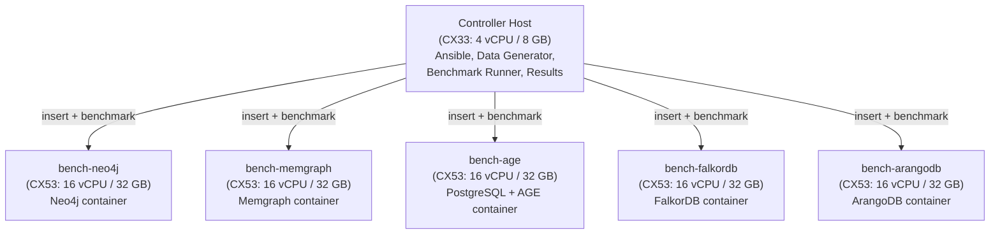
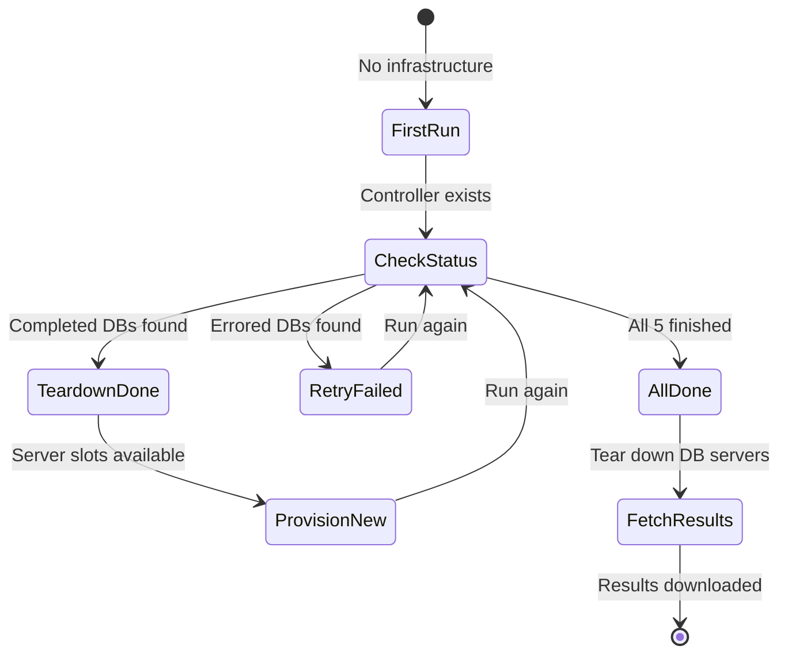

# Cloud Benchmark Deployment

## Overview

Dedicated Hetzner Cloud hosts benchmark Neo4j, Memgraph, Apache AGE, FalkorDB, and ArangoDB under identical conditions. A controller host generates synthetic graph data representative of the real Discogs dataset and inserts it directly into each database via GraphBackend drivers. No extractor, RabbitMQ, or graphinator changes are needed.

## Architecture

The deployment uses one controller host and up to five database hosts. The controller generates synthetic data and inserts it directly using each database's native driver.



Each database host runs only its database container — no graphinator or schema-init is deployed. The controller handles all data insertion directly via the `GraphBackend` abstraction.

### Convergence-Based Execution

The `run.sh --cloud` command uses a **convergence model** — run it repeatedly and it advances the pipeline each time:



1. **1st run:** Provisions controller + 3 DB servers + 1 baseline server. Runs baseline calibration (then tears down baseline). Deploys databases in parallel. Starts benchmarks.
1. **2nd+ runs:** SSHs to controller to check sentinel files. Tears down completed DB servers. Provisions remaining databases up to `--server-limit` (default: 5). Retries errored benchmarks.
1. **Final run:** All 5 benchmarks finished (completed or timed out). Tears down all remaining DB servers, fetches results. Controller remains for manual inspection.

### Timeout Detection

When at least one benchmark has completed and others are still running, the script finds the shortest completed duration and marks any benchmark running longer than **5x that duration** as timed out. The process is killed and a `.timeout` sentinel file is created.

### Per-Database Runner Architecture

Each database gets its own shell script (from `run-benchmark-single.sh.j2` template) deployed to the controller. The runner:

1. Sets database-specific URIs, credentials, and data paths
1. Runs benchmarks at both scale points (small + large)
1. Creates sentinel files: `.done` on success, `.err` on failure

Status tracking uses sentinel files on the controller:

| File                 | Location                  | Meaning                                  |
| -------------------- | ------------------------- | ---------------------------------------- |
| `{db}.done`          | `/opt/benchmark/results/` | Benchmark completed (contains timestamp) |
| `{db}.err`           | `/opt/benchmark/results/` | Benchmark errored (contains timestamp)   |
| `{db}.timeout`       | `/opt/benchmark/results/` | Benchmark timed out (contains timestamp) |
| `{db}.start`         | `/opt/benchmark/results/` | Start timestamp                          |
| `{db}-benchmark.pid` | `/opt/benchmark/`         | Process is running                       |
| `{db}-benchmark.log` | `/opt/benchmark/`         | stdout/stderr                            |

## Hetzner Cloud

### Why Hetzner

Hetzner offers the best price/performance ratio by a significant margin among cloud providers. European data centers (Nuremberg, Falkenstein, Helsinki) plus US East (Ashburn) and US West are available.

### Instance Sizing

- **Controller host (CX33):** 4 vCPU / 8 GB RAM / 80 GB SSD — sufficient for data generation, Ansible orchestration, and running the benchmark harness remotely
- **Database hosts (CX53):** 16 vCPU / 32 GB RAM / 320 GB SSD — accommodates in-memory databases (Memgraph, FalkorDB) for the `large` synthetic dataset (~1.35M nodes, ~5.4M relationships)

### Pricing

| Role       | Instance | vCPU | RAM   | Disk   | Per Host/hr | Per Host/mo |
| ---------- | -------- | ---- | ----- | ------ | ----------- | ----------- |
| Controller | **CX33** | 4    | 8 GB  | 80 GB  | €0.0088     | €5.49       |
| Database   | **CX53** | 16   | 32 GB | 320 GB | €0.0280     | €17.49      |

### Cost Estimates

| Scenario             | Duration | Controller (1x CX33) | DB Hosts (5x CX53) | Total     |
| -------------------- | -------- | -------------------- | ------------------ | --------- |
| Quick run (~8 hours) | 8 hr     | €0.07                | €1.12              | **€1.19** |
| Full run (~24 hours) | 24 hr    | €0.21                | €3.36              | **€3.57** |
| Extended (~48 hours) | 48 hr    | €0.42                | €6.72              | **€7.14** |

> **Note:** The convergence model tears down completed DB servers as benchmarks finish, so costs are lower if databases complete at different speeds. After all benchmarks complete, only the controller remains at €0.0088/hr.

### Additional Costs

| Item             | Cost       | Notes                     |
| ---------------- | ---------- | ------------------------- |
| Hetzner network  | Free       | 20TB included per server  |
| DNS/floating IPs | Not needed | Use IP addresses directly |

### Billing Alert

Set a spending alert in Hetzner Console to receive an email if costs exceed $75:

1. Log in to [console.hetzner.cloud](https://console.hetzner.cloud)
1. Go to **Account > Billing**
1. Click on the cost values for the benchmark project
1. Set the alert threshold to **$75**

## Infrastructure Details

### Network & Firewalls

- **Private network:** `10.0.0.0/16` with subnet `10.0.1.0/24`
- **Controller firewall:** SSH (port 22) from internet, all TCP (1-65535) from private network
- **Database firewall:** SSH + database ports (5432-8529) from private network only

### SSH Access

```bash
# SSH to controller as interactive user
ssh -i ~/.ssh/benchmark-key bench@<controller-ip>

# SSH to a database host (via controller bastion)
ssh -i ~/.ssh/benchmark-key -J root@<controller-ip> root@10.0.1.10

# Tail benchmark logs
ssh -i ~/.ssh/benchmark-key root@<controller-ip> 'tail -f /opt/benchmark/neo4j-benchmark.log'
```

## Metrics Collection

### System Metrics

A background script (`metrics-collector.sh.j2`) runs on each database host, collecting system metrics to a JSONL file at `/opt/benchmark/results/system-metrics.jsonl`:

| Metric                        | Collection Method | Frequency |
| ----------------------------- | ----------------- | --------- |
| CPU usage (%)                 | `/proc/stat`      | Every 5s  |
| Memory usage (used/total KB)  | `/proc/meminfo`   | Every 5s  |
| Disk usage (bytes)            | `df`              | Every 5s  |
| Disk I/O (read/write sectors) | `/proc/diskstats` | Every 5s  |

### Benchmark Metrics

Each benchmark run produces a JSON file with:

| Metric                             | Collection Method                            |
| ---------------------------------- | -------------------------------------------- |
| Insertion throughput (records/sec) | Per-entity-type timing in benchmark runner   |
| Latency p50 / p95 / p99 (ms)       | `time.perf_counter_ns()` per operation       |
| Throughput (ops/sec)               | Inverse of mean latency                      |
| Concurrent throughput              | Total ops across all tasks / wall clock time |

### Hardware Calibration

Each database host runs micro-benchmarks (CPU, memory, I/O) via `investigations/calibration/calibrate.py`. A dedicated baseline server runs the same calibration for cross-environment scaling. Results are stored alongside benchmark output.

## Automated Deployment with Ansible

### Directory Structure

```
investigations/infra/
  ansible.cfg                         # Ansible configuration
  vault.yml                           # Encrypted Hetzner token (not in git)
  inventory/
    hosts.yml                         # Generated by provision.yml (not in git)
  playbooks/
    provision.yml                     # Create Hetzner servers, network, firewalls
    setup-common.yml                  # Docker, monitoring, bench user on all hosts
    setup-neo4j.yml                   # Deploy Neo4j container
    setup-memgraph.yml                # Deploy Memgraph container
    setup-age.yml                     # Deploy PostgreSQL + AGE container
    setup-falkordb.yml                # Deploy FalkorDB container
    setup-arangodb.yml                # Deploy ArangoDB container
    start-benchmark.yml               # Sync code, generate data, calibrate, start benchmark
    baseline-calibration.yml          # Run calibration on baseline server
    check-servers.yml                 # Query Hetzner API for current state
    fetch-results.yml                 # Check status and fetch results to local machine
    run-benchmarks.yml                # Legacy orchestration (superseded by convergence loop)
    teardown.yml                      # Destroy servers, network, firewalls
  templates/
    docker-compose.neo4j.yml.j2       # Neo4j Docker Compose
    docker-compose.memgraph.yml.j2    # Memgraph Docker Compose
    docker-compose.age.yml.j2         # PostgreSQL + AGE Docker Compose
    docker-compose.falkordb.yml.j2    # FalkorDB Docker Compose
    docker-compose.arangodb.yml.j2    # ArangoDB Docker Compose
    run-benchmark-single.sh.j2        # Per-database benchmark runner script
    run-benchmarks.sh.j2              # Legacy multi-database runner
    metrics-collector.sh.j2           # System metrics collection script
```

### Playbook Details

**`provision.yml`** — Creates Hetzner Cloud SSH key, private network, subnet, firewalls, and servers. Supports wave-based provisioning via the `active_dbs` variable:

```bash
# Provision controller + specific databases
ansible-playbook playbooks/provision.yml --vault-password-file=.vault-pass \
  -e '{"active_dbs": ["neo4j", "memgraph", "age"]}'

# Include baseline server for calibration
ansible-playbook playbooks/provision.yml --vault-password-file=.vault-pass \
  -e '{"active_dbs": ["neo4j"], "provision_baseline": true}'
```

**`setup-common.yml`** — Establishes SSH to controller (ControlMaster), installs Docker and monitoring tools (sysstat, iotop, htop, jq), deploys metrics collector script, creates interactive `bench` user on controller with passwordless sudo.

**`setup-{db}.yml`** — Deploys the per-database Docker Compose template from `templates/`, starts the database via `docker compose`, waits for health check, starts metrics collection.

**`start-benchmark.yml`** — The main benchmark orchestration playbook. For a given `benchmark_db`:

1. Syncs investigation code to controller via rsync
1. Installs uv and Python dependencies on controller
1. Generates synthetic data (small + large) if not cached
1. Runs hardware calibration on the target DB host
1. Fetches calibration results to controller
1. Deploys per-DB runner script from `run-benchmark-single.sh.j2`
1. Starts benchmark in background via `nohup`

```bash
ansible-playbook playbooks/start-benchmark.yml -e benchmark_db=neo4j
```

**`baseline-calibration.yml`** — Provisions a baseline CX53 server, runs the calibration benchmark, copies results to controller. The baseline server is torn down after calibration.

**`fetch-results.yml`** — Lists benchmark log tails, counts results by status (completed, errored, timed out, running), fetches all results, logs, calibration data, and system metrics to local `investigations/results/`.

**`teardown.yml`** — Destroys servers, network, firewalls, and SSH key. Supports selective teardown:

```bash
# Tear down specific servers
ansible-playbook playbooks/teardown.yml --vault-password-file=.vault-pass \
  -e '{"destroy_servers": ["bench-neo4j", "bench-memgraph"]}'

# Full teardown
ansible-playbook playbooks/teardown.yml --vault-password-file=.vault-pass
```

## Controller File Layout

```
/opt/benchmark/
├── discogsography/investigations/   # Code synced from local repo
├── data/                            # Synthetic data files (cached)
│   ├── synthetic-data-small-{date}.json.gz
│   └── synthetic-data-large-{date}.json.gz
├── results/                         # All results + sentinel files
│   ├── {db}-small-{timestamp}.json  # Benchmark result
│   ├── {db}-large-{timestamp}.json  # Benchmark result
│   ├── {db}.done / .err / .timeout  # Status sentinels
│   ├── {db}.start                   # Start timestamp
│   ├── {db}-calibration.json        # Per-host hardware calibration
│   ├── baseline-calibration.json    # Baseline reference
│   └── {db}-system-metrics.jsonl    # System metrics
├── {db}-benchmark.pid               # Running process ID
├── {db}-benchmark.log               # stdout/stderr
├── run-benchmark-{db}.sh            # Per-DB runner script
└── metrics-collector.sh             # Metrics background script
```

## Prerequisites and Provisioning Guide

### Local Machine Setup

All prerequisites are auto-installed by `run.sh --cloud`. For manual setup:

```bash
# Install Ansible and required collections/roles
uv tool install ansible-core
ansible-galaxy collection install hetzner.hcloud community.docker community.general ansible.posix
ansible-galaxy role install geerlingguy.docker
uv pip install --system hcloud

# Generate a dedicated SSH key for benchmarking
ssh-keygen -t ed25519 -f ~/.ssh/benchmark-key -N "" -C "discogsography-benchmark"
```

### Hetzner Cloud Account Setup

1. Create account at [console.hetzner.cloud](https://console.hetzner.cloud)
1. Create a project (e.g., "discogsography-benchmark")
1. Go to **Security > API Tokens > Generate API Token**
1. Select **Read & Write** permissions
1. Copy the token (shown only once)

### Vault Setup

The `--cloud` flag handles vault creation automatically. For manual setup:

```bash
# Create vault password file
echo "your-vault-password" > investigations/infra/.vault-pass
chmod 600 investigations/infra/.vault-pass

# Create encrypted vault with Hetzner token
echo 'vault_hcloud_token: "your-hetzner-token"' > investigations/infra/vault.yml.tmp
ansible-vault encrypt investigations/infra/vault.yml.tmp \
  --vault-password-file=investigations/infra/.vault-pass
mv investigations/infra/vault.yml.tmp investigations/infra/vault.yml
```

### Cleanup

Remove all local secrets and SSH keys created by the cloud pipeline:

```bash
./investigations/run.sh --clean
```

This removes `vault.yml`, `.vault-pass`, and `~/.ssh/benchmark-key*`.

## Scaling Results to Other Hardware

After benchmarks complete, anyone can estimate how the results translate to their own hardware without re-running the full suite. See [shared-pre-work.md, Section 3](shared-pre-work.md#3-scaling-results-to-your-environment) for the full methodology.

```bash
# Run calibration on your machine (~30 seconds)
uv run python investigations/calibration/calibrate.py run --output my-calibration.json

# Scale any benchmark result file to your hardware
uv run python investigations/calibration/calibrate.py scale \
  --baseline investigations/results/baseline-calibration.json \
  --local my-calibration.json \
  --benchmark-results investigations/results/neo4j-large-*.json
```
