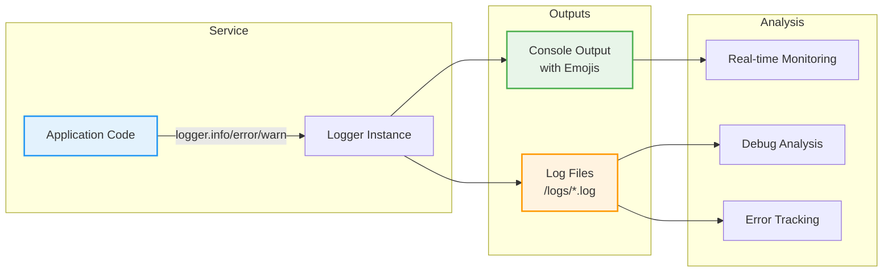

# 📝 Logging Conventions Guide

> Consistent, emoji-enhanced logging patterns across all Discogsography services

## Overview

Discogsography uses a standardized logging approach with emoji prefixes for visual clarity and quick issue
identification. This guide ensures consistent logging across all services.

### Logging Flow



## 🎨 Emoji Pattern

**Format**: `logger.{level}("{emoji} {message}")`

- Always include exactly **one space** after the emoji
- Use consistent emojis for similar operations
- Choose emojis that visually represent the action

## 📚 Emoji Reference

### 🚀 Service Lifecycle

| Emoji | Usage               | Example                                                |
| ----- | ------------------- | ------------------------------------------------------ |
| 🚀    | Service startup     | `logger.info("🚀 Starting extractor service...")`      |
| 🛑    | Service shutdown    | `logger.info("🛑 Shutting down gracefully")`           |
| 🔧    | Configuration/Setup | `logger.info("🔧 Configuring database connections")`   |
| 🏥    | Health check server | `logger.info("🏥 Health server started on port 8000")` |

### ✅ Success & Completion

| Emoji | Usage             | Example                                              |
| ----- | ----------------- | ---------------------------------------------------- |
| ✅    | Operation success | `logger.info("✅ All files processed successfully")` |
| 💾    | Data saved        | `logger.info("💾 Saved 1000 records to database")`   |
| 📋    | Metadata loaded   | `logger.info("📋 Loaded configuration from disk")`   |
| 🆕    | New version/data  | `logger.info("🆕 Found new Discogs data release")`   |

### ❌ Errors & Warnings

| Emoji | Usage             | Example                                            |
| ----- | ----------------- | -------------------------------------------------- |
| ❌    | Error occurred    | `logger.error("❌ Failed to connect to database")` |
| ⚠️    | Warning           | `logger.warning("⚠️ Retry attempt 3/5")`           |
| 🚨    | Critical issue    | `logger.critical("🚨 Out of memory")`              |
| ⏩    | Skipped operation | `logger.info("⏩ Skipped duplicate record")`       |

### 🔄 Processing & Progress

| Emoji | Usage          | Example                                          |
| ----- | -------------- | ------------------------------------------------ |
| 🔄    | Processing     | `logger.info("🔄 Processing batch 5/10")`        |
| ⏳    | Waiting        | `logger.info("⏳ Waiting for messages...")`      |
| 📊    | Progress/Stats | `logger.info("📊 Processed 5000/10000 records")` |
| ⏰    | Scheduled task | `logger.info("⏰ Running periodic check")`       |

### 📥 Data Operations

| Emoji | Usage                     | Example                                                                             |
| ----- | ------------------------- | ----------------------------------------------------------------------------------- |
| 📥    | Download start            | `logger.info("📥 Starting download of releases.xml")`                               |
| ⬇️    | Downloading               | `logger.info("⬇️ Downloaded 50MB/200MB")`                                           |
| 📄    | File operation            | `logger.info("📄 Created output.json")`                                             |
| 🔍    | Searching/Query execution | `logger.info("🔍 Checking for updates...")` or `logger.debug("🔍 Executing Neo4j query")` |

### 🔗 Service Connections

| Emoji | Usage       | Example                                         |
| ----- | ----------- | ----------------------------------------------- |
| 🐰    | RabbitMQ    | `logger.info("🐰 Connected to RabbitMQ")`       |
| 🔗    | Neo4j       | `logger.info("🔗 Connected to Neo4j database")` |
| 🐘    | PostgreSQL  | `logger.info("🐘 Connected to PostgreSQL")`     |
| 🌐    | Network/API | `logger.info("🌐 Fetching from Discogs API")`   |

## 💻 Implementation Examples

### Basic Service Startup

```python
import logging

logger = logging.getLogger(__name__)


async def start_service():
    logger.info("🚀 Starting dashboard service")

    try:
        logger.info("🔧 Initializing database connections")
        await init_databases()
        logger.info("✅ Database connections established")

        logger.info("🏥 Starting health check server on port 8000")
        await start_health_server()

        logger.info("⏳ Waiting for messages...")
        await process_messages()

    except Exception as e:
        logger.error(f"❌ Service startup failed: {e}")
        raise
    finally:
        logger.info("🛑 Shutting down service")
```

### Progress Tracking

```python
async def process_batch(items: list[dict]) -> None:
    total = len(items)

    for i, item in enumerate(items, 1):
        if i % 1000 == 0:
            logger.info(f"📊 Processed {i}/{total} items")

        try:
            await process_item(item)
        except DuplicateError:
            logger.debug(f"⏩ Skipped duplicate item {item['id']}")
        except Exception as e:
            logger.warning(f"⚠️ Failed to process item {item['id']}: {e}")

    logger.info(f"✅ Batch processing complete: {total} items")
```

### Connection Management

```python
async def connect_services():
    # RabbitMQ
    logger.info("🐰 Connecting to RabbitMQ...")
    try:
        await connect_rabbitmq()
        logger.info("🐰 RabbitMQ connection established")
    except Exception as e:
        logger.error(f"❌ RabbitMQ connection failed: {e}")
        raise

    # Neo4j
    logger.info("🔗 Connecting to Neo4j...")
    try:
        await connect_neo4j()
        logger.info("🔗 Neo4j connection established")
    except Exception as e:
        logger.error(f"❌ Neo4j connection failed: {e}")
        raise
```

### Download Operations

```python
async def download_file(url: str, filename: str):
    logger.info(f"📥 Starting download: {filename}")

    try:
        total_size = await get_file_size(url)
        downloaded = 0

        async for chunk in download_chunks(url):
            downloaded += len(chunk)
            progress = (downloaded / total_size) * 100

            if progress % 10 == 0:  # Log every 10%
                logger.info(f"⬇️ Downloading {filename}: {progress:.0f}%")

        logger.info(f"✅ Download complete: {filename}")
        logger.info(f"📄 Saved to: {filename}")

    except Exception as e:
        logger.error(f"❌ Download failed: {e}")
        raise
```

## 🎯 Best Practices

### 1. Appropriate Log Levels

```python
# DEBUG - Detailed diagnostic info
logger.debug("🔍 Checking cache for key: user_123")

# INFO - General informational messages
logger.info("🚀 Service started successfully")

# WARNING - Warning conditions
logger.warning("⚠️ Queue depth exceeding threshold")

# ERROR - Error conditions
logger.error("❌ Database connection lost")

# CRITICAL - Critical conditions
logger.critical("🚨 System out of memory")
```

### 2. Structured Context

```python
# Include relevant context
logger.info(f"💾 Saved artist: id={artist_id}, name={artist_name}")

# Use structured logging where appropriate
logger.info(
    "📊 Processing stats", extra={"processed": 1000, "failed": 5, "duration": 45.2}
)
```

### 3. Consistent Formatting

```python
# ✅ Good: Consistent format
logger.info("🚀 Starting service")
logger.info("🔧 Loading configuration")
logger.info("✅ Service ready")

# ❌ Bad: Inconsistent format
logger.info("🚀Starting service")  # Missing space
logger.info("🔧  Loading configuration")  # Extra space
logger.info("Service ready")  # Missing emoji
```

### 4. Error Context

```python
try:
    result = await risky_operation()
except SpecificError as e:
    # Include operation context
    logger.error(f"❌ Failed to process record {record_id}: {e}")
    # Re-raise or handle appropriately
    raise
except Exception as e:
    # Log unexpected errors with full context
    logger.exception(f"❌ Unexpected error in operation: {e}")
    raise
```

## 🔧 Configuration

### LOG_LEVEL Environment Variable

All Discogsography services use the `LOG_LEVEL` environment variable for consistent log level control:

```bash
# Set log level for all services
export LOG_LEVEL=DEBUG    # Detailed diagnostic information
export LOG_LEVEL=INFO     # General informational messages (default)
export LOG_LEVEL=WARNING  # Warning conditions only
export LOG_LEVEL=ERROR    # Error conditions only
export LOG_LEVEL=CRITICAL # Critical conditions only

# Run service with specific log level
LOG_LEVEL=DEBUG docker-compose up discovery

# Check what DEBUG logging shows
docker-compose logs discovery | grep "🔍"  # Neo4j queries
docker-compose logs discovery | grep "📊"  # Progress updates
docker-compose logs discovery | grep "🔄"  # Processing operations
```

For complete details on log level configuration across all services, see [Logging Configuration](logging-configuration.md).

### Basic Setup

```python
import logging
import sys

# Configure logging format
logging.basicConfig(
    level=logging.INFO,
    format="%(asctime)s - %(name)s - %(levelname)s - %(message)s",
    handlers=[
        logging.StreamHandler(sys.stdout),
        logging.FileHandler(f"/logs/{service_name}.log"),
    ],
)

logger = logging.getLogger(__name__)
```

> **💡 Tip**: Use the `setup_logging()` function from `common.config` instead of manual configuration. It automatically reads `LOG_LEVEL` from the environment and provides structured JSON logging.

### JSON Logging (Production)

```python
import logging
import json
from datetime import datetime


class JSONFormatter(logging.Formatter):
    def format(self, record):
        return json.dumps(
            {
                "timestamp": datetime.utcnow().isoformat(),
                "level": record.levelname,
                "logger": record.name,
                "message": record.getMessage(),
                "extra": getattr(record, "extra", {}),
            }
        )
```

## 📊 Log Analysis

### Finding Errors

```bash
# Using just command
just check-errors

# Manual grep
grep "❌" logs/*.log

# Count errors by type
grep -o "❌ [^:]*" logs/*.log | sort | uniq -c
```

### Progress Tracking

```bash
# Monitor progress
grep "📊" logs/extractor.log | tail -n 10

# Check completion
grep "✅" logs/*.log | grep "complete"
```

## 🚫 Anti-Patterns

```python
# ❌ Don't: No emoji
logger.info("Starting service")

# ❌ Don't: Wrong emoji for context
logger.error("✅ Connection failed")  # Success emoji for error

# ❌ Don't: Multiple spaces
logger.info("🚀  Starting service")

# ❌ Don't: Emoji at end
logger.info("Starting service 🚀")

# ❌ Don't: Multiple emojis
logger.info("🚀 🔧 Starting and configuring")
```

## 📚 Quick Reference Card

```
Lifecycle: 🚀 Start | 🛑 Stop | 🔧 Configure | 🏥 Health
Success:   ✅ Complete | 💾 Saved | 📋 Loaded | 🆕 New
Errors:    ❌ Error | ⚠️ Warning | 🚨 Critical | ⏩ Skip
Progress:  🔄 Processing | ⏳ Waiting | 📊 Stats | ⏰ Scheduled
Data:      📥 Download | ⬇️ Downloading | 📄 File | 🔍 Search/Query
Services:  🐰 RabbitMQ | 🔗 Neo4j | 🐘 PostgreSQL | 🌐 Network
```

> **💡 Tip**: Set `LOG_LEVEL=DEBUG` to see detailed diagnostic logs including database queries marked with 🔍

______________________________________________________________________

Remember: Consistent logging makes debugging easier and operations smoother! 🎯
