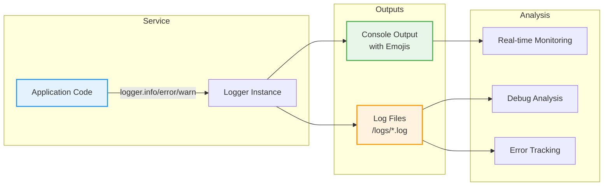

# 📝 Logging Guide

<div align="center">

**Consistent, emoji-enhanced logging patterns and configuration across all Discogsography services**

[🏠 Back to Main](../README.md) | [📚 Documentation Index](README.md) | [📋 Emoji Guide](emoji-guide.md)

</div>

## 📖 Overview

Discogsography uses a standardized logging approach with emoji prefixes for visual clarity and quick issue identification. All services use consistent logging controlled by the `LOG_LEVEL` environment variable.

### Logging Flow


```mermaid
flowchart LR
    subgraph "Service"
        Code[Application Code]
        Logger[Logger Instance]
    end

    subgraph "Outputs"
        Console[Console Output<br/>with Emojis]
        File[Log Files<br/>/logs/*.log]
    end

    subgraph "Analysis"
        Monitor[Real-time Monitoring]
        Debug[Debug Analysis]
        Errors[Error Tracking]
    end

    Code -->|logger.info/error/warn| Logger
    Logger --> Console
    Logger --> File

    Console --> Monitor
    File --> Debug
    File --> Errors

    style Code fill:#e3f2fd,stroke:#2196f3,stroke-width:2px
    style Console fill:#e8f5e9,stroke:#4caf50,stroke-width:2px
    style File fill:#fff3e0,stroke:#ff9800,stroke-width:2px
```

## ⚙️ Configuration

### Environment Variable

All services in the Discogsography platform use the `LOG_LEVEL` environment variable for consistent logging control.

#### Supported Log Levels

| Level      | Description                                   | Use Case                        |
| ---------- | --------------------------------------------- | ------------------------------- |
| `DEBUG`    | Detailed diagnostic information               | Development and troubleshooting |
| `INFO`     | General informational messages                | Production (default)            |
| `WARNING`  | Warning messages for potential issues         | Production monitoring           |
| `ERROR`    | Error messages for failures                   | Production alerts               |
| `CRITICAL` | Critical errors requiring immediate attention | Production alerts               |

**Default**: If `LOG_LEVEL` is not set, all services default to `INFO`.

#### Setting Log Level

```bash
# Development with debug logging
export LOG_LEVEL=DEBUG

# Production with info logging (default)
export LOG_LEVEL=INFO

# Error-only logging
export LOG_LEVEL=ERROR
```

#### Docker Compose

```yaml
services:
  my-service:
    environment:
      LOG_LEVEL: INFO
```

#### Docker Run

```bash
docker run -e LOG_LEVEL=DEBUG discogsography/service:latest
```

### Service-Specific Implementation

#### Python Services

All Python services (graphinator, tableinator, dashboard, explore) use **[structlog](https://www.structlog.org/)** configured via `setup_logging()` from `common/config.py`. Use `structlog.get_logger()` — **not** `logging.getLogger()`:

```python
import structlog
from common import setup_logging

# Call once at service startup — reads LOG_LEVEL from environment, defaults to INFO
setup_logging("service_name", log_file=Path("/logs/service.log"))

# Get a logger in any module
logger = structlog.get_logger(__name__)
logger.info("🚀 Service starting...")
```

**Features**:

- Structured JSON logging with emoji indicators
- Correlation IDs from contextvars
- Service-specific context (name, environment)
- File and console output
- Automatic suppression of verbose third-party logs

#### Extractor

The Rust extractor uses Rust's `tracing` framework and maps Python log levels to Rust equivalents:

| Python Level | Rust Level | Notes                                  |
| ------------ | ---------- | -------------------------------------- |
| DEBUG        | debug      | Detailed diagnostic info               |
| INFO         | info       | General messages (default)             |
| WARNING      | warn       | Warning messages                       |
| ERROR        | error      | Error messages                         |
| CRITICAL     | error      | Mapped to error (Rust has no critical) |

**Configuration**:

```bash
# Debug logging
LOG_LEVEL=DEBUG cargo run

# Production logging
LOG_LEVEL=INFO cargo run
```

**Implementation** (main.rs):

```rust
let log_level = std::env::var("LOG_LEVEL")
    .unwrap_or_else(|_| "INFO".to_string())
    .to_uppercase();

let rust_level = match log_level.as_str() {
    "DEBUG" => "debug",
    "INFO" => "info",
    "WARNING" | "WARN" => "warn",
    "ERROR" => "error",
    "CRITICAL" => "error",
    _ => "info"
};
```

## 📋 Log Format

### Python Services (JSON)

```json
{
  "timestamp": "2024-01-15T10:30:45.123456Z",
  "level": "info",
  "logger": "graphinator",
  "event": "🚀 Service starting...",
  "service": "graphinator",
  "environment": "production",
  "lineno": 1210
}
```

### Extractor (JSON)

```json
{
  "timestamp": "2024-01-15T10:30:45.123456Z",
  "level": "INFO",
  "target": "extractor",
  "message": "🚀 Starting Rust-based Discogs data extractor with high performance",
  "line": 59
}
```

## 🎨 Emoji Pattern

**Format**: `logger.{level}("{emoji} {message}")`

- Always include exactly **one space** after the emoji
- Use consistent emojis for similar operations
- Choose emojis that visually represent the action

## 📚 Emoji Reference

### 🚀 Service Lifecycle

| Emoji | Usage               | Example                                                |
| ----- | ------------------- | ------------------------------------------------------ |
| 🚀    | Service startup     | `logger.info("🚀 Starting extractor service...")`      |
| 🛑    | Service shutdown    | `logger.info("🛑 Shutting down gracefully")`           |
| 🔧    | Configuration/Setup | `logger.info("🔧 Configuring database connections")`   |
| 🏥    | Health check server | `logger.info("🏥 Health server started on port 8000")` |

### ✅ Success & Completion

| Emoji | Usage             | Example                                              |
| ----- | ----------------- | ---------------------------------------------------- |
| ✅    | Operation success | `logger.info("✅ All files processed successfully")` |
| 💾    | Data saved        | `logger.info("💾 Saved 1000 records to database")`   |
| 📋    | Metadata loaded   | `logger.info("📋 Loaded configuration from disk")`   |
| 🆕    | New version/data  | `logger.info("🆕 Found new Discogs data release")`   |

### ❌ Errors & Warnings

| Emoji | Usage             | Example                                            |
| ----- | ----------------- | -------------------------------------------------- |
| ❌    | Error occurred    | `logger.error("❌ Failed to connect to database")` |
| ⚠️    | Warning           | `logger.warning("⚠️ Retry attempt 3/5")`           |
| 🚨    | Critical issue    | `logger.critical("🚨 Out of memory")`              |
| ⏩    | Skipped operation | `logger.info("⏩ Skipped duplicate record")`       |

### 🔄 Processing & Progress

| Emoji | Usage          | Example                                          |
| ----- | -------------- | ------------------------------------------------ |
| 🔄    | Processing     | `logger.info("🔄 Processing batch 5/10")`        |
| ⏳    | Waiting        | `logger.info("⏳ Waiting for messages...")`      |
| 📊    | Progress/Stats | `logger.info("📊 Processed 5000/10000 records")` |
| ⏰    | Scheduled task | `logger.info("⏰ Running periodic check")`       |

### 📥 Data Operations

| Emoji | Usage                     | Example                                                                                   |
| ----- | ------------------------- | ----------------------------------------------------------------------------------------- |
| 📥    | Download start            | `logger.info("📥 Starting download of releases.xml")`                                     |
| ⬇️    | Downloading               | `logger.info("⬇️ Downloaded 50MB/200MB")`                                                 |
| 📄    | File operation            | `logger.info("📄 Created output.json")`                                                   |
| 🔍    | Searching/Query execution | `logger.info("🔍 Checking for updates...")` or `logger.debug("🔍 Executing Neo4j query")` |

### 🔗 Service Connections

| Emoji | Usage                | Example                                            |
| ----- | -------------------- | -------------------------------------------------- |
| 🐰    | RabbitMQ             | `logger.info("🐰 Connected to RabbitMQ")`          |
| 🔗    | Neo4j                | `logger.info("🔗 Connected to Neo4j database")`    |
| 🐘    | PostgreSQL           | `logger.info("🐘 Connected to PostgreSQL")`        |
| 🌐    | Network/API          | `logger.info("🌐 Fetching from Discogs API")`      |
| 📑    | Database index setup | `logger.info("📑 Neo4j indexes created/verified")` |

## 💻 Implementation Examples

### Basic Service Startup

```python
import structlog

logger = structlog.get_logger(__name__)  # Use structlog, not logging.getLogger()


async def start_service():
    logger.info("🚀 Starting dashboard service")

    try:
        logger.info("🔧 Initializing database connections")
        await init_databases()
        logger.info("✅ Database connections established")

        logger.info("🏥 Starting health check server on port 8000")
        await start_health_server()

        logger.info("⏳ Waiting for messages...")
        await process_messages()

    except Exception as e:
        logger.error(f"❌ Service startup failed: {e}")
        raise
    finally:
        logger.info("🛑 Shutting down service")
```

### Progress Tracking

```python
async def process_batch(items: list[dict]) -> None:
    total = len(items)

    for i, item in enumerate(items, 1):
        if i % 1000 == 0:
            logger.info(f"📊 Processed {i}/{total} items")

        try:
            await process_item(item)
        except DuplicateError:
            logger.debug(f"⏩ Skipped duplicate item {item['id']}")
        except Exception as e:
            logger.warning(f"⚠️ Failed to process item {item['id']}: {e}")

    logger.info(f"✅ Batch processing complete: {total} items")
```

### Connection Management

```python
async def connect_services():
    # RabbitMQ
    logger.info("🐰 Connecting to RabbitMQ...")
    try:
        await connect_rabbitmq()
        logger.info("🐰 RabbitMQ connection established")
    except Exception as e:
        logger.error(f"❌ RabbitMQ connection failed: {e}")
        raise

    # Neo4j
    logger.info("🔗 Connecting to Neo4j...")
    try:
        await connect_neo4j()
        logger.info("🔗 Neo4j connection established")
    except Exception as e:
        logger.error(f"❌ Neo4j connection failed: {e}")
        raise
```

### Download Operations

```python
async def download_file(url: str, filename: str):
    logger.info(f"📥 Starting download: {filename}")

    try:
        total_size = await get_file_size(url)
        downloaded = 0

        async for chunk in download_chunks(url):
            downloaded += len(chunk)
            progress = (downloaded / total_size) * 100

            if progress % 10 == 0:  # Log every 10%
                logger.info(f"⬇️ Downloading {filename}: {progress:.0f}%")

        logger.info(f"✅ Download complete: {filename}")
        logger.info(f"📄 Saved to: {filename}")

    except Exception as e:
        logger.error(f"❌ Download failed: {e}")
        raise
```

## 🎯 Best Practices

### 1. Appropriate Log Levels

```python
# DEBUG - Detailed diagnostic info
logger.debug("🔍 Checking cache for key: user_123")

# INFO - General informational messages
logger.info("🚀 Service started successfully")

# WARNING - Warning conditions
logger.warning("⚠️ Queue depth exceeding threshold")

# ERROR - Error conditions
logger.error("❌ Database connection lost")

# CRITICAL - Critical conditions
logger.critical("🚨 System out of memory")
```

### 2. Structured Context

```python
# Include relevant context
logger.info(f"💾 Saved artist: id={artist_id}, name={artist_name}")

# Use structured logging where appropriate
logger.info(
    "📊 Processing stats", extra={"processed": 1000, "failed": 5, "duration": 45.2}
)
```

### 3. Consistent Formatting

```python
# ✅ Good: Consistent format
logger.info("🚀 Starting service")
logger.info("🔧 Loading configuration")
logger.info("✅ Service ready")

# ❌ Bad: Inconsistent format
logger.info("🚀Starting service")  # Missing space
logger.info("🔧  Loading configuration")  # Extra space
logger.info("Service ready")  # Missing emoji
```

### 4. Error Context

```python
try:
    result = await risky_operation()
except SpecificError as e:
    # Include operation context
    logger.error(f"❌ Failed to process record {record_id}: {e}")
    # Re-raise or handle appropriately
    raise
except Exception as e:
    # Log unexpected errors with full context
    logger.exception(f"❌ Unexpected error in operation: {e}")
    raise
```

## 🔧 Advanced Configuration

### Basic Setup

All services use `setup_logging()` from `common.config`, which configures structlog with JSON output, reads `LOG_LEVEL` from the environment, and sets up file + console handlers:

```python
import structlog
from pathlib import Path
from common import setup_logging

# Call once at service startup
setup_logging("service_name", log_file=Path("/logs/service_name.log"))

# Get a logger in each module
logger = structlog.get_logger(__name__)
```

> **💡 Tip**: Never call `logging.basicConfig()` directly in a service — `setup_logging()` handles everything including structlog configuration, third-party log suppression, and log file rotation.

### JSON Logging (Production)

JSON logging is handled automatically by structlog via `setup_logging()`. The configured `JSONRenderer` uses `orjson` for efficient serialization. No custom `JSONFormatter` is needed.

## 🔍 Troubleshooting

### Service not respecting LOG_LEVEL

1. **Check environment variable is set**:

   ```bash
   docker exec <container> printenv LOG_LEVEL
   ```

1. **Verify service startup logs**:

   ```bash
   docker logs <container> | head -20
   ```

1. **Check for explicit level parameter** (Python):

   ```python
   # This overrides LOG_LEVEL
   setup_logging("service", level="WARNING")
   ```

### Too much logging in production

1. Set `LOG_LEVEL=WARNING` or `LOG_LEVEL=ERROR`
1. Check third-party library log levels are suppressed (handled automatically)

### Not enough logging for debugging

1. Set `LOG_LEVEL=DEBUG`
1. Restart the service
1. Monitor logs: `docker logs -f <container>`

## 📊 Log Analysis

### Finding Errors

```bash
# Using just command
just check-errors

# Manual grep
grep "❌" logs/*.log

# Count errors by type
grep -o "❌ [^:]*" logs/*.log | sort | uniq -c
```

### Progress Tracking

```bash
# Monitor progress
grep "📊" logs/extractor.log | tail -n 10

# Check completion
grep "✅" logs/*.log | grep "complete"
```

## 🚫 Anti-Patterns

```python
# ❌ Don't: No emoji
logger.info("Starting service")

# ❌ Don't: Wrong emoji for context
logger.error("✅ Connection failed")  # Success emoji for error

# ❌ Don't: Multiple spaces
logger.info("🚀  Starting service")

# ❌ Don't: Emoji at end
logger.info("Starting service 🚀")

# ❌ Don't: Multiple emojis
logger.info("🚀 🔧 Starting and configuring")
```

## 🔄 Migration Notes

### From RUST_LOG (Extractor)

**Old**:

```yaml
environment:
  RUST_LOG: extractor=info,lapin=warn
```

**New**:

```yaml
environment:
  LOG_LEVEL: INFO
```

### From Verbose Flag (Extractor)

**Old**:

```bash
cargo run --verbose
```

**New**:

```bash
LOG_LEVEL=DEBUG cargo run
```

## 📝 Best Practices Summary

1. **Development**: Use `DEBUG` for detailed diagnostic information
1. **Staging**: Use `INFO` to match production behavior
1. **Production**: Use `INFO` or `WARNING` depending on volume
1. **Incident Response**: Temporarily set to `DEBUG` for affected services
1. **Case Insensitive**: LOG_LEVEL values are case-insensitive (`debug` == `DEBUG`)
1. **Container Logs**: All logs go to stdout/stderr for container orchestration
1. **File Logs**: Python services also write to `/logs/<service>.log` inside containers

## 📚 Quick Reference Card

```
Lifecycle: 🚀 Start | 🛑 Stop | 🔧 Configure | 🏥 Health
Success:   ✅ Complete | 💾 Saved | 📋 Loaded | 🆕 New
Errors:    ❌ Error | ⚠️ Warning | 🚨 Critical | ⏩ Skip
Progress:  🔄 Processing | ⏳ Waiting | 📊 Stats | ⏰ Scheduled
Data:      📥 Download | ⬇️ Downloading | 📄 File | 🔍 Search/Query
Services:  🐰 RabbitMQ | 🔗 Neo4j | 🐘 PostgreSQL | 🌐 Network
```

> **💡 Tip**: Set `LOG_LEVEL=DEBUG` to see detailed diagnostic logs including database queries marked with 🔍

## 🔗 Related Documentation

- [Emoji Guide](emoji-guide.md) - Complete emoji reference for the project
- [Monitoring Guide](monitoring.md) - Real-time monitoring and debugging
- [Troubleshooting Guide](troubleshooting.md) - Common issues and solutions
- [Configuration Guide](configuration.md) - Complete environment variable reference

______________________________________________________________________

<div align="center">

**Last Updated**: 2026-03-07

Remember: Consistent logging makes debugging easier and operations smoother! 🎯

</div>
