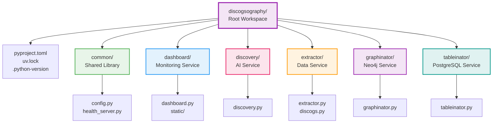

# 📦 Monorepo Structure Guide

> Understanding and working with Discogsography's uv workspace-based monorepo

## Overview

Discogsography uses a **monorepo** structure with **uv workspaces**, allowing multiple services to share code while maintaining independent dependencies. This guide explains how to effectively work within this structure.

## 🏗️ Repository Structure



### Directory Structure Details

```
discogsography/                    # Root workspace
├── pyproject.toml                 # Root configuration & shared dev dependencies
├── uv.lock                        # Single lock file for entire workspace
├── .python-version                # Python version for uv
│
├── common/                        # Shared library (workspace member)
│   ├── pyproject.toml            # Declares [project] with name
│   ├── __init__.py
│   ├── config.py                 # Shared configuration
│   └── health_server.py          # Shared health check server
│
├── dashboard/                     # Service (workspace member)
│   ├── pyproject.toml           # Service-specific dependencies
│   ├── dashboard.py             # Service entry point
│   └── static/                  # Service assets
│
├── discovery/                     # Service (workspace member)
│   ├── pyproject.toml           # AI/ML dependencies
│   └── discovery.py
│
├── extractor/                     # Service (workspace member)
│   ├── pyproject.toml           # Data processing dependencies
│   └── extractor.py
│
├── graphinator/                   # Service (workspace member)
│   ├── pyproject.toml           # Neo4j dependencies
│   └── graphinator.py
│
└── tableinator/                   # Service (workspace member)
    ├── pyproject.toml           # PostgreSQL dependencies
    └── tableinator.py
```

## 🔑 Key Concepts

### 1. Workspace Members

Each service is a **workspace member** with its own `pyproject.toml`:

```toml
# dashboard/pyproject.toml
[project]
name = "dashboard"
version = "1.0.0"
dependencies = [
    "fastapi>=0.115.6",
    "websockets>=14.1",
    # Service-specific deps
]
```

### 2. Shared Dependencies

The root `pyproject.toml` defines:

- Development dependencies (testing, linting)
- Tool configurations (ruff, mypy, pytest)
- Workspace member declarations

```toml
# Root pyproject.toml
[tool.uv.workspace]
members = [
    "common",
    "dashboard",
    "discovery",
    "extractor",
    "graphinator",
    "tableinator"
]

[project.optional-dependencies]
dev = [
    "pytest>=8.3.4",
    "ruff>=0.8.6",
    "mypy>=1.14.1",
    # Shared dev tools
]
```

### 3. Single Lock File

- **One `uv.lock`** at the root locks ALL dependencies
- Ensures version consistency across services
- Updated automatically by uv

## 📋 Common Tasks

### Installing Dependencies

```bash
# Install everything (recommended for development)
uv sync --all-extras

# Install specific service dependencies
uv sync --extra dashboard
uv sync --extra discovery

# Install only dev dependencies
uv sync --extra dev
```

### Adding Dependencies

```bash
# Add to specific service
cd dashboard
uv add fastapi  # Adds to dashboard/pyproject.toml

# Add dev dependency (from root)
uv add --dev pytest-asyncio

# Add with version constraint
uv add "neo4j>=5.15.0"
```

### Running Services

```bash
# From project root (recommended)
uv run python dashboard/dashboard.py
uv run python extractor/extractor.py

# Using task commands
uv run task dashboard
uv run task extractor
```

### Import Patterns

```python
# Services can import from common
from common.config import Config
from common.health_server import HealthServer

# But NOT from other services (bad practice)
# from dashboard.something import thing  # ❌ Don't do this
```

## 🛠️ Development Workflow

### 1. Making Changes to Shared Code

When modifying `common/`:

```bash
# 1. Make your changes in common/
edit common/config.py

# 2. No reinstall needed - changes are immediate
# (common is installed in editable mode)

# 3. Test affected services
uv run task test
```

### 2. Adding a New Service

```bash
# 1. Create service directory
mkdir myservice
cd myservice

# 2. Create pyproject.toml
cat > pyproject.toml << EOF
[project]
name = "myservice"
version = "1.0.0"
dependencies = [
    # Service dependencies
]
EOF

# 3. Add to root pyproject.toml
# Edit [tool.uv.workspace] members list

# 4. Sync workspace
cd ..
uv sync
```

### 3. Service-Specific Testing

```bash
# Test single service
uv run pytest tests/dashboard/

# Test with coverage
uv run pytest tests/extractor/ --cov=extractor

# Test everything
uv run task test
```

## ⚠️ Common Pitfalls

### 1. Wrong Directory

```bash
# ❌ Bad: Running from service directory
cd dashboard
uv run python dashboard.py  # May fail to find imports

# ✅ Good: Running from root
uv run python dashboard/dashboard.py
```

### 2. Manual Dependency Edits

```bash
# ❌ Bad: Editing pyproject.toml manually
# Can break uv.lock consistency

# ✅ Good: Using uv commands
uv add package-name
```

### 3. Cross-Service Imports

```python
# ❌ Bad: Services importing from each other
# dashboard/dashboard.py
from extractor.something import thing

# ✅ Good: Only import from common
from common.config import Config
```

### 4. Installing Without Workspace

```bash
# ❌ Bad: Installing service in isolation
cd dashboard
pip install -e .

# ✅ Good: Using uv sync from root
uv sync --all-extras
```

## 🐳 Docker Considerations

Each service has its own Dockerfile but shares the workspace structure:

```dockerfile
# Copy entire workspace
COPY pyproject.toml uv.lock ./
COPY common ./common
COPY dashboard ./dashboard

# Install specific service
RUN uv sync --frozen --no-dev --extra dashboard
```

## 🎯 Best Practices

1. **Always Work from Root**: Run commands from project root
1. **Use uv Commands**: Don't edit dependency files manually
1. **Shared Code in common/**: Put reusable code here
1. **Service Independence**: Services shouldn't depend on each other
1. **Test After Changes**: Especially when modifying common/
1. **Keep Services Focused**: Each service should have a single responsibility

## 📊 Workspace Benefits

| Benefit | Description |
|---------|-------------|
| **Code Reuse** | Share utilities via common/ |
| **Version Consistency** | Single lock file prevents conflicts |
| **Faster Installation** | uv caches dependencies efficiently |
| **Atomic Updates** | Update all services simultaneously |
| **Simplified CI/CD** | One install step for everything |

## 🔍 Debugging

### Check Workspace Members

```bash
# List all workspace members
uv list

# Show dependency tree
uv tree
```

### Verify Installation

```bash
# Check if service is installed
uv run python -c "import dashboard; print(dashboard.__file__)"
```

### Force Reinstall

```bash
# Clean install
rm -rf .venv
uv sync --all-extras
```

## 📚 Further Reading

- [uv Workspaces Documentation](https://github.com/astral-sh/uv)
- [Task Automation](task-automation.md) - Task commands
- [Docker Standards](dockerfile-standards.md) - Container setup
