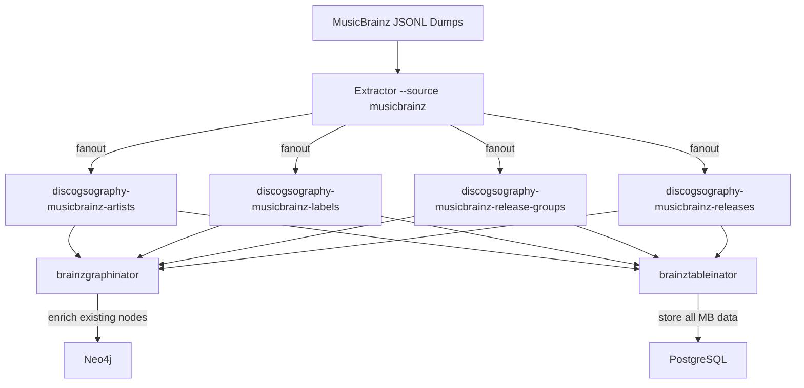

# MusicBrainz Data Sync

## Overview

The MusicBrainz integration imports data from MusicBrainz JSONL database dumps into the Discogsography platform. Data flows through the extractor (Rust) → RabbitMQ → brainzgraphinator (Neo4j) + brainztableinator (PostgreSQL).

## Data Flow



## Dump Schedule

MusicBrainz publishes new JSONL dumps **twice weekly** (Wednesdays and Saturdays).

## Import Process

### Initial Import

1. Download MusicBrainz JSONL dumps (xz-compressed):
   - `artist.jsonl.xz`
   - `label.jsonl.xz`
   - `release-group.jsonl.xz`
   - `release.jsonl.xz`

2. Place files in the `musicbrainz_data` Docker volume (or mounted directory)

3. Start (or restart) the `extractor-musicbrainz` container:
   ```bash
   docker-compose up -d extractor-musicbrainz
   ```

4. The extractor detects the dump files, parses them, and publishes messages to RabbitMQ

5. brainzgraphinator and brainztableinator consume and process all messages

6. Monitor progress via health endpoints:
   - Extractor: `http://localhost:8000/health`
   - Brainzgraphinator: `http://localhost:8011/health`
   - Brainztableinator: `http://localhost:8010/health`

### Incremental Updates

1. Download the latest MB JSONL dumps
2. Replace the files in the data volume
3. Restart `extractor-musicbrainz` or trigger via the `/trigger` endpoint:
   ```bash
   curl -X POST http://localhost:8000/trigger
   ```
4. The state marker system detects the new dump version and triggers a full reprocess
5. All writes are idempotent — existing data is updated, new data is inserted

### Force Reprocess

To force reprocessing of the same dump version:
```bash
curl -X POST http://localhost:8000/trigger -H "Content-Type: application/json" -d '{"force_reprocess": true}'
```

Or set the environment variable:
```bash
FORCE_REPROCESS=true docker-compose up extractor-musicbrainz
```

## State Markers

The extractor tracks progress using version-specific state markers:
- File: `.mb_extraction_status_{version}.json` in the data directory
- States: `pending` → `in_progress` → `completed` (or `failed`)
- A new dump version creates a new marker, triggering reprocessing
- Completed markers prevent duplicate processing

## Monitoring

### Enrichment Status API

```bash
curl http://localhost:8004/api/enrichment/status
```

Returns coverage statistics:
```json
{
  "musicbrainz": {
    "artists": {"total_mb": 2100000, "matched_to_discogs": 950000, "enriched_in_neo4j": 950000},
    "labels": {"total_mb": 180000, "matched_to_discogs": 85000, "enriched_in_neo4j": 85000},
    "releases": {"total_mb": 3200000, "matched_to_discogs": 1400000, "enriched_in_neo4j": 1400000},
    "relationships": {"total_in_mb": 5000000, "created_in_neo4j": 420000}
  }
}
```

### Service Health

| Service | URL | Key Metrics |
|---------|-----|-------------|
| Extractor (MB) | `:8000/health` | extraction_progress, extraction_status |
| Brainzgraphinator | `:8011/health` | entities_enriched, relationships_created, entities_skipped |
| Brainztableinator | `:8010/health` | message_counts per data type |

## Future Enhancements

- **Automated download**: Cron job or scheduled CI to fetch latest dumps automatically
- **Hourly replication**: MusicBrainz offers replication packets for near-real-time updates (complex, requires tracking replication sequence numbers)
- **Delta detection**: Compare record SHA256 hashes to skip unchanged entities during re-import
