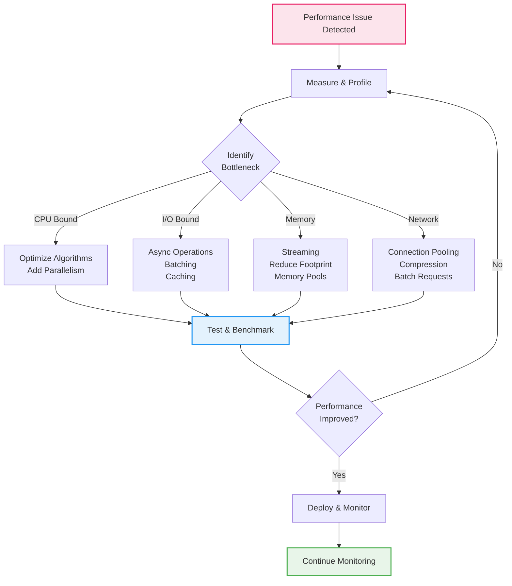

# ⚡ Performance Optimization Guide

> Strategies and techniques for optimizing Discogsography's performance at scale

## Overview

Processing 20+ million music records requires careful attention to performance. This guide covers optimization
strategies, bottleneck identification, and performance tuning across all services.

### Performance Optimization Flow



## 🎯 Performance Goals

| Metric                 | Target       | Current      | Optimization     |
| ---------------------- | ------------ | ------------ | ---------------- |
| **XML Parsing**        | 10,000 rec/s | 5,000-10,000 | I/O, Memory      |
| **Message Processing** | 5,000 msg/s  | 3,000-5,000  | Network          |
| **Neo4j Writes**       | 5,000 rec/s  | 3,000-5,000  | Batch processing ✅ |
| **PostgreSQL Writes**  | 10,000 rec/s | 8,000-10,000 | Batch processing ✅ |
| **API Response Time**  | \<100ms      | \<200ms      | Query complexity |

> **Note**: ✅ indicates optimizations that are implemented and enabled by default.

## 🔍 Profiling & Monitoring

### Performance Profiling

```python
import cProfile
import pstats
from line_profiler import profile


# Function-level profiling
@profile
async def process_batch(items: list[dict]) -> None:
    # Processing logic
    pass


# Run with profiling
if __name__ == "__main__":
    cProfile.run("asyncio.run(main())", "profile_stats")

    # Analyze results
    stats = pstats.Stats("profile_stats")
    stats.sort_stats("cumulative")
    stats.print_stats(20)  # Top 20 functions
```

### Memory Profiling

```python
from memory_profiler import profile
import tracemalloc


# Decorator-based profiling
@profile
def memory_intensive_operation():
    # Large data processing
    pass


# Tracemalloc for detailed tracking
tracemalloc.start()
# ... operations ...
current, peak = tracemalloc.get_traced_memory()
logger.info(
    f"📊 Memory usage: current={current/1024/1024:.1f}MB, peak={peak/1024/1024:.1f}MB"
)
tracemalloc.stop()
```

### Real-time Monitoring

```python
import psutil
import asyncio


async def monitor_resources():
    """Monitor system resources."""
    process = psutil.Process()

    while True:
        cpu_percent = process.cpu_percent(interval=1)
        memory_info = process.memory_info()

        logger.info(
            f"📊 Resources: CPU={cpu_percent}%, Memory={memory_info.rss/1024/1024:.1f}MB"
        )

        await asyncio.sleep(30)  # Log every 30 seconds
```

## 🚀 Optimization Strategies

### 1. XML Parsing Optimization

#### Current Implementation

```python
# Streaming parser with deduplication
async def parse_xml_file(file_path: Path) -> AsyncIterator[dict]:
    seen_hashes = set()

    async for event, elem in etree.iterparse(file_path, events=("end",)):
        if elem.tag in TARGET_TAGS:
            data = element_to_dict(elem)
            data_hash = calculate_hash(data)

            if data_hash not in seen_hashes:
                seen_hashes.add(data_hash)
                yield data

            elem.clear()  # Free memory
```

#### Optimizations

```python
# 1. Use orjson for faster JSON operations
import orjson


def element_to_dict_optimized(elem) -> dict:
    # Convert to dict
    data = {child.tag: child.text for child in elem}

    # Use orjson for serialization (3x faster)
    json_bytes = orjson.dumps(data)
    return orjson.loads(json_bytes)


# 2. Batch processing for better throughput
async def parse_xml_batched(file_path: Path, batch_size: int = 1000):
    batch = []

    async for data in parse_xml_file(file_path):
        batch.append(data)

        if len(batch) >= batch_size:
            yield batch
            batch = []

    if batch:  # Yield remaining
        yield batch


# 3. Parallel processing with multiprocessing
from concurrent.futures import ProcessPoolExecutor


async def parse_xml_parallel(file_path: Path):
    with ProcessPoolExecutor(max_workers=4) as executor:
        # Split file into chunks
        chunks = split_xml_file(file_path, num_chunks=4)

        # Process in parallel
        futures = [executor.submit(parse_chunk, chunk) for chunk in chunks]

        for future in futures:
            yield from future.result()
```

### 2. Message Queue Optimization

#### RabbitMQ Configuration

```python
# Optimal prefetch for consumers
PREFETCH_COUNT = 100  # Adjust based on processing speed


# Connection pooling
class ConnectionPool:
    def __init__(self, size: int = 10):
        self.pool = asyncio.Queue(maxsize=size)
        self.size = size

    async def get_connection(self):
        try:
            return self.pool.get_nowait()
        except asyncio.QueueEmpty:
            return await aio_pika.connect_robust(AMQP_URL)

    async def return_connection(self, conn):
        try:
            self.pool.put_nowait(conn)
        except asyncio.QueueFull:
            await conn.close()
```

#### Batch Publishing

```python
async def publish_batch(messages: list[dict], queue_name: str):
    """Publish messages in batch for better throughput."""
    async with get_channel() as channel:
        # Use transactions for batch
        async with channel.transaction():
            for message in messages:
                await channel.default_exchange.publish(
                    aio_pika.Message(
                        body=orjson.dumps(message),
                        delivery_mode=DeliveryMode.PERSISTENT,
                    ),
                    routing_key=queue_name,
                )
```

### 3. Database Optimization

#### Batch Processing (Implemented)

**Graphinator and Tableinator** now include built-in batch processing for optimal write performance:

```python
# Configured via environment variables (enabled by default)
NEO4J_BATCH_MODE=true           # Enable batch processing
NEO4J_BATCH_SIZE=100            # Records per batch
NEO4J_BATCH_FLUSH_INTERVAL=5.0  # Seconds between flushes

POSTGRES_BATCH_MODE=true           # Enable batch processing
POSTGRES_BATCH_SIZE=100            # Records per batch
POSTGRES_BATCH_FLUSH_INTERVAL=5.0  # Seconds between flushes
```

**How it works:**

1. Messages are accumulated into batches
2. When batch reaches size limit OR time interval expires:
   - All records written in single database operation
   - Message acknowledgments sent after successful write
3. On shutdown, all pending batches are flushed

**Performance gains:**

- **3-5x faster** write throughput
- **Reduced database load** with fewer transactions
- **Better resource utilization** with fewer connections

**Tuning recommendations:**

```bash
# Initial data load (maximize throughput)
NEO4J_BATCH_SIZE=500
NEO4J_BATCH_FLUSH_INTERVAL=10.0
POSTGRES_BATCH_SIZE=500
POSTGRES_BATCH_FLUSH_INTERVAL=10.0

# Real-time updates (minimize latency)
NEO4J_BATCH_SIZE=10
NEO4J_BATCH_FLUSH_INTERVAL=1.0
POSTGRES_BATCH_SIZE=10
POSTGRES_BATCH_FLUSH_INTERVAL=1.0

# Balanced (default - good for most use cases)
NEO4J_BATCH_SIZE=100
NEO4J_BATCH_FLUSH_INTERVAL=5.0
POSTGRES_BATCH_SIZE=100
POSTGRES_BATCH_FLUSH_INTERVAL=5.0
```

See [Configuration Guide](configuration.md#batch-processing-configuration) for complete details.

#### Neo4j Performance

```python
# 1. Batch operations with UNWIND (used internally by batch processor)
async def batch_create_nodes(tx, nodes: list[dict], batch_size: int = 1000):
    """Create nodes in batches."""
    query = """
    UNWIND $batch AS node
    CREATE (n:Artist {
        id: node.id,
        name: node.name,
        profile: node.profile
    })
    """

    for i in range(0, len(nodes), batch_size):
        batch = nodes[i : i + batch_size]
        await tx.run(query, batch=batch)


# 2. Index optimization
CREATE_INDEXES = [
    "CREATE INDEX artist_id IF NOT EXISTS FOR (a:Artist) ON (a.id)",
    "CREATE INDEX release_id IF NOT EXISTS FOR (r:Release) ON (r.id)",
    "CREATE INDEX label_id IF NOT EXISTS FOR (l:Label) ON (l.id)",
]

# 3. Connection pooling
driver = neo4j.AsyncGraphDatabase.driver(
    NEO4J_URI,
    auth=(NEO4J_USER, NEO4J_PASSWORD),
    max_connection_pool_size=50,
    connection_acquisition_timeout=30,
    max_transaction_retry_time=30,
)
```

#### PostgreSQL Performance

```python
# 1. Bulk inserts with COPY
async def bulk_insert_postgresql(conn, table: str, records: list[dict]):
    """Use COPY for bulk inserts."""
    # Convert to CSV format
    output = io.StringIO()
    writer = csv.DictWriter(output, fieldnames=records[0].keys())
    writer.writeheader()
    writer.writerows(records)
    output.seek(0)

    # Use COPY command
    await conn.copy_to_table(table, source=output, format="csv", header=True)


# 2. Prepared statements
async def insert_with_prepared(conn, records: list[dict]):
    """Use prepared statements for better performance."""
    stmt = await conn.prepare(
        """
        INSERT INTO artists (data_id, hash, data)
        VALUES ($1, $2, $3)
        ON CONFLICT (data_id) DO NOTHING
    """
    )

    # Execute in batches
    async with conn.transaction():
        for record in records:
            await stmt.fetch(record["id"], record["hash"], orjson.dumps(record["data"]))


# 3. Connection pooling
async def create_pool():
    return await asyncpg.create_pool(
        host=POSTGRES_HOST,
        port=POSTGRES_PORT,
        user=POSTGRES_USER,
        password=POSTGRES_PASSWORD,
        database=POSTGRES_DB,
        min_size=10,
        max_size=20,
        max_queries=50000,
        max_inactive_connection_lifetime=300,
    )
```

### 4. Async Optimization

#### Concurrent Processing

```python
# Process multiple queues concurrently
async def process_all_queues():
    """Process all queues concurrently."""
    tasks = [
        asyncio.create_task(process_queue("artists")),
        asyncio.create_task(process_queue("labels")),
        asyncio.create_task(process_queue("releases")),
        asyncio.create_task(process_queue("masters")),
    ]

    await asyncio.gather(*tasks)


# Semaphore for rate limiting
class RateLimiter:
    def __init__(self, max_concurrent: int):
        self.semaphore = asyncio.Semaphore(max_concurrent)

    async def __aenter__(self):
        await self.semaphore.acquire()

    async def __aexit__(self, *args):
        self.semaphore.release()


# Usage
rate_limiter = RateLimiter(max_concurrent=10)


async def process_with_limit(item):
    async with rate_limiter:
        await process_item(item)
```

### 5. Caching Strategies

#### In-Memory Caching

```python
from functools import lru_cache
from cachetools import TTLCache
import asyncio


# LRU cache for frequently accessed data
@lru_cache(maxsize=10000)
def get_artist_by_id(artist_id: str) -> dict:
    # Expensive database lookup
    return fetch_from_db(artist_id)


# TTL cache for time-sensitive data
cache = TTLCache(maxsize=1000, ttl=300)  # 5 minutes


async def get_cached_data(key: str) -> dict:
    if key in cache:
        return cache[key]

    data = await fetch_from_source(key)
    cache[key] = data
    return data


# Async cache with lock to prevent stampede
class AsyncCache:
    def __init__(self):
        self.cache = {}
        self.locks = {}

    async def get(self, key: str, factory):
        if key in self.cache:
            return self.cache[key]

        if key not in self.locks:
            self.locks[key] = asyncio.Lock()

        async with self.locks[key]:
            # Double-check after acquiring lock
            if key in self.cache:
                return self.cache[key]

            value = await factory()
            self.cache[key] = value
            return value
```

## 📊 Performance Metrics

### Key Metrics to Track

```python
from dataclasses import dataclass
from datetime import datetime
import time


@dataclass
class PerformanceMetrics:
    operation: str
    start_time: float
    end_time: float
    items_processed: int
    errors: int = 0

    @property
    def duration(self) -> float:
        return self.end_time - self.start_time

    @property
    def throughput(self) -> float:
        return self.items_processed / self.duration if self.duration > 0 else 0

    def log_metrics(self):
        logger.info(
            f"📊 Performance: {self.operation} - "
            f"Items: {self.items_processed}, "
            f"Duration: {self.duration:.2f}s, "
            f"Throughput: {self.throughput:.0f}/s, "
            f"Errors: {self.errors}"
        )


# Usage
async def process_with_metrics(items: list):
    metrics = PerformanceMetrics(
        operation="batch_processing",
        start_time=time.time(),
        end_time=0,
        items_processed=0,
    )

    try:
        for item in items:
            await process_item(item)
            metrics.items_processed += 1
    except Exception as e:
        metrics.errors += 1
        logger.error(f"❌ Processing error: {e}")
    finally:
        metrics.end_time = time.time()
        metrics.log_metrics()
```

## 🔧 Configuration Tuning

### System Configuration

```bash
# /etc/sysctl.conf - Linux kernel tuning
net.core.somaxconn = 65535
net.ipv4.tcp_max_syn_backlog = 65535
net.ipv4.ip_local_port_range = 1024 65535
net.ipv4.tcp_tw_reuse = 1
net.ipv4.tcp_fin_timeout = 15
fs.file-max = 2097152
```

### Docker Resource Limits

```yaml
# docker-compose.yml
services:
  extractor:
    deploy:
      resources:
        limits:
          cpus: '2.0'
          memory: 4G
        reservations:
          cpus: '1.0'
          memory: 2G
```

### Database Tuning

#### Neo4j Configuration

```properties
# neo4j.conf
dbms.memory.heap.initial_size=4g
dbms.memory.heap.max_size=4g
dbms.memory.pagecache.size=2g
dbms.connector.bolt.thread_pool_max_size=400
```

#### PostgreSQL Configuration

```sql
-- postgresql.conf
shared_buffers = 4GB
effective_cache_size = 12GB
maintenance_work_mem = 1GB
work_mem = 256MB
max_connections = 200
checkpoint_completion_target = 0.9
wal_buffers = 16MB
default_statistics_target = 100
random_page_cost = 1.1  # For SSD
```

## 🎯 Performance Checklist

Before deployment, ensure:

- [ ] XML parsing achieves >5000 records/second
- [ ] Message processing handles >3000 messages/second
- [x] **Database writes are batched** (✅ enabled by default with 100 records/batch)
- [x] **Batch processing configured** for Neo4j and PostgreSQL
- [ ] Connection pooling is configured for all services
- [x] **SHA256 hash indexes created** for all tables (✅ automatic on startup)
- [ ] Caching is implemented for frequently accessed data
- [ ] Resource limits are set in Docker Compose
- [ ] Monitoring is enabled for all services
- [ ] Load testing completed successfully
- [ ] Memory leaks checked and fixed
- [ ] Batch processing parameters tuned for workload (optional)

## 📚 Tools & Resources

### Profiling Tools

- **py-spy**: Sampling profiler for Python
- **memory-profiler**: Line-by-line memory usage
- **cProfile**: Built-in Python profiler
- **asyncio-monitor**: Async task monitoring

### Monitoring Tools

- **Prometheus**: Metrics collection
- **Grafana**: Metrics visualization
- **htop**: System resource monitoring
- **iotop**: I/O monitoring

### Load Testing

```bash
# Using locust for load testing
pip install locust

# Create locustfile.py
from locust import HttpUser, task, between

class DiscogsUser(HttpUser):
    wait_time = between(1, 3)

    @task
    def view_dashboard(self):
        self.client.get("/")

    @task
    def check_health(self):
        self.client.get("/health")

# Run load test
locust -f locustfile.py --host=http://localhost:8003
```

______________________________________________________________________

Remember: Measure first, optimize second. Focus on bottlenecks that matter! 🚀
