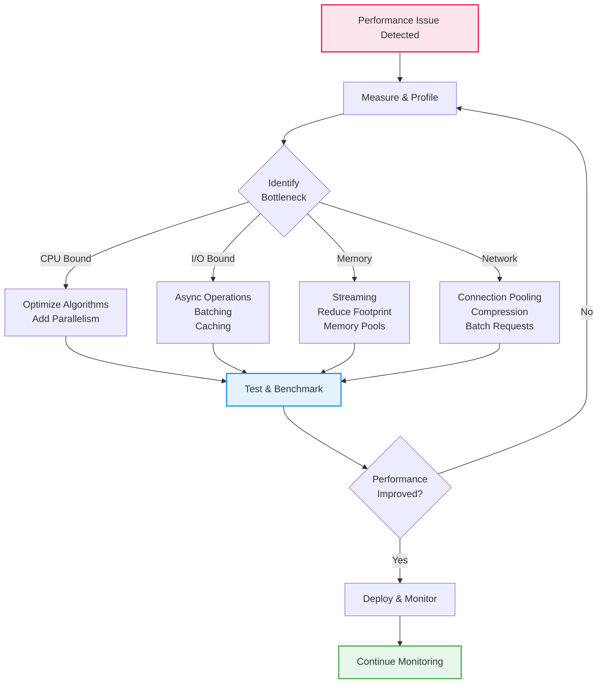
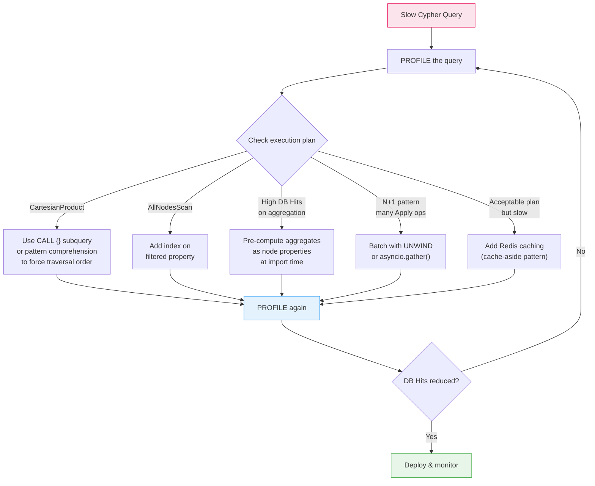

# ⚡ Performance Optimization Guide

> Strategies and techniques for optimizing Discogsography's performance at scale

## Overview

Processing 20+ million music records requires careful attention to performance. This guide covers optimization
strategies, bottleneck identification, and performance tuning across all services.

### Performance Optimization Flow


```mermaid
flowchart TD
    Start[Performance Issue Detected]

    Start --> Measure[Measure & Profile]

    Measure --> Identify{Identify<br/>Bottleneck}

    Identify -->|CPU Bound| CPU[Optimize Algorithms<br/>Add Parallelism]
    Identify -->|I/O Bound| IO[Async Operations<br/>Batching<br/>Caching]
    Identify -->|Memory| Memory[Streaming<br/>Reduce Footprint<br/>Memory Pools]
    Identify -->|Network| Network[Connection Pooling<br/>Compression<br/>Batch Requests]

    CPU --> Test[Test & Benchmark]
    IO --> Test
    Memory --> Test
    Network --> Test

    Test --> Compare{Performance<br/>Improved?}

    Compare -->|Yes| Monitor[Deploy & Monitor]
    Compare -->|No| Measure

    Monitor --> End[Continue Monitoring]

    style Start fill:#fce4ec,stroke:#e91e63,stroke-width:2px
    style End fill:#e8f5e9,stroke:#4caf50,stroke-width:2px
    style Test fill:#e3f2fd,stroke:#2196f3,stroke-width:2px
```

## 🎯 Performance Goals

| Metric                | Observed             | Optimization          |
| --------------------- | -------------------- | --------------------- |
| **XML Parsing**       | ~130-480 rec/s (e2e) | RabbitMQ backpressure |
| **Initial Load**      | ~2 days (parallel)   | Batch processing ✅   |
| **Update Run**        | ~26 hours (parallel) | SHA256 dedup ✅       |
| **API Response Time** | \<200ms              | Query complexity      |

> **Note**: ✅ indicates optimizations that are implemented and enabled by default.

> 📖 **For detailed Neo4j Cypher query optimization results**, see the [Query Performance Optimizations](query-performance-optimizations.md) report — documenting 11 optimization rounds that achieved a **249x overall improvement** (10.95s → 0.044s average across 88 endpoints).

## 🔍 Profiling & Monitoring

### Performance Profiling

```python
import cProfile
import pstats
from line_profiler import profile


# Function-level profiling
@profile
async def process_batch(items: list[dict]) -> None:
    # Processing logic
    pass


# Run with profiling
if __name__ == "__main__":
    cProfile.run("asyncio.run(main())", "profile_stats")

    # Analyze results
    stats = pstats.Stats("profile_stats")
    stats.sort_stats("cumulative")
    stats.print_stats(20)  # Top 20 functions
```

### Memory Profiling

```python
from memory_profiler import profile
import tracemalloc


# Decorator-based profiling
@profile
def memory_intensive_operation():
    # Large data processing
    pass


# Tracemalloc for detailed tracking
tracemalloc.start()
# ... operations ...
current, peak = tracemalloc.get_traced_memory()
logger.info(
    f"📊 Memory usage: current={current/1024/1024:.1f}MB, peak={peak/1024/1024:.1f}MB"
)
tracemalloc.stop()
```

### Real-time Monitoring

```python
import psutil
import asyncio


async def monitor_resources():
    """Monitor system resources."""
    process = psutil.Process()

    while True:
        cpu_percent = process.cpu_percent(interval=1)
        memory_info = process.memory_info()

        logger.info(
            f"📊 Resources: CPU={cpu_percent}%, Memory={memory_info.rss/1024/1024:.1f}MB"
        )

        await asyncio.sleep(30)  # Log every 30 seconds
```

## 🗄️ Neo4j Cypher Query Optimization

The API service executes Cypher queries against a Neo4j graph with ~33.8M nodes and ~134M relationships. Optimization was critical — the original queries averaged 10.95s; after 11 rounds they average 0.044s (249x improvement).

### Key Techniques


```mermaid
flowchart TD
    Problem[Slow Cypher Query]
    Profile[PROFILE the query]

    Problem --> Profile

    Profile --> Check{Check execution plan}

    Check -->|CartesianProduct| Fix1["Use CALL {} subquery<br/>or pattern comprehension<br/>to force traversal order"]
    Check -->|AllNodesScan| Fix2["Add index on<br/>filtered property"]
    Check -->|High DB Hits<br/>on aggregation| Fix3["Pre-compute aggregates<br/>as node properties<br/>at import time"]
    Check -->|N+1 pattern<br/>many Apply ops| Fix4["Batch with UNWIND<br/>or asyncio.gather()"]
    Check -->|Acceptable plan<br/>but slow| Fix5["Add Redis caching<br/>(cache-aside pattern)"]

    Fix1 --> Verify[PROFILE again]
    Fix2 --> Verify
    Fix3 --> Verify
    Fix4 --> Verify
    Fix5 --> Verify

    Verify --> Done{DB Hits reduced?}
    Done -->|Yes| Monitor[Deploy & monitor]
    Done -->|No| Profile

    style Problem fill:#fce4ec,stroke:#e91e63
    style Monitor fill:#e8f5e9,stroke:#4caf50
    style Verify fill:#e3f2fd,stroke:#2196f3
```

#### 1. CALL {} Subqueries to Control the Planner

The Neo4j planner can see through `WITH` barriers and choose unexpected plans (e.g., CartesianProduct scanning 16M releases instead of expanding from 1 genre node). CALL {} subqueries create stronger barriers:

```cypher
-- GOOD: forces genre-first expansion
MATCH (g:Genre {name: $name})
CALL {
    WITH g
    MATCH (g)<-[:IS]-(r:Release)
    WHERE r.year > 0
    RETURN r.year AS year, count(DISTINCT r) AS count
}
RETURN year, count ORDER BY year
```

#### 2. Pre-Computed Node Properties

For expensive aggregate queries that only change on data import, compute results during the graphinator post-import step and store as node properties:

```cypher
-- At import time: compute once
SET g.release_count = count, g.artist_count = count, ...

-- At query time: read properties (6 DB hits vs 200M)
MATCH (g:Genre {name: $name})
RETURN g.release_count, g.artist_count, g.label_count, g.style_count
```

#### 3. Relationship Type Filtering on shortestPath

Always specify explicit relationship types to limit BFS scope:

```cypher
-- 70s → 0.3s by excluding irrelevant relationship types
MATCH p = shortestPath((a)-[:BY|ON|IS|ALIAS_OF|MEMBER_OF|MASTER_OF|DERIVED_FROM*..6]-(b))
```

#### 4. Redis Cache-Aside Pattern

For queries that are expensive on first call but stable between data imports:

```python
# Check cache → query DB → store → return
cached = await redis.get(cache_key)
if cached:
    return json.loads(cached)
result = await run_query(...)
await redis.setex(cache_key, TTL_24H, json.dumps(result))
return result
```

#### 5. Batch Queries with asyncio.gather()

Replace N+1 query patterns with concurrent batch queries:

```python
# BAD: 200 sequential queries
for candidate in candidates:
    profile = await get_profile(candidate.id)

# GOOD: 4 concurrent dimension queries
genres, styles, labels, collabs = await asyncio.gather(
    batch_genre_query(candidate_ids),
    batch_style_query(candidate_ids),
    batch_label_query(candidate_ids),
    batch_collab_query(candidate_ids),
)
```

> 📖 See [Query Performance Optimizations](query-performance-optimizations.md) for the complete optimization report with per-endpoint measurements.

## 🚀 Optimization Strategies

### 1. XML Parsing Optimization

The extractor is written in Rust for maximum parsing performance. Key strategies:

- **Streaming parser**: Uses `quick-xml` for zero-copy streaming XML parsing
- **Deduplication**: SHA256 hashing prevents duplicate records
- **Batch publishing**: Messages are batched before publishing to RabbitMQ
- **Memory efficiency**: Elements are processed and discarded as they stream through

### 2. Message Queue Optimization

#### RabbitMQ Configuration

```python
# Optimal prefetch for consumers
PREFETCH_COUNT = 100  # Adjust based on processing speed
```

The extractor publishes to 4 fanout exchanges (one per data type). Each consumer independently declares its own queues and controls its prefetch count.

### 3. Database Optimization

#### Batch Processing (Implemented)

**Graphinator and Tableinator** now include built-in batch processing for optimal write performance:

```python
# Configured via environment variables (enabled by default)
# Code defaults shown; docker-compose.yml overrides to 500/2.0 for production
NEO4J_BATCH_MODE=true           # Enable batch processing
NEO4J_BATCH_SIZE=500            # Records per batch (docker-compose default)
NEO4J_BATCH_FLUSH_INTERVAL=2.0  # Seconds between flushes (docker-compose default)

POSTGRES_BATCH_MODE=true           # Enable batch processing
POSTGRES_BATCH_SIZE=500            # Records per batch (docker-compose default)
POSTGRES_BATCH_FLUSH_INTERVAL=2.0  # Seconds between flushes (docker-compose default)
```

**How it works:**

1. Messages are accumulated into batches
1. When batch reaches size limit OR time interval expires:
   - All records written in single database operation
   - Message acknowledgments sent after successful write
1. On shutdown, all pending batches are flushed

**Performance gains:**

- **3-5x faster** write throughput
- **Reduced database load** with fewer transactions
- **Better resource utilization** with fewer connections

**Tuning recommendations:**

```bash
# Initial data load (maximize throughput)
NEO4J_BATCH_SIZE=500
NEO4J_BATCH_FLUSH_INTERVAL=10.0
POSTGRES_BATCH_SIZE=500
POSTGRES_BATCH_FLUSH_INTERVAL=10.0

# Real-time updates (minimize latency)
NEO4J_BATCH_SIZE=10
NEO4J_BATCH_FLUSH_INTERVAL=1.0
POSTGRES_BATCH_SIZE=10
POSTGRES_BATCH_FLUSH_INTERVAL=1.0

# Balanced (docker-compose default - good for most use cases)
NEO4J_BATCH_SIZE=500
NEO4J_BATCH_FLUSH_INTERVAL=2.0
POSTGRES_BATCH_SIZE=500
POSTGRES_BATCH_FLUSH_INTERVAL=2.0
```

See [Configuration Guide](configuration.md#batch-processing-configuration) for complete details.

#### Neo4j Performance

```python
# 1. Batch operations with UNWIND (used internally by batch processor)
async def batch_create_nodes(tx, nodes: list[dict], batch_size: int = 1000):
    """Create nodes in batches."""
    query = """
    UNWIND $batch AS node
    CREATE (n:Artist {
        id: node.id,
        name: node.name,
        profile: node.profile
    })
    """

    for i in range(0, len(nodes), batch_size):
        batch = nodes[i : i + batch_size]
        await tx.run(query, batch=batch)


# 2. Constraint/index optimization
CREATE_INDEXES = [
    "CREATE CONSTRAINT artist_id IF NOT EXISTS FOR (a:Artist) REQUIRE a.id IS UNIQUE",
    "CREATE CONSTRAINT release_id IF NOT EXISTS FOR (r:Release) REQUIRE r.id IS UNIQUE",
    "CREATE CONSTRAINT label_id IF NOT EXISTS FOR (l:Label) REQUIRE l.id IS UNIQUE",
]

# 3. Connection pooling
driver = neo4j.AsyncGraphDatabase.driver(
    NEO4J_URI,
    auth=(NEO4J_USER, NEO4J_PASSWORD),
    max_connection_pool_size=50,
    connection_acquisition_timeout=30,
    max_transaction_retry_time=30,
)
```

#### PostgreSQL Performance

```python
# 1. Bulk inserts with COPY
async def bulk_insert_postgresql(conn, table: str, records: list[dict]):
    """Use COPY for bulk inserts."""
    # Convert to CSV format
    output = io.StringIO()
    writer = csv.DictWriter(output, fieldnames=records[0].keys())
    writer.writeheader()
    writer.writerows(records)
    output.seek(0)

    # Use COPY command
    await conn.copy_to_table(table, source=output, format="csv", header=True)


# 2. Prepared statements
async def insert_with_prepared(conn, records: list[dict]):
    """Use prepared statements for better performance."""
    stmt = await conn.prepare(
        """
        INSERT INTO artists (data_id, hash, data)
        VALUES ($1, $2, $3)
        ON CONFLICT (data_id) DO NOTHING
    """
    )

    # Execute in batches
    async with conn.transaction():
        for record in records:
            await stmt.fetch(record["id"], record["hash"], orjson.dumps(record["data"]))


# 3. Connection pooling
async def create_pool():
    return await asyncpg.create_pool(
        host=POSTGRES_HOST,
        port=POSTGRES_PORT,
        user=POSTGRES_USER,
        password=POSTGRES_PASSWORD,
        database=POSTGRES_DB,
        min_size=10,
        max_size=20,
        max_queries=50000,
        max_inactive_connection_lifetime=300,
    )
```

### 4. Async Optimization

#### Concurrent Processing

```python
# Process multiple queues concurrently
async def process_all_queues():
    """Process all queues concurrently."""
    tasks = [
        asyncio.create_task(process_queue("artists")),
        asyncio.create_task(process_queue("labels")),
        asyncio.create_task(process_queue("releases")),
        asyncio.create_task(process_queue("masters")),
    ]

    await asyncio.gather(*tasks)


# Semaphore for rate limiting
class RateLimiter:
    def __init__(self, max_concurrent: int):
        self.semaphore = asyncio.Semaphore(max_concurrent)

    async def __aenter__(self):
        await self.semaphore.acquire()

    async def __aexit__(self, *args):
        self.semaphore.release()


# Usage
rate_limiter = RateLimiter(max_concurrent=10)


async def process_with_limit(item):
    async with rate_limiter:
        await process_item(item)
```

### 5. Caching Strategies

#### In-Memory Caching

```python
from functools import lru_cache
from cachetools import TTLCache
import asyncio


# LRU cache for frequently accessed data
@lru_cache(maxsize=10000)
def get_artist_by_id(artist_id: str) -> dict:
    # Expensive database lookup
    return fetch_from_db(artist_id)


# TTL cache for time-sensitive data
cache = TTLCache(maxsize=1000, ttl=300)  # 5 minutes


async def get_cached_data(key: str) -> dict:
    if key in cache:
        return cache[key]

    data = await fetch_from_source(key)
    cache[key] = data
    return data


# Async cache with lock to prevent stampede
class AsyncCache:
    def __init__(self):
        self.cache = {}
        self.locks = {}

    async def get(self, key: str, factory):
        if key in self.cache:
            return self.cache[key]

        if key not in self.locks:
            self.locks[key] = asyncio.Lock()

        async with self.locks[key]:
            # Double-check after acquiring lock
            if key in self.cache:
                return self.cache[key]

            value = await factory()
            self.cache[key] = value
            return value
```

## 🏎️ Recent Performance Improvements

### Neo4j Rust Driver Extension (#173)

Switched to `neo4j-rust-ext`, a Rust-backed extension for the Neo4j Python driver, delivering up to 10x faster Bolt protocol handling. This is a drop-in replacement that accelerates serialization/deserialization between Python and the Neo4j wire protocol.

### Query Debug Profiling (#174)

Added query profiling infrastructure for both Cypher and SQL queries. The perftest suite now covers additional API endpoints and generates detailed latency reports (p50, p95, p99) with query plan inspection via `EXPLAIN`/`PROFILE`.

### Cypher Query Optimization (#175)

Optimized the 6 slowest Cypher queries identified by the profiling infrastructure, achieving 10-100x fewer database hits per query through better index usage, reduced relationship traversals, and more targeted `MATCH` patterns.

### Performance Testing

The `tests/perftest/` suite provides automated performance regression testing:

- **Configurable endpoints**: `tests/perftest/config.yaml` defines test entities and parameters
- **Statistical accuracy**: Each endpoint is called multiple times for reliable measurements
- **Containerized**: `tests/perftest/Dockerfile` for isolated test runs
- **Results tracking**: Historical results stored in `perftest-results/`

When adding new API endpoints that query Neo4j or PostgreSQL, add corresponding entries to the perftest configuration.

## 📊 Performance Metrics

### Key Metrics to Track

```python
from dataclasses import dataclass
from datetime import datetime
import time


@dataclass
class PerformanceMetrics:
    operation: str
    start_time: float
    end_time: float
    items_processed: int
    errors: int = 0

    @property
    def duration(self) -> float:
        return self.end_time - self.start_time

    @property
    def throughput(self) -> float:
        return self.items_processed / self.duration if self.duration > 0 else 0

    def log_metrics(self):
        logger.info(
            f"📊 Performance: {self.operation} - "
            f"Items: {self.items_processed}, "
            f"Duration: {self.duration:.2f}s, "
            f"Throughput: {self.throughput:.0f}/s, "
            f"Errors: {self.errors}"
        )


# Usage
async def process_with_metrics(items: list):
    metrics = PerformanceMetrics(
        operation="batch_processing",
        start_time=time.time(),
        end_time=0,
        items_processed=0,
    )

    try:
        for item in items:
            await process_item(item)
            metrics.items_processed += 1
    except Exception as e:
        metrics.errors += 1
        logger.error(f"❌ Processing error: {e}")
    finally:
        metrics.end_time = time.time()
        metrics.log_metrics()
```

## 🔧 Configuration Tuning

### System Configuration

```bash
# /etc/sysctl.conf - Linux kernel tuning
net.core.somaxconn = 65535
net.ipv4.tcp_max_syn_backlog = 65535
net.ipv4.ip_local_port_range = 1024 65535
net.ipv4.tcp_tw_reuse = 1
net.ipv4.tcp_fin_timeout = 15
fs.file-max = 2097152
```

### Docker Resource Limits

```yaml
# docker-compose.yml
services:
  extractor:
    deploy:
      resources:
        limits:
          cpus: '2.0'
          memory: 4G
        reservations:
          cpus: '1.0'
          memory: 2G
```

### Database Tuning

#### Neo4j Configuration

```properties
# neo4j.conf
dbms.memory.heap.initial_size=4g
dbms.memory.heap.max_size=4g
dbms.memory.pagecache.size=2g
dbms.connector.bolt.thread_pool_max_size=400
```

#### PostgreSQL Configuration

```sql
-- postgresql.conf
shared_buffers = 4GB
effective_cache_size = 12GB
maintenance_work_mem = 1GB
work_mem = 256MB
max_connections = 200
checkpoint_completion_target = 0.9
wal_buffers = 16MB
default_statistics_target = 100
random_page_cost = 1.1  # For SSD
```

## 🎯 Performance Checklist

Before deployment, ensure:

- [ ] XML parsing achieves >5000 records/second
- [ ] Message processing handles >3000 messages/second
- [x] **Database writes are batched** (✅ enabled by default with 500 records/batch)
- [x] **Batch processing configured** for Neo4j and PostgreSQL
- [ ] Connection pooling is configured for all services
- [x] **SHA256 hash indexes created** for all tables (✅ automatic on startup)
- [ ] Caching is implemented for frequently accessed data
- [ ] Resource limits are set in Docker Compose
- [ ] Monitoring is enabled for all services
- [ ] Memory leaks checked and fixed
- [ ] Batch processing parameters tuned for workload (optional)

## 📚 Tools & Resources

### Profiling Tools

- **py-spy**: Sampling profiler for Python
- **memory-profiler**: Line-by-line memory usage
- **cProfile**: Built-in Python profiler
- **asyncio-monitor**: Async task monitoring

### Monitoring Tools

- **Prometheus**: Metrics collection
- **Grafana**: Metrics visualization
- **htop**: System resource monitoring
- **iotop**: I/O monitoring

______________________________________________________________________

Remember: Measure first, optimize second. Focus on bottlenecks that matter! 🚀

**Last Updated**: 2026-03-20
