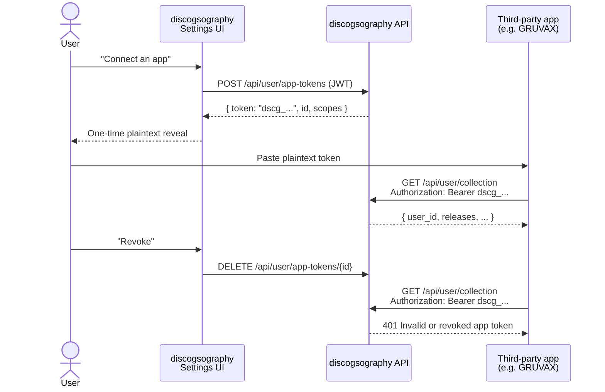

# GRUVAX v2.0 — discogsography integration contract

**Status:** v1 (stable as of 2026-05-26, milestone shipped in PRs #362–#366)
**Audience:** Engineers integrating third-party apps against discogsography. Drafted for [GRUVAX](https://github.com/SimplicityGuy/GRUVAX) v2.0; usable by any third-party caller that wants to read a single user's Discogs collection by delegation.
**Scope:** This document is the **cross-repo contract**. Any change to it requires coordinated rollout with all consumers. Internal refactors that don't alter request/response shape, status codes, headers, scopes, or auth semantics do **not** require a new version.

> Changes to this contract land in this repo via PRs that update both the implementation and this file in the same commit. Breaking changes require a new version — see [§9 Versioning](#9-versioning).

---

## 1. What this enables

Third-party apps (e.g. GRUVAX) can read a discogsography user's collection over HTTPS using a delegated, scoped, revocable **app token**. The user is in control: they mint the token from their own discogsography Account Settings, copy the plaintext exactly once, paste it into the third-party app, and can revoke it at any time. No first-party password or JWT ever leaves discogsography.



## 2. P1 spike outcome (catalog_number)

During implementation it was verified that:

- The three target endpoints (`/api/user/collection`, `/collection/stats`, `/collection/timeline`) already existed under first-party JWT auth at `api/routers/user.py`.
- `catalog_number` was **not stored anywhere on discogsography's side** prior to this milestone — though it was present in upstream data on both sides:
  - The Discogs API returns it as `labels[].catno` per collection item.
  - The Rust extractor preserves it through bulk-pipeline messages (`extractor/src/tests/normalize_tests.rs:304`).

Outcome chosen: **populate `catalog_number` from both writers (per-user sync + bulk graphinator)** using a generic `metadata` bag pattern, with **zero PG schema migrations**.

- Sync writer (`api/syncer.py`): builds `metadata = {"catalog_number": labels[0].catno}` when present. Same dict is written to:
  - `user_collections.metadata` JSONB (column already existed)
  - Neo4j Release node via `SET r += rel.metadata`
- Bulk writer (`graphinator/batch_processor.py`): same pattern on the Release MERGE cypher.
- Read path: `r.catalog_number` is returned by the collection / wantlist queries.

`SET r += {}` is a no-op, so a writer without catno never wipes the property a different writer may have set. Future per-release fields just add a key to the dict; no new cypher branch needed.

**Field on the wire:** `catalog_number` (string, nullable). Type-stable across writers.

## 3. Authentication

### 3.1 App token format

Plaintext token: `dscg_` + 32 random bytes encoded as base64url without padding (44 chars body, ~50 chars total).

```
dscg_7yA-Nq3PtV6m1k9_LpOcEx2gFw5Hr0sIuYj8RdMv1bAo
```

- The `dscg_` prefix is **public**. It exists so a leaked token in logs or screenshots is visually recognizable.
- The body has 256 bits of entropy (`secrets.token_urlsafe(32)`).
- Only the SHA-256 hex of the plaintext is persisted server-side (`token_hash VARCHAR(64)`).
- The plaintext is returned **exactly once** from `POST /api/user/app-tokens` and is never recoverable thereafter. Lost tokens must be re-minted.

### 3.2 Sending an app token

Standard HTTP Bearer:

```
Authorization: Bearer dscg_<token-body>
```

The same three endpoints also accept first-party JWTs in the same `Authorization: Bearer` header — discogsography routes by prefix. If the credential starts with `dscg_`, it's treated as an app token; otherwise it goes through the existing JWT validation flow. First-party clients are unaffected.

### 3.3 Scopes

| Scope            | Grants                                                          |
|------------------|-----------------------------------------------------------------|
| `collection:read`| Read the token owner's collection, stats, and timeline endpoints |

Scopes are a flat string array on the token. The mint endpoint validates against an `ALLOWED_SCOPES` allowlist on the server (`api/routers/app_tokens.py`); unknown scopes return 400.

### 3.4 Revocation

Tokens are revoked via `DELETE /api/user/app-tokens/{id}`. Revoked rows are **tombstones** — the row is never deleted, only `revoked_at` is set. The audit trail is preserved across re-mints. Subsequent requests with a revoked token return 401 with the same shape as an unknown token (no token-existence disclosure to non-owners).

## 4. Endpoints

All endpoints below are served by the discogsography API service. The user must be a registered discogsography user, and their Discogs collection must have been synced (via the discogsography first-party UI) for there to be any data.

### 4.1 Mint an app token

**`POST /api/user/app-tokens`** — first-party JWT only (user mints their own tokens via Settings UI).

Request:

```json
{
  "name": "GRUVAX kiosk",
  "scopes": ["collection:read"]
}
```

Response (201 Created):

```json
{
  "id": "11111111-1111-1111-1111-111111111111",
  "name": "GRUVAX kiosk",
  "scopes": ["collection:read"],
  "token": "dscg_7yA-Nq3PtV6m1k9_LpOcEx2gFw5Hr0sIuYj8RdMv1bAo",
  "created_at": "2026-05-26T14:33:01.234567+00:00"
}
```

The `token` field is the plaintext, returned **once**. Persist it client-side (e.g. as a per-profile setting). Do not log it.

Errors:
- `400 Bad Request` — `{"detail": "Unknown scope(s): foo"}` if any scope isn't in the allowlist
- `400 Bad Request` — `{"detail": "name must be non-empty"}` if name is whitespace-only
- `401 Unauthorized` — first-party JWT missing/invalid
- `422 Unprocessable Entity` — Pydantic validation (e.g. `scopes: []`)

### 4.2 List user's app tokens

**`GET /api/user/app-tokens`** — first-party JWT only.

Response (200 OK):

```json
{
  "active": [
    {
      "id": "11111111-1111-1111-1111-111111111111",
      "name": "GRUVAX kiosk",
      "scopes": ["collection:read"],
      "created_at": "2026-05-26T14:33:01.234567+00:00",
      "last_used_at": "2026-05-26T14:45:22.000000+00:00"
    }
  ],
  "revoked": [
    {
      "id": "22222222-2222-2222-2222-222222222222",
      "name": "old kiosk",
      "revoked_at": "2026-05-20T09:00:00.000000+00:00"
    }
  ]
}
```

The `token_hash` column is **never** returned.

### 4.3 Revoke an app token

**`DELETE /api/user/app-tokens/{id}`** — first-party JWT only.

Response: `204 No Content` on success.

Errors:
- `404 Not Found` — token does not exist, is owned by a different user, or is already revoked. The shape is identical for all three to avoid leaking token-existence information.

### 4.4 Read user's collection

**`GET /api/user/collection`** — accepts either app token (`collection:read`) or first-party JWT.

Query parameters:
- `limit` (int, default 50, range 1–200)
- `offset` (int, default 0)

Response (200 OK):

```json
{
  "user_id": "99999999-9999-9999-9999-999999999999",
  "releases": [
    {
      "id": "12345",
      "title": "Selected Ambient Works 85-92",
      "year": 1992,
      "catalog_number": "AMB LP3922",
      "artist": "Aphex Twin",
      "label": "Apollo",
      "genres": ["Electronic"],
      "styles": ["Ambient", "IDM"],
      "rating": 5,
      "date_added": "2024-08-15T20:14:00+00:00",
      "folder_id": 1
    }
  ],
  "total": 3000,
  "offset": 0,
  "limit": 50,
  "has_more": true
}
```

**Key fields for GRUVAX:**
- `user_id` — top-level string. The owner of the collection (resolved from the app token's row, never from the caller). GRUVAX should bind a profile to this identifier.
- `catalog_number` — nullable string. Populated from `labels[0].catno` on the Discogs source. Releases without a catalog number return `null`.

### 4.5 Read collection stats

**`GET /api/user/collection/stats`** — accepts either auth.

Response shape includes `user_id` at the top level alongside whatever stats fields the query returns. Exact fields are documented separately and may evolve; consumers should tolerate additional keys.

```json
{
  "user_id": "99999999-9999-9999-9999-999999999999",
  ...stats fields...
}
```

### 4.6 Read collection timeline

**`GET /api/user/collection/timeline`** — accepts either auth.

Query parameters:
- `bucket` (string, default `"year"`, allowed: `year` | `decade`)

Response includes `user_id` at the top level. Internal caching is keyed by `user_id` + `bucket` and serves identical content to repeat calls within the TTL.

## 5. OpenAPI fragment

```yaml
openapi: 3.1.0
info:
  title: discogsography — GRUVAX integration surface
  version: 1.0.0
servers:
  - url: https://discogsography.example.com  # replace per-deployment
components:
  securitySchemes:
    AppToken:
      type: http
      scheme: bearer
      bearerFormat: dscg_<base64url-32-bytes>
      description: |
        Third-party app token minted via POST /api/user/app-tokens.
        Same Authorization header accepts a first-party JWT, which discogsography
        routes through its existing user-auth flow.
  schemas:
    CollectionRelease:
      type: object
      required: [id, title]
      properties:
        id: { type: string }
        title: { type: string }
        year: { type: integer, nullable: true }
        catalog_number: { type: string, nullable: true }
        artist: { type: string, nullable: true }
        label: { type: string, nullable: true }
        genres: { type: array, items: { type: string } }
        styles: { type: array, items: { type: string } }
        rating: { type: integer, minimum: 0, maximum: 5 }
        date_added: { type: string, format: date-time, nullable: true }
        folder_id: { type: integer, nullable: true }
    CollectionResponse:
      type: object
      required: [user_id, releases, total, offset, limit, has_more]
      properties:
        user_id: { type: string, format: uuid }
        releases: { type: array, items: { $ref: '#/components/schemas/CollectionRelease' } }
        total: { type: integer }
        offset: { type: integer }
        limit: { type: integer }
        has_more: { type: boolean }
    Error:
      type: object
      properties:
        detail: { type: string }
paths:
  /api/user/collection:
    get:
      security: [{ AppToken: [] }]
      parameters:
        - in: query
          name: limit
          schema: { type: integer, default: 50, minimum: 1, maximum: 200 }
        - in: query
          name: offset
          schema: { type: integer, default: 0, minimum: 0 }
      responses:
        '200':
          description: OK
          content:
            application/json:
              schema: { $ref: '#/components/schemas/CollectionResponse' }
        '401': { description: Missing/invalid/revoked token, content: { application/json: { schema: { $ref: '#/components/schemas/Error' } } } }
        '403': { description: Token lacks required scope, content: { application/json: { schema: { $ref: '#/components/schemas/Error' } } } }
        '429': { description: Rate limit exceeded — see Retry-After header }
  /api/user/collection/stats:
    get:
      security: [{ AppToken: [] }]
      responses:
        '200': { description: OK }
        '401': { description: Missing/invalid/revoked token }
        '403': { description: Token lacks required scope }
        '429': { description: Rate limit exceeded }
  /api/user/collection/timeline:
    get:
      security: [{ AppToken: [] }]
      parameters:
        - in: query
          name: bucket
          schema: { type: string, enum: [year, decade], default: year }
      responses:
        '200': { description: OK }
        '401': { description: Missing/invalid/revoked token }
        '403': { description: Token lacks required scope }
        '429': { description: Rate limit exceeded }
```

## 6. Errors

All errors return `application/json` with shape `{"detail": "<message>"}` unless otherwise noted.

| Status | Cause                                                                  | Recovery                                            |
|--------|------------------------------------------------------------------------|-----------------------------------------------------|
| 401    | Missing `Authorization` header                                         | Send `Authorization: Bearer dscg_…`                 |
| 401    | Token has wrong prefix (not `dscg_` and not a valid JWT)                | Mint a fresh token                                  |
| 401    | Token is unknown (never existed)                                       | Mint a fresh token                                  |
| 401    | Token is revoked                                                       | User must mint a new token via Settings UI          |
| 403    | Token exists but lacks the required scope                              | Re-mint with broader scopes                         |
| 429    | Rate limit exceeded                                                    | Honour `Retry-After` (seconds), back off            |
| 5xx    | Server-side issue                                                      | Retry with exponential backoff                      |

The 401 responses are intentionally identical in shape across "missing", "wrong prefix", "unknown", and "revoked" to avoid disclosing token-existence information.

## 7. Rate limits

The three collection endpoints carry per-token rate limits:

- **60 requests / minute** per token
- **600 requests / hour** per token

Limits are keyed by `SHA-256(authorization_header)[:16]` — distinct tokens get distinct buckets; the plaintext never appears in slowapi telemetry. Unauthenticated requests fall back to client-IP keying.

A 429 response includes:
- `Retry-After: <seconds>` — how long to wait before retrying
- `X-RateLimit-Limit`, `X-RateLimit-Remaining`, `X-RateLimit-Reset` — informational (slowapi standard)

**Expected GRUVAX traffic budget:** a full sync of a 3000-item collection paged at 50/page is ~60 requests total. The hourly cap (600) allows ~10 full re-syncs per hour per token; the per-minute cap (60) protects against a runaway client. Real GRUVAX usage (1 nightly sync + a few manual presses) lands at <5% of either cap.

## 8. Mint / list / revoke flow for the user

The flow is fully self-service in the discogsography Settings UI (`/settings/apps` lives under the Account Settings pane in the explore service):

1. User signs in to discogsography.
2. Navigates to **Account Settings → Connected Apps**.
3. Clicks **Connect an app**, enters a friendly name (e.g. "GRUVAX kiosk"), selects scopes (currently just `collection:read`), clicks **Mint token**.
4. Plaintext is shown once with a Copy button and a prominent warning. The user copies it.
5. Clicks **Done** — plaintext is dropped from the UI DOM and the in-memory reference.
6. User pastes the plaintext into GRUVAX.
7. From the same Settings page, the user can see all active tokens (with `last_used_at` recency) and a tombstone list of past revoked tokens. **Revoke** is a one-click confirm.

No CLI or API-only path is currently exposed for minting — this is intentional: the one-time reveal is a UI concern.

## 9. Versioning

This contract is currently **v1**. Backwards-compatible changes (new optional fields, new error subcategories with same status codes) do not bump the version.

A new version is required for:
- Removing or renaming an existing field on a 2xx response
- Changing a request body shape in a non-additive way
- Adding a new required field to a request
- Changing the auth header format
- Changing the token-prefix format (`dscg_`)
- Tightening rate limits (loosening is backwards-compatible)
- Reducing a scope's grant

When a new version ships, the old version will be supported for at least one full release cycle (typically 30 days, longer if active third-party integrations are known). The new version is delivered side-by-side, e.g. under `/v2/api/user/collection`, until a migration window has passed.

## 10. Hand-off checklist for new integrations

Verify before going live:

- [ ] Sign in to discogsography. Connect an app. Copy the plaintext token. Confirm the plaintext is not visible after navigating away from the reveal screen.
- [ ] `curl -H 'Authorization: Bearer dscg_<token>' $API/api/user/collection` returns 200 with `user_id`, `releases`, `catalog_number` on items that have one.
- [ ] Revoke the token from Settings.
- [ ] Same curl now returns 401.
- [ ] Mint a token without `collection:read` scope is not currently possible (the only scope is `collection:read`) — but a token with no scopes is impossible (Pydantic 422). Verified.
- [ ] Hit the endpoint > 60 times in a minute with one token; observe 429 with `Retry-After`.
- [ ] Hit the endpoint with a different token; observe 200 (per-token buckets are independent).

## 11. References

- Implementation:
  - `api/app_tokens.py` — token mint, hash, require_app_token dependency
  - `api/routers/app_tokens.py` — POST/GET/DELETE management endpoints
  - `api/routers/user.py` — three collection endpoints
  - `api/dependencies.py` — `require_user_or_app_token`, `UnifiedAuth`
  - `api/limiter.py` — `bearer_token_key_func`
  - `api/syncer.py` — per-user sync writing `catalog_number` to PG metadata JSONB + Neo4j Release node
  - `graphinator/batch_processor.py` — bulk pipeline writing `catalog_number` to Release nodes
  - `api/queries/user_queries.py` — returns `catalog_number` on collection/wantlist
  - `schema-init/postgres_schema.py` — `app_tokens` table
  - `explore/static/index.html` + `explore/static/js/settings.js` — Settings UI

- Milestone PRs: #362 (schema), #363 (dependency), #364 (settings UI), #365 (collection auth + rate limits), #366 (catalog_number).
