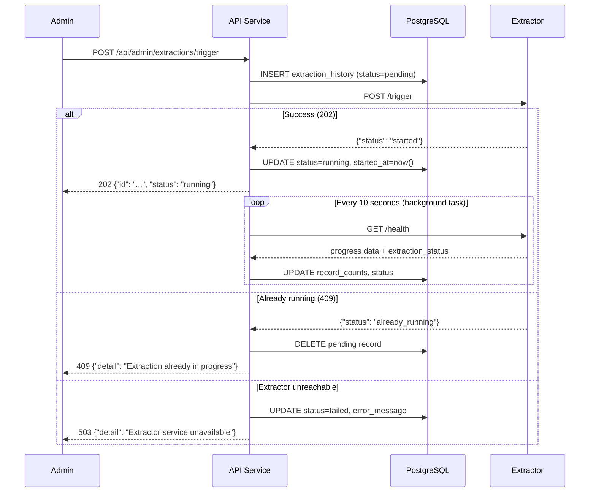

# Admin Dashboard Phase 1 — Design Spec

**Issue:** #104
**Scope:** Admin auth, extraction history, management actions (trigger extraction, purge DLQ)
**Date:** 2026-03-14

## Context

The existing Dashboard (port 8003) monitors real-time system state via WebSocket, but operators lack historical visibility and management actions. This phase adds admin-only endpoints to the API service for extraction history tracking and operational controls.

**Key distinction:** The `users` table stores Discogs user accounts (OAuth-linked). Admin users are platform operators stored in a separate `dashboard_admins` table.

## Database Schema

### `dashboard_admins` table

```sql
CREATE TABLE IF NOT EXISTS dashboard_admins (
    id UUID PRIMARY KEY DEFAULT gen_random_uuid(),
    email VARCHAR(255) UNIQUE NOT NULL,
    hashed_password VARCHAR(255) NOT NULL,
    is_active BOOLEAN DEFAULT TRUE,
    created_at TIMESTAMP WITH TIME ZONE DEFAULT NOW(),
    updated_at TIMESTAMP WITH TIME ZONE DEFAULT NOW()
);
```

### `extraction_history` table

```sql
CREATE TABLE IF NOT EXISTS extraction_history (
    id UUID PRIMARY KEY DEFAULT gen_random_uuid(),
    triggered_by UUID NOT NULL REFERENCES dashboard_admins(id),
    status VARCHAR(20) NOT NULL DEFAULT 'pending',
    started_at TIMESTAMP WITH TIME ZONE,
    completed_at TIMESTAMP WITH TIME ZONE,
    record_counts JSONB,
    error_message TEXT,
    extractor_version VARCHAR(50),
    created_at TIMESTAMP WITH TIME ZONE DEFAULT NOW()
);

CREATE INDEX IF NOT EXISTS idx_extraction_history_status ON extraction_history(status);
CREATE INDEX IF NOT EXISTS idx_extraction_history_created_at ON extraction_history(created_at DESC);
```

Note: `duration_seconds` is not stored — it is computed from `completed_at - started_at` at query time. `triggered_by` is NOT NULL because only admin-triggered extractions are recorded in this phase.

## API Endpoints

All admin endpoints live in `api/routers/admin.py`, mounted at `/api/admin`.

### Auth (public, rate-limited)

| Method | Path | Description | Rate Limit |
|--------|------|-------------|------------|
| `POST` | `/api/admin/auth/login` | Returns JWT with `"type": "admin"` claim | 5/minute |
| `POST` | `/api/admin/auth/logout` | Blacklists token jti in Redis | — |

### Protected (require `require_admin` dependency)

| Method | Path | Description |
|--------|------|-------------|
| `GET` | `/api/admin/extractions` | List extraction history (paginated, newest first) |
| `GET` | `/api/admin/extractions/{id}` | Single extraction detail |
| `POST` | `/api/admin/extractions/trigger` | Trigger new extraction |
| `POST` | `/api/admin/dlq/purge/{queue}` | Purge a dead-letter queue |

### Pagination

`GET /api/admin/extractions` accepts `offset` (default 0) and `limit` (default 20, max 100) query parameters. Response includes `total` count for client-side pagination.

## Authentication Design

### Separate from Discogs users

Admin auth reuses the same cryptographic primitives from `api/auth.py` (PBKDF2-SHA256 hashing, HS256 JWT signing) but is logically separate:

- JWT tokens include `"type": "admin"` claim to distinguish from user tokens
- Token jti uses `admin:` prefix in Redis blacklist (e.g., `revoked:jti:admin:{jti}`)
- `require_admin()` dependency lives in `api/dependencies.py` (alongside existing `require_user`). It validates the JWT, checks `"type": "admin"` claim, and checks revocation against the `admin:`-prefixed key
- `api/admin_auth.py` handles only admin-specific auth logic: password verification against `dashboard_admins`, JWT creation with admin type claim
- Admin login **must check `is_active`** and reject inactive admins with 401

### Token isolation

To prevent admin tokens from being accepted by regular user endpoints:
- The existing `_get_current_user` function must reject tokens with `"type": "admin"` — this is a required modification to `api/api.py`
- Similarly, `require_admin` rejects tokens without `"type": "admin"`
- This ensures complete separation between the two auth domains

### Admin seeding

New CLI tool `admin-setup` (follows `discogs-setup` pattern in `api/setup.py`):
- Uses argparse with `--email` and `--password` flags (consistent with `discogs-setup` using CLI arguments)
- Supports `--list` flag to show existing admins (email + active status, no passwords)
- Hashes password with PBKDF2-SHA256
- Inserts into `dashboard_admins`
- Can be run multiple times to add additional admins

Entry point: `[project.scripts] admin-setup = "api.admin_setup:main"`

## Extraction Trigger Flow



### Background tracking

After a successful trigger, the API spawns an `asyncio.Task` that:
1. Polls `GET http://{extractor_host}:{extractor_port}/health` every 10 seconds
2. Updates `extraction_history.record_counts` with progress data from the health response
3. Detects completion via the `extraction_status` field in the health response (see Extractor Changes below)
4. On completion: sets `status=completed`, `completed_at=now()`
5. On failure: sets `status=failed`, records `error_message`
6. Handles extractor becoming unreachable — sets `status=failed` after 5 consecutive timeouts

The task is tracked in a dict (similar to `_running_syncs` pattern in `api/routers/sync.py`) and cancelled on service shutdown.

**Constraint:** This design assumes a single API instance triggers and tracks extractions. Multiple API instances would need coordination (e.g., via Redis locking). This is acceptable for the current single-instance deployment.

## Extractor Changes (Rust)

### New endpoint: `POST /trigger`

Added to the existing health HTTP server (no new dependencies):

- **202 Accepted** — `{"status": "started"}` if no extraction is running; signals the main extraction loop via an `Arc<AtomicBool>` trigger flag
- **409 Conflict** — `{"status": "already_running"}` if extraction is in progress

The main extraction loop checks the trigger flag between idle cycles. When set, it starts a new extraction run using the existing pipeline.

### Extended `/health` endpoint

The health response must be extended with an `extraction_status` field so the API's background tracker can detect extraction lifecycle transitions:

- `"extraction_status": "idle"` — no extraction running
- `"extraction_status": "running"` — extraction in progress
- `"extraction_status": "completed"` — last extraction finished successfully
- `"extraction_status": "failed"` — last extraction failed

This is a **required change** to the existing health endpoint. The existing `extraction_progress` counts and `last_extraction_time` fields are preserved.

## DLQ Purge

`POST /api/admin/dlq/purge/{queue}`:

1. Validates `queue` against a whitelist of known DLQ names derived from `common/config.py` constants:
   - `graphinator-{data_type}-dlq` (4 queues)
   - `tableinator-{data_type}-dlq` (4 queues)
2. Calls `DELETE /api/queues/%2f/{queue}/contents` on the RabbitMQ management API (using credentials from `ApiConfig`)
3. Returns `{"queue": "...", "messages_purged": N}`
4. Unknown queue names return `404`
5. **Audit logging:** Each purge is logged via structured logging with admin email, queue name, and message count purged. A persistent `admin_audit_log` table is out of scope for this phase.

## File Changes

### New files

| File | Purpose |
|------|---------|
| `api/routers/admin.py` | Admin router: auth + extraction history + DLQ purge endpoints |
| `api/admin_auth.py` | Admin auth utils: password verification, JWT creation with admin type |
| `api/admin_setup.py` | CLI tool for seeding admin accounts |
| `tests/api/test_admin_auth.py` | Admin auth tests |
| `tests/api/test_admin_extractions.py` | Extraction history + trigger tests |
| `tests/api/test_admin_dlq.py` | DLQ purge tests |

### Modified files

| File | Change |
|------|--------|
| `api/api.py` | Register admin router; reject admin tokens in `_get_current_user` |
| `api/dependencies.py` | Add `require_admin()` dependency |
| `api/models.py` | Add Pydantic models for admin request/response types |
| `common/config.py` | Add `extractor_host`/`extractor_port` and `rabbitmq_username`/`rabbitmq_password`/`rabbitmq_management_host` to `ApiConfig` |
| `schema-init/postgres_schema.py` | Add `dashboard_admins` and `extraction_history` tables |
| `extractor/src/health.rs` (or equivalent) | Add `POST /trigger` endpoint; extend `/health` with `extraction_status` field |
| `api/pyproject.toml` | Add `admin-setup` script entry point |

## Testing Strategy

- **Unit tests:** Admin auth (login with active/inactive checks, JWT validation, require_admin dependency, token isolation from user endpoints), extraction history CRUD, DLQ queue name validation
- **Integration tests:** Full trigger flow with mocked extractor responses, background tracking task lifecycle
- **Extractor tests:** Trigger endpoint responses (202/409), trigger flag synchronization, health response with extraction_status

## Out of Scope (Future Phases)

- User activity statistics panel
- Storage utilization panel
- Queue health trends over time
- System health / uptime history
- Linking Discogs users to admin accounts
- Admin UI (frontend) — this phase is API-only
- Persistent admin audit log table
