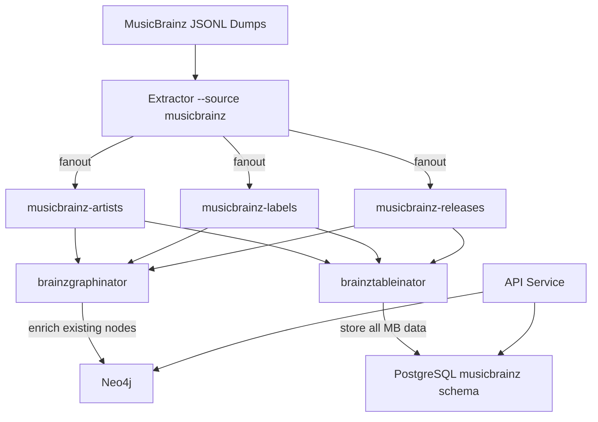

# MusicBrainz Integration Design Spec

**Issue**: #168
**Date**: 2026-03-25
**Status**: Approved

## Overview

Integrate MusicBrainz (MB) data into the Discogsography platform by extending the existing extractor/consumer architecture. The MB JSONL database dumps are parsed by a new extractor mode and published to dedicated fanout exchanges. Two new consumer services — brainzgraphinator (Neo4j) and brainztableinator (PostgreSQL) — write enrichments and store MB data.

This follows the established architectural pattern: extractor parses raw data and publishes messages, consumers write to their respective databases.

## Architecture



**Key architectural decisions:**

- **Two extractor instances** in Docker — one configured for Discogs (`--source discogs`), one for MusicBrainz (`--source musicbrainz`). Same binary, different mode.
- **Three fanout exchanges**: `musicbrainz-artists`, `musicbrainz-labels`, `musicbrainz-releases`. Relationships are included inline with entity messages (MB JSONL dumps already structure them this way).
- **Two consumer services**: brainzgraphinator writes to Neo4j, brainztableinator writes to PostgreSQL. Mirrors the existing graphinator/tableinator split for independent scaling and failure isolation.
- **Extractor-side Discogs ID matching**: The extractor parses Discogs URLs from MB entity URL relationships and includes `discogs_artist_id` / `discogs_label_id` / `discogs_release_id` in messages. Consumers receive pre-matched data.
- **Neo4j: enrich existing nodes only**: brainzgraphinator skips entities without a Discogs match. No stub nodes created for MB-only entities. This is a deliberate scope decision — the primary value is enriching the existing Discogs graph, not building a parallel MB graph. See "Known Limitations" for rationale.
- **PostgreSQL: store everything**: brainztableinator stores all MB entities in a dedicated `musicbrainz` schema, including those without Discogs matches. This provides a complete MB data store for analytics and future use.

## Extractor Changes (Rust)

### New CLI argument

```
--source <discogs|musicbrainz>  (default: discogs)
```

When `--source musicbrainz`:
- Downloads MB JSONL dumps (xz-compressed, one file per entity type)
- Parses each line as a self-contained JSON object
- Extracts Discogs IDs from URL relationships
- Publishes to `musicbrainz-*` fanout exchanges

### Environment variables

| Variable | Default | Description |
|----------|---------|-------------|
| `MUSICBRAINZ_ROOT` | `/musicbrainz-data` | Directory for downloaded MB dumps |
| `AMQP_EXCHANGE_PREFIX` | `musicbrainz` | Exchange name prefix (overrides default `discogsography`) |

### JSONL parsing

MB JSONL dumps contain one JSON object per line. Example artist record:

```json
{
  "id": "mbid-uuid",
  "name": "Artist Name",
  "sort-name": "Name, Artist",
  "type": "Group",
  "gender": null,
  "life-span": {"begin": "1962", "end": null, "ended": false},
  "area": {"name": "London"},
  "begin-area": {"name": "Liverpool"},
  "disambiguation": "the Beatles, not the insects",
  "aliases": [{"name": "ビートルズ", "locale": "ja"}],
  "tags": [{"name": "rock", "count": 42}],
  "relations": [
    {
      "type": "member of band",
      "target": {"id": "target-mbid", "name": "Target Artist"},
      "begin": "1960",
      "end": "1970",
      "attributes": ["guitar"]
    }
  ],
  "url-rels": [
    {"type": "discogs", "url": {"resource": "https://www.discogs.com/artist/108713"}},
    {"type": "wikipedia", "url": {"resource": "https://en.wikipedia.org/wiki/The_Beatles"}}
  ]
}
```

### Discogs ID extraction

The extractor parses `url-rels` entries where `type == "discogs"`:
- Extracts the numeric ID from the URL path: `/artist/108713` -> `108713`
- Includes it in the published message as `discogs_artist_id` (or `discogs_label_id`, `discogs_release_id`)
- For relationships, the target entity's Discogs ID is resolved by looking up the target MBID in the same JSONL file (since the dump contains all artists). The extractor builds an in-memory MBID→Discogs ID map during a first pass, then uses it to resolve relationship targets during the publish pass. If the target has no Discogs URL, the relationship's `target_discogs_id` is set to `null`.
- Entities without a Discogs URL are still published (brainztableinator stores all; brainzgraphinator skips)

### Message format

Same envelope pattern as Discogs messages:

**Data message:**
```json
{
  "type": "data",
  "id": "mbid-uuid",
  "sha256": "computed-from-jsonl-line",
  "discogs_artist_id": 108713,
  "name": "Artist Name",
  "mb_type": "Group",
  "gender": null,
  "life_span": {"begin": "1962", "end": null, "ended": false},
  "area": "London",
  "begin_area": "Liverpool",
  "disambiguation": "the Beatles, not the insects",
  "aliases": [...],
  "tags": [...],
  "relations": [...],
  "external_links": [
    {"service": "wikipedia", "url": "https://en.wikipedia.org/wiki/The_Beatles"},
    {"service": "wikidata", "url": "https://www.wikidata.org/wiki/Q1299"}
  ]
}
```

**File complete / extraction complete messages:** Same structure as Discogs equivalents with `data_type` values of `artists`, `labels`, `releases`.

### State markers

New version-specific markers: `.mb_extraction_status_{version}.json`
- Same state machine as Discogs: `pending` -> `in_progress` -> `completed` / `failed`
- Separate from Discogs markers — two extractors track progress independently
- Version derived from the MB dump date

### Docker

A second extractor container in `docker-compose.yml`:

```yaml
extractor-musicbrainz:
  build:
    context: .
    dockerfile: extractor/Dockerfile
  image: discogsography/extractor:latest
  container_name: discogsography-extractor-musicbrainz
  hostname: extractor-musicbrainz
  command: ["--source", "musicbrainz"]
  environment:
    MUSICBRAINZ_ROOT: /musicbrainz-data
    AMQP_EXCHANGE_PREFIX: musicbrainz
    LOG_LEVEL: INFO
    # RabbitMQ connection vars...
  depends_on:
    rabbitmq:
      condition: service_healthy
  volumes:
    - musicbrainz_data:/musicbrainz-data
    - extractor_mb_logs:/logs
  healthcheck:
    test: ["CMD", "curl", "-sf", "http://localhost:8000/health"]
    # ...
```

## Brainztableinator (PostgreSQL)

### PostgreSQL Schema

Created by schema-init in a dedicated `musicbrainz` schema:

```sql
CREATE SCHEMA IF NOT EXISTS musicbrainz;

-- Core entity tables
CREATE TABLE IF NOT EXISTS musicbrainz.artists (
    mbid UUID PRIMARY KEY,
    name TEXT NOT NULL,
    sort_name TEXT,
    type TEXT,                  -- Person, Group, Orchestra, Choir, Character, Other
    gender TEXT,
    begin_date TEXT,            -- partial dates: "1962", "1962-06", "1962-06-18"
    end_date TEXT,
    ended BOOLEAN DEFAULT FALSE,
    area TEXT,
    begin_area TEXT,
    end_area TEXT,
    disambiguation TEXT,
    discogs_artist_id INTEGER,  -- NULL if no Discogs match
    aliases JSONB,
    tags JSONB,
    data JSONB,                 -- full raw MB record
    created_at TIMESTAMPTZ DEFAULT NOW(),
    updated_at TIMESTAMPTZ DEFAULT NOW()
);

CREATE TABLE IF NOT EXISTS musicbrainz.labels (
    mbid UUID PRIMARY KEY,
    name TEXT NOT NULL,
    type TEXT,
    label_code INTEGER,
    begin_date TEXT,
    end_date TEXT,
    ended BOOLEAN DEFAULT FALSE,
    area TEXT,
    disambiguation TEXT,
    discogs_label_id INTEGER,
    data JSONB,
    created_at TIMESTAMPTZ DEFAULT NOW(),
    updated_at TIMESTAMPTZ DEFAULT NOW()
);

CREATE TABLE IF NOT EXISTS musicbrainz.releases (
    mbid UUID PRIMARY KEY,
    name TEXT NOT NULL,
    barcode TEXT,
    status TEXT,
    release_group_mbid UUID,
    discogs_release_id INTEGER,
    data JSONB,
    created_at TIMESTAMPTZ DEFAULT NOW(),
    updated_at TIMESTAMPTZ DEFAULT NOW()
);

-- Relationships (all types in one table)
CREATE TABLE IF NOT EXISTS musicbrainz.relationships (
    id SERIAL PRIMARY KEY,
    source_mbid UUID NOT NULL,
    target_mbid UUID NOT NULL,
    source_entity_type TEXT NOT NULL,   -- 'artist', 'label', 'release'
    target_entity_type TEXT NOT NULL,
    relationship_type TEXT NOT NULL,    -- 'collaboration', 'member of band', etc.
    begin_date TEXT,
    end_date TEXT,
    ended BOOLEAN DEFAULT FALSE,
    attributes JSONB,                  -- instrument, vocal type, etc.
    created_at TIMESTAMPTZ DEFAULT NOW(),
    UNIQUE (source_mbid, target_mbid, relationship_type)
);

-- External links (Wikipedia, Wikidata, AllMusic, etc.)
CREATE TABLE IF NOT EXISTS musicbrainz.external_links (
    id SERIAL PRIMARY KEY,
    mbid UUID NOT NULL,
    entity_type TEXT NOT NULL,          -- 'artist', 'label', 'release'
    service_name TEXT NOT NULL,         -- 'wikipedia', 'wikidata', 'allmusic', 'lastfm', 'imdb'
    url TEXT NOT NULL,
    created_at TIMESTAMPTZ DEFAULT NOW(),
    UNIQUE (mbid, entity_type, service_name)
);
```

### Indexes

```sql
-- Cross-reference indexes (critical for Discogs matching)
CREATE INDEX IF NOT EXISTS idx_mb_artists_discogs_id ON musicbrainz.artists (discogs_artist_id) WHERE discogs_artist_id IS NOT NULL;
CREATE INDEX IF NOT EXISTS idx_mb_labels_discogs_id ON musicbrainz.labels (discogs_label_id) WHERE discogs_label_id IS NOT NULL;
CREATE INDEX IF NOT EXISTS idx_mb_releases_discogs_id ON musicbrainz.releases (discogs_release_id) WHERE discogs_release_id IS NOT NULL;

-- Name search
CREATE INDEX IF NOT EXISTS idx_mb_artists_name ON musicbrainz.artists (name);
CREATE INDEX IF NOT EXISTS idx_mb_labels_name ON musicbrainz.labels (name);

-- Relationship lookups
CREATE INDEX IF NOT EXISTS idx_mb_rels_source ON musicbrainz.relationships (source_mbid);
CREATE INDEX IF NOT EXISTS idx_mb_rels_target ON musicbrainz.relationships (target_mbid);
CREATE INDEX IF NOT EXISTS idx_mb_rels_type ON musicbrainz.relationships (relationship_type);

-- External link lookups
CREATE INDEX IF NOT EXISTS idx_mb_links_mbid ON musicbrainz.external_links (mbid);
CREATE INDEX IF NOT EXISTS idx_mb_links_service ON musicbrainz.external_links (service_name);
```

### Service details

| Property | Value |
|----------|-------|
| Directory | `brainztableinator/` |
| Health port | 8010 |
| Queue prefix | `musicbrainz-brainztableinator` |
| Batch mode | Configurable via `POSTGRES_BATCH_MODE` |
| Write semantics | `INSERT ... ON CONFLICT (mbid) DO UPDATE` (idempotent) |

Follows tableinator's patterns: `AsyncPostgreSQLPool` from common, batch processor support, DLQ/DLX per queue, health endpoint with processing metrics.

## Brainzgraphinator (Neo4j)

### Core behavior

For each message:
1. Check if `discogs_artist_id` (or label/release equivalent) is present
2. If absent: log at DEBUG, ack message, skip
3. If present: enrich the existing Discogs node with MB metadata and relationships

### Metadata enrichment

New properties on existing nodes, prefixed with `mb_` to distinguish from Discogs data:

```cypher
-- Artist enrichment
MATCH (a:Artist {id: $discogs_artist_id})
SET a.mbid = $mbid,
    a.mb_type = $type,
    a.mb_gender = $gender,
    a.mb_begin_date = $begin_date,
    a.mb_end_date = $end_date,
    a.mb_area = $area,
    a.mb_begin_area = $begin_area,
    a.mb_end_area = $end_area,
    a.mb_disambiguation = $disambiguation,
    a.mb_updated_at = datetime()

-- Label enrichment
MATCH (l:Label {id: $discogs_label_id})
SET l.mbid = $mbid,
    l.mb_type = $type,
    l.mb_label_code = $label_code,
    l.mb_begin_date = $begin_date,
    l.mb_end_date = $end_date,
    l.mb_area = $area,
    l.mb_updated_at = datetime()

-- Release enrichment
MATCH (r:Release {id: $discogs_release_id})
SET r.mbid = $mbid,
    r.mb_barcode = $barcode,
    r.mb_status = $status,
    r.mb_updated_at = datetime()
```

### Relationship edges

New Neo4j edge types from MB artist-artist relationships:

| MB Relationship Type | Neo4j Edge | Direction | Properties |
|---|---|---|---|
| member of band | `MEMBER_OF` (enrich existing) | person -> group | begin_date, end_date, attributes |
| collaboration | `COLLABORATED_WITH` | artist <-> artist | begin_date, end_date |
| teacher | `TAUGHT` | teacher -> student | begin_date, end_date |
| tribute | `TRIBUTE_TO` | tribute act -> original | — |
| founder | `FOUNDED` | person -> group | begin_date |
| supporting musician | `SUPPORTED` | supporter -> main artist | attributes (instrument) |
| subgroup | `SUBGROUP_OF` | subgroup -> parent | — |
| artist rename | `RENAMED_TO` | old -> new | begin_date |

**Both sides must have a Discogs match** in the graph. If either side lacks a `discogs_*_id`, the relationship is skipped. This is logged at DEBUG level with a counter exposed on the health endpoint.

```cypher
-- Example: collaboration edge
MATCH (a1:Artist {id: $source_discogs_id})
MATCH (a2:Artist {id: $target_discogs_id})
MERGE (a1)-[r:COLLABORATED_WITH]->(a2)
SET r.mbid = $link_mbid,
    r.begin_date = $begin_date,
    r.end_date = $end_date,
    r.attributes = $attributes,
    r.source = 'musicbrainz'
```

All MB-sourced edges carry `source: 'musicbrainz'` to distinguish from Discogs-sourced relationships.

### New Neo4j indexes

Added to schema-init:

```cypher
CREATE INDEX artist_mbid IF NOT EXISTS FOR (a:Artist) ON (a.mbid)
CREATE INDEX label_mbid IF NOT EXISTS FOR (l:Label) ON (l.mbid)
CREATE INDEX release_mbid IF NOT EXISTS FOR (r:Release) ON (r.mbid)
```

### Service details

| Property | Value |
|----------|-------|
| Directory | `brainzgraphinator/` |
| Health port | 8011 |
| Queue prefix | `musicbrainz-brainzgraphinator` |
| Batch mode | Configurable via `NEO4J_BATCH_MODE` |
| Write semantics | `MATCH ... SET` (idempotent) + `MERGE` for edges |

### Health endpoint metrics

```json
{
  "status": "healthy",
  "service": "brainzgraphinator",
  "stats": {
    "messages_processed": 150000,
    "entities_enriched": 95000,
    "entities_skipped_no_discogs_match": 55000,
    "relationships_created": 42000,
    "relationships_skipped_missing_side": 18000,
    "last_message_at": "2026-03-25T14:30:00Z"
  }
}
```

## API Endpoints (Phase 5)

New router: `api/routers/musicbrainz.py`

### `GET /api/artist/{id}/musicbrainz`

Returns MB metadata for a Discogs artist. Source: Neo4j.

```json
{
  "discogs_id": 108713,
  "mbid": "b10bbbfc-cf9e-42e0-be17-e2c3e1d2600d",
  "type": "Group",
  "gender": null,
  "begin_date": "1960",
  "end_date": "1970",
  "area": "London",
  "begin_area": "Liverpool",
  "disambiguation": "the Beatles, not the insects"
}
```

Returns 404 if the artist has no MB data.

### `GET /api/artist/{id}/relationships`

Returns MB-sourced relationships for a Discogs artist. Source: Neo4j.

```json
{
  "discogs_id": 108713,
  "relationships": [
    {
      "type": "MEMBER_OF",
      "target": {"discogs_id": 26557, "name": "John Lennon"},
      "direction": "incoming",
      "begin_date": "1960",
      "end_date": "1970",
      "attributes": ["guitar", "vocals"]
    }
  ]
}
```

### `GET /api/artist/{id}/external-links`

Returns external links for a Discogs artist. Source: PostgreSQL (`musicbrainz.external_links`).

```json
{
  "discogs_id": 108713,
  "links": [
    {"service": "wikipedia", "url": "https://en.wikipedia.org/wiki/The_Beatles"},
    {"service": "wikidata", "url": "https://www.wikidata.org/wiki/Q1299"},
    {"service": "allmusic", "url": "https://www.allmusic.com/artist/mn0000754032"},
    {"service": "lastfm", "url": "https://www.last.fm/music/The+Beatles"}
  ]
}
```

### `GET /api/enrichment/status`

Returns enrichment coverage statistics. Source: both databases.

```json
{
  "musicbrainz": {
    "artists": {"total_mb": 2100000, "matched_to_discogs": 950000, "enriched_in_neo4j": 950000},
    "labels": {"total_mb": 180000, "matched_to_discogs": 85000, "enriched_in_neo4j": 85000},
    "releases": {"total_mb": 3200000, "matched_to_discogs": 1400000, "enriched_in_neo4j": 1400000},
    "relationships": {"total_in_mb": 5000000, "created_in_neo4j": 420000},
    "last_import": "2026-03-25T02:00:00Z"
  }
}
```

## Phase 6: Incremental Sync

MB publishes new JSONL dumps twice weekly (Wednesdays and Saturdays).

**Strategy**: Re-run the MB extractor with the latest dump. The state marker system detects a new version and triggers a full reprocess. Both consumers use idempotent write semantics (`ON CONFLICT UPDATE` for PostgreSQL, `MATCH ... SET` + `MERGE` for Neo4j), so re-importing the full dump is safe and correct.

No delta detection is needed initially. This is intentionally simple — the existing state marker pattern already handles "new version -> reprocess."

A future optimization could compare dump file checksums or record-level SHA256 hashes to skip unchanged entities.

## Implementation Phases

| Phase | Scope | Dependencies | Key Deliverables |
|-------|-------|-------------|-----------------|
| **1** | Extractor: MB JSONL support | None | Rust JSONL parser, `--source musicbrainz` CLI, 3 fanout exchanges, Discogs ID extraction, state markers, Docker config for second extractor instance |
| **2** | Schema + brainztableinator | Phase 1 | `musicbrainz` PostgreSQL schema in schema-init, brainztableinator service, tests, CI, Docker |
| **3** | Brainzgraphinator — metadata | Phase 1 | brainzgraphinator service, MBID + metadata enrichment on existing nodes, new Neo4j indexes, tests, CI, Docker |
| **4** | Brainzgraphinator — relationships | Phase 3 | New Neo4j edge types, skip-if-unmapped logic with logging, tests |
| **5** | API endpoints | Phases 2 + 3 + 4 | `api/routers/musicbrainz.py`, 4 new endpoints, tests |
| **6** | Incremental sync | Phase 1 | Periodic re-import support, version detection, documentation |

Phases 2 and 3 can be parallelized (independent database targets). Phase 4 depends on 3. Phase 5 depends on 2+3+4. Phase 6 is independent follow-up.

## Service Port Summary

| Service | Health Port |
|---------|-------------|
| brainztableinator | 8010 |
| brainzgraphinator | 8011 |

## Known Limitations

### Neo4j: Discogs-matched entities only

brainzgraphinator only enriches entities that already exist in the Discogs graph. MB entities without a Discogs URL match are skipped entirely in Neo4j. **Rationale**: The primary value of this integration is enriching the existing knowledge graph with metadata and relationships that Discogs doesn't provide. Creating stub nodes for MB-only entities would introduce nodes with no Discogs data, no releases, and no existing graph connections — low value for users browsing Discogs collections. The PostgreSQL side stores all MB data for analytics and future use. This decision can be revisited if coverage gaps prove problematic.

### Relationships require both sides matched

New Neo4j relationship edges (COLLABORATED_WITH, TAUGHT, etc.) are only created when both the source and target entity have a Discogs match in the graph. A relationship where one side is MB-only is skipped. The health endpoint tracks skip counts for monitoring coverage.

### No INFLUENCED_BY relationships

MusicBrainz does **not** have an influence relationship type. The original issue #168 documents this clearly. Issue #116 (Influence Chain Explorer) needs alternative data sources (Wikidata P737 property, AllMusic, community contribution, or inference from collaboration/genre patterns).

### No hourly replication

The initial implementation uses full dump re-import (twice weekly) rather than MusicBrainz's hourly replication packets. Replication is more complex (requires tracking replication sequence numbers and applying incremental SQL-like changes) and is deferred to a future issue.

## Acceptance Criteria

- [ ] Extractor parses MB JSONL dumps and publishes to 3 fanout exchanges
- [ ] Discogs IDs correctly extracted from MB URL relationships
- [ ] brainztableinator stores all MB data in `musicbrainz` PostgreSQL schema
- [ ] brainzgraphinator enriches existing Neo4j nodes with MB metadata
- [ ] New relationship edge types created for matched entities
- [ ] All MB-sourced properties prefixed with `mb_` on Neo4j nodes
- [ ] All MB-sourced edges carry `source: 'musicbrainz'`
- [ ] Idempotent writes — re-importing a dump produces same result
- [ ] Health endpoints report enrichment/skip metrics
- [ ] API endpoints expose MB metadata, relationships, and external links
- [ ] Enrichment status endpoint shows coverage statistics
- [ ] >=80% test coverage for both new services
- [ ] CI pipelines for both services
- [ ] Documentation updated (architecture, service READMEs)
- [ ] Skip-if-unmapped behavior well-documented with rationale

## Related Issues

- #116 — Influence Chain Explorer (depends on relationship data; note: `INFLUENCED_BY` not available from MB)
- #49 — Path Finder (new relationship types create richer paths)
- #99 — Collaboration Network (MB `COLLABORATED_WITH` directly supports this)
