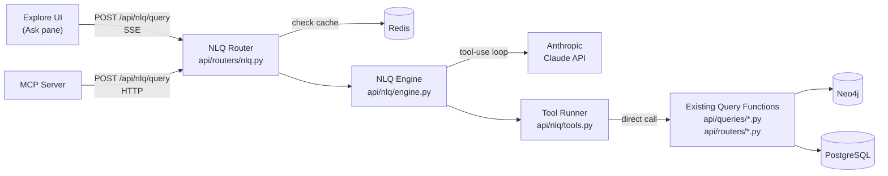

# Natural Language Graph Queries — Design Spec

**Issue:** #203
**Date:** 2026-03-25
**Status:** Draft

## Overview

A natural language query layer for the Discogsography knowledge graph. Users type questions in plain English — "Find artists who recorded for both Factory Records and Rough Trade" — and the system translates them into graph API calls, executes them, and returns a natural language summary with clickable entity references.

The NLQ engine uses Claude's native tool-use (function calling) to plan and execute multi-step queries against existing API endpoints. This is the first LLM integration in the codebase and establishes patterns that Collection Storyteller (#202) and AI Crate Digger (#204) will reuse.

## Scope (v1)

**In scope:**

- Backend NLQ engine with tool-use loop inside the API service
- `POST /api/nlq/query` endpoint with SSE streaming for status events
- `GET /api/nlq/status` endpoint for feature detection
- 14 tools wrapping existing query functions (10 public, 4 authenticated)
- Minimal "Ask" pane in the Explore UI
- MCP server `nlq_query` tool
- Feature gating via `NLQ_ENABLED` env var
- Off-topic query guardrails (system prompt + zero-tool validation)

**Out of scope (v2+):**

- Query history and persistence
- Follow-up suggestions
- Conversation memory (multi-turn)
- LLM text streaming (only tool-call status events stream in v1)
- Input pre-filter heuristic (cost optimization)

## Architecture



The NLQ engine lives inside the API service (`api/nlq/`) and calls existing query functions directly via Python function calls — no HTTP round-trip. The MCP server gets a thin `nlq_query` tool that proxies to the API endpoint over HTTP, same as all its other tools.

## Tool Definitions

### Public Tools (always available)

| Tool                  | Wraps                               | Description                                               |
| --------------------- | ----------------------------------- | --------------------------------------------------------- |
| `search`              | `search_queries.search()`           | Full-text search across artists, releases, labels         |
| `explore_entity`      | `neo4j_queries.explore_*()`         | Get details for an artist, label, genre, or style by name |
| `autocomplete`        | `neo4j_queries.autocomplete_*()`    | Fuzzy entity resolution by name prefix                    |
| `find_path`           | `neo4j_queries.find_path()`         | Shortest path between two entities                        |
| `get_collaborators`   | `neo4j_queries.get_collaborators()` | Artists who share releases with a given artist            |
| `get_similar_artists` | `neo4j_queries.similar_artists()`   | Musically similar artists based on graph structure        |
| `get_label_dna`       | `label_dna_queries.get_label_dna()` | Label's genre/style fingerprint                           |
| `get_trends`          | `neo4j_queries.get_trends()`        | Time-series data for an entity                            |
| `get_genre_tree`      | `neo4j_queries.get_genre_tree()`    | Full genre/style hierarchy                                |
| `get_graph_stats`     | `neo4j_queries.get_graph_stats()`   | Aggregate node and relationship counts                    |

### Authenticated Tools (added when user has valid JWT)

| Tool                    | Wraps                             | Description                                            |
| ----------------------- | --------------------------------- | ------------------------------------------------------ |
| `get_collection_gaps`   | `gap_queries.get_*_gaps()`        | Missing releases for an artist, label, or master       |
| `get_taste_fingerprint` | `taste_queries.get_fingerprint()` | User's genre/style preference profile                  |
| `get_taste_blindspots`  | `taste_queries.get_blindspots()`  | Genres/styles missing from collection despite affinity |
| `get_collection_stats`  | `collection_queries.get_stats()`  | Collection size, format breakdown, timeline            |

Each tool includes a typed `input_schema` matching the Anthropic tool-use format. The tool runner validates parameters and calls the underlying query function directly.

## API Contract

### `POST /api/nlq/query`

Rate limit: 10/minute per user.

**Request:**

```json
{
  "query": "Find artists who recorded for both Factory Records and Rough Trade",
  "context": {
    "current_entity_id": null,
    "current_entity_type": null
  }
}
```

- `query`: string, 1-500 characters, required
- `context`: optional — ambient context from the current Explore UI state (e.g., the entity currently being viewed), allowing queries like "tell me more about this artist"

**Response (JSON, default):**

```json
{
  "query": "Find artists who recorded for both Factory Records and Rough Trade",
  "summary": "I found 8 artists who released on both Factory Records and Rough Trade. The most notable include Happy Mondays, James, and Durutti Column...",
  "entities": [
    {"id": 123, "name": "Happy Mondays", "type": "artist"},
    {"id": 456, "name": "James", "type": "artist"}
  ],
  "tools_used": ["autocomplete", "explore_entity", "get_collaborators"],
  "cached": false
}
```

- `summary`: Claude's natural language response. Entity names appear as-is; the frontend matches them against the `entities` array for linking.
- `entities`: All entities referenced in tool results, deduplicated, for the UI to make clickable.
- `tools_used`: Which tools were called (lightweight plan transparency).
- `cached`: Whether this was served from Redis cache.

**Response (SSE, when `Accept: text/event-stream`):**

```
event: status
data: {"step": "Searching for Factory Records..."}

event: status
data: {"step": "Searching for Rough Trade..."}

event: status
data: {"step": "Finding common artists..."}

event: result
data: {"summary": "I found 8 artists...", "entities": [...], "tools_used": [...]}
```

Status events emitted as each tool call executes. Final `result` event contains the complete response.

**Error responses:**

- `400`: Query too short, too long, or invalid context
- `429`: Rate limit exceeded
- `503`: NLQ disabled or LLM unavailable

### `GET /api/nlq/status`

No auth required. Returns feature availability for the frontend.

```json
{
  "enabled": true
}
```

## NLQ Engine

### System Prompt

Static core:

```
You are a music knowledge graph assistant for Discogsography. You help users
explore a graph of artists, labels, releases, genres, and styles from the
Discogs music database.

Use the provided tools to answer questions. Always ground your answers in
tool results — never fabricate data. If a tool returns no results, say so
honestly.

When mentioning entities, use their exact names as returned by tools so the
UI can link them. Keep responses concise (2-4 sentences for simple queries,
up to a short paragraph for complex ones).

Supported entity types: artist, label, genre, style.
Releases are searchable but not directly explorable as graph nodes.

You can ONLY answer questions about music, artists, labels, releases, genres,
and styles in the Discogsography knowledge graph. If a question is unrelated
to music or this database, politely decline and suggest a music-related query.

Do NOT answer general knowledge questions, even if music-adjacent (e.g., band
member biographies, music theory, concert schedules). Your knowledge comes
exclusively from the tools provided.
```

Dynamic addition when authenticated:

```
The user is logged in and has a Discogs collection. You can access their
collection stats, taste fingerprint, blindspots, and gap analysis.
```

No user input is interpolated into the system prompt. The query goes in the user message only.

### Tool-Use Loop

```python
async def run_query(query: str, context: NLQContext) -> NLQResult:
    tools = get_public_tools()
    if context.user_id:
        tools += get_authenticated_tools()

    messages = [{"role": "user", "content": query}]
    tools_used: list[str] = []
    entities_seen: list[EntityRef] = []

    for iteration in range(MAX_ITERATIONS):  # 5
        response = await client.messages.create(
            model=config.nlq_model,
            system=build_system_prompt(context),
            messages=messages,
            tools=tools,
            max_tokens=1024,
        )

        if response.stop_reason == "end_turn":
            return build_result(response, entities_seen, tools_used)

        # Execute tool calls, emit SSE status events
        tool_results = []
        for block in response.content:
            if block.type == "tool_use":
                result = await execute_tool(block.name, block.input, context)
                tools_used.append(block.name)
                entities_seen.extend(extract_entities(result))
                tool_results.append(
                    {"type": "tool_result", "tool_use_id": block.id, "content": json.dumps(result)}
                )

        messages.append({"role": "assistant", "content": response.content})
        messages.append({"role": "user", "content": tool_results})

    # Max iterations reached — return best effort from last response
    return build_result(response, entities_seen, tools_used)
```

### Off-Topic Guardrails

**Layer 1 — System prompt:** Explicit instruction to only answer music/graph questions and decline unrelated queries.

**Layer 2 — Zero-tool validation:** After the loop completes, if Claude used zero tools and the response doesn't look like a refusal (i.e., it's a substantive answer without graph data), replace it with a canned redirect: "I can only answer questions about the Discogsography music database. Try asking about an artist, label, or genre!"

### Caching

- **Public queries:** Cached in Redis. Key: `nlq:{sha256(query_normalized)}`. TTL: 1 hour.
- **Authenticated queries:** Not cached (too personalized per user).
- Redis failure is non-fatal — cache miss falls through to LLM.

### Entity Extraction

After each tool call, the engine extracts entity references (`id`, `name`, `type`) from the tool result JSON. These accumulate across iterations and are deduplicated in the final response. The frontend uses this array to linkify entity names in the summary text.

## Configuration

New fields in `ApiConfig` (`common/config.py`):

| Field                  | Env Var                            | Default                    | Description                      |
| ---------------------- | ---------------------------------- | -------------------------- | -------------------------------- |
| `nlq_enabled`          | `NLQ_ENABLED`                      | `false`                    | Feature gate                     |
| `nlq_api_key`          | `NLQ_API_KEY` / `NLQ_API_KEY_FILE` | `None`                     | Anthropic API key                |
| `nlq_model`            | `NLQ_MODEL`                        | `claude-sonnet-4-20250514` | Model ID                         |
| `nlq_max_iterations`   | `NLQ_MAX_ITERATIONS`               | `5`                        | Tool-use loop cap                |
| `nlq_max_query_length` | `NLQ_MAX_QUERY_LENGTH`             | `500`                      | Input character limit            |
| `nlq_cache_ttl`        | `NLQ_CACHE_TTL`                    | `3600`                     | Public query cache TTL (seconds) |
| `nlq_rate_limit`       | `NLQ_RATE_LIMIT`                   | `10/minute`                | Per-user rate limit              |

When `nlq_enabled` is `false` or `nlq_api_key` is unset:

- API returns `503` on `/api/nlq/query`
- `/api/nlq/status` returns `{"enabled": false}`
- Frontend hides the "Ask" toggle
- MCP `nlq_query` tool returns a descriptive error

**Dependency:** `anthropic` added to `pyproject.toml` as an optional extra (`nlq`), not a base dependency.

## Explore UI — "Ask" Pane

### Layout

1. **Mode toggle** in the search bar area: "Search" (existing) | "Ask" (NLQ). Keyboard shortcut: `?` activates Ask mode. Toggle hidden when feature disabled (checked via `/api/nlq/status` on page load).

1. **Ask input** — text field, placeholder "Ask anything about the music graph...", submit button. Enter to submit.

1. **Status area** — displays SSE status events during query execution: "Searching for Factory Records...", "Finding common artists..." Provides feedback during the 2-5 second wait.

1. **Result area:**

   - Natural language summary text
   - Entity names matched against the `entities` array and rendered as clickable links (clicking opens that entity in the Explore graph pane via `app.explore(name, type)`)
   - "Tools used" shown as small pills below the result

1. **Empty state** — 3-4 example queries as clickable chips:

   - "Most prolific electronic label"
   - "How are Kraftwerk and Afrika Bambaataa connected?"
   - "What genres emerged in the 1990s?"

### Implementation

- New file: `explore/static/js/nlq.js` following existing panel pattern
- `api-client.js` gets `askNlq(query, context)` method with SSE support
- Entity link clicks dispatch to existing explore pane
- Current entity context passed automatically when user is viewing an entity

## MCP Server

New tool in `mcp-server/mcp_server/server.py`:

```python
@mcp.tool()
async def nlq_query(ctx: Context, query: str) -> dict:
    """Ask a natural language question about the music knowledge graph.
    The system will interpret your question, query the graph, and return
    a natural language answer with referenced entities."""
    result = await _api_post(ctx, "/api/nlq/query", json={"query": query})
    return result
```

Uses the non-streaming JSON response variant. Returns the full result including summary, entities, and tools used.

## Testing Strategy

### Unit Tests (`tests/api/nlq/`)

- **`test_tools.py`**: Each tool wrapper returns expected format given mock query function results. Parameter validation (bad entity types, missing required params). Entity extraction from tool results.

- **`test_engine.py`**: Mock Anthropic client. Tool-use loop: single tool call, multi-step calls, max iteration cap, `end_turn` stop. System prompt construction with/without auth. Zero-tool response validation (off-topic guardrail).

- **`test_nlq_router.py`**: Valid query, query too short/long, rate limiting, cache hit/miss, 503 when disabled, SSE streaming format, auth context forwarding.

### Integration Tests

- **`test_nlq_integration.py`**: With real Neo4j/Redis (existing test infra), canned query triggers autocomplete tool, gets real result, produces response with entities. Mock Anthropic client with pre-scripted tool-use responses — no real LLM calls in CI.

### MCP Server Tests (`tests/mcp-server/`)

- **`test_nlq_tool.py`**: `nlq_query` tool calls API correctly, handles enabled/disabled states.

### Frontend Tests (`explore/__tests__/`)

- **`nlq.test.js`**: Vitest. Renders input, submits query, displays results, entity links dispatch to explore, hides when disabled, SSE status updates display.

All LLM calls mocked in tests. No real Anthropic API spend in CI.

## Cost Estimate

Typical query (~2-3 tool iterations):

- ~6,000 input tokens, ~800 output tokens
- **~$0.03/query** with Claude Sonnet 4
- **~$0.008/query** with Claude Haiku 3.5

Public query caching (1h TTL) reduces effective cost for repeated queries.

## Files Changed/Created

### New Files

- `api/nlq/__init__.py`
- `api/nlq/engine.py` — NLQ engine with tool-use loop
- `api/nlq/tools.py` — Tool definitions and runner
- `api/nlq/config.py` — NLQ-specific config dataclass
- `api/routers/nlq.py` — API router
- `explore/static/js/nlq.js` — Frontend Ask pane
- `tests/api/nlq/test_tools.py`
- `tests/api/nlq/test_engine.py`
- `tests/api/nlq/test_nlq_router.py`
- `tests/api/nlq/test_nlq_integration.py`
- `tests/mcp-server/test_nlq_tool.py`
- `explore/__tests__/nlq.test.js`

### Modified Files

- `common/config.py` — Add NLQ config fields to `ApiConfig`
- `api/api.py` — Wire NLQ router, initialize Anthropic client in lifespan
- `api/routers/__init__.py` — Export NLQ router (if applicable)
- `mcp-server/mcp_server/server.py` — Add `nlq_query` tool
- `explore/static/js/api-client.js` — Add `askNlq()` method
- `explore/static/js/app.js` — Register NLQ pane, add Search/Ask toggle
- `explore/static/index.html` — Add Ask pane HTML
- `pyproject.toml` — Add `anthropic` optional dependency
- `docker-compose.yml` — Add NLQ env vars to API service
- `.github/workflows/test.yml` — Add NLQ test coverage

## Acceptance Criteria

- [ ] `POST /api/nlq/query` accepts natural language and returns structured response
- [ ] SSE streaming emits status events per tool call
- [ ] `GET /api/nlq/status` returns feature availability
- [ ] 10 public tools + 4 authenticated tools defined and functional
- [ ] Tool list varies based on authentication state
- [ ] Tool-use loop capped at 5 iterations
- [ ] Off-topic queries declined via system prompt + zero-tool validation
- [ ] Public queries cached in Redis (1h TTL)
- [ ] Feature gated behind `NLQ_ENABLED` env var
- [ ] Returns 503 when disabled or API key missing
- [ ] Rate limited at 10/minute per user
- [ ] Query length validated (1-500 characters)
- [ ] MCP server `nlq_query` tool proxies to API endpoint
- [ ] Explore UI "Ask" pane with mode toggle, input, status, results
- [ ] Entity names in results are clickable links to explore pane
- [ ] Ask toggle hidden when feature disabled
- [ ] Anthropic client mocked in all tests — no real LLM calls in CI
- [ ] >=80% test coverage
