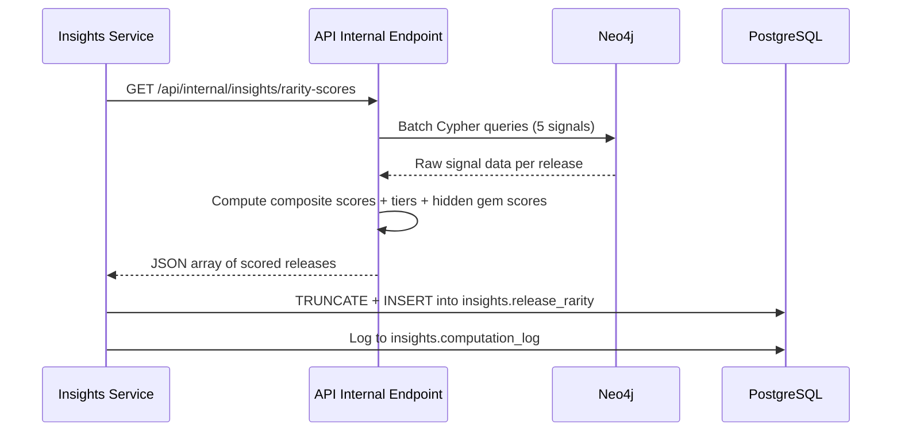

# Release Rarity Scoring Phase 1 — Computation Engine and Core Endpoints

**Issue:** #205
**Date:** 2026-03-25
**Related:** #206 (community have/want enrichment — deferred)

## Summary

Compute a rarity index (0-100) for every release in the knowledge graph using 5 graph-derived signals. Surface hidden gems — releases that are rare but connected to well-known artists/labels/genres. Store precomputed scores in PostgreSQL via the insights pipeline. Expose 5 read-only API endpoints for querying rarity data.

## Decisions

- **5-signal model**: Community have/want counts excluded (requires Discogs API, tracked in #206). Weights redistributed.
- **Graph-only quality signals**: Hidden gem scoring uses artist degree, label catalog size, and genre release count — all available in Neo4j.
- **Batch computation**: Runs in the insights pipeline, not computed per-request.
- **Flat columns**: Signal scores stored as individual columns, not JSONB — enables efficient filtering and sorting.
- **No admin-configurable weights in Phase 1**: Weights hardcoded in computation module. Admin config deferred to Phase 2.
- **Phase scope**: Computation + 5 public endpoints. Collection-aware endpoints, Explore UI, and MCP tools deferred to Phase 2/3.

## Phasing Overview

| Phase | Scope |
|-------|-------|
| **1 (this spec)** | Rarity computation engine, 5 core endpoints, hidden gem scoring, insights pipeline integration |
| 2 | Collection rarity endpoints (authenticated), Explore UI integration (badges, dashboard), admin weight config |
| 3 | MCP server tools, integration with achievements/storyteller/recommendations |

## Rarity Signals

### Signal Definitions

| Signal | Weight | Source | Description |
|--------|--------|--------|-------------|
| Pressing scarcity | 0.30 | Neo4j | Fewer pressings of the same master = rarer |
| Label catalog size | 0.15 | Neo4j | Releases on small-catalog labels are rarer |
| Format rarity | 0.15 | Neo4j | Scarce physical formats scored higher |
| Temporal scarcity | 0.20 | Neo4j | Older releases without recent reissues score higher |
| Graph isolation | 0.20 | Neo4j | Fewer graph connections = rarer |

### Pressing Scarcity (weight: 0.30)

Count releases sharing the same Master via `(:Release)-[:DERIVED_FROM]->(:Master)`.

| Pressing count | Score |
|---------------|-------|
| 1 (unique) | 100 |
| 2 | 85 |
| 3-5 | 60 |
| 6-10 | 35 |
| 11+ | 10 |
| No master link (standalone) | 90 |

### Label Catalog Size (weight: 0.15)

Count total releases on the same label. Use pre-computed `Label.release_count` where available (graphinator already computes this), fall back to live count.

| Label catalog size | Score |
|-------------------|-------|
| < 10 releases | 100 |
| 10-50 | 75 |
| 51-200 | 50 |
| 201-1000 | 25 |
| 1000+ | 10 |

### Format Rarity (weight: 0.15)

Static lookup against `Release.formats` list. Take the maximum score across all formats.

```python
FORMAT_RARITY_SCORES = {
    "Test Pressing": 100,
    "Lathe Cut": 98,
    "Flexi-disc": 95,
    "Shellac": 90,
    "Blu-spec CD": 80,
    "Box Set": 70,
    "10\"": 65,
    "8-Track Cartridge": 60,
    "CDr": 50,
    "Vinyl": 40,
    "Cassette": 35,
    "LP": 30,
    "CD": 10,
    "File": 5,
}
# Unknown formats default to 50
```

### Temporal Scarcity (weight: 0.20)

Two-part score:

1. **Age score**: `min(100, (current_year - release_year) * 1.5)`
2. **Reissue penalty**: If the master has any pressing with a year within the last 10 years, subtract 40 points (floor at 0)
3. **No year**: Score 50

### Graph Isolation (weight: 0.20)

Count total relationships on the Release node (`:BY`, `:ON`, `:IS`, `:DERIVED_FROM`).

| Relationship count | Score |
|-------------------|-------|
| 1-2 | 90 |
| 3-4 | 70 |
| 5-7 | 50 |
| 8-12 | 30 |
| 13+ | 10 |

## Hidden Gem Score

```
hidden_gem_score = rarity_score * quality_multiplier
```

**Quality multiplier** (0.0 to 1.0) combines three graph-derived signals:

| Signal | Weight in multiplier | Logic |
|--------|---------------------|-------|
| Artist prominence | 0.4 | Normalized artist degree (edges count) — higher degree = more prominent artist = stronger hidden gem signal |
| Label strength | 0.3 | Normalized label catalog size — larger catalog = more established label |
| Genre popularity | 0.3 | Normalized genre release count — more releases = more popular genre |

Normalization: percentile rank within each signal's distribution, scaled to 0.0-1.0.

A release scores high as a hidden gem when it is **rare** (high rarity_score) AND the surrounding context is **well-known** (high quality_multiplier). This filters out truly obscure releases with no quality signal.

## Rarity Tiers

| Tier | Score Range | Key |
|------|------------|-----|
| Common | 0-20 | `common` |
| Uncommon | 21-40 | `uncommon` |
| Scarce | 41-60 | `scarce` |
| Rare | 61-80 | `rare` |
| Ultra-Rare | 81-100 | `ultra-rare` |

## Computation Pipeline

### Flow



### Internal Endpoint

`GET /api/internal/insights/rarity-scores` — returns all scored releases. Protected by internal-only access (no auth, not exposed via public routes).

### Batch Cypher Strategy

Five aggregate queries, not per-release queries:

1. **Pressing counts**: Group releases by master, count siblings
2. **Label catalog sizes**: Use `Label.release_count` or count `(:Release)-[:ON]->(:Label)`
3. **Format data**: Return release_id + formats list for Python-side scoring
4. **Temporal data**: Release year + most recent sibling year per master
5. **Graph degree**: Count relationships per release node

Results joined in Python by release_id, composite score computed, then returned as a single JSON payload.

### Schedule

Runs as part of `run_all_computations()` in the insights service. Added after existing computations. Expected to be the most expensive computation — use a longer HTTP timeout (600s, matching data_completeness).

## PostgreSQL Schema

New table in the `insights` schema:

```sql
CREATE TABLE IF NOT EXISTS insights.release_rarity (
    release_id BIGINT PRIMARY KEY,
    title TEXT,
    artist_name TEXT,
    year INTEGER,
    rarity_score REAL NOT NULL,
    tier TEXT NOT NULL,
    hidden_gem_score REAL,
    pressing_scarcity REAL,
    label_catalog REAL,
    format_rarity REAL,
    temporal_scarcity REAL,
    graph_isolation REAL,
    computed_at TIMESTAMPTZ DEFAULT NOW()
);

CREATE INDEX IF NOT EXISTS idx_release_rarity_score
    ON insights.release_rarity (rarity_score DESC);
CREATE INDEX IF NOT EXISTS idx_release_rarity_tier
    ON insights.release_rarity (tier);
CREATE INDEX IF NOT EXISTS idx_release_rarity_gem
    ON insights.release_rarity (hidden_gem_score DESC NULLS LAST);
```

Title, artist_name, and year denormalized to avoid joins in leaderboard/list queries.

## API Endpoints

All endpoints in `api/routers/rarity.py`. Rate limited at 30/minute. Redis cached with 1-hour TTL.

### `GET /api/rarity/{release_id}`

Full rarity breakdown for a single release.

```json
{
  "release_id": 456,
  "title": "Cybernetic Serendipity Music",
  "artist": "Various",
  "year": 1968,
  "rarity_score": 87.2,
  "tier": "ultra-rare",
  "hidden_gem_score": 72.1,
  "breakdown": {
    "pressing_scarcity": {"score": 95.0, "weight": 0.30},
    "label_catalog": {"score": 80.0, "weight": 0.15},
    "format_rarity": {"score": 70.0, "weight": 0.15},
    "temporal_scarcity": {"score": 92.0, "weight": 0.20},
    "graph_isolation": {"score": 65.0, "weight": 0.20}
  }
}
```

Returns 404 if release not yet scored (computation hasn't run or release doesn't exist).

### `GET /api/rarity/leaderboard`

Global top-N rarest releases, paginated.

**Query params:** `page` (default 1), `page_size` (default 20, max 100), `tier` (optional filter)

```json
{
  "items": [
    {"release_id": 456, "title": "...", "artist": "Various", "year": 1968, "rarity_score": 87.2, "tier": "ultra-rare"}
  ],
  "total": 12345,
  "page": 1,
  "page_size": 20
}
```

### `GET /api/rarity/hidden-gems`

Top hidden gems globally, sorted by hidden_gem_score descending.

**Query params:** `page` (default 1), `page_size` (default 20, max 100), `min_rarity` (optional, default 41 — scarce+)

Same response shape as leaderboard, with `hidden_gem_score` included in each item.

### `GET /api/rarity/artist/{artist_id}`

Rarest releases by a specific artist, paginated. First queries Neo4j for release_ids via `(:Release)-[:BY]->(:Artist {id: $artist_id})`, then fetches matching rows from `insights.release_rarity` sorted by rarity_score descending.

**Query params:** `page` (default 1), `page_size` (default 20, max 100)

Returns 404 if artist not found. Same paginated response shape.

### `GET /api/rarity/label/{label_id}`

Rarest releases on a specific label, paginated. First queries Neo4j for release_ids via `(:Release)-[:ON]->(:Label {id: $label_id})`, then fetches matching rows from `insights.release_rarity` sorted by rarity_score descending.

**Query params:** `page` (default 1), `page_size` (default 20, max 100)

Returns 404 if label not found. Same paginated response shape.

## File Structure

```
api/routers/rarity.py              — 5 endpoints + configure()
api/queries/rarity_queries.py      — PostgreSQL lookups + Neo4j batch signal queries
api/models.py                      — add RarityBreakdown, RaritySignal, RarityResponse, RarityListResponse
insights/computations.py           — add compute_and_store_rarity()
schema-init/postgres_schema.py     — add release_rarity table + indexes
tests/api/test_rarity.py           — endpoint tests
tests/api/test_rarity_queries.py   — query unit tests
tests/insights/test_rarity_computation.py — computation pipeline tests
```

## Testing Strategy

- **Unit tests**: Signal scoring functions tested with known inputs/outputs
- **Query tests**: Mocked Neo4j/PostgreSQL responses for batch queries
- **Endpoint tests**: Full request/response cycle with mocked data layer
- **Computation tests**: End-to-end insights pipeline with mocked API responses
- **Target**: >=80% coverage across all new files

## Future Phases (out of scope)

### Phase 2
- `GET /api/rarity/collection` — authenticated, user's collection rarity distribution
- `GET /api/rarity/hidden-gems/collection` — hidden gems the user owns
- Explore UI: rarity badges on release views, collection rarity dashboard panel
- Admin-configurable weights via admin endpoint

### Phase 3
- MCP server: `get_rarity_score`, `get_hidden_gems` tools
- Integration with collector achievements (#200), storyteller (#202), crate digger (#204)
- Gap analysis integration: "This missing pressing is rated Ultra-Rare"
