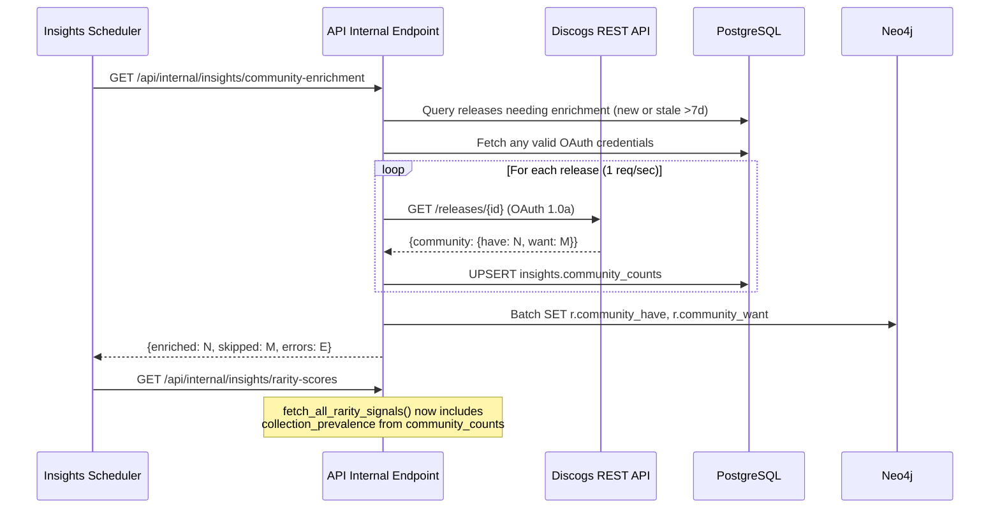

# Community Have/Want Enrichment for Release Rarity Scoring

**Issue:** #206
**Date:** 2026-04-11
**Status:** Approved

## Overview

Add a 6th rarity signal — **collection prevalence** — by fetching `community.have` and `community.want` counts from the Discogs REST API for releases in user collections/wantlists. These global counts reflect how many Discogs users worldwide own or want a release, providing the strongest real-world scarcity signal.

## Design Decisions

| Decision | Choice | Rationale |
|---|---|---|
| Enrichment scope | Collection-first | Only enrich releases in synced user collections/wantlists. Manageable scope, serves active users. Unenriched releases get a neutral fallback score (50.0). |
| Storage | PostgreSQL + Neo4j mirror | PostgreSQL `insights.community_counts` as source of truth. Neo4j Release nodes get `community_have`/`community_want` properties for query convenience. |
| Process location | API internal endpoint | Fits existing insights architecture. API already has OAuth, DB connections, rate limiting patterns. Triggered by insights scheduler before rarity computation. |

## Data Flow



## Storage Schema

### PostgreSQL — new table

```sql
CREATE TABLE IF NOT EXISTS insights.community_counts (
    release_id   BIGINT PRIMARY KEY,
    have_count   INTEGER NOT NULL DEFAULT 0,
    want_count   INTEGER NOT NULL DEFAULT 0,
    fetched_at   TIMESTAMPTZ NOT NULL DEFAULT NOW()
);
CREATE INDEX IF NOT EXISTS idx_community_counts_fetched
    ON insights.community_counts (fetched_at);
```

### PostgreSQL — extend `insights.release_rarity`

Add column: `collection_prevalence REAL`

### Neo4j — Release node properties

Add `community_have` (integer) and `community_want` (integer) properties to Release nodes during enrichment via batch Cypher update.

## Scoring Function

`compute_collection_prevalence_score(have_count, want_count) -> float`

Score is inversely proportional to how many people have the release, using log-scale thresholds (community counts follow a power-law distribution):

| have_count | Base Score | Interpretation |
|---|---|---|
| 0 | 95.0 | Almost nobody has it |
| 1-10 | 85.0 | Extremely scarce |
| 11-100 | 70.0 | Hard to find |
| 101-1000 | 50.0 | Moderate availability |
| 1001-10000 | 25.0 | Widely available |
| 10000+ | 10.0 | Mass market |

**Want bonus:** If `want_count > have_count`, add +5.0 to the score (capped at 100.0). High want relative to have indicates desirability/scarcity pressure.

**Fallback:** Releases without community data get 50.0 (neutral).

## Updated Signal Weights

```python
SIGNAL_WEIGHTS = {
    "pressing_scarcity": 0.25,       # was 0.30
    "label_catalog": 0.10,           # was 0.15
    "format_rarity": 0.10,           # was 0.15
    "temporal_scarcity": 0.20,       # unchanged
    "graph_isolation": 0.15,         # was 0.20
    "collection_prevalence": 0.20,   # NEW
}
```

Rationale: Collection prevalence is the strongest real-world rarity signal, matching temporal scarcity's weight. Pressing scarcity stays highest as the most graph-reliable signal. Label catalog and format rarity absorb reductions as the least discriminating signals.

## Enrichment Process Details

### Release selection

Query PostgreSQL for distinct `release_id` values from `user_collections` and `user_wantlists` that either:
- Don't exist in `insights.community_counts`, or
- Have `fetched_at` older than 7 days

### OAuth credentials

Pick any user with valid Discogs OAuth credentials from `oauth_tokens`. Community counts are public data — any authenticated user can read them. If no credentials are available, the endpoint returns early with `{"enriched": 0, "skipped": N, "error": "no_credentials"}`.

### Rate limiting

- 1 request per second (SYNC_DELAY_SECONDS = 1.0) to stay under 60 req/min
- On 429 response: wait 60 seconds, retry up to 5 times (same pattern as `syncer.py`)
- On non-200/non-429: log error, skip release, continue

### Staleness

Counts older than 7 days are refreshed on the next enrichment run. The `fetched_at` timestamp is updated on each successful fetch.

## API & Pipeline Changes

### New internal endpoint

`GET /api/internal/insights/community-enrichment` in `api/routers/insights_compute.py`:
- Rate limited to 1/minute (long-running operation)
- Runs the enrichment process described above
- Returns `{"enriched": N, "skipped": M, "errors": E}`

### Updated `fetch_all_rarity_signals()`

- Add `pool` parameter (PostgreSQL) alongside existing `driver` parameter (Neo4j)
- After the 8 existing Neo4j queries, query `insights.community_counts` for have/want counts
- Build a `community_map` lookup dict
- Compute `collection_prevalence` score for each release
- Include in weighted sum and result dict

### Updated `compute_and_store_rarity()`

- INSERT statement adds the `collection_prevalence` column

### Updated public API

- `get_rarity_for_release()` SELECT query includes `collection_prevalence`
- `_format_breakdown()` automatically includes the new signal (iterates `SIGNAL_WEIGHTS`)

### Insights scheduler ordering

Enrichment runs before rarity computation so freshly fetched counts are available for scoring.

## Files Modified

| File | Change |
|---|---|
| `api/queries/rarity_queries.py` | Add `compute_collection_prevalence_score()`, update weights, update `fetch_all_rarity_signals()` to accept pool and query community counts, update `get_rarity_for_release()` SELECT |
| `api/routers/insights_compute.py` | Add `community-enrichment` endpoint with enrichment logic |
| `api/routers/rarity.py` | No changes needed (breakdown auto-includes new signal) |
| `schema-init/postgres_schema.py` | Add `insights.community_counts` table, add `collection_prevalence` column to `insights.release_rarity` |
| `insights/computations.py` | Update `compute_and_store_rarity()` INSERT to include `collection_prevalence`, add `compute_and_store_community_enrichment()`, update scheduler ordering |
| `tests/api/test_rarity_queries.py` | Add `TestCollectionPrevalenceScore`, update `TestFetchAllRaritySignals` |
| `tests/api/test_community_enrichment.py` | New file: enrichment endpoint tests |
| `tests/insights/test_rarity_computation.py` | Update mock data with `collection_prevalence` |

## Testing Strategy

**Unit tests for scoring function:** Each threshold bucket, want>have bonus, 100 cap, neutral fallback.

**Unit tests for enrichment logic:** Release selection (new + stale), Discogs API response parsing, 429 backoff, PostgreSQL upsert, Neo4j property update, no-credentials handling.

**Updated integration tests:** `TestFetchAllRaritySignals` with 9th data source (PostgreSQL community counts), `TestSignalWeights` (automatically passes), mock data updated with `collection_prevalence` column.
