# 🧪 Testing Guide

> Comprehensive testing strategies for the Discogsography monorepo

## Overview

Discogsography employs a multi-layered testing approach including unit tests, integration tests, and end-to-end (E2E)
tests. This guide covers testing patterns, best practices, and common scenarios.

## 🎯 Testing Philosophy

### Testing Pyramid


### Coverage Goals

| Test Type   | Target Coverage | Current Status      |
| ----------- | --------------- | ------------------- |
| Unit Tests  | 80%+            | **94%** ✅          |
| Integration | 70%+            | Core business logic |
| E2E Tests   | Critical paths  | User workflows      |
| **Overall** | **85%+**        | **94%** ✅          |

## 🛠️ Test Structure

```
tests/
├── conftest.py                          # Shared fixtures
├── test_batch_performance.py            # Batch performance benchmarks
├── test_config.py                       # Configuration tests
├── test_file_completion.py              # File completion tracking tests
├── test_health_server.py                # Health server tests
├── test_integration.py                  # Cross-service integration tests
│
├── common/                              # Shared module tests
│   ├── test_data_normalizer.py
│   ├── test_db_resilience.py
│   ├── test_neo4j_resilient.py
│   ├── test_postgres_resilient.py
│   ├── test_rabbitmq_resilient.py
│   └── test_state_marker.py
│
├── dashboard/
│   ├── conftest.py                      # Dashboard fixtures
│   ├── test_dashboard_api.py            # API unit tests
│   ├── test_dashboard_api_integration.py # Integration tests
│   ├── test_dashboard_app.py            # App-level tests
│   └── test_dashboard_ui.py             # E2E tests (playwright, @pytest.mark.e2e)
│
├── explore/
│   ├── conftest.py
│   ├── test_explore_api.py              # API unit tests
│   ├── test_explore_ui.py               # E2E tests (playwright, @pytest.mark.e2e)
│   └── test_neo4j_queries.py
│
├── graphinator/
│   ├── conftest.py
│   ├── test_batch_processor.py
│   ├── test_batch_processor_integration.py
│   └── test_graphinator.py
│
├── load/                                # Load tests (Locust)
│   ├── locustfile.py
│   ├── scenarios.py
│   └── README.md
│
├── schema-init/
│   ├── conftest.py                      # Adds schema-init/ to sys.path
│   ├── test_neo4j_schema.py             # Neo4j schema statements & creation
│   ├── test_postgres_schema.py          # PostgreSQL schema statements & creation
│   └── test_schema_init.py              # Main init logic, settings, startup
│
└── tableinator/
    ├── conftest.py
    ├── test_batch_processor.py
    └── test_tableinator.py
```

## 📝 Writing Tests

### Unit Test Pattern

```python
import pytest
from unittest.mock import AsyncMock, patch


class TestArtistProcessor:
    """Test artist processing logic."""

    @pytest.fixture
    def mock_connection(self):
        """Create mock database connection."""
        conn = AsyncMock()
        conn.execute = AsyncMock()
        return conn

    @pytest.mark.asyncio
    async def test_process_artist_success(self, mock_connection):
        """Test successful artist processing."""
        # Arrange
        artist_data = {"id": "123", "name": "Test Artist", "profile": "Test profile"}

        # Act
        result = await process_artist(artist_data, mock_connection)

        # Assert
        assert result["status"] == "success"
        mock_connection.execute.assert_called_once()
```

### Integration Test Pattern

Integration tests are identified by their filename convention (`*_integration.py`) rather than a pytest marker. They test service interactions with real or mock external dependencies.

```python
class TestServiceIntegration:
    """Test service interactions."""

    @pytest.fixture
    async def services(self):
        """Start test services."""
        async with TestEnvironment() as env:
            yield env

    @pytest.mark.asyncio
    async def test_message_flow(self, services):
        """Test message flow between services."""
        # Send test message
        await services.publish_message("test_queue", {"test": "data"})

        # Verify processing
        result = await services.wait_for_result(timeout=5)
        assert result["processed"] is True
```

### E2E Test Pattern

```python
@pytest.mark.e2e
class TestDashboardUI:
    """Test dashboard user interface."""

    @pytest.fixture
    async def dashboard_page(self, test_server, page):
        """Navigate to dashboard."""
        await page.goto(f"http://localhost:{test_server.port}")
        return page

    async def test_service_health_display(self, dashboard_page):
        """Test service health indicators."""
        # Wait for dashboard to load
        await dashboard_page.wait_for_selector(".service-health")

        # Check all services shown
        services = await dashboard_page.query_selector_all(".service-card")
        assert len(services) == 5

        # Verify health status
        health_status = await dashboard_page.text_content(".health-status")
        assert health_status in ["Healthy", "Starting"]
```

## 🔧 Test Fixtures

### Common Fixtures

```python
# tests/conftest.py
@pytest.fixture
def mock_amqp_connection():
    """Mock AMQP connection for testing."""
    connection = AsyncMock()
    channel = AsyncMock()

    connection.channel = AsyncMock(return_value=channel)
    channel.declare_queue = AsyncMock()
    channel.basic_consume = AsyncMock()

    return connection


@pytest.fixture
def test_config():
    """Test configuration."""
    return Config(
        amqp_connection="amqp://test@localhost",
        neo4j_host="bolt://localhost:7687",
        neo4j_username="test",
        neo4j_password="test",
        postgres_host="localhost:5432",
        postgres_username="test",
        postgres_password="test",
        postgres_database="test_db",
    )
```

### Service-Specific Fixtures

```python
# tests/dashboard/conftest.py
@pytest.fixture
async def test_server():
    """Start test dashboard server."""
    server = TestServer(port=0)  # Random port
    await server.start()

    yield server

    await server.stop()


@pytest.fixture
def test_client(test_server):
    """Create test client."""
    return TestClient(test_server.app)
```

## 🚀 Running Tests

### Parallel Test Execution

**All tests run in parallel by default** using pytest-xdist with `loadfile` distribution strategy:

- **Default behavior**: `pytest` automatically runs with `-n auto --dist loadfile`
- **Workers**: Auto-detected based on CPU cores (typically 8-10 workers)
- **Distribution**: `loadfile` keeps all tests from the same file in the same worker for better isolation
- **Performance**: Tests complete in ~5 minutes vs ~15+ minutes sequential
- **Pass rate**: 100% (1,543 passed, 2 skipped)

```bash
# Default parallel execution (recommended)
uv run pytest

# Customize number of workers
uv run pytest -n 4

# Sequential execution (slower, for debugging)
uv run pytest -n 0

# Different distribution strategies
uv run pytest --dist loadscope  # Group by test scope
uv run pytest --dist load        # Round-robin (not recommended)
```

### Test Execution Flow

```mermaid
flowchart TD
    Start[Run Tests]

    Start --> Type{Test Type?}

    Type -->|Unit| Unit[pytest -m 'not e2e and not benchmark']
    Type -->|Integration| Integration[pytest tests/**/test_*_integration.py]
    Type -->|E2E| E2E[pytest -m e2e]
    Type -->|All| All[pytest]

    Unit --> Coverage{Coverage<br/>Report?}
    Integration --> Coverage
    E2E --> Browser[Install Browsers<br/>playwright install]
    All --> Coverage

    Browser --> E2ERun[Run E2E Tests]
    E2ERun --> Results

    Coverage -->|Yes| CovReport[Generate Coverage<br/>HTML Report]
    Coverage -->|No| Results[Test Results]

    CovReport --> Results

    Results --> Status{All Tests<br/>Pass?}

    Status -->|Yes| Success[✅ Success]
    Status -->|No| Debug[Debug Failures]

    Debug --> Fix[Fix Issues]
    Fix --> Start

    style Start fill:#e3f2fd,stroke:#2196f3,stroke-width:2px
    style Success fill:#e8f5e9,stroke:#4caf50,stroke-width:2px
    style Debug fill:#fce4ec,stroke:#e91e63,stroke-width:2px
```



### Quick Commands

```bash
# Run all tests in parallel (default, ~5 minutes)
just test
# or
uv run pytest

# Run with coverage (parallel)
just test-cov

# Run specific service tests (parallel)
uv run pytest tests/dashboard/
uv run pytest tests/extractor/

# Run only unit tests (parallel, exclude E2E and benchmarks)
uv run pytest -m "not e2e and not benchmark"

# Run only integration tests (by filename convention)
uv run pytest tests/graphinator/test_batch_processor_integration.py tests/dashboard/test_dashboard_api_integration.py

# Run E2E tests
just test-e2e

# Sequential execution (for debugging, ~15+ minutes)
uv run pytest -n 0
```

### Advanced Testing

```bash
# Run specific test
uv run pytest tests/test_config.py::test_config_validation -v

# Run with debugging (sequential for better output)
uv run pytest -n 0 -xvs --tb=short

# Customize parallel workers
uv run pytest -n 4  # Use 4 workers
uv run pytest -n 0  # Sequential execution

# Different distribution strategies
uv run pytest --dist loadfile   # Default: file-level isolation
uv run pytest --dist loadscope  # Scope-level isolation
uv run pytest --dist load        # Round-robin (faster but less isolation)

# Generate HTML coverage report
uv run pytest --cov --cov-report=html
open htmlcov/index.html

# Performance analysis
uv run pytest --durations=10  # Show 10 slowest tests
uv run pytest --durations=0   # Show all test durations
```

## 🎭 E2E Testing with Playwright

### Setup

```bash
# Install Playwright browsers
uv run playwright install chromium firefox webkit
uv run playwright install-deps

# Run E2E tests
uv run pytest -m e2e
```

### Writing E2E Tests

```python
import pytest
from playwright.async_api import Page


@pytest.mark.e2e
async def test_dashboard_navigation(page: Page, test_server):
    """Test dashboard navigation."""
    # Navigate to dashboard
    await page.goto(f"http://localhost:{test_server.port}")

    # Test navigation menu
    await page.click("button.menu-toggle")
    await page.wait_for_selector("nav.menu", state="visible")

    # Navigate to explore
    await page.click("text=AI Discovery")
    await page.wait_for_url("**/explore")

    # Verify page loaded
    assert await page.title() == "Music Discovery - Discogsography"
```

### Browser Configuration

```bash
# Run on specific browser
pytest -m e2e --browser chromium
pytest -m e2e --browser firefox
pytest -m e2e --browser webkit

# Run with visible browser
pytest -m e2e --headed

# Run with slowmo for debugging
pytest -m e2e --headed --slowmo 1000

# Device emulation
pytest -m e2e --device "iPhone 13"
```

## 🧩 Mocking Strategies

### Database Mocking

```python
@pytest.fixture
def mock_neo4j():
    """Mock Neo4j driver."""
    driver = AsyncMock()
    session = AsyncMock()

    driver.session = MagicMock(return_value=session)
    session.__aenter__ = AsyncMock(return_value=session)
    session.__aexit__ = AsyncMock()
    session.run = AsyncMock()

    return driver


@pytest.fixture
def mock_postgres():
    """Mock PostgreSQL connection."""
    conn = AsyncMock()
    conn.execute = AsyncMock()
    conn.fetch = AsyncMock(return_value=[])
    conn.fetchrow = AsyncMock(return_value=None)

    return conn
```

### External Service Mocking

```python
@pytest.fixture
def mock_discogs_api(httpx_mock):
    """Mock Discogs API responses."""
    httpx_mock.add_response(
        url="https://api.discogs.com/database/search",
        json={"results": [{"id": 1, "title": "Test"}]},
    )
    return httpx_mock
```

## 📊 Test Organization

### Test Naming

```python
# Pattern: test_<what>_<condition>_<expected>
def test_config_validation_missing_field_raises_error():
    pass


def test_artist_processing_duplicate_skips_record():
    pass


def test_download_large_file_shows_progress():
    pass
```

### Test Classes

```python
class TestArtistProcessor:
    """Group related tests."""

    class TestValidation:
        """Validation-specific tests."""

        def test_valid_artist_passes(self):
            pass

        def test_missing_id_fails(self):
            pass

    class TestProcessing:
        """Processing-specific tests."""

        @pytest.mark.asyncio
        async def test_successful_processing(self):
            pass
```

## 🔄 Test Isolation & Parallel Execution

### Best Practices

**File-Level Isolation (`loadfile` strategy)**:

- All tests in the same file run in the same worker
- Provides better isolation than round-robin (`load`)
- Prevents cross-file global state pollution
- Recommended for most use cases

**Test Independence**:

- Each test should be fully independent
- Global state is reset between tests via `conftest.py` fixtures
- Module-level variables are reset automatically
- Database connections and event loops are properly isolated

**When to Use Sequential Execution**:

- Debugging specific test failures
- Profiling test performance
- Investigating race conditions
- When you need predictable execution order

```bash
# Debug a specific failing test
uv run pytest -n 0 tests/test_specific.py::test_function -xvs

# Profile test performance
uv run pytest -n 0 --durations=0
```

### Global State Management

The test suite handles global state through `conftest.py` fixtures:

- **graphinator**: `shutdown_requested`, `message_counts`, `progress_interval`
- **tableinator**: `connection_pool`, `message_counts`, `consumer_tags`
- **extractor**: `shutdown_requested`

These are automatically reset before and after each test to ensure isolation.

## ⚠️ Common Pitfalls

### 1. Missing Async Markers

```python
# ❌ Wrong
async def test_async_operation():
    await some_async_call()


# ✅ Correct
@pytest.mark.asyncio
async def test_async_operation():
    await some_async_call()
```

### 2. Resource Cleanup

```python
# ❌ Wrong - No cleanup
def test_file_operation():
    create_test_file()
    # Test...


# ✅ Correct - With cleanup
def test_file_operation(tmp_path):
    test_file = tmp_path / "test.txt"
    test_file.write_text("test")
    # Test...
    # Cleanup handled by pytest
```

### 3. Test Isolation

```python
# ❌ Wrong - Shared state
class TestCounter:
    counter = 0

    def test_increment(self):
        self.counter += 1
        assert self.counter == 1  # Fails on second run


# ✅ Correct - Isolated state
class TestCounter:
    def test_increment(self):
        counter = 0
        counter += 1
        assert counter == 1
```

## 🎯 Best Practices

1. **Test One Thing**: Each test should verify a single behavior
1. **Use Descriptive Names**: Test names should explain what they test
1. **Arrange-Act-Assert**: Structure tests clearly
1. **Mock External Dependencies**: Don't make real network calls
1. **Use Fixtures**: Share setup code through fixtures
1. **Test Edge Cases**: Empty data, nulls, errors
1. **Keep Tests Fast**: Mock slow operations
1. **Test Public APIs**: Not implementation details

## 📈 Coverage Requirements

### Viewing Coverage

```bash
# Generate coverage report
just test-cov

# View in terminal
coverage report

# Generate HTML report
coverage html
open htmlcov/index.html
```

### Coverage Configuration

```toml
# pyproject.toml
[tool.coverage.run]
source = ["common", "dashboard", "explore", "graphinator", "schema-init", "tableinator"]
omit = ["*/tests/*", "*/__pycache__/*", "*/static/*"]

[tool.coverage.report]
exclude_lines = [
    "pragma: no cover",
    "def __repr__",
    "if __name__ == .__main__.:",
    "raise AssertionError",
    "raise NotImplementedError",
]
```

## 🔍 Debugging Tests

### Debugging Techniques

```bash
# Stop on first failure
uv run pytest -x

# Show print statements
uv run pytest -s

# Verbose output
uv run pytest -v

# Show local variables on failure
uv run pytest -l

# Drop into debugger on failure
uv run pytest --pdb
```

### VS Code Integration

```json
// .vscode/settings.json
{
    "python.testing.pytestEnabled": true,
    "python.testing.unittestEnabled": false,
    "python.testing.pytestArgs": [
        "--no-cov"  // Disable coverage in VS Code
    ]
}
```

## 📚 Additional Resources

- [pytest Documentation](https://docs.pytest.org/)
- [pytest-asyncio](https://github.com/pytest-dev/pytest-asyncio)
- [Playwright Python](https://playwright.dev/python/)
- [Coverage.py](https://coverage.readthedocs.io/)
