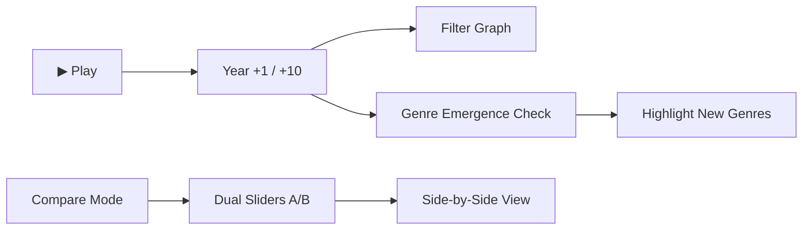
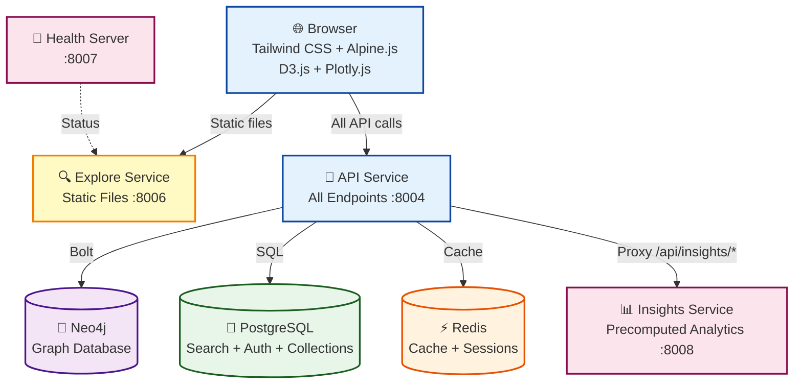

# Explore Service

🔍 **Interactive Graph Exploration, Search, Analytics, and Collection Management**

The Explore service serves the interactive frontend for navigating the Discogs knowledge graph, visualizing trends, searching entities, browsing user collections, and accessing precomputed analytics. Built with **Tailwind CSS** (dark theme), **Alpine.js** (reactive UI), **D3.js** (force-directed graph), and **Plotly.js** (charts). All data endpoints are consolidated in the **API service** (`/api/*`).

## 🌟 Features

### 🗂️ UI Panes

The Explore frontend organizes functionality into tabbed panes:

| Pane                | Description                                                              | Auth Required |
| ------------------- | ------------------------------------------------------------------------ | ------------- |
| **explore**         | Interactive force-directed graph explorer                                | No            |
| **trends**          | Time-series release count charts                                         | No            |
| **path**            | Shortest path finder between any two entities                            | No            |
| **search**          | Full-text search with type, genre, and decade filters                    | No            |
| **insights**        | Precomputed analytics dashboard with auto-refresh (60s)                  | No            |
| **collection**      | User's synced Discogs collection with stats and taste fingerprint        | Yes           |
| **wantlist**        | User's synced Discogs wantlist                                           | Yes           |
| **recommendations** | Personalized release recommendations based on collection                 | Yes           |
| **collaborators**   | Collaborator network for an artist — shared releases and timelines       | No            |
| **genre-tree**      | Interactive genre/style hierarchy browser                                | No            |
| **credits**         | Credits & Provenance — person search, profile, timeline, connections     | No            |
| **gaps**            | Collection gap finder — missing releases for an artist, label, or master | Yes           |

### 🔍 Interactive Graph Explorer

- **Force-Directed Graph**: D3.js-powered visualization of entity relationships
- **Category Expansion**: Click category nodes to load releases, artists, labels, aliases, genres, and styles
- **Load More**: Paginated expansion — results are loaded 30 at a time with a "Load N more..." node appended when additional items exist
- **Info Panel**: View detailed node information on click
- **Search Types**: Explore by Artist, Genre, Label, or Style
- **Fast Autocomplete**: Debounced search with Neo4j fulltext indexes
- **Snapshot Save/Share**: Save the current graph state and share it via URL token

### 📈 Trends Visualization

- **Time-Series Charts**: Plotly.js charts showing release counts over time
- **Multi-Entity Support**: View trends for artists, genres, labels, or styles
- **Interactive Tooltips**: Hover for year-by-year details
- **Comparison Mode**: Overlay trends for two entities on the same chart

### ⏳ Vinyl Archaeology / Timeline Scrubber

Time-travel through the knowledge graph with a timeline scrubber that filters the graph by year:

- **Play/Pause**: Animate through years at configurable speed (1 year/sec or 10 years/sec)
- **Speed Controls**: Toggle between year-by-year and decade-by-decade playback
- **Year Scrubbing**: Drag the slider to jump to any year in the database range
- **Genre Emergence Highlighting**: Newly emerging genres and styles are highlighted as the timeline advances
- **Comparison Mode**: Dual sliders to compare two points in time side-by-side with a color-coded legend
- **Reset**: Return to the "All years" unfiltered view


```mermaid
graph LR
    PLAY["▶ Play"] --> TICK["Year +1 / +10"]
    TICK --> FILTER["Filter Graph"]
    TICK --> EMERGE["Genre Emergence Check"]
    EMERGE --> HIGHLIGHT["Highlight New Genres"]
    COMPARE["Compare Mode"] --> DUAL["Dual Sliders A/B"]
    DUAL --> DIFF["Side-by-Side View"]
```

### 🔬 Shortest Path Finder

- **Entity-to-Entity Paths**: Find the shortest connection between any two artists, labels, genres, or styles
- **Configurable Depth**: Max traversal depth from 1 to 15 hops
- **Visual Path Display**: Path results rendered as a connected graph

### 🔎 Full-Text Search

- **PostgreSQL Full-Text Search**: Searches across artists, labels, masters, and releases
- **Type Filters**: Toggle entity type chips to narrow results
- **Genre Filters**: Clickable genre facet chips from search results
- **Year Range**: Filter results by minimum and maximum release year
- **Decade Facets**: Visual breakdown of results by decade
- **Relevance Scoring**: Results ranked by relevance with visual indicators
- **Pagination**: Page-based navigation with page numbers
- **Cross-Pane Navigation**: Click a result to explore that entity in the graph pane

### 📊 Insights Dashboard

Precomputed analytics from the Insights service, displayed in the UI:

- **Top Artists**: Most connected artists in the knowledge graph
- **Genre Trends**: Decade-by-decade release counts per genre (Plotly.js chart with selectable genre chips)
- **This Month in Music History**: Anniversary releases grouped by milestone years
- **Data Completeness**: Progress bars showing entity type coverage
- **Status Footer**: Last computation timestamp and health indicator
- **Auto-Refresh Polling**: Checks for updated data every 60 seconds and reloads automatically

### 🔐 Authentication and OAuth

- **Register/Login**: Email and password-based account creation and login
- **JWT Tokens**: Stored in localStorage, validated on page load via `/api/auth/me`
- **Discogs OAuth 1.0a**: Connect your Discogs account through an OOB OAuth flow with a verification code modal
- **Session Management**: Logout, token revocation, and Discogs disconnect
- **Auth-Gated Panes**: Collection, Wantlist, Recommendations, and Gaps panes require authentication

### 💿 Collection and Wantlist

- **Collection Browser**: Paginated table of synced Discogs collection releases with artist, year, and format metadata
- **Collection Stats**: Total items, unique artists, unique labels, and average rating summary cards
- **Wantlist Browser**: Paginated table of synced Discogs wantlist
- **Sync Trigger**: Manually sync collection and wantlist data from Discogs

### 🎵 Taste Fingerprint

Personal collection analytics displayed as a compact strip within the Collection pane:

- **Obscurity Score**: How obscure your collection is (0-1 scale)
- **Peak Decade**: The decade most represented in your collection
- **Taste Drift**: How your taste has shifted over time
- **Heatmap**: Visual grid of genre/decade distribution
- **Blind Spots**: Under-explored genres relative to your tastes
- **Downloadable SVG Card**: Export your taste fingerprint as a shareable SVG image

### 🏷️ Label DNA

Fingerprint and compare record labels via API endpoints (used by the graph info panel and external consumers):

- **Label Fingerprint**: `/api/label/{id}/dna` — genre distribution, decade activity, top artists, format preferences
- **Similar Labels**: `/api/label/{id}/similar` — find labels with similar DNA profiles
- **Label Comparison**: `/api/label/dna/compare` — side-by-side comparison of two labels

### 🤖 Recommendations

- **Personalized Suggestions**: Releases you might like based on your collection, with match score percentages
- **Cross-Pane Links**: Click a recommendation to explore the artist in the graph

### 🔍 Collection Gap Analysis

Find releases you are missing from an artist, label, or master:

- **Multi-Entity Support**: Analyze gaps for artists (`/api/collection/gaps/artist/{id}`), labels (`/api/collection/gaps/label/{id}`), or masters (`/api/collection/gaps/master/{id}`)
- **Format Filters**: Filter missing releases by format (vinyl, CD, cassette, etc.)
- **Exclude Wantlist**: Optionally hide releases already on your wantlist
- **Paginated Results**: Browse missing releases with pagination

### 🤝 Collaborator Network

- **Shared Releases**: Find all artists who share releases with a given artist
- **Temporal Data**: Yearly collaboration counts, first/last collaboration year
- **Rate Limited**: 30 requests/minute with Neo4j timeout protection

### 🎭 Credits & Provenance

Discover the people behind the music — producers, engineers, mastering engineers, session musicians, and designers:

- **Person Search**: Autocomplete search across all credited personnel (fulltext index)
- **Profile Card**: Summary showing total credits, active years, role breakdown pills, and linked artist
- **Timeline Chart**: Plotly.js stacked bar chart showing year-by-year credit activity by category
- **Release List**: All credited releases with role filter pills, paginated to 100
- **Connections Graph**: D3.js force-directed graph of people connected through shared releases
- **Role Leaderboard**: Most prolific people in each role category (mastering, production, etc.)

### 🌳 Genre Tree

- **Hierarchy Browser**: Full genre/style tree derived from release co-occurrence
- **Release Counts**: Each genre and style includes its release count
- **Cached**: In-memory cache with 5-minute TTL since hierarchy changes only on import

### 🎨 Artist Similarity and Graph Discovery

API endpoints for music discovery (available to all consumers):

- **Similar Artists**: `/api/recommend/similar/artist/{id}` — find artists with similar connection patterns
- **Explore From Here**: `/api/recommend/explore/{type}/{id}` — multi-signal recommendations radiating from an entity

## 🚀 Quick Start

### Using Docker (Recommended)

```bash
# Start all services including explore
docker-compose up -d

# Access graph queries via the API service
open http://localhost:8004/api/explore
```

> **Note**: The Explore service (port 8006) is internal-only in Docker Compose. All API endpoints are served by the API service at port 8004.

### Local Development

```bash
# Install dependencies
uv sync --extra explore

# Set environment variables
export API_BASE_URL="http://localhost:8004"  # URL of the running API service

# Start the explore service
just explore
```

## 🏗️ Architecture


```mermaid
graph TD
    UI["🌐 Browser<br/>Tailwind CSS + Alpine.js<br/>D3.js + Plotly.js"]
    EXPLORE["🔍 Explore Service<br/>Static Files :8006"]
    HEALTH["🏥 Health Server<br/>:8007"]
    APISERVICE["🔐 API Service<br/>All Endpoints :8004"]
    NEO4J[("🔗 Neo4j<br/>Graph Database")]
    POSTGRES[("🐘 PostgreSQL<br/>Search + Auth + Collections")]
    REDIS[("⚡ Redis<br/>Cache + Sessions")]
    INSIGHTS["📊 Insights Service<br/>Precomputed Analytics :8008"]

    UI -->|Static files| EXPLORE
    UI -->|All API calls| APISERVICE
    APISERVICE -->|Bolt| NEO4J
    APISERVICE -->|SQL| POSTGRES
    APISERVICE -->|Cache| REDIS
    APISERVICE -->|Proxy /api/insights/*| INSIGHTS
    HEALTH -.->|Status| EXPLORE

    style UI fill:#e3f2fd,stroke:#0d47a1,stroke-width:2px
    style EXPLORE fill:#fff9c4,stroke:#f57c00,stroke-width:2px
    style HEALTH fill:#fce4ec,stroke:#880e4f,stroke-width:2px
    style APISERVICE fill:#e3f2fd,stroke:#0d47a1,stroke-width:2px
    style NEO4J fill:#f3e5f5,stroke:#4a148c,stroke-width:2px
    style POSTGRES fill:#e8f5e9,stroke:#1b5e20,stroke-width:2px
    style REDIS fill:#fff3e0,stroke:#e65100,stroke-width:2px
    style INSIGHTS fill:#fce4ec,stroke:#880e4f,stroke-width:2px
```

### Dependencies

The Explore service serves static files only — all query logic, authentication, and data management lives in the **API service**. No RabbitMQ, PostgreSQL, or Redis connections from Explore.

## 📡 API Endpoints

The Explore service exposes only a health endpoint. All data endpoints are served by the **API service** at port 8004:

### Graph Exploration

| Method | Path                           | Description                                                       |
| ------ | ------------------------------ | ----------------------------------------------------------------- |
| GET    | `/api/autocomplete`            | Search entities with autocomplete                                 |
| GET    | `/api/explore`                 | Get center node with category counts                              |
| GET    | `/api/expand`                  | Expand a category node (paginated, supports `before_year` filter) |
| GET    | `/api/node/{node_id}`          | Get full details for a node                                       |
| GET    | `/api/explore/year-range`      | Min/max release year for timeline bounds                          |
| GET    | `/api/explore/genre-emergence` | Genre/style first-appearance years up to a given year             |

### Trends

| Method | Path          | Description                               |
| ------ | ------------- | ----------------------------------------- |
| GET    | `/api/trends` | Year-by-year release counts for an entity |

### Path Finder

| Method | Path        | Description                              |
| ------ | ----------- | ---------------------------------------- |
| GET    | `/api/path` | Shortest path between two named entities |

### Search

| Method | Path          | Description                                                           |
| ------ | ------------- | --------------------------------------------------------------------- |
| GET    | `/api/search` | Full-text search with type/genre/year filters, facets, and pagination |

### Snapshots

| Method | Path                    | Description                                     |
| ------ | ----------------------- | ----------------------------------------------- |
| POST   | `/api/snapshot`         | Save a graph snapshot (returns shareable token) |
| GET    | `/api/snapshot/{token}` | Restore a saved graph snapshot                  |

### Authentication

| Method | Path                 | Description                 |
| ------ | -------------------- | --------------------------- |
| POST   | `/api/auth/register` | Create a new account        |
| POST   | `/api/auth/login`    | Login and receive JWT token |
| POST   | `/api/auth/logout`   | Revoke JWT token            |
| GET    | `/api/auth/me`       | Get current user info       |

### Discogs OAuth

| Method | Path                           | Description                                      |
| ------ | ------------------------------ | ------------------------------------------------ |
| GET    | `/api/oauth/authorize/discogs` | Start Discogs OAuth flow (returns authorize URL) |
| POST   | `/api/oauth/verify/discogs`    | Submit OAuth verifier code                       |
| GET    | `/api/oauth/status/discogs`    | Check Discogs connection status                  |
| DELETE | `/api/oauth/revoke/discogs`    | Disconnect Discogs account                       |

### User Data

| Method | Path                             | Description                                   |
| ------ | -------------------------------- | --------------------------------------------- |
| GET    | `/api/user/collection`           | Paginated collection releases                 |
| GET    | `/api/user/collection/stats`     | Collection summary statistics                 |
| GET    | `/api/user/collection/timeline`  | Collection acquisition timeline               |
| GET    | `/api/user/collection/evolution` | Collection evolution over time                |
| GET    | `/api/user/wantlist`             | Paginated wantlist releases                   |
| GET    | `/api/user/recommendations`      | Personalized release recommendations          |
| GET    | `/api/user/status`               | Ownership status for a set of release IDs     |
| POST   | `/api/sync`                      | Trigger collection/wantlist sync from Discogs |
| GET    | `/api/sync/status`               | Check sync job status                         |

### Taste Fingerprint

| Method | Path                          | Description                                               |
| ------ | ----------------------------- | --------------------------------------------------------- |
| GET    | `/api/user/taste/fingerprint` | Full fingerprint (heatmap, obscurity, drift, blind spots) |
| GET    | `/api/user/taste/heatmap`     | Genre/decade heatmap data                                 |
| GET    | `/api/user/taste/blindspots`  | Under-explored genre suggestions                          |
| GET    | `/api/user/taste/card`        | Downloadable SVG taste card                               |

### Label DNA

| Method | Path                            | Description                                               |
| ------ | ------------------------------- | --------------------------------------------------------- |
| GET    | `/api/label/{label_id}/dna`     | Label fingerprint (genres, decades, top artists, formats) |
| GET    | `/api/label/{label_id}/similar` | Find similar labels by DNA profile                        |
| GET    | `/api/label/dna/compare`        | Compare two labels side-by-side                           |

### Collection Gap Analysis

| Method | Path                                      | Description                            |
| ------ | ----------------------------------------- | -------------------------------------- |
| GET    | `/api/collection/formats`                 | Available format options for filtering |
| GET    | `/api/collection/gaps/artist/{artist_id}` | Missing releases from an artist        |
| GET    | `/api/collection/gaps/label/{label_id}`   | Missing releases from a label          |
| GET    | `/api/collection/gaps/master/{master_id}` | Missing releases from a master         |

### Collaborators

| Method | Path                             | Description                                          |
| ------ | -------------------------------- | ---------------------------------------------------- |
| GET    | `/api/collaborators/{artist_id}` | Collaborating artists with release overlap and years |

### Genre Tree

| Method | Path              | Description                                   |
| ------ | ----------------- | --------------------------------------------- |
| GET    | `/api/genre-tree` | Genre hierarchy with nested styles and counts |

### Artist Similarity and Discovery

| Method | Path                                               | Description                            |
| ------ | -------------------------------------------------- | -------------------------------------- |
| GET    | `/api/recommend/similar/artist/{artist_id}`        | Similar artists by connection patterns |
| GET    | `/api/recommend/explore/{entity_type}/{entity_id}` | Multi-signal discovery from an entity  |

### Credits & Provenance

| Method | Path                                  | Description                                 |
| ------ | ------------------------------------- | ------------------------------------------- |
| GET    | `/api/credits/person/{name}`          | All releases a person is credited on        |
| GET    | `/api/credits/person/{name}/timeline` | Year-by-year credit activity                |
| GET    | `/api/credits/person/{name}/profile`  | Summary profile with role breakdown         |
| GET    | `/api/credits/release/{release_id}`   | Full credits breakdown for a release        |
| GET    | `/api/credits/role/{role}/top`        | Most prolific people in a role category     |
| GET    | `/api/credits/shared`                 | Releases where two people are both credited |
| GET    | `/api/credits/connections/{name}`     | People connected through shared releases    |
| GET    | `/api/credits/autocomplete`           | Search credits by person name               |

### Insights (Proxied from Insights Service)

| Method | Path                              | Description                           |
| ------ | --------------------------------- | ------------------------------------- |
| GET    | `/api/insights/top-artists`       | Most connected artists                |
| GET    | `/api/insights/genre-trends`      | Decade-by-decade genre release counts |
| GET    | `/api/insights/label-longevity`   | Label activity longevity rankings     |
| GET    | `/api/insights/this-month`        | Anniversary releases this month       |
| GET    | `/api/insights/data-completeness` | Entity type completeness percentages  |
| GET    | `/api/insights/status`            | Computation status and timestamps     |

### Health

| Method | Path      | Service         | Description                          |
| ------ | --------- | --------------- | ------------------------------------ |
| GET    | `/health` | Explore (:8007) | Health check (dedicated health port) |

## ⚙️ Configuration

| Variable       | Description                              | Default                                       |
| -------------- | ---------------------------------------- | --------------------------------------------- |
| `API_BASE_URL` | Base URL of the API service for proxying | `http://api:8004`                             |
| `CORS_ORIGINS` | Comma-separated list of allowed origins  | `http://localhost:3000,http://localhost:8003` |

## 🔌 Ports

| Port | Purpose                                         |
| ---- | ----------------------------------------------- |
| 8006 | Static file server (internal only in Docker)    |
| 8007 | Health check endpoint (internal only in Docker) |

## 🧪 Testing

### Python Tests

```bash
# Run unit and API tests
uv run pytest tests/explore/ -m 'not e2e' -v

# Run E2E tests (requires Playwright)
uv run pytest tests/explore/test_explore_ui.py -v
```

### JavaScript Tests (Vitest)

The frontend JavaScript is tested with [Vitest](https://vitest.dev/). Test files live in `explore/__tests__/`:

```bash
# Run all JavaScript tests
just test-js

# Or directly with npx
cd explore && npx vitest run
```

Test coverage includes:

- `api-client.test.js` — API client fetch calls and error handling
- `app.test.js` — Main application controller and pane switching
- `auth.test.js` — Authentication state management
- `autocomplete.test.js` — Search autocomplete behavior
- `graph.test.js` — D3 graph visualization
- `insights.test.js` — Insights panel rendering and polling
- `path-finder.test.js` — Shortest path UI
- `search.test.js` — Full-text search pane
- `trends.test.js` — Trends chart rendering
- `theme.test.js` — Dark/light theme toggling
- `user-panes.test.js` — Collection, wantlist, recommendations, and gaps panes

## 📁 Project Structure

```
explore/
├── __tests__/              # Vitest JavaScript test files
├── static/
│   ├── index.html          # Single-page application shell
│   ├── css/                # Tailwind-compiled styles
│   └── js/
│       ├── api-client.js   # API client (all fetch calls)
│       ├── app.js          # Main controller + timeline scrubber
│       ├── auth.js          # JWT auth state manager
│       ├── autocomplete.js  # Search autocomplete
│       ├── credits.js       # Credits & Provenance panel
│       ├── graph.js         # D3 force-directed graph
│       ├── insights.js      # Insights panel + auto-refresh
│       ├── search.js        # Full-text search pane
│       ├── theme.js         # Dark/light theme
│       ├── trends.js        # Plotly trends charts
│       └── user-panes.js   # Collection, wantlist, recommendations, gaps, taste fingerprint
├── explore.py              # Static file server + health endpoint
├── Dockerfile              # Production container
├── package.json            # Node.js deps (Tailwind, Vitest)
├── vitest.config.js        # Vitest configuration
├── tailwind.config.js      # Tailwind CSS configuration
└── pyproject.toml          # Python project metadata
```
