# Explore Service

🔍 **Interactive Graph Exploration and Trends Visualization**

The Explore service provides a lightweight, fast-loading interface for navigating the Discogs knowledge graph and visualizing release trends over time.

## 🌟 Features

### 🔍 Interactive Graph Explorer

- **Force-Directed Graph**: D3.js-powered visualization of entity relationships
- **Category Expansion**: Click category nodes to load releases, artists, labels, aliases, genres, and styles
- **Load More**: Paginated expansion — results are loaded 30 at a time with a "Load N more…" node appended when additional items exist
- **Info Panel**: View detailed node information on click
- **Search Types**: Explore by Artist, Genre, Label, or Style
- **Fast Autocomplete**: Debounced search with Neo4j fulltext indexes

### 📈 Trends Visualization

- **Time-Series Charts**: Plotly.js charts showing release counts over time
- **Multi-Entity Support**: View trends for artists, genres, labels, or styles
- **Interactive Tooltips**: Hover for year-by-year details

## 🚀 Quick Start

### Using Docker (Recommended)

```bash
# Start all services including explore
docker-compose up -d

# Access the Explore UI
open http://localhost:8006
```

### Local Development

```bash
# Install dependencies
uv sync --extra explore

# Set environment variables
export NEO4J_ADDRESS="bolt://localhost:7687"
export NEO4J_USERNAME="neo4j"
export NEO4J_PASSWORD="password"

# Start the explore service
just explore
```

## 🏗️ Architecture

```mermaid
graph TD
    UI["🌐 Browser<br/>HTML + D3.js + Plotly.js"]
    API["🔍 Explore API<br/>FastAPI :8006"]
    HEALTH["🏥 Health Server<br/>:8007"]
    NEO4J[("🔗 Neo4j<br/>Graph Database")]

    UI -->|HTTP| API
    API -->|Bolt| NEO4J
    HEALTH -.->|Status| API

    style UI fill:#e3f2fd,stroke:#0d47a1,stroke-width:2px
    style API fill:#fff9c4,stroke:#f57c00,stroke-width:2px
    style HEALTH fill:#fce4ec,stroke:#880e4f,stroke-width:2px
    style NEO4J fill:#f3e5f5,stroke:#4a148c,stroke-width:2px
```



### Dependencies

The Explore service connects to **Neo4j only** — no RabbitMQ, PostgreSQL, or Redis needed. This makes it fast to start and simple to deploy.

## 📡 API Endpoints

| Method | Path                  | Description                                |
| ------ | --------------------- | ------------------------------------------ |
| GET    | `/health`             | Health check (also available on port 8007) |
| GET    | `/api/autocomplete`   | Search entities with autocomplete          |
| GET    | `/api/explore`        | Get center node with category counts       |
| GET    | `/api/expand`         | Expand a category node (paginated)         |
| GET    | `/api/node/{node_id}` | Get full details for a node                |
| GET    | `/api/trends`         | Get time-series release counts             |

### Autocomplete

```
GET /api/autocomplete?q=radio&type=artist&limit=10
```

Parameters:

| Parameter | Required | Default  | Description                                      |
| --------- | -------- | -------- | ------------------------------------------------ |
| `q`       | ✅        | —        | Search query (minimum 2 characters)              |
| `type`    |          | `artist` | Entity type: `artist`, `genre`, `label`, `style` |
| `limit`   |          | `10`     | Maximum results (1–50)                           |

Example response:

```json
{
  "results": [
    { "id": "1", "name": "Radiohead", "score": 9.5 },
    { "id": "2", "name": "Radio Dept.", "score": 7.2 }
  ]
}
```

### Explore

```
GET /api/explore?name=Radiohead&type=artist
```

Returns a center node and artificial category nodes with counts.

Parameters:

| Parameter | Required | Default  | Description                                      |
| --------- | -------- | -------- | ------------------------------------------------ |
| `name`    | ✅        | —        | Entity name to explore                           |
| `type`    |          | `artist` | Entity type: `artist`, `genre`, `label`, `style` |

Example response:

```json
{
  "center": { "id": "1", "name": "Radiohead", "type": "artist" },
  "categories": [
    { "id": "cat-releases", "name": "Releases", "category": "releases", "count": 42 },
    { "id": "cat-labels",   "name": "Labels",   "category": "labels",   "count": 5  },
    { "id": "cat-aliases",  "name": "Aliases & Members", "category": "aliases", "count": 2 }
  ]
}
```

### Expand

```
GET /api/expand?node_id=Radiohead&type=artist&category=releases&limit=50&offset=0
```

Expands a category node to return its children. Supports **cursor-based pagination** via `offset`.

Parameters:

| Parameter  | Required | Default | Description                                           |
| ---------- | -------- | ------- | ----------------------------------------------------- |
| `node_id`  | ✅        | —       | Parent entity name                                    |
| `type`     | ✅        | —       | Parent entity type: `artist`, `genre`, `label`, `style` |
| `category` | ✅        | —       | Category to expand (see table below)                  |
| `limit`    |          | `50`    | Results per page (1–200)                              |
| `offset`   |          | `0`     | Number of results to skip                             |

Valid categories per entity type:

| Type     | Valid categories                          |
| -------- | ----------------------------------------- |
| `artist` | `releases`, `labels`, `aliases`           |
| `genre`  | `releases`, `artists`, `labels`, `styles` |
| `label`  | `releases`, `artists`, `genres`           |
| `style`  | `releases`, `artists`, `labels`, `genres` |

Example response:

```json
{
  "children": [
    { "id": "10", "name": "OK Computer",  "type": "release", "year": 1997 },
    { "id": "11", "name": "Kid A",        "type": "release", "year": 2000 },
    { "id": "12", "name": "In Rainbows",  "type": "release", "year": 2007 }
  ],
  "total": 42,
  "offset": 0,
  "limit": 50,
  "has_more": false
}
```

#### Pagination

When a category contains more items than the requested `limit`, `has_more` is `true`. Fetch the next page by incrementing `offset` by `limit`:

```bash
# Page 1
GET /api/expand?node_id=Rock&type=genre&category=releases&limit=50&offset=0

# Page 2
GET /api/expand?node_id=Rock&type=genre&category=releases&limit=50&offset=50

# Page 3
GET /api/expand?node_id=Rock&type=genre&category=releases&limit=50&offset=100
```

In the UI, a **"Load N more…"** node automatically appears on category branches where `has_more` is `true`. Clicking it fetches the next page and appends the new nodes to the graph without disrupting the existing layout.

### Node Details

```
GET /api/node/1?type=artist
```

Parameters:

| Parameter | Required | Default  | Description                                                 |
| --------- | -------- | -------- | ----------------------------------------------------------- |
| `node_id` | ✅        | —        | Node ID (path parameter)                                    |
| `type`    |          | `artist` | Node type: `artist`, `release`, `label`, `genre`, `style`   |

Returns full details for a specific node.

### Trends

```
GET /api/trends?name=Radiohead&type=artist
```

Parameters:

| Parameter | Required | Default  | Description                                      |
| --------- | -------- | -------- | ------------------------------------------------ |
| `name`    | ✅        | —        | Entity name                                      |
| `type`    |          | `artist` | Entity type: `artist`, `genre`, `label`, `style` |

Returns year-by-year release counts for the given entity.

Example response:

```json
{
  "name": "Radiohead",
  "type": "artist",
  "data": [
    { "year": 1993, "count": 1 },
    { "year": 1997, "count": 1 },
    { "year": 2000, "count": 1 }
  ]
}
```

## ⚙️ Configuration

| Variable         | Description               | Default  |
| ---------------- | ------------------------- | -------- |
| `NEO4J_ADDRESS`  | Neo4j bolt connection URL | Required |
| `NEO4J_USERNAME` | Neo4j username            | Required |
| `NEO4J_PASSWORD` | Neo4j password            | Required |

## 🔌 Ports

| Port | Purpose                           |
| ---- | --------------------------------- |
| 8006 | Main service (API + static files) |
| 8007 | Health check endpoint             |

## 🧪 Testing

```bash
# Run unit and API tests
uv run pytest tests/explore/ -m 'not e2e' -v

# Run E2E tests (requires Playwright)
uv run pytest tests/explore/test_explore_ui.py -v
```
