# Explore Service

🔍 **Interactive Graph Exploration and Trends Visualization**

The Explore service provides a lightweight, fast-loading interface for navigating the Discogs knowledge graph and visualizing release trends over time.

## 🌟 Features

### 🔍 Interactive Graph Explorer

- **Force-Directed Graph**: D3.js-powered visualization of entity relationships
- **Category Expansion**: Click category nodes to load releases, artists, labels, aliases, and styles
- **Info Panel**: View detailed node information on click
- **Search Types**: Explore by Artist, Genre, or Label
- **Fast Autocomplete**: Debounced search with Neo4j fulltext indexes

### 📈 Trends Visualization

- **Time-Series Charts**: Plotly.js charts showing release counts over time
- **Multi-Entity Support**: View trends for artists, genres, or labels
- **Interactive Tooltips**: Hover for year-by-year details

## 🚀 Quick Start

### Using Docker (Recommended)

```bash
# Start all services including explore
docker-compose up -d

# Access the Explore UI
open http://localhost:8006
```

### Local Development

```bash
# Install dependencies
uv sync --extra explore

# Set environment variables
export NEO4J_ADDRESS="bolt://localhost:7687"
export NEO4J_USERNAME="neo4j"
export NEO4J_PASSWORD="password"

# Start the explore service
just explore
```

## 🏗️ Architecture

```mermaid
graph TD
    UI["🌐 Browser<br/>HTML + D3.js + Plotly.js"]
    API["🔍 Explore API<br/>FastAPI :8006"]
    HEALTH["🏥 Health Server<br/>:8007"]
    NEO4J[("🔗 Neo4j<br/>Graph Database")]

    UI -->|HTTP| API
    API -->|Bolt| NEO4J
    HEALTH -.->|Status| API

    style UI fill:#e3f2fd,stroke:#0d47a1,stroke-width:2px
    style API fill:#fff9c4,stroke:#f57c00,stroke-width:2px
    style HEALTH fill:#fce4ec,stroke:#880e4f,stroke-width:2px
    style NEO4J fill:#f3e5f5,stroke:#4a148c,stroke-width:2px
```



### Dependencies

The Explore service connects to **Neo4j only** - no RabbitMQ, PostgreSQL, or Redis needed. This makes it fast to start and simple to deploy.

## 📡 API Endpoints

| Method | Path | Description |
|--------|------|-------------|
| GET | `/health` | Health check (also available on port 8007) |
| GET | `/api/autocomplete` | Search entities with autocomplete |
| GET | `/api/explore` | Get center node with category counts |
| GET | `/api/expand` | Expand a category node to get children |
| GET | `/api/node/{node_id}` | Get full details for a node |
| GET | `/api/trends` | Get time-series release counts |

### Autocomplete

```
GET /api/autocomplete?q=radio&type=artist&limit=10
```

Parameters:
- `q` (required, min 2 chars): Search query
- `type` (default: "artist"): Entity type - artist, genre, or label
- `limit` (default: 10, max: 50): Maximum results

### Explore

```
GET /api/explore?name=Radiohead&type=artist
```

Returns a center node and artificial category nodes with counts (e.g., Releases: 42, Labels: 5, Aliases: 2).

### Expand

```
GET /api/expand?node_id=Radiohead&type=artist&category=releases&limit=50
```

Expands a category node to return its children. Valid categories per type:
- **artist**: releases, labels, aliases
- **genre**: artists, labels, styles
- **label**: releases, artists

### Node Details

```
GET /api/node/1?type=artist
```

Returns full details for a specific node (artist, release, label, genre, or style).

### Trends

```
GET /api/trends?name=Radiohead&type=artist
```

Returns year-by-year release counts for the given entity.

## ⚙️ Configuration

| Variable | Description | Default |
|----------|-------------|---------|
| `NEO4J_ADDRESS` | Neo4j bolt connection URL | Required |
| `NEO4J_USERNAME` | Neo4j username | Required |
| `NEO4J_PASSWORD` | Neo4j password | Required |

## 🔌 Ports

| Port | Purpose |
|------|---------|
| 8006 | Main service (API + static files) |
| 8007 | Health check endpoint |

## 🧪 Testing

```bash
# Run unit and API tests
uv run pytest tests/explore/ -m 'not e2e' -v

# Run E2E tests (requires Playwright)
uv run pytest tests/explore/test_explore_ui.py -v
```
