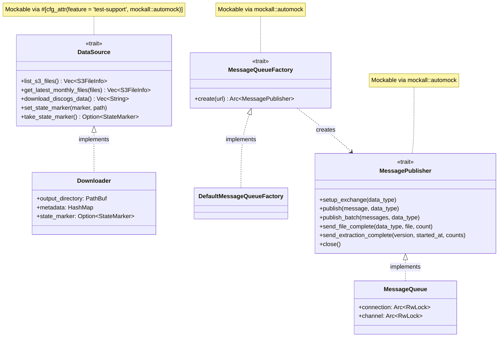

# Extractor

High-performance Rust-based data extractor for the Discogsography platform, supporting both Discogs and MusicBrainz data sources.

## Overview

Extractor is a high-performance Rust service that streams and parses Discogs XML data dumps and MusicBrainz JSONL database dumps, sending processed records to RabbitMQ for consumption by downstream services (Graphinator and Tableinator).

## Features

- **High Performance**: Leverages Rust's zero-cost abstractions and efficient XML streaming
- **Low Memory Usage**: Streaming parser maintains minimal memory footprint (~5-10MB)
- **Concurrent Processing**: Multi-threaded extraction with configurable worker pools
- **Resilient Connections**: Automatic reconnection to RabbitMQ with exponential backoff
- **Health Monitoring**: HTTP health endpoints for container orchestration
- **Progress Tracking**: Real-time extraction metrics and progress reporting
- **Periodic Checks**: Automatic checking for new Discogs data dumps
- **State Marker System**: Version-specific progress tracking for safe restarts (no duplicate processing)

## Credits

This implementation is inspired by and references the excellent [disco-quick](https://github.com/sublipri/disco-quick)
library by sublipri, which demonstrated the incredible performance gains possible with Rust-based XML parsing for
Discogs data.

## Performance Benchmarks

Observed end-to-end throughput (XML parsing + RabbitMQ publishing, March 2026 dataset):

| Data Type | Avg Records/Second | Peak Records/Second | Memory Usage |
| --------- | ------------------ | ------------------- | ------------ |
| Artists   | ~132               | ~437                | ~5MB         |
| Labels    | ~162               | ~437                | ~5MB         |
| Masters   | ~156               | ~437                | ~8MB         |
| Releases  | ~130               | ~477                | ~10MB        |

> **Note**: Throughput is limited by RabbitMQ publishing and consumer backpressure, not XML parsing speed.

## Configuration

Extractor is configured via environment variables.

### Environment Variables

- `RABBITMQ_USERNAME`: RabbitMQ username (default: `discogsography`; also supports `RABBITMQ_USERNAME_FILE` for Docker secrets)
- `RABBITMQ_PASSWORD`: RabbitMQ password (default: `discogsography`; also supports `RABBITMQ_PASSWORD_FILE` for Docker secrets)
- `RABBITMQ_HOST`: RabbitMQ hostname (default: `rabbitmq`)
- `RABBITMQ_PORT`: RabbitMQ port (default: `5672`)
- `DISCOGS_ROOT`: Directory for Discogs data (default: `/discogs-data`)
- `PERIODIC_CHECK_DAYS`: Days between checks for new data (default: `15`)
- `LOG_LEVEL`: Logging level - DEBUG, INFO, WARNING, ERROR, CRITICAL (default: `INFO`)
- `MAX_WORKERS`: Number of worker threads (default: CPU count)
- `BATCH_SIZE`: Message batch size for AMQP (default: `100`)
- `FORCE_REPROCESS`: Force reprocessing of all files (default: `false`; CLI argument with env override)
- `DATA_QUALITY_RULES`: Path to YAML rules file for data quality validation (optional; also available as `--data-quality-rules` CLI arg)

The health server port is fixed at **8000**.

## Building

### Local Development

```bash
# Build debug version
cargo build

# Build release version
cargo build --release

# Run tests
cargo test

# Run with debug logging
LOG_LEVEL=DEBUG cargo run

# Run with default (INFO) logging
cargo run
```

### Docker

```bash
# Build image
docker build -t extractor .

# Run container
docker run -e RABBITMQ_HOST=rabbitmq extractor
```

## Testing

```bash
# Run all tests
cargo test

# Run with coverage (requires cargo-llvm-cov)
cargo llvm-cov --html

# Run benchmarks
cargo bench
```

## State Marker System

Extractor uses a version-specific state marker system to track extraction progress and enable safe restarts:

### Features

- **Version-Specific Tracking**: Each Discogs version (e.g., `20260101`) gets its own state marker file
- **Multi-Phase Monitoring**: Tracks download, processing, publishing, and overall status
- **Smart Resume Logic**: Automatically decides whether to reprocess, continue, or skip on restart
- **Per-File Progress**: Detailed tracking of individual file processing status
- **Error Recovery**: Records errors at each phase for debugging and recovery

### State Marker File

Location: `/discogs-data/.extraction_status_<version>.json`

Example:

```json
{
  "current_version": "20260101",
  "download_phase": {
    "status": "completed",
    "files_downloaded": 4,
    "bytes_downloaded": 5234567890
  },
  "processing_phase": {
    "status": "in_progress",
    "files_processed": 2,
    "records_extracted": 1234567,
    "progress_by_file": {
      "discogs_20260101_artists.xml.gz": {
        "status": "completed",
        "records_extracted": 500000
      }
    }
  },
  "summary": {
    "overall_status": "in_progress"
  }
}
```

### Processing Decisions

When the extractor restarts, it checks the state marker and decides:

| Scenario               | Decision      | Action                  |
| ---------------------- | ------------- | ----------------------- |
| Download failed        | **Reprocess** | Re-download everything  |
| Processing in progress | **Continue**  | Resume unfinished files |
| All completed          | **Skip**      | Wait for next check     |

See **[State Marker System](../docs/state-marker-system.md)** for complete documentation.

## Data Quality Rules

Extractor includes a configurable rule engine that validates parsed records against YAML-defined quality rules. The validator runs as an observation-only pipeline stage — all records pass through regardless of violations, so rules never block extraction.

### Enabling Rules

Provide a path to a YAML rules file via environment variable or CLI argument:

```bash
# Environment variable
DATA_QUALITY_RULES=/path/to/extraction-rules.yaml cargo run

# CLI argument
cargo run -- --data-quality-rules /path/to/extraction-rules.yaml
```

In Docker, the default `extraction-rules.yaml` is mounted read-only into the container via docker-compose.

### Rule File Format

Rules are grouped by data type (`releases`, `artists`, `labels`, `masters`). Each rule specifies a `name`, `description`, `field`, `condition`, and `severity`:

```yaml
rules:
  releases:
    - name: year-out-of-range
      description: "Release year is before 1860 or after current year + 1"
      field: year
      condition:
        type: range
        min: 1860
        max: 2027
      severity: warning

    - name: genre-is-numeric
      description: "Genre value is purely numeric — likely a parsing error"
      field: genres.genre
      condition:
        type: regex
        pattern: "^\\d+$"
      severity: error
```

### Condition Types

| Type         | Parameters              | Description                                                                         |
| ------------ | ----------------------- | ----------------------------------------------------------------------------------- |
| **required** | *(none)*                | Field must exist and not be empty/null                                              |
| **range**    | `min`, `max` (optional) | Numeric value must fall within bounds                                               |
| **regex**    | `pattern`               | Field value must match (or *not* match, depending on rule intent) the regex pattern |
| **length**   | `min`, `max` (optional) | String length must fall within bounds                                               |
| **enum**     | `values` (list)         | Field value must be one of the listed values                                        |

### Severity Levels

| Level       | Description                                                         |
| ----------- | ------------------------------------------------------------------- |
| **error**   | Definite data problem (e.g., missing required field, numeric genre) |
| **warning** | Likely data problem (e.g., year out of expected range)              |
| **info**    | Informational flag for review                                       |

### Dot-Notation Field Paths

Fields support dot-notation for nested access. When a path traverses an array, each element is evaluated individually:

- `title` — top-level field
- `genres.genre` — accesses the `genre` field inside each element of the `genres` array
- `artists.name` — accesses `name` inside each element of `artists`

### Output

When rules are configured, the validator produces:

- **Flagged record files**: Per-record XML, JSON, and JSONL files organized by `<version>/<data_type>/` for manual inspection
- **Quality report**: Summary of per-rule violation counts printed at extraction completion

### Default Rules

The shipped `extraction-rules.yaml` includes:

| Data Type | Rule                 | Condition                      | Severity |
| --------- | -------------------- | ------------------------------ | -------- |
| releases  | year-out-of-range    | range 1860–2027                | warning  |
| releases  | missing-title        | required                       | error    |
| releases  | genre-not-recognized | enum (15 known Discogs genres) | warning  |
| releases  | genre-is-numeric     | regex `^\d+$`                  | error    |
| artists   | empty-artist-name    | required                       | error    |
| labels    | empty-label-name     | required                       | error    |
| masters   | year-out-of-range    | range 1860–2027                | warning  |

> **Note**: The `max` value in year-range rules is static and should be bumped to `current_year + 1` at the start of each year.

## Architecture

Extractor uses a streaming pipeline architecture with trait-based dependency injection for testability:

### Pipeline Stages

1. **Downloader**: Fetches latest Discogs dumps from S3
1. **Parser**: Streams XML using quick-xml, extracting records (with optional raw XML reconstruction)
1. **Validator** *(optional)*: Evaluates records against YAML-defined quality rules, writes flagged records — observation-only, non-blocking
1. **Batcher**: Groups records for efficient AMQP publishing
1. **Publisher**: Sends batched messages to RabbitMQ fanout exchanges
1. **State Tracker**: Updates progress markers at each phase

### Trait-Based Dependency Injection

The extractor uses three core traits to decouple components and enable comprehensive mocking in tests:



| Trait                     | Purpose                                                                  | Production Impl              | Test Mock                           |
| ------------------------- | ------------------------------------------------------------------------ | ---------------------------- | ----------------------------------- |
| **`DataSource`**          | S3 file listing, downloading, state marker management                    | `Downloader`                 | `MockDataSource` (mockall)          |
| **`MessagePublisher`**    | AMQP exchange setup, message publishing, completion signals              | `MessageQueue`               | `MockMessagePublisher` (mockall)    |
| **`MessageQueueFactory`** | Creates `MessagePublisher` instances (enables per-data-type connections) | `DefaultMessageQueueFactory` | `MockMessageQueueFactory` (mockall) |

All traits use the `#[async_trait]` attribute for async method support and `#[cfg_attr(feature = "test-support", mockall::automock)]` for conditional mock generation. The `test-support` feature flag ensures mock code is only compiled during testing.

The main entry point `process_discogs_data()` accepts trait objects (`&mut dyn DataSource`, `Arc<dyn MessageQueueFactory>`) rather than concrete types, allowing tests to inject mocks for S3, RabbitMQ, and state marker operations without any network dependencies.

### Module Structure

| Module                      | Responsibility                                                                                                      |
| --------------------------- | ------------------------------------------------------------------------------------------------------------------- |
| `lib.rs`                    | Library crate root — re-exports all public modules for integration testing                                          |
| `main.rs`                   | Entry point, CLI args, health server, periodic check loop                                                           |
| `extractor.rs`              | Core orchestration: download → parse → publish pipeline (Discogs and MusicBrainz)                                   |
| `discogs_downloader.rs`     | S3 file discovery, download with retry, checksum validation (Discogs mode)                                          |
| `musicbrainz_downloader.rs` | Local dump file discovery and version detection (MusicBrainz mode)                                                  |
| `parser.rs`                 | Streaming XML parser using quick-xml (artists, labels, masters, releases)                                           |
| `jsonl_parser.rs`           | MusicBrainz JSONL parser — xz decompression, record parsing, MBID→Discogs ID mapping, relation enrichment           |
| `message_queue.rs`          | AMQP connection management, exchange declaration, batch publishing                                                  |
| `state_marker.rs`           | Version-specific progress tracking, resume decisions                                                                |
| `rules.rs`                  | Data quality rule engine — YAML loading, compilation, condition evaluation, flagged record writing, quality reports |
| `types.rs`                  | Data types (DataType, DataMessage, Message, S3FileInfo, etc.)                                                       |
| `config.rs`                 | Environment variable configuration                                                                                  |
| `health.rs`                 | HTTP health/metrics/readiness endpoints                                                                             |

## MusicBrainz Mode

The extractor supports parsing MusicBrainz JSONL database dumps in addition to Discogs XML dumps.

### Usage

```bash
# Discogs mode (default)
extractor --source discogs

# MusicBrainz mode
extractor --source musicbrainz
```

### Environment Variables (MusicBrainz)

| Variable                      | Default                      | Description                               |
| ----------------------------- | ---------------------------- | ----------------------------------------- |
| `EXTRACTOR_SOURCE`            | `discogs`                    | Data source: `discogs` or `musicbrainz`   |
| `MUSICBRAINZ_ROOT`            | `/musicbrainz-data`          | Directory containing MB JSONL dump files  |
| `DISCOGS_EXCHANGE_PREFIX`     | `discogsography-discogs`     | Exchange name prefix for Discogs mode     |
| `MUSICBRAINZ_EXCHANGE_PREFIX` | `discogsography-musicbrainz` | Exchange name prefix for MusicBrainz mode |

### MusicBrainz Dump Files

Place xz-compressed JSONL dump files in the `MUSICBRAINZ_ROOT` directory:

- `artist.jsonl.xz`
- `label.jsonl.xz`
- `release-group.jsonl.xz`
- `release.jsonl.xz`

### Fanout Exchanges

In MusicBrainz mode, the extractor publishes to 4 fanout exchanges:

- `discogsography-musicbrainz-artists`
- `discogsography-musicbrainz-labels`
- `discogsography-musicbrainz-release-groups`
- `discogsography-musicbrainz-releases`

> **Docker Compose**: The extractor runs as two separate services — `extractor-discogs` and `extractor-musicbrainz` — each with its own container and `EXTRACTOR_SOURCE` env var.

### Two-Pass Processing

For artist data, the extractor performs two passes:

1. **First pass**: Builds an MBID→Discogs ID lookup map by scanning URL relationships
1. **Second pass**: Parses full records and enriches relationship targets with resolved Discogs IDs

### State Markers

Progress is tracked via `.mb_extraction_status_{version}.json` files, separate from Discogs markers.

## Logging

Extractor uses structured JSON logging with emoji indicators:

- 🚀 Service starting
- 📥 Download operations
- 📊 Progress updates
- ✅ Successful operations
- ⚠️ Warnings
- ❌ Errors
- 🛑 Shutdown events
- 🎉 Completion milestones

### Log Levels

Set the `LOG_LEVEL` environment variable to control logging verbosity:

- `DEBUG`: Detailed diagnostic information
- `INFO`: General informational messages (default)
- `WARNING`: Warning messages for potential issues
- `ERROR`: Error messages for failures
- `CRITICAL`: Critical errors (mapped to ERROR in Rust)

## Health Endpoints

- `GET /health`: Service health status with current metrics
- `GET /metrics`: Prometheus-compatible metrics
- `GET /ready`: Readiness probe for container orchestration

### Extraction Status Lifecycle

The `/health` response includes an `extraction_status` field that reports where the extractor is in its lifecycle. The same five values apply to both Discogs and MusicBrainz modes.

```mermaid
stateDiagram-v2
    [*] --> Idle

    Idle : idle
    Idle : initial state before any run

    Running : running
    Running : actively processing

    Completed : completed
    Completed : transient success<br/>(end of process_*_data)

    Waiting : waiting
    Waiting : sleeping until next<br/>periodic check

    Failed : failed
    Failed : last run failed;<br/>preserved through sleep<br/>for operator visibility

    Idle --> Running : initial run or trigger
    Running --> Completed : Ok(true)
    Running --> Failed : Err or Ok(false)
    Completed --> Waiting : run_*_loop before sleep
    Waiting --> Running : periodic wake or trigger
    Failed --> Running : next periodic attempt or trigger
```



**Transition points in code** (`extractor/src/extractor.rs`):

| Transition | Set by | Line |
|---|---|---|
| `Idle → Running` | `process_discogs_data` / `process_musicbrainz_data` | top of function |
| `Running → Completed` | same functions, on success | end of function |
| `Running → Failed` | same functions, on error | end of function |
| Early-skip → `Completed` | same functions, on `Skip` / empty-file paths | each early return |
| `Completed → Waiting` | `run_discogs_loop` / `run_musicbrainz_loop` | immediately before `sleep(periodic_check_days)` |
| `Waiting → Running` | next invocation of `process_*_data` | via periodic wake or `/trigger` API call |
| `Failed → Running` | same | `Failed` persists through sleep and is overwritten by the next attempt |

**Design notes:**

- `Completed` is transient by design. It lives for microseconds between the end of a successful run and the loop's next iteration, at which point it becomes `Waiting`. Keeping `Completed` as a distinct value lets single-shot test paths (which call `process_*_data` without a surrounding loop) observe a clean terminal state, and preserves a race-window catch for external pollers.
- `Waiting` is the dominant observable success state. Downstream consumers treat it as terminal success equivalent to `Completed`:
  - The MusicBrainz extractor's `wait_for_discogs_idle` proceeds on any status ≠ `running`, so `Waiting` unblocks MusicBrainz extraction immediately instead of making it wait for the next Discogs periodic cycle.
  - The admin dashboard's `_track_extraction` polls `/health` every 10 seconds during a manually-triggered run and accepts both `completed` and `waiting` as terminal success — it writes whichever value it observed verbatim to `extraction_history.status` so operators can tell a freshly-finished run from one already back on the schedule.
- `Failed` is **not** overwritten by the loop's `Completed → Waiting` transition. A failed run's status persists through the 5-day sleep window so operators can see the last attempt failed, and only flips back to `Running` when the next attempt begins.

## Integration

Extractor integrates with the Discogsography platform:

- **Discogs mode**: Publishes to 4 RabbitMQ fanout exchanges (`discogsography-discogs-{artists,labels,masters,releases}`) consumed by Graphinator (Neo4j) and Tableinator (PostgreSQL)
- **MusicBrainz mode**: Publishes to 3 RabbitMQ fanout exchanges (`discogsography-musicbrainz-{artists,labels,releases}`) with MBID→Discogs ID cross-referencing
- Provides HTTP health, metrics, and readiness endpoints

## License

MIT
