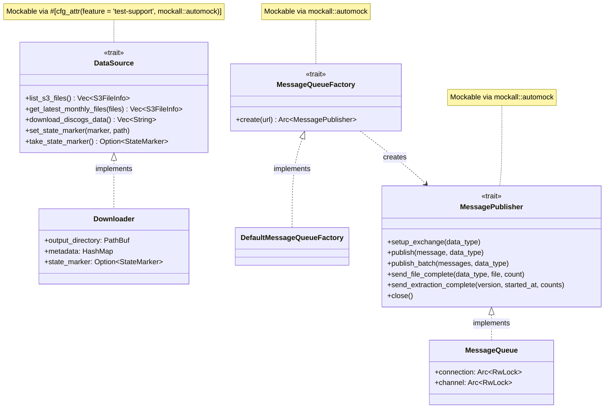

# Extractor

High-performance Rust-based Discogs data extractor for the Discogsography platform.

## Overview

Extractor is a high-performance Rust service that streams and parses Discogs XML data dumps, sending processed
records to RabbitMQ for consumption by downstream services (Graphinator and Tableinator).

## Features

- **High Performance**: Leverages Rust's zero-cost abstractions and efficient XML streaming
- **Low Memory Usage**: Streaming parser maintains minimal memory footprint (~5-10MB)
- **Concurrent Processing**: Multi-threaded extraction with configurable worker pools
- **Resilient Connections**: Automatic reconnection to RabbitMQ with exponential backoff
- **Health Monitoring**: HTTP health endpoints for container orchestration
- **Progress Tracking**: Real-time extraction metrics and progress reporting
- **Periodic Checks**: Automatic checking for new Discogs data dumps
- **State Marker System**: Version-specific progress tracking for safe restarts (no duplicate processing)

## Credits

This implementation is inspired by and references the excellent [disco-quick](https://github.com/sublipri/disco-quick)
library by sublipri, which demonstrated the incredible performance gains possible with Rust-based XML parsing for
Discogs data.

## Performance Benchmarks

Observed end-to-end throughput (XML parsing + RabbitMQ publishing, March 2026 dataset):

| Data Type | Avg Records/Second | Peak Records/Second | Memory Usage |
| --------- | ------------------ | ------------------- | ------------ |
| Artists   | ~132               | ~437                | ~5MB         |
| Labels    | ~162               | ~437                | ~5MB         |
| Masters   | ~156               | ~437                | ~8MB         |
| Releases  | ~130               | ~477                | ~10MB        |

> **Note**: Throughput is limited by RabbitMQ publishing and consumer backpressure, not XML parsing speed.

## Configuration

Extractor is configured via environment variables.

### Environment Variables

- `RABBITMQ_USERNAME`: RabbitMQ username (default: `discogsography`; also supports `RABBITMQ_USERNAME_FILE` for Docker secrets)
- `RABBITMQ_PASSWORD`: RabbitMQ password (default: `discogsography`; also supports `RABBITMQ_PASSWORD_FILE` for Docker secrets)
- `RABBITMQ_HOST`: RabbitMQ hostname (default: `rabbitmq`)
- `RABBITMQ_PORT`: RabbitMQ port (default: `5672`)
- `DISCOGS_ROOT`: Directory for Discogs data (default: `/discogs-data`)
- `PERIODIC_CHECK_DAYS`: Days between checks for new data (default: `15`)
- `LOG_LEVEL`: Logging level - DEBUG, INFO, WARNING, ERROR, CRITICAL (default: `INFO`)
- `MAX_WORKERS`: Number of worker threads (default: CPU count)
- `BATCH_SIZE`: Message batch size for AMQP (default: `100`)
- `FORCE_REPROCESS`: Force reprocessing of all files (default: `false`; CLI argument with env override)

The health server port is fixed at **8000**.

## Building

### Local Development

```bash
# Build debug version
cargo build

# Build release version
cargo build --release

# Run tests
cargo test

# Run with debug logging
LOG_LEVEL=DEBUG cargo run

# Run with default (INFO) logging
cargo run
```

### Docker

```bash
# Build image
docker build -t extractor .

# Run container
docker run -e RABBITMQ_HOST=rabbitmq extractor
```

## Testing

```bash
# Run all tests
cargo test

# Run with coverage (requires cargo-llvm-cov)
cargo llvm-cov --html

# Run benchmarks
cargo bench
```

## State Marker System

Extractor uses a version-specific state marker system to track extraction progress and enable safe restarts:

### Features

- **Version-Specific Tracking**: Each Discogs version (e.g., `20260101`) gets its own state marker file
- **Multi-Phase Monitoring**: Tracks download, processing, publishing, and overall status
- **Smart Resume Logic**: Automatically decides whether to reprocess, continue, or skip on restart
- **Per-File Progress**: Detailed tracking of individual file processing status
- **Error Recovery**: Records errors at each phase for debugging and recovery

### State Marker File

Location: `/discogs-data/.extraction_status_<version>.json`

Example:

```json
{
  "current_version": "20260101",
  "download_phase": {
    "status": "completed",
    "files_downloaded": 4,
    "bytes_downloaded": 5234567890
  },
  "processing_phase": {
    "status": "in_progress",
    "files_processed": 2,
    "records_extracted": 1234567,
    "progress_by_file": {
      "discogs_20260101_artists.xml.gz": {
        "status": "completed",
        "records_extracted": 500000
      }
    }
  },
  "summary": {
    "overall_status": "in_progress"
  }
}
```

### Processing Decisions

When the extractor restarts, it checks the state marker and decides:

| Scenario               | Decision      | Action                  |
| ---------------------- | ------------- | ----------------------- |
| Download failed        | **Reprocess** | Re-download everything  |
| Processing in progress | **Continue**  | Resume unfinished files |
| All completed          | **Skip**      | Wait for next check     |

See **[State Marker System](../docs/state-marker-system.md)** for complete documentation.

## Architecture

Extractor uses a streaming pipeline architecture with trait-based dependency injection for testability:

### Pipeline Stages

1. **Downloader**: Fetches latest Discogs dumps from S3
1. **Parser**: Streams XML using quick-xml, extracting records
1. **Batcher**: Groups records for efficient AMQP publishing
1. **Publisher**: Sends batched messages to RabbitMQ fanout exchanges
1. **State Tracker**: Updates progress markers at each phase

### Trait-Based Dependency Injection

The extractor uses three core traits to decouple components and enable comprehensive mocking in tests:



| Trait | Purpose | Production Impl | Test Mock |
|-------|---------|----------------|-----------|
| **`DataSource`** | S3 file listing, downloading, state marker management | `Downloader` | `MockDataSource` (mockall) |
| **`MessagePublisher`** | AMQP exchange setup, message publishing, completion signals | `MessageQueue` | `MockMessagePublisher` (mockall) |
| **`MessageQueueFactory`** | Creates `MessagePublisher` instances (enables per-data-type connections) | `DefaultMessageQueueFactory` | `MockMessageQueueFactory` (mockall) |

All traits use the `#[async_trait]` attribute for async method support and `#[cfg_attr(feature = "test-support", mockall::automock)]` for conditional mock generation. The `test-support` feature flag ensures mock code is only compiled during testing.

The main entry point `process_discogs_data()` accepts trait objects (`&mut dyn DataSource`, `Arc<dyn MessageQueueFactory>`) rather than concrete types, allowing tests to inject mocks for S3, RabbitMQ, and state marker operations without any network dependencies.

### Module Structure

| Module | Responsibility |
|--------|---------------|
| `main.rs` | Entry point, CLI args, health server, periodic check loop |
| `extractor.rs` | Core orchestration: download → parse → publish pipeline |
| `downloader.rs` | S3 file discovery, download with retry, checksum validation |
| `parser.rs` | Streaming XML parser using quick-xml (artists, labels, masters, releases) |
| `message_queue.rs` | AMQP connection management, exchange declaration, batch publishing |
| `state_marker.rs` | Version-specific progress tracking, resume decisions |
| `types.rs` | Data types (DataType, DataMessage, Message, S3FileInfo, etc.) |
| `config.rs` | Environment variable configuration |
| `health.rs` | HTTP health/metrics/readiness endpoints |

## Logging

Extractor uses structured JSON logging with emoji indicators:

- 🚀 Service starting
- 📥 Download operations
- 📊 Progress updates
- ✅ Successful operations
- ⚠️ Warnings
- ❌ Errors
- 🛑 Shutdown events
- 🎉 Completion milestones

### Log Levels

Set the `LOG_LEVEL` environment variable to control logging verbosity:

- `DEBUG`: Detailed diagnostic information
- `INFO`: General informational messages (default)
- `WARNING`: Warning messages for potential issues
- `ERROR`: Error messages for failures
- `CRITICAL`: Critical errors (mapped to ERROR in Rust)

## Health Endpoints

- `GET /health`: Service health status with current metrics
- `GET /metrics`: Prometheus-compatible metrics
- `GET /ready`: Readiness probe for container orchestration

## Integration

Extractor integrates with the Discogsography platform:

- Publishes to 4 RabbitMQ fanout exchanges (one per data type) consumed by Graphinator (Neo4j) and Tableinator (PostgreSQL)
- Supports all four data types: artists, labels, masters, releases
- Provides HTTP health, metrics, and readiness endpoints

## License

MIT
