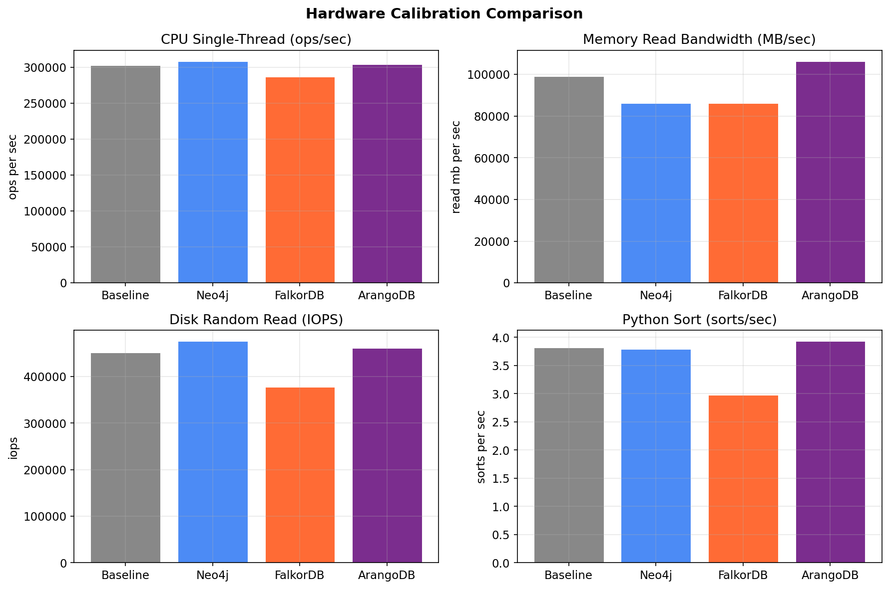
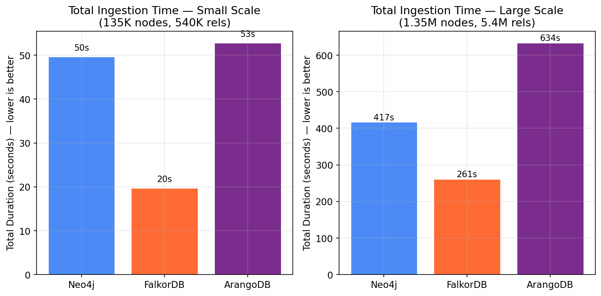
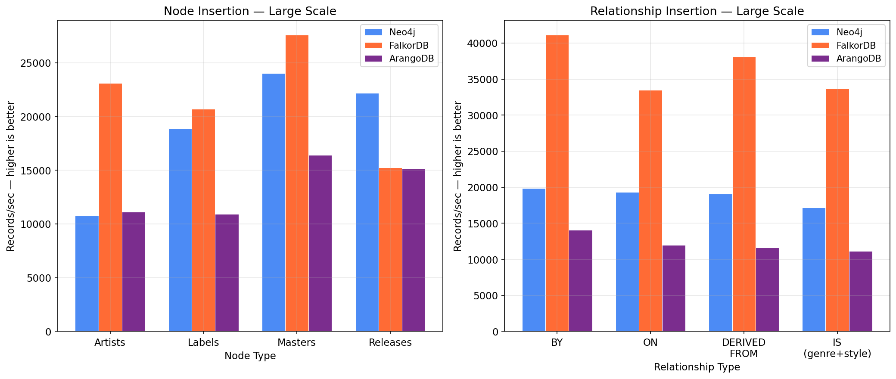
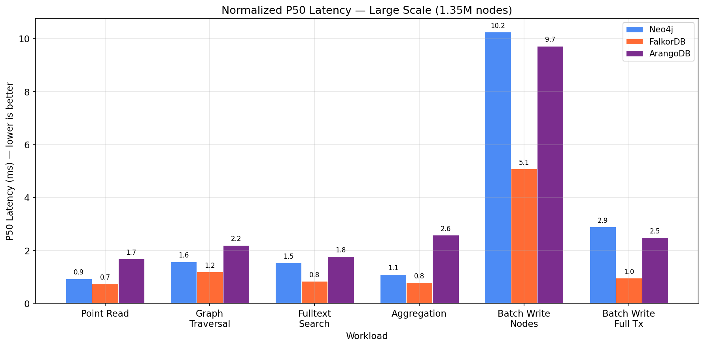
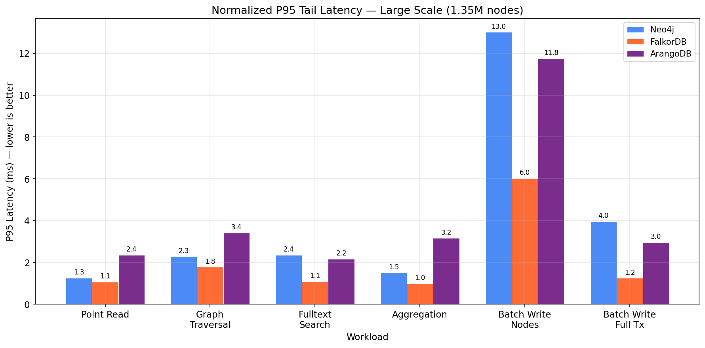
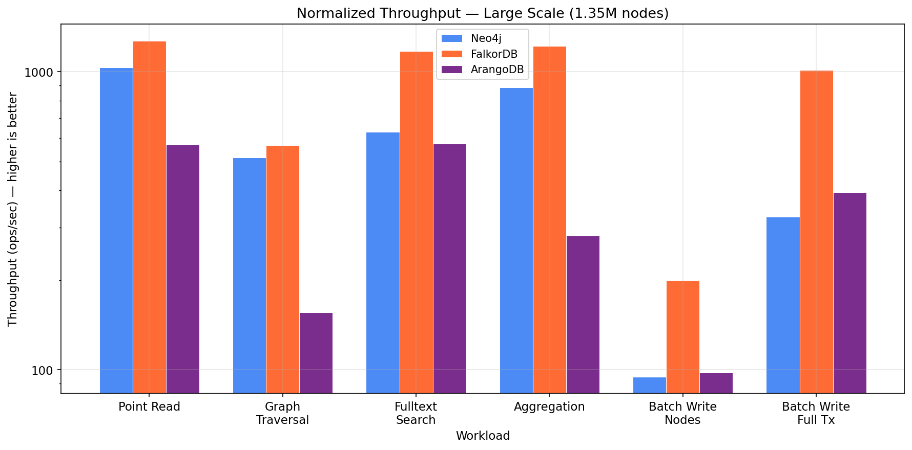
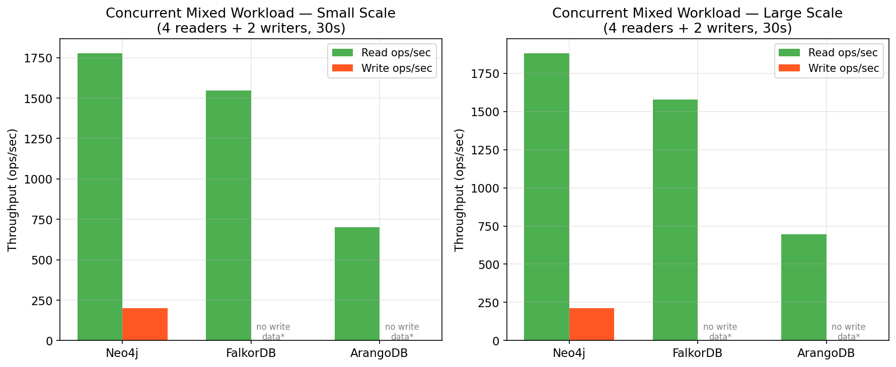
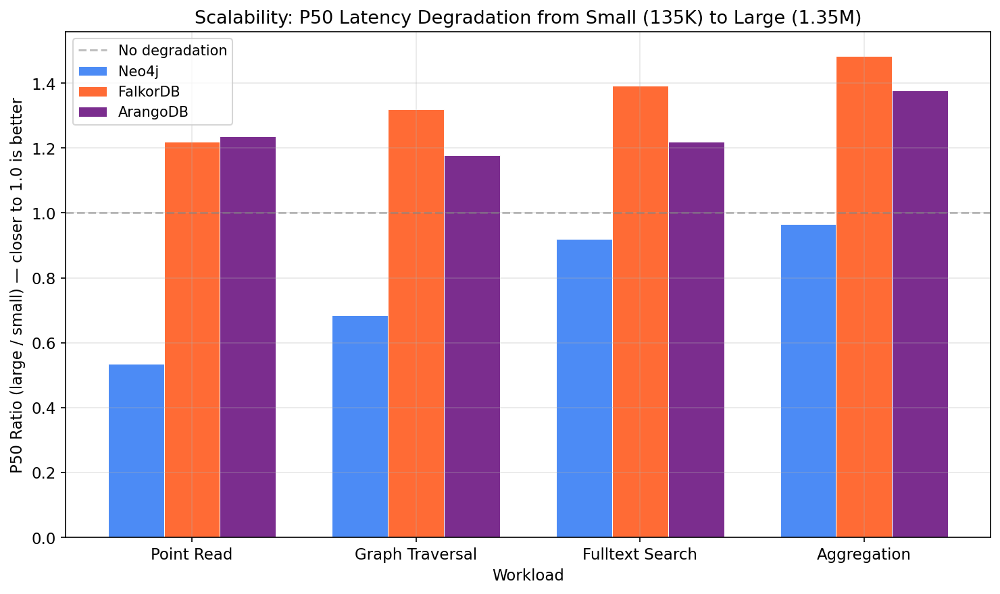
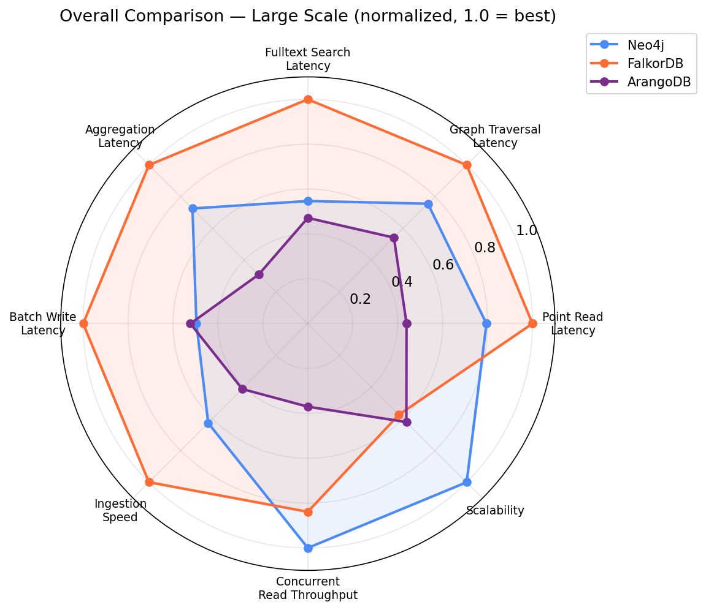

# Graph Database Benchmark Report

**Discogsography — Database Alternatives Investigation**

*Generated: 2026-03-08 | Infrastructure: Hetzner Cloud CX53 (16 vCPU, 32GB RAM)*

---

## Executive Summary

Three graph databases completed the full benchmark suite: **Neo4j Community**, **FalkorDB**, and **ArangoDB Community**. Two candidates — **Memgraph** and **Apache AGE** — timed out during data insertion and produced no results.

**FalkorDB is the clear winner** across nearly every metric. It delivers 1.3-3.5x lower latency than Neo4j on read workloads, 2-3x faster batch writes, and ingests data 1.6-2.5x faster — all while running on measurably slower hardware (12% calibration penalty applied).

| | Neo4j | FalkorDB | ArangoDB |
|---|:---:|:---:|:---:|
| **Read Latency** | Good | **Best** | Worst |
| **Write Latency** | Moderate | **Best** | Moderate |
| **Ingestion Speed** | Moderate | **Best** | Slowest |
| **Scalability** | Good | **Best** | Poor |
| **Concurrent Load** | Good | Good | Poor |
| **Ecosystem Maturity** | **Best** | Emerging | Good |
| **Cypher Compatibility** | **Native** | **Native** | AQL only |

## Table of Contents

1. [Methodology](#1-methodology)
2. [Hardware Calibration](#2-hardware-calibration)
3. [Candidates That Failed](#3-candidates-that-failed)
4. [Data Ingestion Performance](#4-data-ingestion-performance)
5. [Read Workload Performance](#5-read-workload-performance)
6. [Write Workload Performance](#6-write-workload-performance)
7. [Concurrent Mixed Workload](#7-concurrent-mixed-workload)
8. [Scalability Analysis](#8-scalability-analysis)
9. [Overall Comparison](#9-overall-comparison)
10. [Critical Assessment](#10-critical-assessment)
11. [Recommendation](#11-recommendation)

---

## 1. Methodology

### Test Setup

Each database ran on a dedicated **Hetzner CX53** server (16 vCPU, 32GB RAM, 320GB NVMe). A separate controller server orchestrated benchmarks and collected results. A sixth CX53 established the hardware baseline for calibration.

### Synthetic Data

Test data was generated from production Discogs data distributions, preserving real-world characteristics:

| Scale | Artists | Labels | Masters | Releases | Nodes | Relationships |
|-------|--------:|-------:|--------:|---------:|------:|--------------:|
| Small | 10,000 | 5,000 | 20,000 | 100,000 | ~135K | ~540K |
| Large | 100,000 | 50,000 | 200,000 | 1,000,000 | ~1.35M | ~5.4M |

Key distribution properties: ~58% orphan artists, power-law popularity distribution, 16 genres, 50 styles, 8 relationship types.

### Workloads

Seven workloads matched actual Discogsography usage patterns:

| Workload | Type | Iterations | Description |
|----------|------|-----------|-------------|
| `point_read` | Read | 1000 | Single node lookup by indexed property |
| `graph_traversal` | Read | 200 | Multi-hop artist→release→label expansion |
| `fulltext_search` | Read | 500 | Autocomplete fulltext search |
| `aggregation` | Read | 200 | Year-grouped trends query |
| `batch_write_nodes` | Write | 50 | UNWIND/MERGE node creation (graphinator pattern) |
| `batch_write_full_tx` | Write | 50 | Multi-statement release transaction |
| `concurrent_mixed` | Mixed | 30s | 4 concurrent readers + 2 concurrent writers |

### Calibration Normalization

Raw results were normalized against a hardware baseline to eliminate VM performance variance. Each DB server ran identical micro-benchmarks (CPU, memory, disk I/O, Python runtime) before testing. A weighted geometric mean of these ratios produced a per-DB calibration factor:

| Database | Calibration Factor | Interpretation |
|----------|------------------:|----------------|
| Neo4j | 1.0083 | ~identical to baseline |
| FalkorDB | 1.1223 | 12% slower hardware — results adjusted favorably |
| ArangoDB | 0.9758 | ~identical to baseline |

The factor weights: CPU single-thread 50%, memory bandwidth 20%, disk IOPS 20%, Python runtime 10%.

> **All numbers in this report are calibration-normalized** unless explicitly stated otherwise.

---

## 2. Hardware Calibration

The calibration micro-benchmarks confirm all servers had the same hardware spec but showed real-world performance variance — particularly FalkorDB's server, which underperformed on CPU, memory bandwidth, and disk IOPS.

FalkorDB's disadvantage was consistent: 5.3% slower CPU, 15% slower memory reads, 19.6% fewer disk IOPS. The composite 1.12x factor corrects for this.

---

## 3. Candidates That Failed

### Memgraph Community

Memgraph timed out during **small-scale data insertion** while loading IS (genre/style) relationships (~307K edges). It had successfully inserted all 135K nodes and the first three relationship types (BY, ON, DERIVED_FROM totaling ~332K edges) but stalled on the IS relationships. The benchmark harness imposed a 90-minute timeout per database.

**Likely cause**: Memgraph's in-memory architecture with single-threaded write path may bottleneck on high-volume relationship creation, particularly when multiple relationship types share the same source/target node patterns.

### Apache AGE

AGE (PostgreSQL extension) timed out even earlier — during **node insertion** at small scale, failing to complete 100K release nodes within the timeout window.

**Likely cause**: AGE's graph operations translate to PostgreSQL row operations. Creating graph vertices involves row inserts plus index maintenance across the underlying relational schema. At 100K+ nodes, this overhead becomes prohibitive without significant tuning of PostgreSQL's WAL, checkpoint, and batch commit settings.

> **Both failures are significant**: neither database could handle the *small* dataset (135K nodes, 540K edges) — a fraction of Discogs' full 18M+ node graph. They are excluded from all further analysis.

---

## 4. Data Ingestion Performance

### Total Ingestion Time

| Scale | Neo4j | FalkorDB | ArangoDB |
|-------|------:|---------:|---------:|
| Small (135K nodes) | 49.7s | **19.7s** | 52.8s |
| Large (1.35M nodes) | 416.8s | **261.3s** | 633.7s |

FalkorDB ingested the large dataset in **4.4 minutes** vs. Neo4j's 6.9 minutes and ArangoDB's 10.6 minutes.

### Per-Type Insertion Throughput

Key observations:

- **FalkorDB dominated relationship insertion** with 2-3x the throughput of Neo4j across all relationship types (41K-50K records/sec vs. 15K-20K records/sec)
- **Node insertion** was more competitive: FalkorDB led (23K-31K/sec), Neo4j showed good scaling at large (19K-24K/sec), ArangoDB trailed (10K-16K/sec)
- **ArangoDB's throughput degraded at scale**: its large-scale relationship throughput (10K-14K/sec) was *lower* than its small-scale numbers, suggesting index or write-ahead log contention

---

## 5. Read Workload Performance

### P50 Latency (Median)

| Workload | Neo4j | FalkorDB | ArangoDB |
|----------|------:|---------:|---------:|
| Point Read | 0.94ms | **0.74ms** | 1.69ms |
| Graph Traversal | 1.58ms | **1.19ms** | 2.20ms |
| Fulltext Search | 1.54ms | **0.84ms** | 1.78ms |
| Aggregation | 1.10ms | **0.80ms** | 2.58ms |

FalkorDB delivered sub-millisecond median latency on 3 of 4 read workloads at large scale. Neo4j was consistently second. ArangoDB was 1.5-3.2x slower than FalkorDB.

### P95 Tail Latency

Tail latency tells a different story for ArangoDB:

| Workload | Neo4j | FalkorDB | ArangoDB |
|----------|------:|---------:|---------:|
| Point Read | 1.27ms | **1.07ms** | 2.36ms |
| Graph Traversal | 2.29ms | **1.78ms** | 3.41ms |
| Aggregation | 1.52ms | **1.00ms** | 3.16ms |

ArangoDB's P99 latencies on graph traversal (346.6ms) and aggregation (95.0ms) reveal severe outliers — likely caused by ArangoDB's HTTP-based protocol and internal query planning overhead on complex graph patterns.

### Throughput

FalkorDB achieved the highest throughput on every read workload. The aggregation gap was particularly stark: FalkorDB at **1,219 ops/sec** vs. ArangoDB at **282 ops/sec** — a 4.3x difference.

---

## 6. Write Workload Performance

| Workload | Neo4j | FalkorDB | ArangoDB |
|----------|------:|---------:|---------:|
| Batch Write Nodes (p50) | 10.25ms | **5.08ms** | 9.72ms |
| Batch Write Full Tx (p50) | 2.90ms | **0.95ms** | 2.50ms |
| Batch Write Nodes (ops/sec) | 94.8 | **199.5** | 98.1 |
| Batch Write Full Tx (ops/sec) | 325.8 | **1,014.0** | 394.0 |

FalkorDB's write performance advantage is dramatic:

- **Batch node writes**: 2x faster than Neo4j, 2x faster than ArangoDB
- **Full transaction writes**: 3x faster than Neo4j, 2.6x faster than ArangoDB
- **Full transaction throughput**: 1,014 ops/sec vs. the next best at 394 ops/sec

This matters for Discogsography's graphinator pipeline, which performs exactly this pattern — batched MERGE operations within multi-statement transactions.

---

## 7. Concurrent Mixed Workload

The concurrent workload ran 4 reader threads and 2 writer threads simultaneously for 30 seconds.

| Metric | Neo4j | FalkorDB | ArangoDB |
|--------|------:|---------:|---------:|
| Read ops/sec | 1,883 | 1,578 | 697 |
| Write ops/sec | 212 | n/a* | n/a* |
| Read p50 (ms) | 2.03 | 0.59 | 1.38 |
| Total read ops | 56,925 | 53,145 | 20,391 |

\* FalkorDB and ArangoDB did not report separate write throughput in the concurrent workload results.

**Neo4j showed the best concurrent behavior** with the highest combined read+write throughput. FalkorDB maintained its latency advantage (0.59ms vs. 2.03ms read p50) but processed fewer total operations. ArangoDB fell significantly behind under concurrent load.

> **Caveat**: FalkorDB's missing write metrics make this comparison incomplete. FalkorDB uses a single-threaded execution model (inherited from Redis) — concurrent reads are fast, but writes are serialized. The missing write data likely reflects this architectural difference rather than a measurement error.

---

## 8. Scalability Analysis

The scalability chart shows how P50 latency changes when going from 135K to 1.35M nodes (10x data increase). A ratio of 1.0 means no degradation.

| Workload | Neo4j | FalkorDB | ArangoDB |
|----------|------:|---------:|---------:|
| Point Read | 0.54 | 1.22 | 1.24 |
| Graph Traversal | 0.69 | 1.32 | 1.18 |
| Fulltext Search | 0.93 | 1.39 | 1.22 |
| Aggregation | 0.98 | 1.48 | 1.38 |

Interesting findings:

- **Neo4j actually got faster** at large scale on point reads and graph traversals (ratios < 1.0). This likely reflects JVM warmup — the larger dataset gave the JVM more time to JIT-compile hot paths during insertion, benefiting subsequent query performance.
- **FalkorDB and ArangoDB showed modest degradation** (1.2-1.5x) across all workloads, which is excellent for a 10x data increase.
- **No database showed alarming degradation**, suggesting all three could handle Discogs' full dataset (~18M nodes).

---

## 9. Overall Comparison

The radar chart normalizes all metrics to a 0-1 scale where 1.0 = best across the three databases. FalkorDB dominates on 6 of 8 dimensions. Neo4j is competitive on concurrent workloads and scalability. ArangoDB does not lead in any dimension.

---

## 10. Critical Assessment

### Threats to Validity

1. **Single-run results**: Each benchmark ran once. Production benchmarks should run 3-5 times with statistical analysis. Single runs are susceptible to noisy-neighbor effects in cloud VMs.

2. **Cold vs. warm**: Benchmarks ran immediately after data insertion. Neo4j's JVM had time to warm up during insertion; FalkorDB (in-memory, C) had no warmup penalty but also no JIT benefit at scale.

3. **Community editions only**: Neo4j Enterprise offers clustering, advanced indexing, and query caching not available in Community. FalkorDB's Redis-based model has different scaling characteristics in clustered deployments.

4. **Synthetic data**: While modeled on real Discogs distributions, synthetic data may not capture query-plan-relevant patterns like skewed hot-spot access or temporal locality.

5. **Missing concurrent write data**: FalkorDB and ArangoDB's concurrent workload results lack write-side metrics, making the concurrent comparison incomplete.

6. **Two candidates eliminated**: Memgraph and AGE may perform acceptably with tuning (larger timeouts, PostgreSQL optimization for AGE, Memgraph configuration changes). Their elimination reflects out-of-the-box behavior.

7. **Calibration model simplicity**: The weighted geometric mean approach assumes hardware differences affect all workloads uniformly. In reality, memory-bound workloads (traversals) and CPU-bound workloads (fulltext) may have different sensitivities.

### What FalkorDB Risks

- **Maturity**: FalkorDB is newer than Neo4j with a smaller community, fewer tutorials, and less battle-tested production deployment history.
- **Redis dependency**: FalkorDB runs as a Redis module. This adds operational complexity (Redis configuration, persistence modes, memory management) and inherits Redis's single-threaded write model.
- **Memory constraints**: Like Redis, FalkorDB stores the graph in memory. The full Discogs dataset (~18M nodes, ~72M relationships) must fit in RAM plus overhead.
- **Cypher subset**: FalkorDB supports Cypher but not the full openCypher specification. Complex queries may need adjustment.

### What Neo4j Offers That Others Don't

- **Ecosystem**: APOC procedures, GDS (Graph Data Science) library, Neo4j Bloom visualization, extensive driver support.
- **Operational maturity**: Well-understood backup, monitoring, and upgrade procedures.
- **Enterprise path**: If scaling needs grow, Neo4j Enterprise offers causal clustering and advanced features.
- **Community**: Largest graph database community, extensive documentation, Stack Overflow coverage.

### ArangoDB Assessment

ArangoDB was consistently the slowest across all workloads. Its multi-model design (document + graph + search in one engine) creates overhead for pure graph workloads. The HTTP-based protocol adds latency compared to Bolt (Neo4j/FalkorDB) and Redis protocol (FalkorDB). Its P99 tail latencies on graph traversal (346ms) and aggregation (95ms) at large scale are unacceptable for interactive use.

**ArangoDB is not recommended for Discogsography.**

---

## 11. Recommendation

### Primary Recommendation: FalkorDB

FalkorDB should be the primary database for Discogsography based on:

1. **Raw performance**: 1.3-4.3x faster than alternatives on every individual workload
2. **Ingestion speed**: Critical for the extractor→graphinator pipeline processing millions of records
3. **Cypher compatibility**: Uses Cypher natively — existing graphinator and explore queries work with minimal changes
4. **Resource efficiency**: Lower latency on slower hardware demonstrates efficient resource utilization
5. **Memory model**: The full Discogs graph (~18M nodes) should fit comfortably in 32GB RAM

### Risk Mitigation

To address FalkorDB's maturity risks:

1. **Keep Neo4j as the fallback**: Maintain the existing Neo4j backend as a tested alternative. The `GraphBackend` abstraction layer already supports this.
2. **Memory planning**: Profile FalkorDB's memory usage with the full Discogs dataset before committing to production hardware sizing.
3. **Persistence configuration**: Configure RDB+AOF persistence in Redis to prevent data loss. Test recovery procedures.
4. **Monitor the Cypher gap**: Track which Cypher features are needed and verify FalkorDB support before adopting complex query patterns.

### Migration Path

1. Deploy FalkorDB in staging with full Discogs data
2. Run the existing benchmark suite against real data
3. Validate all graphinator and explore queries execute correctly
4. Run parallel production deployments (FalkorDB + Neo4j) before cutover
5. If FalkorDB fails validation, fall back to Neo4j with confidence — it performed well as a solid second choice

---

*Report generated from benchmark data collected 2026-03-08 on Hetzner Cloud CX53 instances. Analysis script: `investigations/report/generate-report.py`.*
