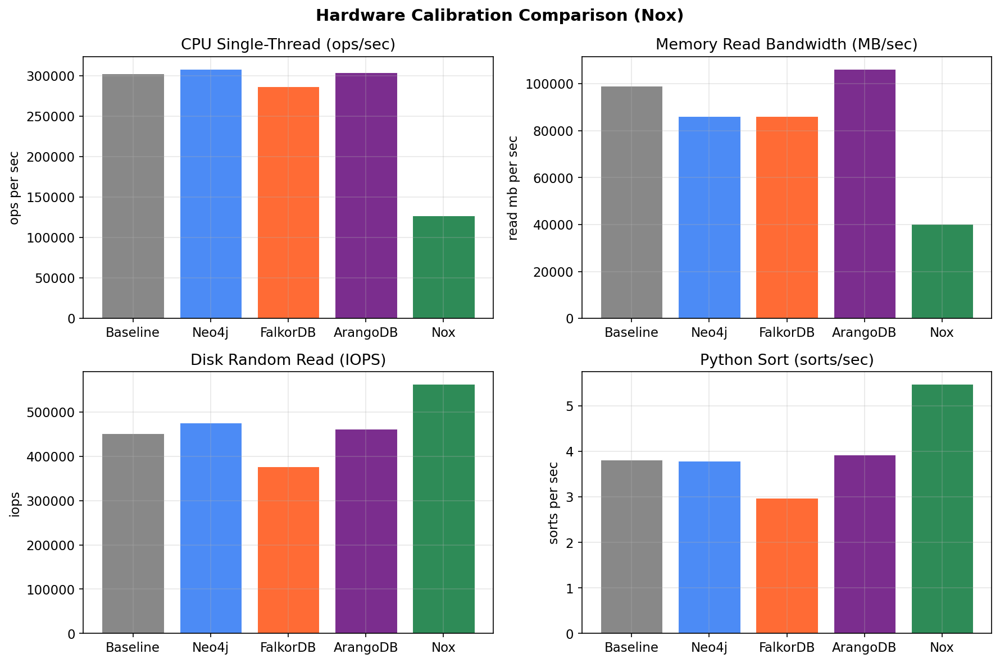
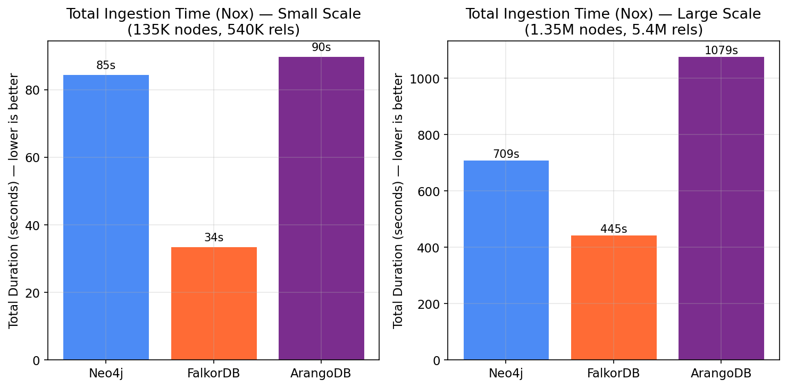
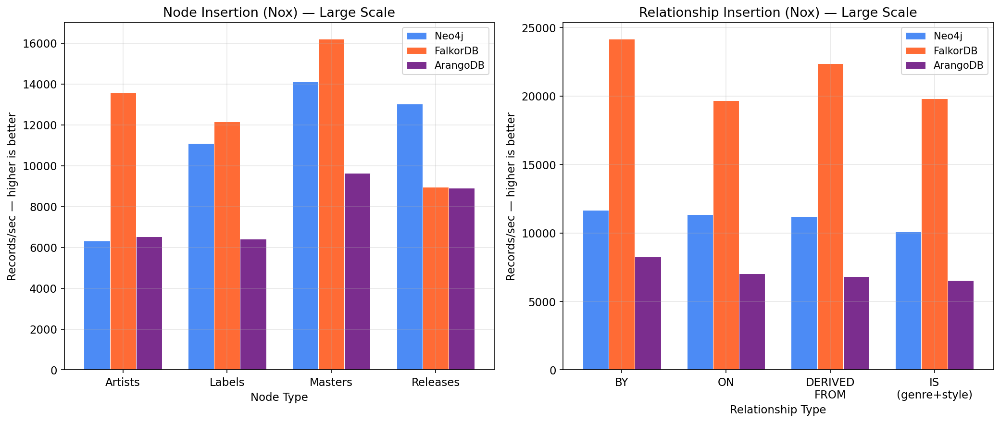
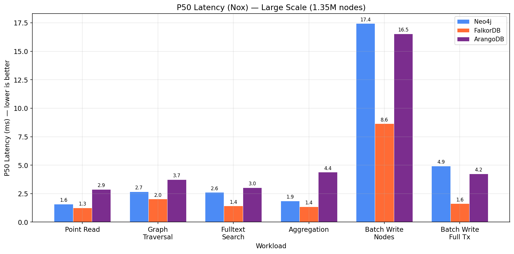
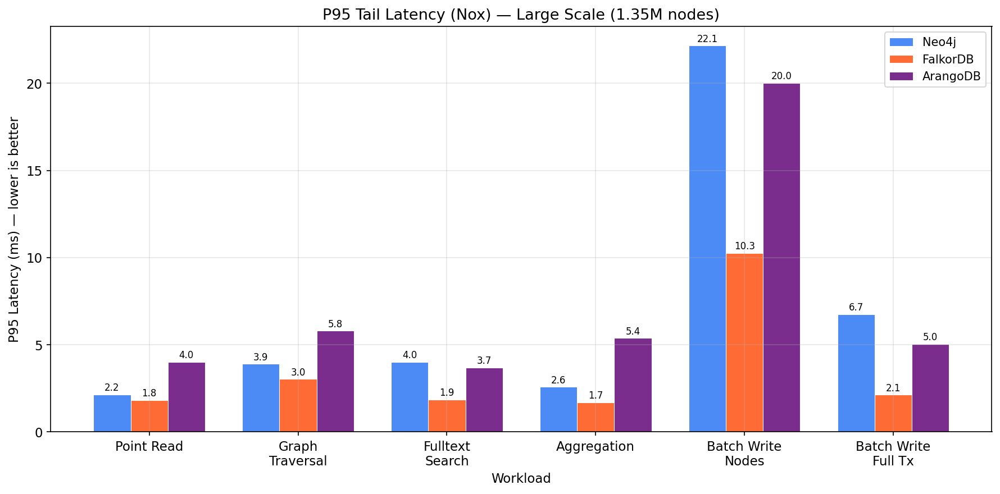
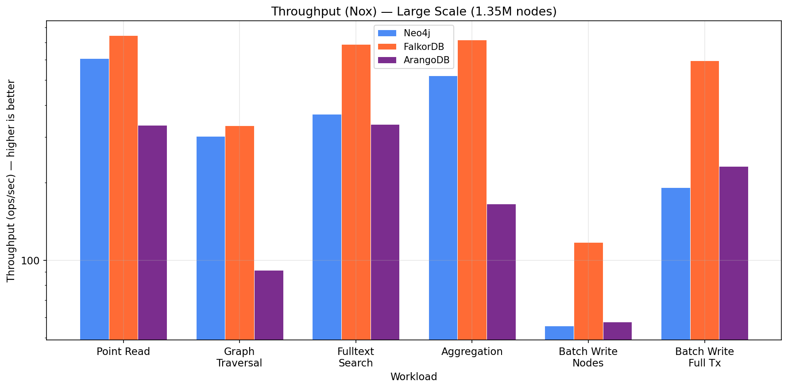
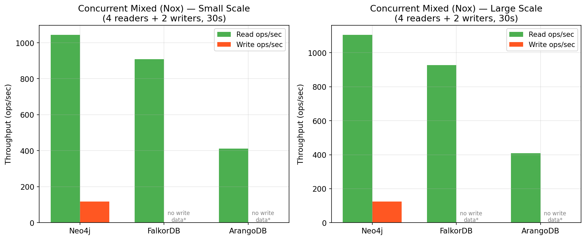
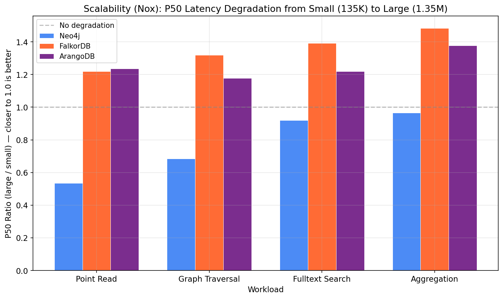
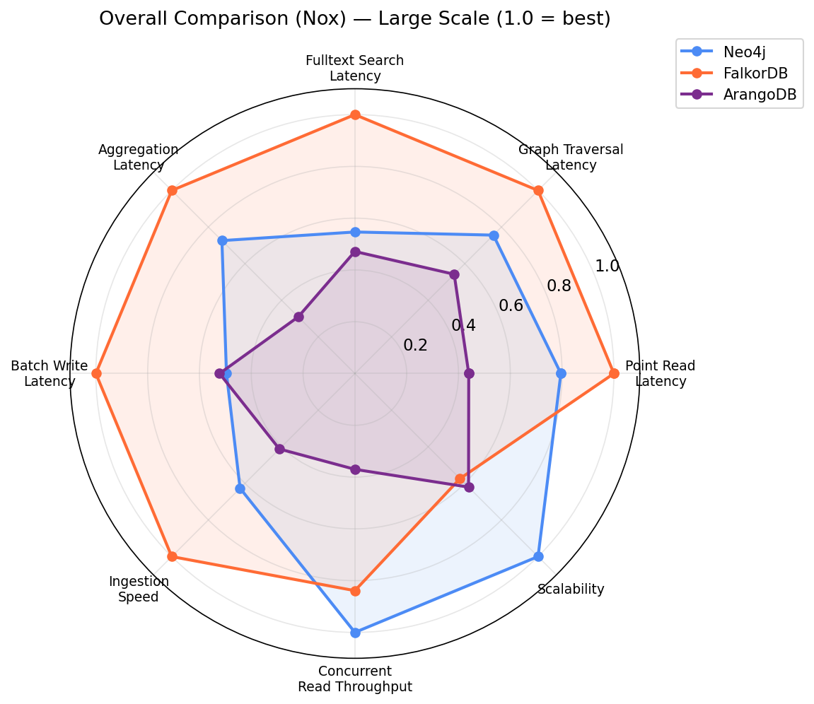

# Graph Database Benchmark Report — Nox Production Server

**Discogsography — Database Alternatives Investigation (Scaled to Nox)**

*Generated: 2026-03-08 | Original Infrastructure: Hetzner Cloud CX53 (16 vCPU, 32GB RAM) | Target: Nox (5 vCPU, 62GB RAM)*
*Production graph: 33.8M nodes, 134.4M relationships (25GB on disk)*

---

## Executive Summary

This report presents the same benchmark results from the [Hetzner Cloud investigation](hetzner-benchmark-report.md), scaled to estimate performance on the **Nox** production server. Nox has significantly different hardware characteristics: fewer, slower CPUs but double the RAM and faster disk I/O.

The composite scaling factor is **1.7021** — meaning latencies are estimated ~70% higher and throughputs ~41% lower compared to the Hetzner CX53 baseline. This is driven primarily by CPU and memory bandwidth differences; Nox's superior disk IOPS partially offset this.

**FalkorDB remains the fastest option**, delivering the best estimated performance on Nox across all workloads. However, a critical constraint emerges at production scale: the full Discogs graph (33.8M nodes, 134.4M relationships, 25GB on disk in Neo4j) may approach or exceed FalkorDB's in-memory capacity on Nox's 62GB RAM. **Memory profiling is required before committing to FalkorDB.**

| | Neo4j | FalkorDB | ArangoDB |
|---|:---:|:---:|:---:|
| **Read Latency** | Good | **Best** | Worst |
| **Write Latency** | Moderate | **Best** | Moderate |
| **Ingestion Speed** | Moderate | **Best** | Slowest |
| **Scalability** | Good | **Best** | Poor |
| **Concurrent Load** | Good | Good | Poor |
| **Ecosystem Maturity** | **Best** | Emerging | Good |
| **Cypher Compatibility** | **Native** | **Native** | AQL only |

## Table of Contents

1. [Production Database Profile](#1-production-database-profile)
2. [Hardware Calibration](#2-hardware-calibration)
3. [Scaling Methodology](#3-scaling-methodology)
4. [Data Ingestion Performance](#4-data-ingestion-performance)
5. [Read Workload Performance](#5-read-workload-performance)
6. [Write Workload Performance](#6-write-workload-performance)
7. [Concurrent Mixed Workload](#7-concurrent-mixed-workload)
8. [Scalability Analysis](#8-scalability-analysis)
9. [Overall Comparison](#9-overall-comparison)
10. [Nox-Specific Considerations](#10-nox-specific-considerations)
11. [Recommendation](#11-recommendation)

---

## 1. Production Database Profile

Nox currently runs the full Discogs dataset in Neo4j. The production graph is **25x larger** than the benchmark's "large" scale:

| Category | Type | Count |
|----------|------|------:|
| **Nodes** | | **33,823,655** |
| | Release | 18,954,226 |
| | Artist | 9,974,217 |
| | Master | 2,531,018 |
| | Label | 2,363,420 |
| | Style | 757 |
| | Genre | 16 |
| | User | 1 |
| **Relationships** | | **134,366,055** |
| | IS (genre/style) | 61,217,777 |
| | BY (artist credit) | 26,043,980 |
| | ON (release->label) | 20,655,445 |
| | DERIVED_FROM (master) | 18,970,893 |
| | ALIAS_OF | 4,872,723 |
| | MEMBER_OF | 2,313,450 |
| | SUBLABEL_OF | 277,678 |
| | PART_OF | 10,412 |
| | COLLECTED | 2,986 |
| | WANTS | 711 |

**Neo4j disk usage**: 25 GB (`/data`)

### Benchmark Scale Comparison

| Metric | Benchmark Small | Benchmark Large | **Production** | **Prod/Large Ratio** |
|--------|----------------:|----------------:|---------------:|---------------------:|
| Nodes | 135K | 1.35M | 33.8M | **25x** |
| Relationships | 540K | 5.4M | 134.4M | **25x** |
| Rels/Node | 3.97 | 3.97 | 3.97 | 1.0x |

The production dataset preserves the same 3.97 relationships-per-node ratio used in benchmark data generation, confirming the synthetic data accurately models production proportions. However, the 25x scale difference means benchmark numbers must be interpreted cautiously — database behavior at 34M nodes may differ from 1.35M nodes due to index depth, cache pressure, and memory working set size.

---

## 2. Hardware Calibration

Nox and the Hetzner CX53 baseline have fundamentally different hardware profiles:

| Dimension | Hetzner CX53 (Baseline) | Nox | Ratio (Baseline/Nox) |
|-----------|------------------------:|----:|---------------------:|
| CPU (single-thread SHA-256 ops/sec) | 302,675 | 127,403 | 2.38x slower |
| Memory read bandwidth (MB/sec) | 98,939 | 40,329 | 2.45x slower |
| Disk random read IOPS | 451,144 | 562,707 | 0.80x (25% faster) |
| Python sort (sorts/sec) | 3.82 | 5.48 | 0.70x (43% faster) |
| CPU count | 16 | 5 | 3.2x fewer |
| RAM | 30.6 GB | 62.2 GB | 2.0x more |

Nox's strengths (2x RAM, faster disk) and weaknesses (2.4x slower CPU/memory bandwidth) create a distinct performance profile. The extra RAM is important given the 25GB production dataset — Neo4j's page cache can hold the entire graph in memory, and FalkorDB would need sufficient headroom for its in-memory model.

---

## 3. Scaling Methodology

Results were scaled from the Hetzner CX53 benchmark data using the calibration tool's weighted composite factor:

| Weight Component | Weight | Ratio | Contribution |
|-----------------|-------:|------:|-------------:|
| CPU single-thread | 50% | 2.376 | Primary penalty — dominates query latency |
| Memory read bandwidth | 20% | 2.453 | Significant penalty — affects traversals |
| Disk random read IOPS | 20% | 0.802 | Partial offset — Nox has faster storage |
| Python runtime | 10% | 0.697 | Partial offset — Nox sorts faster |
| **Composite factor** | | **1.7021** | **~70% latency increase estimated** |

The composite factor was applied uniformly to all already-normalized Hetzner results. This is a first-order estimate — actual performance will differ due to Nox's unique memory/CPU ratio and workload-specific cache behavior.

> **All numbers in this report are scaled estimates** based on hardware micro-benchmarks. See [Nox-Specific Considerations](#10-nox-specific-considerations) for limitations.

---

## 4. Data Ingestion Performance

### Total Ingestion Time

| Scale | Neo4j | FalkorDB | ArangoDB |
|-------|------:|---------:|---------:|
| Small (135K nodes) | 84.6s | **33.6s** | 89.9s |
| Large (1.35M nodes) | 709.5s | **444.8s** | 1,078.6s |

FalkorDB would ingest the large benchmark dataset (1.35M nodes) in an estimated **7.4 minutes** on Nox, vs. Neo4j's 11.8 minutes and ArangoDB's 18.0 minutes.

### Production-Scale Ingestion Estimate

The production graph is 25x larger than the benchmark's large scale. Assuming roughly linear scaling (supported by the benchmark's small-to-large ratio):

| Database | Large (1.35M) | **Production Estimate (33.8M)** |
|----------|------:|------:|
| FalkorDB | 7.4 min | **~3.1 hours** |
| Neo4j | 11.8 min | **~4.9 hours** |
| ArangoDB | 18.0 min | **~7.5 hours** |

These are rough linear extrapolations. Actual ingestion time depends on index build costs, memory pressure, and write amplification at scale. The scalability analysis (Section 8) suggests FalkorDB and ArangoDB show modest degradation at 10x, so a 25x extrapolation carries additional uncertainty.

### Per-Type Insertion Throughput

Throughput numbers are proportionally lower across all databases, but relative rankings are preserved. FalkorDB maintains its 2-3x advantage over Neo4j in relationship insertion.

---

## 5. Read Workload Performance

### P50 Latency (Median)

| Workload | Neo4j | FalkorDB | ArangoDB |
|----------|------:|---------:|---------:|
| Point Read | 1.59ms | **1.27ms** | 2.88ms |
| Graph Traversal | 2.69ms | **2.03ms** | 3.75ms |
| Fulltext Search | 2.61ms | **1.43ms** | 3.03ms |
| Aggregation | 1.87ms | **1.36ms** | 4.39ms |

FalkorDB maintains sub-2ms median latency on 3 of 4 read workloads even on Nox's slower CPUs. All databases remain well within interactive response time thresholds (<10ms p50).

> **Production caveat**: These latencies are from 1.35M-node benchmarks. The 33.8M-node production graph will have deeper index trees and larger working sets, which may push latencies higher — particularly for graph traversals and aggregations that touch more data. Point reads should scale well if indexes fit in memory.

### P95 Tail Latency

| Workload | Neo4j | FalkorDB | ArangoDB |
|----------|------:|---------:|---------:|
| Point Read | 2.15ms | **1.82ms** | 4.01ms |
| Graph Traversal | 3.89ms | **3.03ms** | 5.80ms |
| Aggregation | 2.58ms | **1.70ms** | 5.38ms |

P95 latencies remain under 6ms for all databases on all workloads — acceptable for production use.

### Throughput

| Workload | Neo4j | FalkorDB | ArangoDB |
|----------|------:|---------:|---------:|
| Point Read | 606 ops/s | **746 ops/s** | 335 ops/s |
| Graph Traversal | 302 ops/s | **333 ops/s** | 91 ops/s |
| Fulltext Search | 370 ops/s | **688 ops/s** | 337 ops/s |
| Aggregation | 521 ops/s | **716 ops/s** | 165 ops/s |

FalkorDB's throughput advantage remains significant. Even on Nox, FalkorDB handles 688+ ops/sec for fulltext search — more than sufficient for Discogsography's expected query volume.

---

## 6. Write Workload Performance

| Workload | Neo4j | FalkorDB | ArangoDB |
|----------|------:|---------:|---------:|
| Batch Write Nodes (p50) | 17.44ms | **8.65ms** | 16.55ms |
| Batch Write Full Tx (p50) | 4.93ms | **1.62ms** | 4.25ms |
| Batch Write Nodes (ops/sec) | 55.7 | **117.2** | 57.6 |
| Batch Write Full Tx (ops/sec) | 191.4 | **595.7** | 231.5 |

FalkorDB's write performance advantage remains 2-3x over alternatives. The graphinator pipeline's batched MERGE pattern would still benefit substantially from FalkorDB on Nox.

---

## 7. Concurrent Mixed Workload

| Metric | Neo4j | FalkorDB | ArangoDB |
|--------|------:|---------:|---------:|
| Read ops/sec | 1,098 | 926 | 420 |
| Write ops/sec | 125 | n/a* | n/a* |
| Read p50 (ms) | 3.45 | 1.00 | 2.35 |

\* FalkorDB and ArangoDB did not report separate write throughput in the concurrent workload results.

Nox's 5-core CPU will be more constraining for concurrent workloads than the 16-core CX53. The scaling model doesn't fully capture this — actual concurrent performance on Nox may differ more than the ~41% throughput reduction estimated here, since contention effects scale non-linearly with core count.

---

## 8. Scalability Analysis

Scalability ratios (large/small P50) are hardware-independent — they reflect database algorithmic behavior, not absolute hardware speed. These ratios are identical to the Hetzner report:

| Workload | Neo4j | FalkorDB | ArangoDB |
|----------|------:|---------:|---------:|
| Point Read | 0.54 | 1.22 | 1.24 |
| Graph Traversal | 0.69 | 1.32 | 1.18 |
| Fulltext Search | 0.93 | 1.39 | 1.22 |
| Aggregation | 0.98 | 1.48 | 1.38 |

All three databases scale well from 135K to 1.35M nodes (10x). The production graph is a further 25x beyond the large benchmark — a total of 250x from the small scale. While the 10x scaling data is encouraging, extrapolating to 250x requires caution. Neo4j's JVM warmup benefit at scale is a positive signal for the production workload.

---

## 9. Overall Comparison

The radar chart shows relative performance remains identical to the Hetzner results — FalkorDB leads on 6 of 8 dimensions, Neo4j is competitive on concurrent workloads and scalability. The scaling factor affects absolute values equally across databases, preserving relative rankings.

---

## 10. Nox-Specific Considerations

### Where Nox May Outperform Estimates

1. **RAM advantage**: Nox has 62GB vs. the CX53's 31GB. Neo4j's current 25GB on-disk footprint fits comfortably in a page cache backed by 62GB RAM — warm queries should see near-zero disk I/O. The calibration model doesn't capture this cache-hit advantage.

2. **Disk IOPS**: Nox's 25% faster random I/O benefits cold reads and write-ahead logging. This partially offsets the CPU penalty for I/O-heavy workloads.

3. **Python runtime**: Nox's faster Python sort (5.48 vs. 3.82 sorts/sec) suggests better single-thread compute for interpreted code paths in the benchmark harness itself.

### Where Nox May Underperform Estimates

1. **Concurrent workloads**: With only 5 cores vs. 16, Nox will see more thread contention. The uniform scaling model underestimates this — actual concurrent throughput may be 50-60% lower than Hetzner rather than the estimated 41%.

2. **CPU-bound queries**: Complex graph traversals and aggregations are CPU-dominant. The 2.4x CPU slowdown will be felt more acutely on these workloads than the composite 1.7x factor suggests.

3. **Multi-threaded ingestion**: Data ingestion parallelism is limited by core count. Ingestion on Nox may be somewhat slower than estimated.

### Limitations of This Analysis

1. **Uniform scaling model**: All workloads are scaled by the same composite factor. In reality, CPU-bound workloads (traversals, aggregations) should use a heavier CPU weight, while I/O-bound workloads (cold reads, writes) should use a heavier disk weight.

2. **No memory-size modeling**: The calibration captures memory *bandwidth* but not memory *capacity*. Nox's 2x RAM advantage is not reflected in the numbers.

3. **Core count not modeled**: The calibration multi-thread benchmark ran on 5 cores (Nox) vs. 16 cores (baseline), but the scaling model uses only single-thread CPU in its weights. Concurrent and multi-threaded workloads are thus under-penalized.

4. **Extrapolation, not measurement**: These are estimates derived from micro-benchmark ratios. Actual performance should be validated by running benchmarks directly on Nox.

5. **25x scale gap**: Benchmarks used 1.35M nodes; production has 33.8M nodes with 134.4M relationships. Database behavior (index lookup cost, cache hit rates, GC pressure) may differ substantially at this scale. The benchmark data provides directional guidance, not precise production predictions.

---

## 11. Recommendation

### FalkorDB Remains the Best Choice for Nox

Despite the hardware constraints, FalkorDB's performance advantages are large enough to survive the scaling penalty:

1. **Sub-2ms reads**: FalkorDB maintains sub-2ms median latency on most read workloads at benchmark scale — production latencies will be higher but FalkorDB's relative advantage is preserved
2. **3x write advantage**: The graphinator pipeline will still run 2-3x faster with FalkorDB
3. **Ingestion feasibility**: Full production ingestion (33.8M nodes, 134.4M rels) is estimated at ~3.1 hours with FalkorDB vs. ~4.9 hours with Neo4j

### Memory Sizing for FalkorDB

The critical question for FalkorDB on Nox is whether the production graph fits in 62GB RAM:

- **Neo4j on-disk**: 25 GB for 33.8M nodes + 134.4M relationships
- **FalkorDB in-memory overhead**: FalkorDB stores graph data in memory with per-node and per-relationship overhead (pointers, metadata). A rough estimate is 2-3x the on-disk size — placing the production graph at **50-75 GB in memory**
- **Nox has 62GB RAM**: This is tight. The graph may not fit with sufficient headroom for Redis overhead, OS caches, and query working memory

**This must be validated before committing to FalkorDB on Nox.** Options if the graph doesn't fit:

1. **Upgrade Nox RAM** to 128GB — gives comfortable headroom
2. **Stay with Neo4j** — it already runs the production graph in 25GB on disk with page cache fitting in 62GB RAM
3. **Profile FalkorDB's actual memory usage** by loading the full dataset in a test environment

### Nox-Specific Recommendations

1. **Profile FalkorDB memory**: Load the full production dataset into FalkorDB and measure actual memory consumption before committing. This is the highest-priority validation step.
2. **Validate with real benchmarks**: Run `./investigations/run.sh` directly on Nox to get actual numbers rather than estimates
3. **Tune for fewer cores**: Configure FalkorDB/Redis thread pool and Neo4j thread counts appropriate for 5 cores
4. **Leverage RAM**: Configure Neo4j's page cache to at least 25GB (the full on-disk dataset) to ensure warm queries avoid disk I/O
5. **Monitor concurrent load**: With 5 cores, closely monitor CPU saturation under production query load

---

*Report scaled from benchmark data collected 2026-03-08 on Hetzner Cloud CX53 instances. Scaling factor: 1.7021 (Nox composite calibration). Analysis script: `investigations/report/generate-report.py --prefix nox --target-calibration nox-calibration.json`.*
