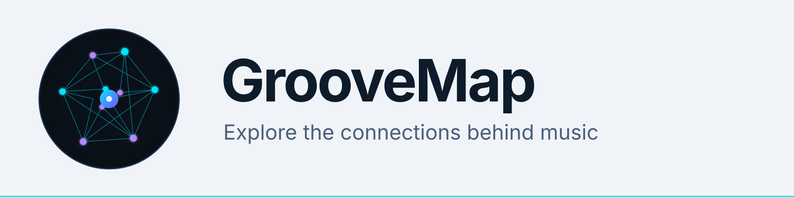

<picture>
  <source media="(prefers-color-scheme: dark)" srcset="./assets/banner-dark.svg">
  <source media="(prefers-color-scheme: light)" srcset="./assets/banner-light.svg">
  
</picture>

# Explore the connections behind music

[GrooveMap](https://groovemap.music) turns music-catalog data into a connected map of
artists, labels, releases, credits, and the relationships between them.

## What we are building

- [Graph Explorer](https://github.com/groovemap-music/graph-explorer) is the
  public-facing graph exploration application and API proxy.
- [Catalog API](https://github.com/groovemap-music/catalog-api) provides authentication,
  catalog search, graph queries, recommendations, and natural-language queries.
- [MCP Server](https://github.com/groovemap-music/mcp-server) connects compatible AI
  clients to GrooveMap through the catalog API.
- [GrooveMap on the web](https://groovemap.music) is the canonical project website and
  documentation entry point.

## Project repositories

Repositories begin private and become visible only when their access and licensing
boundaries have been reviewed. A link may therefore be unavailable until its repository
is ready for its intended audience.

| Repository | Purpose |
| --- | --- |
| [`catalog-api`](https://github.com/groovemap-music/catalog-api) | Authentication, Discogs OAuth and sync, catalog search, graph queries, recommendations, natural-language queries, internal analytics endpoints, and operator setup CLIs |
| [`musicbrainz-graph-enricher`](https://github.com/groovemap-music/musicbrainz-graph-enricher) | Consume MusicBrainz events and enrich matched Neo4j entities |
| [`musicbrainz-sql-loader`](https://github.com/groovemap-music/musicbrainz-sql-loader) | Consume MusicBrainz events and load the complete MusicBrainz dataset into PostgreSQL |
| [`python-libraries`](https://github.com/groovemap-music/python-libraries) | Versioned Python runtime, resilience, and agent-tool libraries shared by services |
| [`operations-console`](https://github.com/groovemap-music/operations-console) | Privileged administrative and monitoring web console |
| [`discogs-graph-enricher`](https://github.com/groovemap-music/discogs-graph-enricher) | Consume Discogs events and construct the Neo4j knowledge graph |
| [`analytics-engine`](https://github.com/groovemap-music/analytics-engine) | Scheduled and precomputed music analytics with PostgreSQL and Redis caching |
| [`database-schema`](https://github.com/groovemap-music/database-schema) | Versioned Neo4j and PostgreSQL schema definitions and compatibility policy |
| [`discogs-sql-loader`](https://github.com/groovemap-music/discogs-sql-loader) | Consume Discogs events and build PostgreSQL analytical tables |
| [`operations-toolkit`](https://github.com/groovemap-music/operations-toolkit) | Queue, error, system, and deployment inspection CLI utilities |
| [`catalog-ingestion`](https://github.com/groovemap-music/catalog-ingestion) | Download, parse, normalize, and publish Discogs and MusicBrainz datasets |
| [`graph-explorer`](https://github.com/groovemap-music/graph-explorer) | Public-facing graph exploration web application and API proxy |
| [`mcp-server`](https://github.com/groovemap-music/mcp-server) | MCP integration exposing GrooveMap through the catalog API |

We build in the open only after the relevant security and licensing boundary is ready for
public scrutiny. Private infrastructure, deployment configuration, and operator material
remain private.
